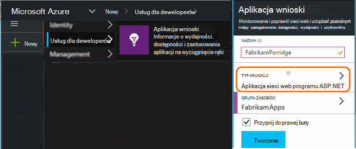
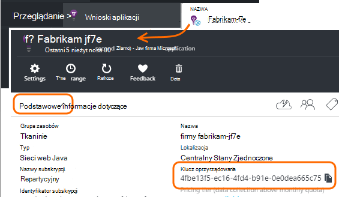

<properties 
    pageTitle="Oddzielanie wniosków aplikacji zasoby dla deweloperów, badań i produkcji" 
    description="Monitorowanie wydajności i użycia aplikacji na różnych etapach rozwoju" 
    services="application-insights" 
    documentationCenter=""
    authors="alancameronwills" 
    manager="douge"/>

<tags 
    ms.service="application-insights" 
    ms.workload="tbd" 
    ms.tgt_pltfrm="ibiza" 
    ms.devlang="na" 
    ms.topic="article" 
    ms.date="05/04/2016" 
    ms.author="awills"/>

# Oddzielanie wniosków aplikacji zasobów

Należy telemetrycznego z różnych elementów i wersji aplikacji być wysyłane do różnych zasobów wniosków aplikacji lub połączone w jedną? W tym artykule wygląda co najlepsze rozwiązania i niezbędne techniki.

Najpierw Przyjrzyjmy się pytanie. Dane otrzymane od aplikacji jest przechowywane i przetwarzane przez wniosków aplikacji w programie Microsoft Azure *zasobów*. Każdemu zasobowi jest identyfikowany przez *klucz oprzyrządowania* (iKey). W aplikacji klucz jest udostępniana w SDK wniosków aplikacji, tak aby było wysyłać dane, które są zbierane właściwy zasób. Klucz może być udostępniana w kodzie lub w ApplicationInsights.config. Zmieniając klucz w zestawie SDK, możesz wskazać dane do różnych zasobów. 

W przypadku prostych po utworzeniu kodu dla nowej aplikacji, można także tworzyć nowego zasobu w aplikacji wnioski. W programie Visual Studio okno dialogowe *Nowy projekt* powinien się tym zająć dla Ciebie.

Jeśli jest to duże witryny sieci Web, mogą być rozmieszczone na więcej niż jedno wystąpienie serwera.

W bardziej złożonych scenariuszy masz system składa się z wielu części — na przykład witryny sieci web i procesor wewnętrznej. 

## Kiedy należy używać oddzielnych iKeys

Poniżej przedstawiono ogólne wskazówki:

* Miejsce, w którym masz jednostki niezależne możliwością rozmieszczania aplikacji uruchamianej na zbiór serwera wystąpienia, które można skalować wzrost spadek niezależnie od innych składników, a następnie będzie zwykle mapowanie który do pojedynczego zasobu - oznacza to, że będzie miał klucz pojedynczy oprzyrządowania (iKey).
* Natomiast dla przy użyciu oddzielnych iKeys przyczyny:
 - Łatwe odczyt osobnych metryki składniki.
 - Zachować telemetrycznego głośność dolny osobnych z dużą liczbą aby ograniczania przydziałów i pobierania na jeden strumień nie mają wpływu na drugi.
 - Oddzielne alertów, eksportowanie i konfiguracji elementu pracy.
 - Rozłóż [limity](app-insights-pricing.md#limits-summary) , takie jak przydział telemetrycznego, ograniczania i web testowanie Statystyka.
 - Kod w fazie projektowania i badania należy wysłać do oddzielnych iKey niż sygnaturę produkcji.  

Wiele wniosków aplikacji portalu środowiska zaprojektowano z poniższymi wskazówkami pamiętać. Na przykład serwery wyświetlanie segmentów na wystąpienie serwera, wprowadzania założenie tego telemetrycznego o jeden składnik logiczne mogą pochodzić z kilku wystąpienia serwera.

## Pojedynczy iKey

Miejsce, w którym wysyłasz telemetrycznego z wielu składników do pojedynczej iKey:

* Dodaj właściwości do wszystkich telemetrycznego, która pozwala części i filtrowanie na tożsamość składnika. Identyfikator roli jest automatycznie dodawany do telemetrycznego wystąpienia rola serwera, ale w innych przypadkach, których można używać [Inicjator telemetrycznego](app-insights-api-filtering-sampling.md#add-properties) , aby dodać właściwości.
* Aktualizowanie aplikacji SDK wniosków w różnych składnikach w tym samym czasie. Telemetrycznego dla jednej iKey powinny pochodzić z tej samej wersji zestawu SDK.

## Osobne iKeys

Miejsce, w którym masz wiele iKeys składników innej aplikacji:

* Tworzenie [pulpitu nawigacyjnego](app-insights-dashboards.md) dla widoku kluczowych telemetrycznego z aplikacji logiczne, połączone ze składników innej aplikacji. Pulpity nawigacyjne mogą być udostępniane, więc widoku pojedynczego system logiczny mogą być używane przez różnych zespołów.
* Organizowanie [grup zasobów](app-insights-resources-roles-access-control.md) na poziomie zespołu. Uprawnienia dostępu są przypisywane przez grupa zasobów, a należą uprawnienia do konfigurowania alertów. 
* Za pomocą [Menedżera zasobów Azure szablony i programu Powershell](app-insights-powershell.md) ułatwiające zarządzanie artefakty, takie jak reguł alertów i badania w sieci web.

## Osobne iKeys dla deweloperów i badań i produkcji

Aby ułatwić Zmienianie klucza automatycznie po zwolnieniu aplikacji, należy ustawić iKey w kodzie, zamiast w ApplicationInsights.config.

### Dynamiczne oprzyrządowania klucza

Ustaw klucz metody inicjowania, takich jak global.aspx.cs w usłudze ASP.NET:

*C#*

    protected void Application_Start()
    {
      Microsoft.ApplicationInsights.Extensibility.
        TelemetryConfiguration.Active.InstrumentationKey = 
          // - for example -
          WebConfigurationManager.AppSettings["ikey"];
      ...

W tym przykładzie ikeys dla różnych zasobów są umieszczane w różnych wersjach pliku konfiguracji sieci web. Zamienianie pliku konfiguracji sieci web — co można zrobić jako część skryptu wersji - będzie Zamień zasobu docelowego.

### Strony sieci Web

IKey jest również używana w Twojej aplikacji stron sieci web, w obszarze [skrypt uzyskanego od karta szybki start](app-insights-javascript.md). Zamiast kodowania go dosłownie do skrypt, wygenerowany na podstawie stanu serwera. Na przykład w aplikacji programu ASP.NET:

*Język JavaScript w Razor*

    <script type="text/javascript">
    // Standard Application Insights web page script:
    var appInsights = window.appInsights || function(config){ ...
    // Modify this part:
    }({instrumentationKey:  
      // Generate from server property:
      "@Microsoft.ApplicationInsights.Extensibility.
         TelemetryConfiguration.Active.InstrumentationKey"
    }) // ...

## Tworzenie dodatkowych zasobów wniosków aplikacji
  
Jeśli zdecydujesz się oddzielić telemetrycznego składniki innej aplikacji lub innego sygnatury (deweloperów test produkcja) tego samego składnika, będą dostępne do tworzenia nowego zasobu wniosków aplikacji.

W [portal.azure.com](https://portal.azure.com)Dodaj zasób wniosków aplikacji:

* **Typ aplikacji** wpływa, co widać na karta Przegląd i właściwości dostępne w [Eksploratorze Metryka](app-insights-metrics-explorer.md). Jeśli nie widzisz typ aplikacji, wybierz jeden z typów sieci web dla stron sieci web.
* **Grupa zasobów** jest wygody zarządzania właściwości, takich jak [Kontrola dostępu](app-insights-resources-roles-access-control.md). Tworzenie, testowanie i produkcji można użyć oddzielnych grup zasobów.
* **Subskrypcja** jest konta płatności w Azure.
* **Lokalizacja** to miejsce, w którym możemy zachować dane. Obecnie go nie można zmienić. 
* **Dodaj do pulpitu nawigacyjnego** umieszcza kafelka szybkiego dostępu dla zasobu na stronie głównej Azure. 

Tworzenie zasobu trwa kilka sekund. Alert będzie widoczny po zakończeniu.

(Można napisać [skrypt programu PowerShell](app-insights-powershell-script-create-resource.md) , aby automatycznie utworzyć zasób.)

## Wprowadzenie klucza oprzyrządowania

Klucz oprzyrządowania identyfikatorem utworzony zasób. 

Potrzebujesz klawiszy oprzyrządowania zasobów, do której aplikacji będzie wysyłać dane.

 
