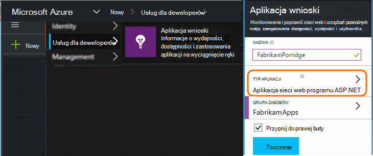
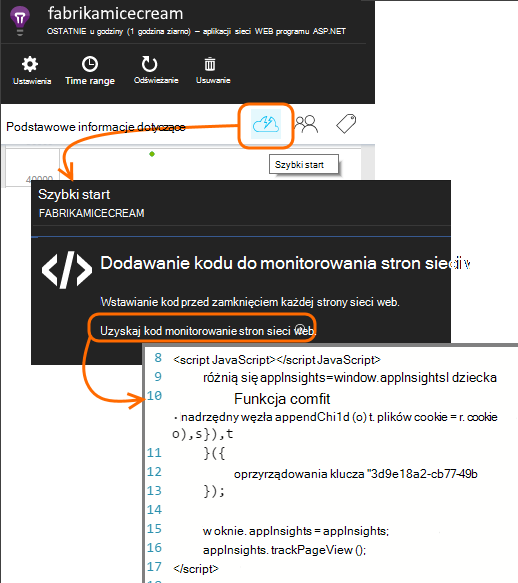
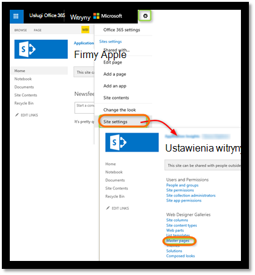
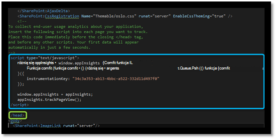
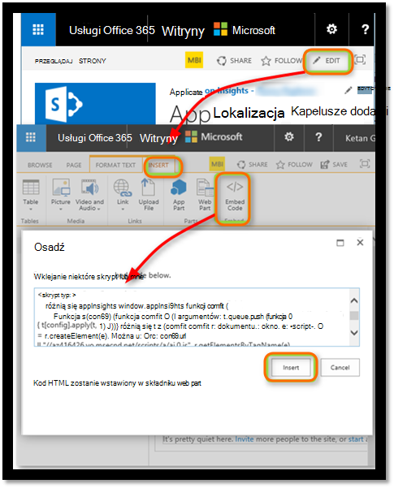
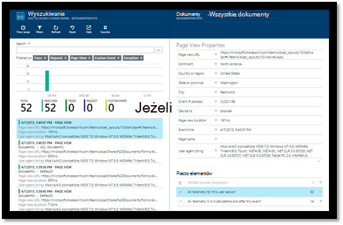
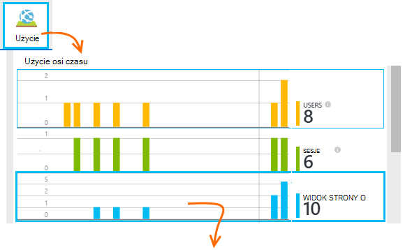
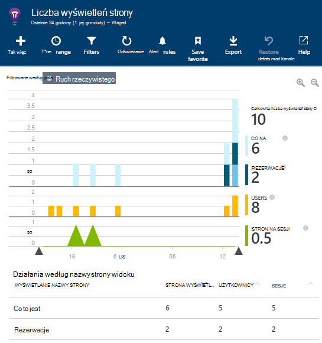
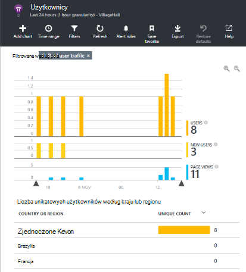
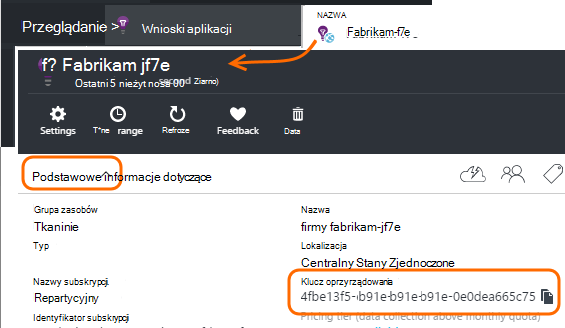

<properties 
    pageTitle="Monitorowanie witryny programu SharePoint przy użyciu aplikacji wniosków" 
    description="Uruchomić monitorowania nowej aplikacji przy użyciu nowego klucza oprzyrządowania" 
    services="application-insights" 
    documentationCenter=""
    authors="alancameronwills" 
    manager="douge"/>

<tags 
    ms.service="application-insights" 
    ms.workload="tbd" 
    ms.tgt_pltfrm="ibiza" 
    ms.devlang="na" 
    ms.topic="article" 
    ms.date="03/24/2016" 
    ms.author="awills"/>

# <a name="monitor-a-sharepoint-site-with-application-insights"></a>Monitorowanie witryny programu SharePoint przy użyciu aplikacji wniosków


Visual Studio aplikacji wniosków monitoruje dostępność, wydajności i użycia aplikacji. Tutaj dowiesz się, jak skonfigurować go do witryny programu SharePoint.


## <a name="create-an-application-insights-resource"></a>Tworzenie zasób wniosków aplikacji


W [portalu Azure](https://portal.azure.com)utworzyć nowy zasób wniosków aplikacji. Wybierz ASP.NET jako typ aplikacji.




Kartę, która zostanie otwarta to miejsce, w którym pojawi się wydajność i danych dotyczących użycia o aplikacji. Aby wrócić do niej następnym zalogowaniu Azure, należy znaleźć kafelka dla niego, na ekranie startowym. Alternatywnie kliknij przycisk Przeglądaj, aby go znaleźć.
    


## <a name="add-our-script-to-your-web-pages"></a>Dodawanie naszą skrypt do stron sieci web

W przewodniku Szybki Start uzyskać skrypt dla stron sieci web:



Wstawianie skrypt tuż przed &lt;/głowy&gt; znacznika każdej strony, które chcesz śledzić. Jeśli witryny sieci Web zawiera strony wzorcowej, możesz umieścić skrypt istnieje. Na przykład w projekcie ASP.NET MVC przełączyć ją w View\Shared\_Layout.cshtml

Skrypt zawiera klucz oprzyrządowania, który kieruje telemetrycznego zasobu wniosków aplikacji.

### <a name="add-the-code-to-your-site-pages"></a>Dodawanie kodu do stron witryny

#### <a name="on-the-master-page"></a>Na stronie wzorcowej

Jeśli możesz edytować strony wzorcowej witryny, zapewniającą monitorowania dla każdej strony w witrynie.

Wyewidencjonowywanie strony wzorcowej i edytować przy użyciu programu SharePoint Designer lub innego edytora.




Dodawanie kodu tuż przed </head> znacznik. 




#### <a name="or-on-individual-pages"></a>Lub na poszczególnych stronach

Aby monitorować ograniczony zestaw stron, należy dodać skrypt oddzielnie do każdej strony. 

Wstawianie składnika web part i osadzić wstawkę kodu.





## <a name="view-data-about-your-app"></a>Wyświetlanie danych o aplikacji

Ponownie wdróż aplikacji.

Powróć do swojej karta aplikacji w [Azure portal](https://portal.azure.com).

Pierwszy zdarzeń pojawi się w wyszukiwaniu. 



Jeśli masz Oczekiwano większej ilości danych, kliknij przycisk Odśwież po kilku sekundach.

Karta Przegląd kliknij **analizy użycia** , aby wyświetlić wykresy użytkowników, sesji i liczba wyświetleń strony:



Kliknij dowolny wykres, aby wyświetlić więcej szczegółów — na przykład liczba wyświetleń strony:



Lub użytkowników:





## <a name="capturing-user-id"></a>Przechwytywanie identyfikator użytkownika


Wstawkę kodu standardowej stronie sieci web nie Przechwytywanie identyfikator użytkownika z witryny programu SharePoint, ale możesz skorzystać z małych modyfikacji.


1. Skopiuj klucza oprzyrządowania Twojej aplikacji z listy rozwijanej w aplikacji wniosków podstawowe informacje dotyczące. 


    

2. W poniższych wstawek podstawić klucz oprzyrządowania "XXXX". 
3. Osadzanie skrypt w aplikacji programu SharePoint zamiast wstawek, które otrzymujesz w portalu.


```


<SharePoint:ScriptLink ID="ScriptLink1" name="SP.js" runat="server" localizable="false" loadafterui="true" /> 
<SharePoint:ScriptLink ID="ScriptLink2" name="SP.UserProfiles.js" runat="server" localizable="false" loadafterui="true" /> 
  
<script type="text/javascript"> 
var personProperties; 
  
// Ensure that the SP.UserProfiles.js file is loaded before the custom code runs. 
SP.SOD.executeOrDelayUntilScriptLoaded(getUserProperties, 'SP.UserProfiles.js'); 
  
function getUserProperties() { 
    // Get the current client context and PeopleManager instance. 
    var clientContext = new SP.ClientContext.get_current(); 
    var peopleManager = new SP.UserProfiles.PeopleManager(clientContext); 
     
    // Get user properties for the target user. 
    // To get the PersonProperties object for the current user, use the 
    // getMyProperties method. 
    
    personProperties = peopleManager.getMyProperties(); 
  
    // Load the PersonProperties object and send the request. 
    clientContext.load(personProperties); 
    clientContext.executeQueryAsync(onRequestSuccess, onRequestFail); 
} 
     
// This function runs if the executeQueryAsync call succeeds. 
function onRequestSuccess() { 
var appInsights=window.appInsights||function(config){
function s(config){t[config]=function(){var i=arguments;t.queue.push(function(){t[config].apply(t,i)})}}var t={config:config},r=document,f=window,e="script",o=r.createElement(e),i,u;for(o.src=config.url||"//az416426.vo.msecnd.net/scripts/a/ai.0.js",r.getElementsByTagName(e)[0].parentNode.appendChild(o),t.cookie=r.cookie,t.queue=[],i=["Event","Exception","Metric","PageView","Trace"];i.length;)s("track"+i.pop());return config.disableExceptionTracking||(i="onerror",s("_"+i),u=f[i],f[i]=function(config,r,f,e,o){var s=u&&u(config,r,f,e,o);return s!==!0&&t["_"+i](config,r,f,e,o),s}),t
    }({
        instrumentationKey:"XXXX"
    });
    window.appInsights=appInsights;
    appInsights.trackPageView(document.title,window.location.href, {User: personProperties.get_displayName()});
} 
  
// This function runs if the executeQueryAsync call fails. 
function onRequestFail(sender, args) { 
} 
</script> 


```


## <a name="next-steps"></a>Następne kroki

* [Testy sieci web](app-insights-monitor-web-app-availability.md) do monitorowania dostępności witryny.

* [Wnioski aplikacji](app-insights-overview.md) dla innych typów aplikacji.


<!--Link references-->


 