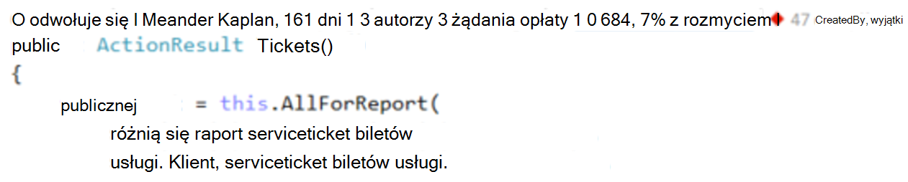
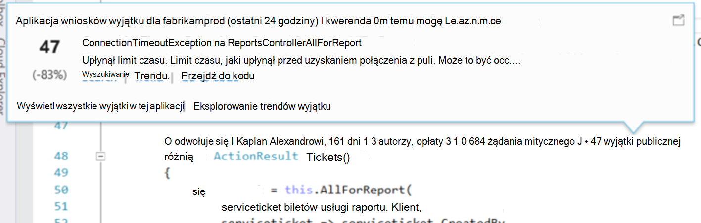
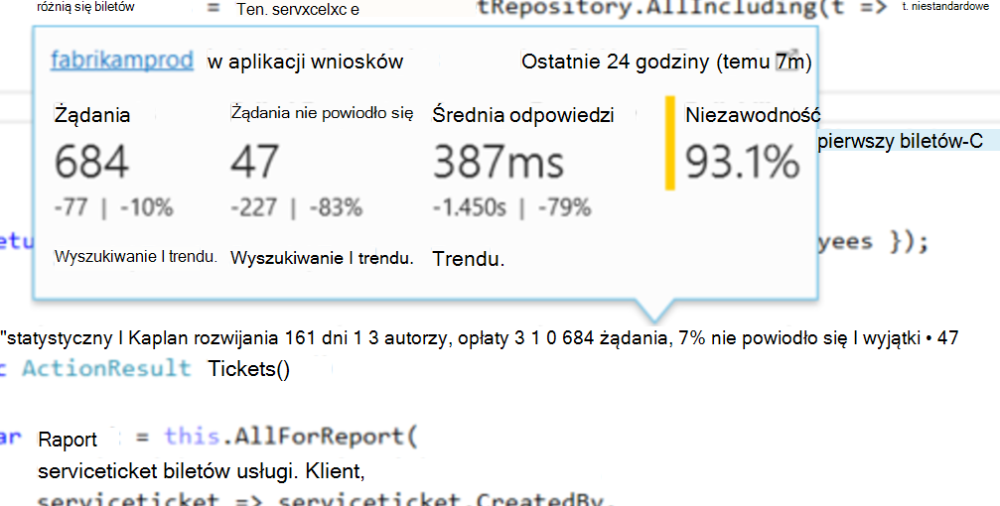
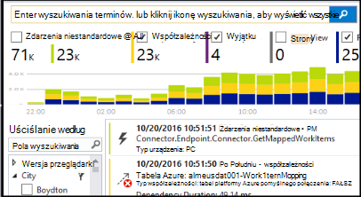

<properties 
    pageTitle="Aplikacja telemetrycznego wniosków w CodeLens programu Visual Studio | Microsoft Azure" 
    description="Szybki dostęp do Twojej aplikacji wniosków zaproszenie i wyjątku telemetrycznego z CodeLens w programie Visual Studio." 
    services="application-insights" 
    documentationCenter=".net"
    authors="numberbycolors" 
    manager="douge"/>

<tags 
    ms.service="application-insights" 
    ms.workload="tbd" 
    ms.tgt_pltfrm="ibiza" 
    ms.devlang="na" 
    ms.topic="get-started-article" 
    ms.date="08/30/2016" 
    ms.author="daviste"/>
    
# Aplikacja telemetrycznego wniosków w CodeLens programu Visual Studio

Metody w kodzie aplikacji sieci web można dodawać adnotacje z telemetrycznego o wyjątki w czasie wykonywania i żądanie czasy odpowiedzi. Po zainstalowaniu [Programu Visual Studio aplikacji wniosków](app-insights-overview.md) w aplikacji telemetrycznego pojawi się w programie Visual Studio [CodeLens](https://msdn.microsoft.com/library/dn269218.aspx) - za notatki w górnej części każdej funkcji miejsce, w którym są używane są wyświetlane że przydatne informacje, takie jak liczba miejsc funkcji odwołuje się lub nazwisko osoby, która go edytować.

> [AZURE.NOTE] Wnioski aplikacji w CodeLens jest dostępna w Visual Studio 2015 aktualizacji 3 i nowszy lub z najnowszą wersją rozszerzenia [Narzędzi dla deweloperów analizy](https://visualstudiogallery.msdn.microsoft.com/82367b81-3f97-4de1-bbf1-eaf52ddc635a). CodeLens jest dostępna w wersji Enterprise i Professional programu Visual Studio.

## Gdzie można znaleźć danych wniosków aplikacji

Poszukaj telemetrycznego wniosków aplikacji wskaźników CodeLens metod publicznej żądanie aplikacji sieci web. Wskaźniki CodeLens są powyższej metody i inne zgłoszenia w kodzie C# i Visual Basic. Jeśli dane wniosków aplikacji są dostępne dla metody, zobaczysz wskaźników dla żądania i wyjątków, takie jak "100 żądania, 1% nie powiodło się" lub "10 wyjątki." Kliknij wskaźnik CodeLens, aby uzyskać więcej informacji. 

> [AZURE.TIP] Żądanie wniosków aplikacji i wskaźniki wyjątku może potrwać kilka sekund dodatkowe po są wyświetlane inne wskaźniki CodeLens.

## Wyjątki w CodeLens

Wskaźnik CodeLens wyjątku pokazuje liczbę wyjątków, które wystąpiły w ciągu ostatnich 24 godzin od 15 najczęściej występujące wyjątki w aplikacji, w tym okresie, podczas przetwarzania żądania obsługiwane przez metodę.

Aby wyświetlić więcej szczegółów, kliknij wskaźnik CodeLens wyjątki:

* Zmiana wartości procentowej liczbę wyjątków z ostatnich 24 godzin względem poprzednich 24 godziny
* Wybierz pozycję **Przejdź do kodu** , aby przejść do kodu źródłowego funkcji generowania wyjątku
* Wybierz pozycję **wyszukiwania** do kwerendy wszystkie wystąpienia tego wyjątku, które wystąpiły w ciągu ostatnich 24 godzin
* Wybierz pozycję **REGLINW** wyświetlanie wizualizacji REGLINW dla wystąpienia tego wyjątku w ciągu ostatnich 24 godzin
* Wybierz pozycję **Wyświetl wszystkie wyjątki w tej aplikacji** , aby kwerenda wszystkie wyjątki, które wystąpiły w ciągu ostatnich 24 godzin
* Wybierz pozycję **trendów wyjątku Eksploruj** wyświetlanie wizualizacji trendu dla wszystkich wyjątków, które wystąpiły w ciągu ostatnich 24 godzin. 

> [AZURE.TIP] Jeśli zostanie wyświetlony w CodeLens "wyjątki 0", ale wiadomo, że powinny być wyjątków, sprawdź, upewnij się, że wybrano właściwy zasób wniosków aplikacji CodeLens. Aby wybrać inny zasób, kliknij prawym przyciskiem myszy nad projektem w Eksploratorze rozwiązań i wybierz polecenie **wniosków aplikacji > Wybierz źródło danych Telemetrycznych**. CodeLens jest wyświetlana tylko dla 15 większość częstych wyjątki w aplikacji w ciągu ostatnich 24 godzin, tak, jeśli wyjątek nie jest najczęściej 16 lub mniej, zostanie wyświetlona lista "wyjątki 0." Wyjątki w widokach programu ASP.NET mogą nie być wyświetlane na temat metod kontrolerze, wygenerowanych widoków.

> [AZURE.TIP] Jeśli zobaczysz "? wyjątki"w CodeLens, należy skojarzyć konto Azure Visual Studio lub wygasł poświadczeń dla swojego konta Azure. W obu przypadkach, kliknij pozycję "? wyjątki"i wybierz pozycję **Dodaj konto...** , aby wprowadzić poświadczenia.

## Żądania w CodeLens

Żądanie CodeLens wskaźnik pokazuje liczbę żądania HTTP został obsługiwane za pomocą metody ostatnich 24 godzin oraz wartość procentową te żądania, które nie powiodło się.

Aby uzyskać szczegółowe informacje, kliknij pozycję żądania CodeLens wskaźnik:

* Zmiany bezwzględnym i procent liczby żądania, żądań zakończonych niepowodzeniem i czasy średnia odpowiedzi w ciągu ostatnich 24 godzin w porównaniu z poprzednich 24 godziny
* Wybór metody, obliczana jako wartość procentowa żądania, które prawidłowo w ciągu ostatnich 24 godzin
* Wybierz pozycję **wyszukiwania** dla żądania lub niepowodzeniu żądania do kwerendy wszystkie żądania (uszkodzone), które wystąpiły w ciągu ostatnich 24 godzin
* Wybierz pozycję **trendu** wyświetlanie wizualizacji trendu żądania, żądań zakończonych niepowodzeniem lub czas reakcji średnia w ciągu ostatnich 24 godzin.
* Wybierz nazwę zasobu wniosków aplikacji w lewym górnym rogu widoku Szczegóły CodeLens, aby zmienić zasobów jest źródłem danych CodeLens.

## Następne kroki

||
|---|---
|**[Praca z wniosków aplikacji w programie Visual Studio](app-insights-visual-studio.md)** Wyszukiwanie telemetrycznego, zobacz danych w CodeLens i konfigurowanie aplikacji wnioski. W programie Visual Studio. |
|**[Dodawanie większej ilości danych](app-insights-asp-net-more.md)** Monitorowanie użycia, dostępność, zależności, wyjątki. Włączenie śledzenia z ram rejestrowanie. Napisz telemetrycznego niestandardowe. | 
|**[Praca z portalem wniosków aplikacji](app-insights-dashboards.md)** Eksportowanie pulpitów nawigacyjnych, zaawansowane narzędzia diagnostyczne i analityczne, alerty, mapy żywo zależności aplikacji i telemetrycznego. |
