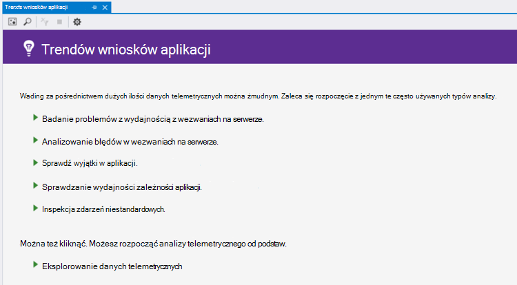
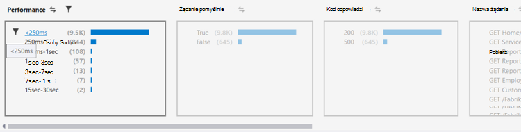
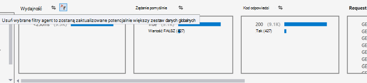
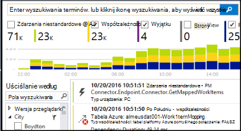
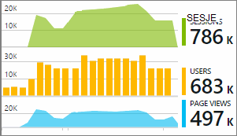

<properties 
    pageTitle="Analizowanie trendów w programie Visual Studio | Microsoft Azure" 
    description="Analizowanie, wizualizowanie i eksplorowanie trendów w swojej telemetrycznego wniosków aplikacji w programie Visual Studio." 
    services="application-insights" 
    documentationCenter=".net"
    authors="numberbycolors" 
    manager="douge"/>

<tags 
    ms.service="application-insights" 
    ms.workload="tbd" 
    ms.tgt_pltfrm="ibiza" 
    ms.devlang="na" 
    ms.topic="get-started-article" 
    ms.date="10/25/2016" 
    ms.author="daviste"/>
    
# Analizowanie trendów w programie Visual Studio

Narzędzie trendów wniosków aplikacji spowoduje wizualizację, jak aplikacji telemetrycznego ważnych wydarzeń zmian w czasie, ułatwiają szybkie identyfikowanie problemów i różnic w odniesieniu. Przez tworzenie łączy do bardziej szczegółowych informacji diagnostycznych, trendów może ułatwić zwiększenie wydajności aplikacji sieci, identyfikowanie przyczyny wyjątków i odkrywanie wniosków z niestandardowych zdarzeń.

> [AZURE.NOTE] Trendów wniosków aplikacji jest dostępne w Visual Studio 2015 aktualizacji 3 i nowsze lub przy użyciu wersji [rozszerzenia narzędzi dla deweloperów analizy](https://visualstudiogallery.msdn.microsoft.com/82367b81-3f97-4de1-bbf1-eaf52ddc635a) 5.209 lub nowszy.

## Otwórz aplikację wniosków trendów

Aby otworzyć okno trendów wniosków aplikacji:

* Przycisk na pasku narzędzi aplikacji wniosków, wybierz **Eksplorowanie trendów telemetrycznego**lub
* Z menu kontekstowego projektu wybierz **wniosków aplikacji > Przegląd trendów telemetrycznego**, lub
* Na pasku menu programu Visual Studio wybierz **Widok > inne okna > trendy wniosków aplikacji**.

Może zostać wyświetlony monit, wybierz zasób. Kliknij pozycję **Wybierz zasób**, zaloguj się przy użyciu Azure subskrypcji, a następnie wybierz zasób wniosków aplikację z listy, dla którego chcesz analizowania trendów danych telemetrycznych.

## Wybierz pozycję analizy trendu.

Wprowadzenie, wybierając jedną z pięciu typowych analizy trendu, każdego analizowania danych z ostatnich 24 godzin:

* **Zbadaj problemy z wydajnością w wezwaniach na serwerze** — wnioski z usługą pogrupowane według czasu odpowiedzi
* **Analizowanie błędów w wezwaniach na serwerze** — wnioski z usługą pogrupowane według kodu odpowiedzi HTTP
* **Sprawdzenie wyjątki w aplikacji** — wyjątki od tej usługi pogrupowane według typ wyjątku
* **Sprawdzanie wydajności zależności aplikacji** — usług o nazwie przez usługę, pogrupowane według czasu odpowiedzi
* **Sprawdzanie niestandardowych zdarzeń** - zdarzenia niestandardowe, które skonfigurowano tej usługi pogrupowane według typu zdarzenia.

Gotowy analiz są dostępne później w menu **Widok typowych telemetrycznego analizy** w lewym górnym rogu okna trendów.

## Wizualizuj trendy w aplikacji

Trendów wniosków aplikacji tworzy serię wizualizacji czasu z telemetrycznego Twojej aplikacji. Każdej wizualizacji serii czasu wyświetla jednego typu telemetrycznego pogrupowane według jednej właściwości tego telemetrycznego dla niektórych zakresu czasu. Na przykład można wyświetlić żądania serwera, pogrupowane według kraju, z którego pochodzą, w ciągu ostatnich 24 godzin. W tym przykładzie każdego bąbelka na wizualizacji czy reprezentują liczba żądań serwera dla niektórych kraju/regionu podczas godzinę.

Aby dostosować, jakiego rodzaju telemetrycznego wyświetlania za pomocą kontrolek w górnej części okna. Najpierw wybierz typy telemetrycznego, w których Cię:

* **Typ danych telemetrycznych** - żądania serwera, wyjątki, depdendencies lub zdarzenia niestandardowe
* **Zakres czasu** — dowolnego miejsca z ostatniego 30 minut na ostatnie 3 dni
* **Grupuj według** — wyjątku typ, identyfikator problemu, kraj/region i inne.

Następnie kliknij **Analizowanie telemetrycznego** , aby uruchomić kwerendę.

Przechodzenie między bąbelki wizualizacji:

* Kliknij, aby wybrać bąbelkowe aktualizuje Filtry w dolnej części okna podsumowywania tylko zdarzenia, które wystąpiły w określonym okresie
* Kliknij dwukrotnie bąbelkowy przejdź do narzędzia wyszukiwania i wyświetlić wszystkie zdarzenia telemetrycznego indywidualnych, które wystąpiły w tym okresie czasu
* Przytrzymując klawisz CTRL bąbelkowy do Usuń zaznaczenie pola wyboru w wizualizacji.

> [AZURE.TIP] Trendów i wyszukiwania narzędzi do pracy ze sobą, aby pomóc w określeniu przyczyny problemów występujących w usłudze spośród tysięcy telemetrycznego zdarzeń. Na przykład jeśli jeden po południu klientów Zwróć uwagę aplikacji jest mniej odpowiada, Rozpocznij od trendów. Analizowanie żądania usługi w ciągu ostatnich kilka godzin, pogrupowane według czasu odpowiedzi. Zobacz, jeśli jest bardzo dużych klaster działa wolno żądań. Kliknij dwukrotnie tego bąbelków przejdź do narzędzia wyszukiwania filtrowane, aby te zdarzenia wezwanie. Z wyników wyszukiwania można eksplorować zawartość tych wniosków i przechodzenie do kodu związane rozwiązać ten problem.

## Filtr

Dowiedz się więcej określonych trendów za pomocą kontrolek filtr w dolnej części okna. Aby zastosować filtr, kliknij jego nazwę. Możesz szybko przełączać się między różne filtry, aby odkrywać trendy, które mogą się znajdować ukryte w określonego wymiaru z telemetrycznego. Stosowanie filtru w jeden z wymiarów, takich jak typ wyjątku filtry w innych wymiarów pozostaną klikania chociaż wyglądają wyszarzona. Aby anulować — zastosować filtr, kliknij ją ponownie. Przytrzymując klawisz CTRL, aby zaznaczyć wiele filtrów w tym samym wymiarze.

Co zrobić, jeśli chcesz zastosować wiele filtrów? 

1. Stosowanie pierwszy filtr. 
2. Kliknij przycisk **Zastosuj wybrane filtry i kwerendy ponownie** według nazwy wymiaru pierwszy filtr. Ponownie zwrócą usługi telemetrycznego dla tylko te zdarzenia, które są zgodne z pierwszy filtr. 
3. Stosowanie filtru w drugim. 
4. Powtórz proces, aby znaleźć trendy w określony podzbiór usługi telemetrycznego. Na przykład żądania serwera o nazwie "Główne GET-Index" _i_ dostarczonej razem z Niemcy _i_ otrzymania kodu odpowiedzi 500. 

Aby anulować-zastosowanie jednego z tych filtrów, kliknij przycisk **Usuń wybrane filtry i kwerendy ponownie** wymiaru.

## Znajdowanie różnic w odniesieniu

Narzędzie trendów można wyróżnić bąbelki zdarzeń, które są anomalous w porównaniu z innymi bąbelków w tym samym szeregu czasowego. Na liście rozwijanej Typ widoku wybierz pozycję **statystyką w czasie kolorem (różnic w odniesieniu wyróżnienia)** lub **wartości procentowych w czasie kolorem (różnic w odniesieniu wyróżnienia)**. Czerwone bąbelki są anomalous. Różnic w odniesieniu są definiowane następująco bąbelków przy użyciu liczby-wartości procentowych przekraczają 2.1 razy odchylenie standardowe liczników i wartości procentowe, które wystąpiły w przeszłości dwóch okresów (48 godzin przy przeglądaniu ostatnie 24 godziny itp.).

> [AZURE.TIP] Wyróżnianie różnic w odniesieniu jest szczególnie pomocne w znalezieniu wartości odstających w szeregu czasowego małych bąbelków, które w przeciwnym razie może wyglądać podobnie o rozmiarze.  

## Następne kroki

||
|---|---
|**[Praca z wniosków aplikacji w programie Visual Studio](app-insights-visual-studio.md)** Wyszukiwanie telemetrycznego, zobacz danych w CodeLens i konfigurowanie aplikacji wnioski. W programie Visual Studio. |
|**[Dodawanie większej ilości danych](app-insights-asp-net-more.md)** Monitorowanie użycia, dostępność, zależności, wyjątki. Włączenie śledzenia z ram rejestrowanie. Napisz telemetrycznego niestandardowe. | 
|**[Praca z portalem wniosków aplikacji](app-insights-dashboards.md)** Eksportowanie pulpitów nawigacyjnych, zaawansowane narzędzia diagnostyczne i analityczne, alerty, mapy żywo zależności aplikacji i telemetrycznego. |
