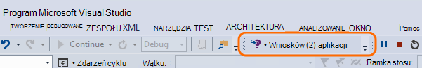
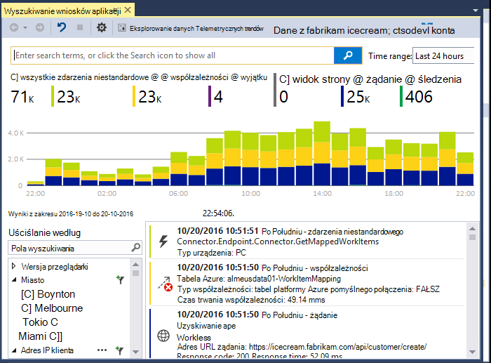
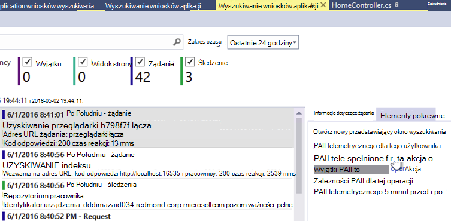
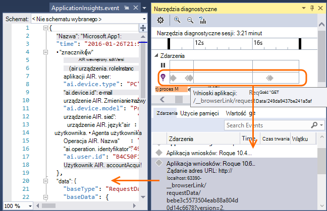
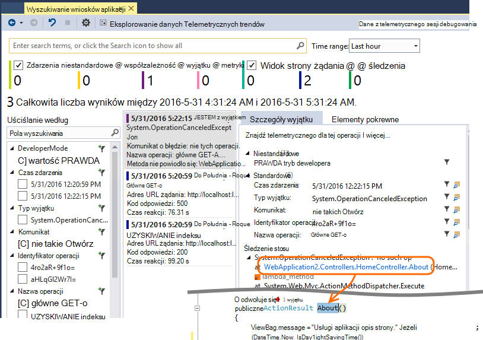
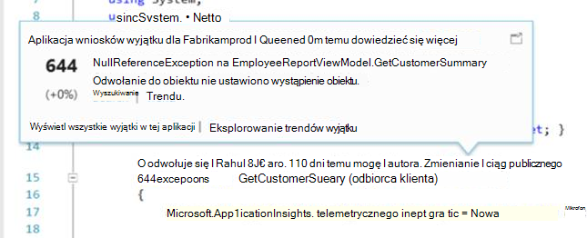
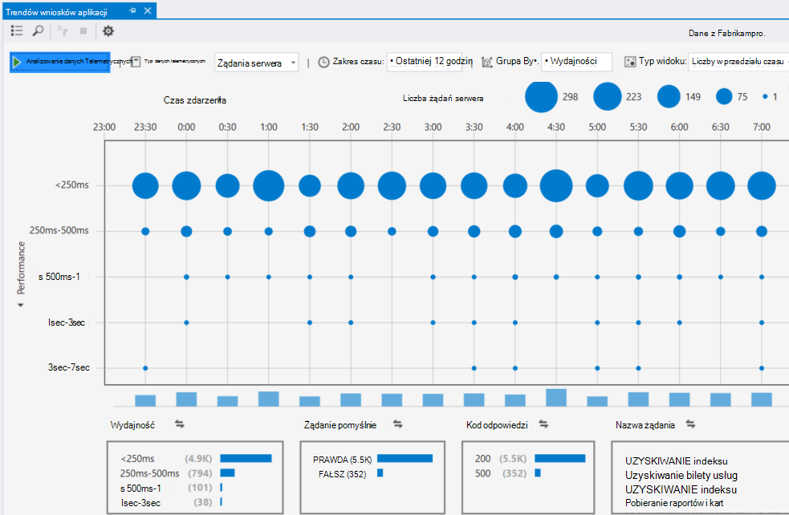
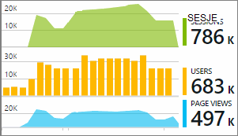

<properties 
    pageTitle="Praca z wniosków aplikacji w programie Visual Studio" 
    description="Analiza wydajności i diagnostyki podczas debugowania i produkcji." 
    services="application-insights" 
    documentationCenter=".net"
    authors="alancameronwills" 
    manager="douge"/>

<tags 
    ms.service="application-insights" 
    ms.workload="tbd" 
    ms.tgt_pltfrm="ibiza" 
    ms.devlang="na" 
    ms.topic="get-started-article" 
    ms.date="06/21/2016" 
    ms.author="awills"/>

# Praca z wniosków aplikacji w programie Visual Studio

W programie Visual Studio (2015 lub nowszy) możesz analizowanie wydajności i diagnozowanie problemów zarówno w debugowania i produkcji, przy użyciu telemetrycznego z [Programu Visual Studio aplikacji wnioski](app-insights-overview.md).

Jeśli nie jest jeszcze [Zainstalowany wniosków aplikacji w aplikacji](app-insights-asp-net.md), czy to teraz.

## Debugowanie projektu

Uruchomienie aplikacji z F5 i przetestuj: otwieranie różnych stronach w celu wygenerowania niektórych telemetrycznego.

W programie Visual Studio zostanie wyświetlona liczba zdarzeń, które zostały zarejestrowane.

Kliknij ten przycisk, aby otworzyć okno Wyszukiwanie diagnostyczne. 

## Wyszukiwanie diagnostyczne

Okno wyszukiwania zawiera zdarzenia, które zostały zarejestrowane. (Jeśli zalogowano Azure podczas konfigurowania aplikacji wniosków, możesz szukać tego samego zdarzenia w portalu.)

Wyszukiwanie niezależnej działa na wszystkie pola w zdarzenia. Na przykład wyszukiwanie część adresu URL strony; lub wartość właściwości, takich jak kod pocztowy klienta; lub z określonymi wyrazami w dzienniku śledzenia.

Kliknij dowolne zdarzenie, aby wyświetlić właściwości szczegółowe.

Można również Otwórz kartę powiązanych elementów diagnozowanie żądań zakończonych niepowodzeniem lub wyjątków.

## Centrum diagnostyki

Centrum diagnostyki (w Visual Studio 2015 lub nowszej) przedstawiono telemetrycznego serwera wniosków aplikacji jest generowany. Dzieje się tak, nawet jeśli tylko wybrał Zainstaluj zestaw SDK, bez łączenia go do zasobu w portalu Azure.

## Wyjątki

Jeśli masz [wyjątku monitorowania](app-insights-asp-net-exceptions.md), raporty wyjątku pojawi się w oknie Wyszukiwanie. 

Kliknij pozycję wyjątków, aby uzyskać śledzenia stosu. Jeśli kod aplikacji jest otwarty w programie Visual Studio, możesz kliknąć za pośrednictwem za pomocą śledzenia stosu do odpowiedniego wiersza kodu.

Ponadto w wierszu obiektyw kod powyżej każdej z tych metod pojawi się liczba wyjątków, rejestrowane przez aplikację wniosków w ciągu ostatnich 24 godzin.

## Lokalne monitorowania

(Z programu Visual Studio aktualizacja 2015 2) Jeśli jeszcze nie skonfigurowano SDK wysyłanie telemetrycznego do portalu wniosków aplikacji (dzięki temu ApplicationInsights.config jest żaden klucz oprzyrządowania) oknie diagnostyki zostaną wyświetlone telemetrycznego z najnowszych debugowania sesji. 

Jest to pożądane, jeśli masz już opublikowane poprzednią wersję aplikacji. Nie chcesz telemetrycznego z Twojej sesji debugowania, aby zostać zamienione z telemetrycznego portalu wniosków aplikacji z opublikowanych aplikacji.

Jest również przydatne, jeśli masz kilka [niestandardowych telemetrycznego](app-insights-api-custom-events-metrics.md) chcesz debugowanie przed wysłaniem telemetrycznego do portalu.

* *Na początku I w pełni skonfigurowane wniosków aplikacji, aby wysłać telemetrycznego do portalu. Ale teraz chcesz wyświetlić telemetrycznego tylko w programie Visual Studio.*

 * W obszarze Ustawienia okna Wyszukiwanie istnieje możliwość wyszukiwania lokalnego diagnostyki, nawet w przypadku aplikacji wysyła telemetrycznego do portalu.
 * Aby zatrzymać telemetrycznego wysyłana do portalu, komentarz wiersza `<instrumentationkey>...` z ApplicationInsights.config. Gdy wszystko będzie już gotowe do ponownego wysłania telemetrycznego do portalu, Usuń komentarze.

## Trendów

Trendów to narzędzie do wizualizacji zachowanie aplikacji w czasie. 

Wybierz pozycję **Eksplorowanie trendów telemetrycznego** z przycisku na pasku narzędzi aplikacji wniosków lub okna aplikacji wniosków wyszukiwania. Wybierz jedną z pięciu typowych kwerend, aby rozpocząć pracę. Można analizować różnych zestawów danych na podstawie typów telemetrycznego, zakresami czasu i inne właściwości. 

Aby znaleźć różnic w odniesieniu w danych, wybierz jedną z opcji anomalii w obszarze lista rozwijana "Typ widoku". Opcje filtrowania w dolnej części okna ułatwiają skupić w na określony podzbiór usługi telemetrycznego.

[Więcej informacji na temat trendów](app-insights-visual-studio-trends.md).

## Co to jest dalej?

||
|---|---
|**[Dodawanie większej ilości danych](app-insights-asp-net-more.md)** Monitorowanie użycia, dostępność, zależności, wyjątki. Włączenie śledzenia z ram rejestrowanie. Napisz telemetrycznego niestandardowe. | 
|**[Praca z portalem wniosków aplikacji](app-insights-dashboards.md)** Eksportowanie pulpitów nawigacyjnych, zaawansowane narzędzia diagnostyczne i analityczne, alerty, mapy live zależności aplikacji i telemetrycznego. |

 
