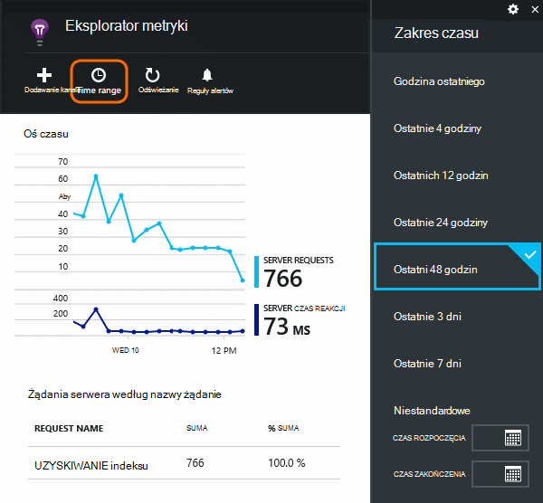
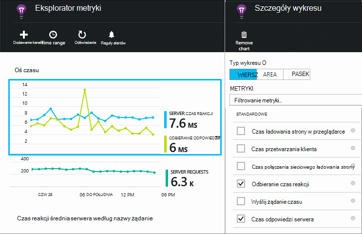
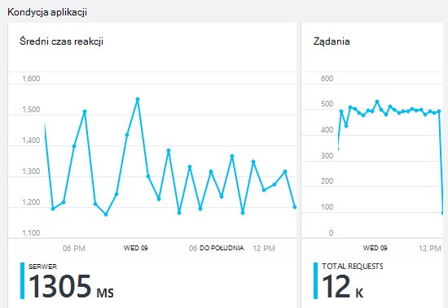
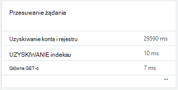
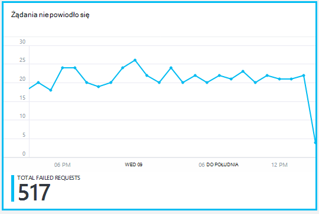
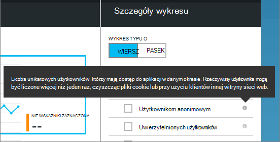
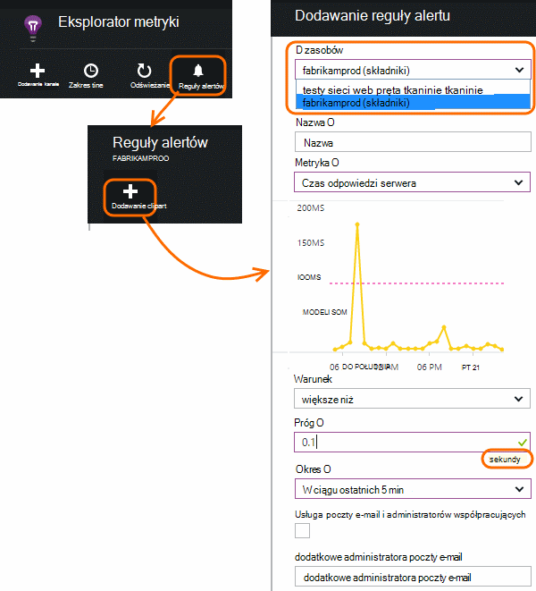

<properties 
    pageTitle="Monitorowanie kondycji i zastosowania przy użyciu aplikacji wniosków aplikacji sieci" 
    description="Wprowadzenie do aplikacji wnioski. Analizowanie użycia, dostępności i wydajności lokalnego lub aplikacji Microsoft Azure." 
    services="application-insights" 
    documentationCenter=""
    authors="alancameronwills" 
    manager="douge"/>

<tags 
    ms.service="application-insights" 
    ms.workload="tbd" 
    ms.tgt_pltfrm="ibiza" 
    ms.devlang="na" 
    ms.topic="article" 
    ms.date="11/25/2015" 
    ms.author="awills"/>
 
# Monitorowanie wydajności w aplikacjach sieci web

*Wnioski aplikacji jest w podglądzie.*

Upewnij się, że aplikacja działa również i szybko informacje o liniach wszystkie błędy. [Aplikacja wniosków] [ start] Opisz wszelkie problemy z wydajnością i wyjątki i ułatwić odnalezienie i diagnozowanie przyczyn.

Wnioski aplikacji można monitorować zarówno Java i ASP.NET aplikacji sieci web i usług, usług WCF. Mogą być hostowana w wersji lokalnej, w środowisku maszyn wirtualnych systemu lub jako Microsoft Azure witryn sieci Web. 

Po stronie klienta wniosków aplikacji może zająć telemetrycznego ze stron sieci web i z wielu różnych urządzeniach, łącznie z systemem iOS, Android i aplikacje ze Sklepu Windows.

## Konfigurowanie monitorowania wydajności

Jeśli nie została jeszcze dodana wniosków aplikacji do projektu (Jeśli nie zawiera on ApplicationInsights.config), wybierz jedną z następujących sposobów, aby rozpocząć pracę:

* [Aplikacje sieci web programu ASP.NET](app-insights-asp-net.md)
 * [Dodaj wyjątek monitorowania](app-insights-asp-net-exceptions.md)
 * [Dodawanie współzależności monitorowania](app-insights-monitor-performance-live-website-now.md)
* [Aplikacje web J2EE](app-insights-java-get-started.md)
 * [Dodawanie współzależności monitorowania](app-insights-java-agent.md)

## Poznawanie wskaźniki

W [portalu Azure](https://portal.azure.com)przejdź do zasobu wniosków aplikacji skonfigurowanego dla aplikacji. Karta Przegląd zawiera dane dotyczące wydajności podstawowe:

Kliknij wykres, aby wyświetlić więcej szczegółów i wyświetlić wyniki przez dłuższy czas. Na przykład kliknij żądania, a następnie wybierz zakres czasu:

Kliknij wykres, aby wybierz które metryki są wyświetlane, lub dodawanie nowego wykresu i wybierz jego metryki:

> [AZURE.NOTE] **Wyczyść pole wyboru wszystkie metryki** , aby wyświetlić całą sekcję, który jest dostępny. Metryki należą do grupy; Po zaznaczeniu każdy członek grupy są wyświetlane tylko innych członków tej grupy.

## Co oznacza je wszystkie? Kafelki wydajności i raportów

Istnieje szereg wskaźniki, które można uzyskać. Zacznijmy od tych, które pojawiają się domyślnie na karta aplikacji.

### Żądania

Liczba żądania HTTP otrzymane w podanym okresie. Porównaj to z wynikami względem innych raportów, aby zobaczyć, jak aplikacji zachowuje się jak Załaduj zmienia się.

Żądanie HTTP zawierać wszystkie żądania GET lub POST stron, danych i obrazów.

Kliknij Kafelek, aby uzyskać liczniki dla określonych adresów URL.

### Średni czas reakcji

Środki czasu między żądaniem sieci web, wprowadzając aplikacji i odpowiedź są zwracane.

Punkty umożliwia wyświetlenie ruchomą średnia. Jeśli istnieje wiele żądań, mogą występować niektóre, który różni się od średniej bez widocznych Szczyt lub zanurzyć na wykresie.

Poszukaj nietypowe wartości. Na ogół przewiduje czas reakcji na wzrostu z wzrost żądania. W przypadku nieproporcjonalny wzrostu aplikacji może być naciśnięcie limit zasobów, takich jak Procesora lub wydajność usługi, które są używane.

Kliknij Kafelek, aby uzyskać godziny dla określonych adresów URL.

### Przesuwanie żądania

Pokazuje, które żądania może być konieczne Dostosowywanie wydajności.

### Żądania nie powiodło się

Liczba żądań, które wygenerował nie przechwycony wyjątki.

Kliknij Kafelek, aby wyświetlić szczegóły określone awarie, a następnie wybierz indywidualne żądanie, aby wyświetlić jej szczegóły. 

Przedstawiciela próbki błędów jest zachowywana dla poszczególnych kontroli.

### Inne wskaźniki

Aby zobaczyć, jak ustawić inne wskaźniki można wyświetlać, kliknij wykres i usuń zaznaczenie opcji wszystkie metryki, aby wyświetlić dostępne pełnej. Kliknij (i), aby wyświetlić definicji Każda metryka.

Wybieranie dowolnej metryki wyłączy osobom, które nie są wyświetlane na tym samym wykresie.

## Ustawianie alertów

Aby otrzymywać powiadomienia pocztą e-mail wartości dowolnym metryki, Dodaj alertu. Możesz albo wysłać wiadomość e-mail, administratorom konta lub do adresów e-mail określone.

Ustawianie zasób przed inne właściwości. Nie należy wybierać zasoby webtest, jeśli chcesz ustawić alerty dla miar wydajności i użycia.

Należy zachować ostrożność Uwaga jednostki, w których jest wyświetlana prośba o wprowadź wartość progowa.

*Przycisk Dodaj Alert nie jest widoczny.* — Jest to grupy konta, do którego masz dostęp tylko do odczytu? Skontaktuj się z administratorem konta.

## Diagnozowanie problemów

Oto kilka porad dotyczących znajdowania i diagnozowanie problemów z wydajnością:

* Ustawianie [testów web] [ availability] alertów, jeśli witryny sieci web zostanie wyłączona lub odpowiada nieprawidłowo lub powoli. 
* Porównanie licznik żądania przy użyciu innych metryk, aby sprawdzić, czy błędy lub powolnych odpowiedzi dotyczą ładowanie.
* [Wstawianie i przeszukiwanie śledzenia instrukcji] [ diagnostic] w kodzie ułatwiające identyfikowanie problemów.

## Następne kroki

[Testy z siecią Web] [ availability] -żądania sieci web wysyłane do aplikacji w regularnych odstępach na całym świecie.

[Przechwytywanie i przeszukiwanie diagnostyczne śledzenia] [ diagnostic] - Wstawianie połączeń śledzenia i zapoznawanie wyników w celu określenia problemów.

[Użycie śledzenia] [ usage] — Dowiedz się, jak osób za pomocą aplikacji.

[Rozwiązywanie problemów z] [ qna] - i aparatu pytania i odpowiedzi

## Klip wideo

[AZURE.VIDEO performance-monitoring-application-insights]

<!--Link references-->

[availability]: app-insights-monitor-web-app-availability.md
[diagnostic]: app-insights-diagnostic-search.md
[greenbrown]: app-insights-asp-net.md
[qna]: app-insights-troubleshoot-faq.md
[redfield]: app-insights-monitor-performance-live-website-now.md
[start]: app-insights-overview.md
[usage]: app-insights-web-track-usage.md

 
