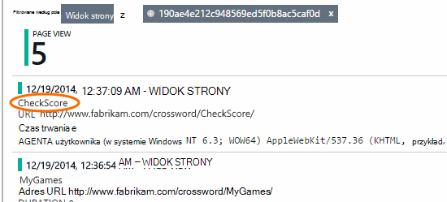

<properties 
    pageTitle="Analiza użycia dla aplikacji sieci web przy użyciu aplikacji wniosków" 
    description="Omówienie analizy użycia dla aplikacji sieci web przy użyciu aplikacji wniosków" 
    services="application-insights" 
    documentationCenter=""
    authors="alancameronwills" 
    manager="douge"/>

<tags 
    ms.service="application-insights" 
    ms.workload="tbd" 
    ms.tgt_pltfrm="ibiza" 
    ms.devlang="na" 
    ms.topic="article" 
    ms.date="06/12/2016" 
    ms.author="awills"/>
 
# <a name="usage-analysis-for-web-applications-with-application-insights"></a>Analiza użycia dla aplikacji sieci web przy użyciu aplikacji wniosków

Informacje o sposobem korzystania z aplikacji pozwala wyodrębnienia pracy opracowywania scenariuszy, które są najbardziej istotne do nich i uzyskanie wniosków do celów, które są łatwiejsze lub trudne do osiągnięcia. 

Visual Studio aplikacji wniosków udostępnia dwa poziomy zastosowania śledzenia:

* **Użytkownicy, sesji i wyświetlania danych** - przewiduje się pole.  
* **Niestandardowe telemetrycznego** -, [Pisanie kodu] [ api] do śledzenia użytkowników za pomocą środowiska pracy użytkownika do aplikacji. 

## <a name="setting-up"></a>Aby skonfigurować

Otwórz zasób wniosków aplikacji w [Azure Portal](https://portal.azure.com), kliknij pusty wykres obciążenia strony przeglądarki, a następnie postępuj zgodnie z instrukcjami instalacji.

[Dowiedz się więcej](app-insights-javascript.md) 


## <a name="how-popular-is-my-web-application"></a>Jak popularne jest Moja aplikacja sieci web?

Zaloguj się do [portalu Azure][portal], przejdź do zasobu aplikacji i kliknij pozycję Użycie:


* **Użytkowników:** Liczba unikatowych aktywni użytkownicy w przedziale czasu wykresu. 
* **Sesji:** Liczba aktywnych sesji
* **Liczba wyświetleń strony** Zlicza połączenia do trackPageView(), zwykle o nazwie raz w każdej strony sieci web.

Kliknij dowolny wykres, aby wyświetlić więcej szczegółów. Zwróć uwagę, można zmienić zakres czasu wykresów.

### <a name="where-do-my-users-live"></a>Miejsce, w którym live moich użytkowników?

Z karta zastosowania kliknij wykres użytkowników, aby zobaczyć więcej szczegółów:


 
### <a name="what-browsers-or-operating-systems-do-they-use"></a>Jakie przeglądarki i systemy operacyjne czy ich używać?

Grupowanie (segmentu) danych według właściwości, takie jak przeglądarki, System operacyjny lub miasta:


## <a name="sessions"></a>Sesje

Sesja jest podstawowe pojęcia w wniosków aplikacji, której dokłada starań, aby skojarzyć wszystkich telemetrycznego zdarzenie — na przykład żądania, liczbę wyświetleń stron, wyjątki i zdarzenia niestandardowe kodu możesz samodzielnie - sesji określonego użytkownika. 

Sformatowany kontekstu informacje są zbierane informacje o każdej sesji, takie jak właściwości urządzenia, lokalizację geo, system operacyjny i tak dalej.

Jeśli instrumentu klienta i serwera ([ASP.NET] [ greenbrown] lub [J2EE][java]), SDK zostaną przeniesione identyfikator sesji między klientem a serwerem, dlatego wydarzeń na obu stronach arkusza można powiązane.

Gdy [Diagnozowanie problemów][diagnostic], można znaleźć wszystkie telemetrycznego dotyczących sesji, w którym wystąpił problem, w tym wyjątków wszystkie żądania i wszelkich zdarzeń lub śledzenia, które zostały zarejestrowane.

Umożliwia dobrą miarę popularności kontekstów, takie jak urządzenia, system operacyjny lub lokalizacji. Pokazując liczba sesji pogrupowane według urządzenia, na przykład, możesz uzyskać liczbą dokładniejszych informacji o częstotliwości tego urządzenie jest używane z aplikacji, niż, licząc wyświetleń stron. Będzie przydatne wprowadzania sprawdzać z wszelkie problemy specyficzne dla urządzenia.


#### <a name="whats-a-session"></a>Co to jest sesji?

Sesji reprezentuje pojedynczy podczas potyczki między użytkownikiem a aplikacji. W postaci najłatwiejszym sesja zaczyna się od użytkownika w przypadku uruchamiania aplikacji i kończy, gdy użytkownik opuści aplikacji. W przypadku aplikacji sieci web domyślnie sesja kończy się po 30 minutach braku aktywności lub po upływie 24 godzin działania. 

Te ustawienia domyślne można zmieniać, edytując wstawkę kodu:

    <script type="text/javascript">
        var appInsights= ... { ... }({
            instrumentationKey: "...",
            sessionRenewalMs: 3600000,
            sessionExpirationMs: 172800000
        });

* `sessionRenewalMs`: Czas (w milisekundach), aby wygasało sesji z powodu braku aktywności użytkownika. Wartość domyślna: 30 minut.
* `sessionExpirationMs`: Sesji maksymalna długość (w milisekundach). Jeśli użytkownik pozostaje aktywne po tym razem, jest liczony innej sesji. Wartość domyślna: 24 godziny.

**Czas trwania sesji** jest [metryki] [ metrics] zawierające rekordy zakres czasu między elementami telemetrycznego imię i nazwisko sesji. (Nie zawiera limit czasu).

**Liczba sesji** w danym interwale jest definiowana jako liczba unikatowych sesji z niektórych działań w tym czasie. Podczas wyszukiwania w zakresie dłuższego czasu, takie jak liczba dzienny sesji ostatnim tygodniu, jest to zazwyczaj równoważne całkowita liczba sesji. 

Jednak podczas Eksplorowanie krótszej zakresów czasu, takich jak ziarno co godzinę, sesji długie obejmujące wiele godzin będą zliczane dla każdej godziny, w którym sesja była aktywna. 

## <a name="users-and-user-counts"></a>Użytkownicy i liczby użytkowników


Każda sesja użytkownika jest skojarzony z Unikatowy identyfikator użytkownika. 

Domyślnie użytkownik jest identyfikowany przez umieszczenie pliku cookie. Użytkownik, który korzysta z wielu operacyjne lub urządzenia będą zliczane więcej niż jeden raz. (Ale zobacz [uwierzytelnionych użytkowników](#authenticated-users))


Metryka **liczba użytkowników** w danym interwale jest definiowana jako liczba unikatowych użytkowników z zarejestrowanej czynności w tym czasie. W wyniku użytkownikom długie sesje może należy ująć kilka razy, gdy Ustaw zakres godzin, aby ziarno jest mniejsza niż godzinę lub tak.

**Nowi użytkownicy** zlicza użytkowników, których pierwszą sesje z aplikacją wystąpił w tym czasie. Jeśli jest używana metoda domyślna inwentaryzacji przez użytkowników, pliki cookie, również to będzie zawierać użytkowników, które usunięto ich pliki cookie lub korzystających z nowego urządzenia lub przeglądarki Aby uzyskać dostęp do aplikacji po raz pierwszy.


### <a name="authenticated-users"></a>Uwierzytelnionych użytkowników

Jeśli aplikacji sieci web umożliwia użytkownikom, zaloguj się, możesz uzyskać dokładne zestawienia za pomocą aplikacji wniosków z identyfikatora unikatowego użytkownika. Nie ma być jej nazwę lub tej samej używanej w aplikacji. Po zainicjowaniu aplikacji zidentyfikował użytkownika, użyj tego numeru:


*JavaScript klienta*

      appInsights.setAuthenticatedUserContext(userId);

Jeśli aplikacji grupy użytkowników do konta, można również przekazać identyfikator konta. 

      appInsights.setAuthenticatedUserContext(userId, accountId);

Identyfikatory użytkownika i konta nie może zawierać spacji ani znaków`,;=|`


W [Eksploratorze metryki](app-insights-metrics-explorer.md)można utworzyć wykres **Uwierzytelnionych użytkowników** i **kont**. 

## <a name="synthetic-traffic"></a>Ruch syntetycznych

Ruch syntetycznych obejmuje żądania z sprawdza dostępności i ładowanie, aparat przeszukiwarki i innych czynników. 

Stosowanie prób wniosków dokłada starań, aby automatycznie określić klasyfikowania syntetycznych ruchu i oznacz ją odpowiednio. W większości przypadków syntetycznych ruch nie wywoła JavaScript SDK tak, aby to działanie nie jest uwzględniana użytkowników i zliczania sesji. 

Jednak dla wniosków aplikacji [sieci web testów][availability], identyfikator użytkownika są ustawiane automatycznie na podstawie lokalizacji POP i identyfikator sesji jest ustawiona na podstawie identyfikator uruchomić test. W domyślnych raportów, syntetycznych ruch zostaną odfiltrowane domyślnie wyłącza tych użytkowników i sesji. Jednak podczas syntetycznych ruch jest włączone, może spowodować zwiększona o małych w ogólnej użytkowników i liczby sesji.
 
## <a name="page-usage"></a>Użycie strony

Kliknij wykres widoków strony, aby uzyskać bardziej powiększenie wersji razem z podział najpopularniejszych stron:


 
W powyższym przykładzie pochodzi z witryny sieci Web gry. Z niego natychmiast są wyświetlane:

* Użycie nie zwiększona w ostatnim tygodniu. Być może możemy należy wziąć pod uwagę Optymalizacja aparatu wyszukiwania?
* Wiele osób mniej niż strony głównej można znaleźć na stronach gry. Dlaczego strony głównej nie przyciągania osób do gier
* "Krzyżówkami" jest najpopularniejszym nożna. Firma Microsoft powinni nadawać priorytet nowe pomysły i ulepszenia.

## <a name="custom-tracking"></a>Śledzenie niestandardowych

Załóżmy, że zamiast wykonania każdej gry na osobnej stronie sieci web, możesz zdecydować o refactor je wszystkie w samej aplikacji jedną stronę, do większości funkcji kodowane jako kod Javascript na stronie sieci web. Dzięki temu użytkownikowi szybko przełączyć się między jednej gry lub nawet mieć kilka gier na jednej stronie. 

Ale nadal chcesz wniosków aplikacji do logowania się liczba każdej gry powoduje otwarcie, w taki sam sposób, jak podczas znajdowały się one w osobnych stron sieci web. Jest łatwe: tylko wstawianie połączenia z modułem telemetrycznego do swojego JavaScript, której chcesz rekord, który został otwarty nowy "strony":

    appInsights.trackPageView(game.Name);

## <a name="custom-events"></a>Zdarzenia niestandardowe

Pisanie niestandardowych telemetrycznego do rejestrowania zdarzeń określonych. Szczególnie w aplikacji dla jednej strony warto wiedzieć, jak często wykonuje akcje określonego użytkownika lub uzyskuje określone cele: 

    appInsights.trackEvent("GameEnd");

Na przykład do logowania, klikając łącze:

    <a href="target.htm" onclick="appInsights.trackEvent('linkClick');return true;">my link</a>


## <a name="view-counts-of-custom-events"></a>Wyświetlanie liczby zdarzenia niestandardowe

Otwórz Eksploratora metryki i dodać wykres, aby pokazać zdarzenia. Segmenty według nazwy:


## <a name="drill-into-specific-events"></a>Przechodzenie do określonego zdarzenia

Uzyskanie lepszego zrozumienia jak przechodzi typowe sesji można skupić się na sesji określonego użytkownika, zawierającą określony typ zdarzenia. 

W tym przykładzie możemy kodowane zdarzenia niestandardowego "NoGame" nazywanym jeśli loguje bez rzeczywistego Rozpoczynanie gry. Dlaczego użytkownik może to zrobić? Być może Jeśli firma Microsoft przechodzić do niektórych poszczególne wystąpienia, możemy wyświetlony clue. 

Zdarzenia niestandardowe odebrana z aplikacji są wyświetlane według nazwy karta Przegląd:


 
Kliknij zdarzenie odsetek i wybierz ostatnie określonego wystąpienia:


 
Przyjrzyjmy się wszystkie telemetrycznego dla sesji, w którym wystąpił danego zdarzenia NoGame. 


 
Wystąpiły bez wyjątków, aby użytkownik nie uniemożliwia odtwarzanie przy niektórych błąd.
 
Firma Microsoft odfiltrować wszystkie typy telemetrycznego z wyjątkiem wyświetleń stron dla tej sesji:



 
A teraz widać, ten użytkownik zalogowany wystarczy, aby sprawdzić najnowsze wyniki. Powinny być może warto opracować historii użytkownika, co ułatwi to zrobić. (I firma Microsoft wykonała zdarzenia niestandardowego do raportu po wystąpieniu tego artykułu określonych.)

## <a name="filter-search-and-segment-your-data-with-properties"></a>Filtrowanie, wyszukiwanie i segmentu danych za pomocą właściwości
Wartości liczbowe i znacznikami dowolnego można dołączać do zdarzenia.
 

*JavaScript klienta*

```JavaScript

    appInsights.trackEvent("WinGame",
        // String properties:
        {Game: currentGame.name, Difficulty: currentGame.difficulty},
        // Numeric measurements:
        {Score: currentGame.score, Opponents: currentGame.opponentCount}
    );
```

*C# na serwerze*

```C#

    // Set up some properties:
    var properties = new Dictionary <string, string> 
        {{"game", currentGame.Name}, {"difficulty", currentGame.Difficulty}};
    var measurements = new Dictionary <string, double>
        {{"Score", currentGame.Score}, {"Opponents", currentGame.OpponentCount}};

    // Send the event:
    telemetry.TrackEvent("WinGame", properties, measurements);
```

*VB na serwerze*

```VB

    ' Set up some properties:
    Dim properties = New Dictionary (Of String, String)
    properties.Add("game", currentGame.Name)
    properties.Add("difficulty", currentGame.Difficulty)

    Dim measurements = New Dictionary (Of String, Double)
    measurements.Add("Score", currentGame.Score)
    measurements.Add("Opponents", currentGame.OpponentCount)

    ' Send the event:
    telemetry.TrackEvent("WinGame", properties, measurements)
```

Dołączanie właściwości do wyświetleń stron w taki sam sposób:

*JavaScript klienta*

```JS

    appInsights.trackPageView("Win", 
        url,
        {Game: currentGame.Name}, 
        {Score: currentGame.Score});
```

W polu Wyszukaj diagnostyczne Wyświetl właściwości, klikając pozycję przez poszczególne wystąpienia zdarzenia.


 
Użyj pola wyszukiwania, aby wyświetlić wystąpienia zdarzenia o wartości określonej właściwości.


## <a name="a--b-testing"></a>A | Testowanie B

Jeśli nie wiesz, który wariant funkcji więcej powiedzie się, zwolnij oba wprowadzania każdego dostępne dla różnych użytkowników. Miarą sukcesu w każdej, a następnie przesuń do unified wersji.

Dla tej metody możesz dołączyć odrębnych znaczniki do wszystkich telemetrycznego wysłanej przez w każdej wersji aplikacji. Można to zrobić, definiując właściwości w aktywnej TelemetryContext. Te domyślne właściwości są dodawane do każdej telemetrycznego wiadomości wysyłające aplikacji — nie tylko niestandardowe wiadomości, ale także standardowe telemetrycznego. 

W portalu wniosków aplikacji zostanie następnie można filtr i grupa (segmentu) danych na znaczniki, aby porównać wersje.

*C# na serwerze*

```C#

    using Microsoft.ApplicationInsights.DataContracts;

    var context = new TelemetryContext();
    context.Properties["Game"] = currentGame.Name;
    var telemetry = new TelemetryClient(context);
    // Now all telemetry will automatically be sent with the context property:
    telemetry.TrackEvent("WinGame");
```

*VB na serwerze*

```VB

    Dim context = New TelemetryContext
    context.Properties("Game") = currentGame.Name
    Dim telemetry = New TelemetryClient(context)
    ' Now all telemetry will automatically be sent with the context property:
    telemetry.TrackEvent("WinGame")
```

Poszczególne telemetrycznego można zastąpić wartości domyślne.

Uniwersalny inicjator można ustawić tak, aby wszystkie nowe TelemetryClients automatycznie Użyj kontekstu.

```C#


    // Telemetry initializer class
    public class MyTelemetryInitializer : ITelemetryInitializer
    {
        public void Initialize (ITelemetry telemetry)
        {
            telemetry.Properties["AppVersion"] = "v2.1";
        }
    }
```

W inicjator aplikacji, takich jak Global.asax.cs:

```C#

    protected void Application_Start()
    {
        // ...
        TelemetryConfiguration.Active.TelemetryInitializers
        .Add(new MyTelemetryInitializer());
    }
```


## <a name="build---measure---learn"></a>Tworzenie - miary — informacje

Za pomocą analizy staje się zintegrowanym elementem procesu opracowywania — nie tylko coś Pomyśl o do rozwiązania problemów. Oto kilka porad:

* Ustalanie kluczowych metryk aplikacji. Czy chcesz wielu użytkownikom możliwie lub będzie lepszy małego zestawu bardzo Radosna użytkowników? Czy chcesz zmaksymalizować wizyty lub sprzedaży?
* Planowanie celu pomiaru każdej sekcji. Gdy szkicowanie nowego wątku użytkownika lub funkcji lub planu w celu zaktualizowania istniejącej, zawsze wziąć pod uwagę co będzie miarą sukcesu zmiany. Przed kodowanie uruchomienia, poproś "efekt to będzie w naszym miar, jeśli to działa? Czy firma Microsoft śledzić wszelkie nowe zdarzenia?"
I oczywiście, gdy ta funkcja jest live, upewnij się, spójrz na analizy i działania na stronie wyników. 
* Tworzenie relacji między innymi wskaźnikami klucza jednostki metryczne. Na przykład po dodaniu funkcji "Ulubione" chcesz wiedzieć, jak często użytkownicy Dodaj ulubione. Ale jest prawdopodobnie więcej interesujące wiedzieć, jak często są wrócić do ulubionych. I najważniejsze, czy klienci korzystający z ulubionych ostatecznie kupić więcej produktu?
* Testowanie Kanaryjskich. Ustaw przełącznik funkcji, który umożliwia nawiązywanie nową funkcję widoczny tylko dla niektórych użytkowników. Aby sprawdzić, czy nowa funkcja jest używane w taki sposób, który możesz przewidziane za pomocą aplikacji wnioski. Wprowadź zmiany, a następnie zwolnij go do większej liczby osób.
* Zwróć się do użytkowników! Analiza za mało samodzielnie, ale uzupełniające do utrzymania relacji z klientem dobre.


## <a name="references"></a>Odwołania

* [Korzystanie z interfejsu API — omówienie][api]
* [Odwołanie interfejsu API języka JavaScript](https://github.com/Microsoft/ApplicationInsights-JS/blob/master/API-reference.md)

## <a name="video"></a>Klip wideo

> [AZURE.VIDEO usage-monitoring-application-insights]


<!--Link references-->

[api]: app-insights-api-custom-events-metrics.md
[availability]: app-insights-monitor-web-app-availability.md
[client]: app-insights-javascript.md
[diagnostic]: app-insights-diagnostic-search.md
[greenbrown]: app-insights-asp-net.md
[java]: app-insights-java-get-started.md
[metrics]: app-insights-metrics-explorer.md
[portal]: http://portal.azure.com/
[windows]: app-insights-windows-get-started.md

 
