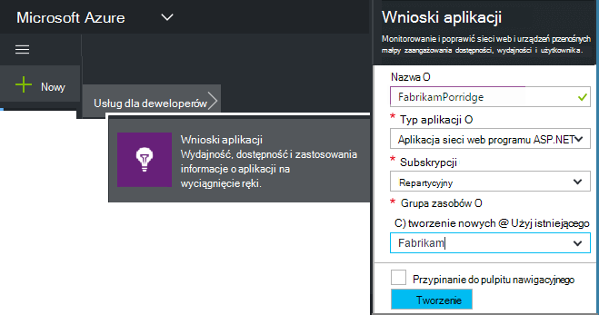

<properties
    pageTitle="Usługi aplikacji wniosków dla systemu Windows i ról pracownik | Microsoft Azure"
    description="Ręczne dodawanie SDK wniosków aplikacji do aplikacji programu ASP.NET, aby przeprowadzić analizę użycia, dostępności i wydajności."
    services="application-insights"
    documentationCenter=".net"
    authors="alancameronwills"
    manager="douge"/>

<tags
    ms.service="application-insights"
    ms.workload="tbd"
    ms.tgt_pltfrm="ibiza"
    ms.devlang="na"
    ms.topic="get-started-article"
    ms.date="08/30/2016"
    ms.author="awills"/>

# Ręczne konfigurowanie aplikacji wniosków dla aplikacji 4 programu ASP.NET

*Wnioski aplikacji jest w podglądzie.*

[AZURE.INCLUDE [app-insights-selector-get-started](../../includes/app-insights-selector-get-started.md)]

Można ręcznie skonfigurować [Visual Studio aplikacji wniosków](app-insights-overview.md) monitorowanie usług systemu Windows, pracownik ról i innych aplikacji ASP.NET. W przypadku aplikacji sieci web Konfiguracja ręczna stanowi alternatywę dla [automatycznej konfiguracji](app-insights-asp-net.md) oferowanych przez program Visual Studio.

Wnioski aplikacji ułatwia diagnozowanie problemów i monitorowanie wydajności i użycia w aplikacji programu live.

#### Przed rozpoczęciem

Potrzebujesz:

* Subskrypcję usługi [Microsoft Azure](http://azure.com). Jeśli Twój zespół lub organizacja ma subskrypcję usługi Azure, właściciela można dodać możesz do niej, za pomocą [konta Microsoft](http://live.com).
* Program Visual Studio 2013 lub nowszym.

## 1. Utwórz zasób wniosków aplikacji

Zaloguj się do [portalu Azure](https://portal.azure.com/)i utworzyć nowy zasób wniosków aplikacji. Wybierz ASP.NET jako typ aplikacji.

[Zasób](app-insights-resources-roles-access-control.md) platformy Azure jest wystąpieniem usługi. Zasób jest miejsce, w którym analizowane i odpowiedzi na pytanie telemetrycznego z Twojej aplikacji.

Wybór typu aplikacja ustawia widoczne w [Eksploratorze metryki](app-insights-metrics-explorer.md)domyślnej zawartości karty zasobów i właściwości.

#### Kopiowanie klucza oprzyrządowania

Klucz identyfikuje zasób, a następnie można będzie ją zainstalować wkrótce w zestawie SDK do kierowania danych do tego zasobu.

Czynności, które jest po prostu już gotowe do utworzenia nowego zasobu są dobrym sposobem uruchomić monitorowania dowolnej aplikacji. Teraz możesz wysłać danych do niego.

## 2. Zainstaluj zestaw SDK w aplikacji

Instalowanie i konfigurowanie aplikacji SDK wniosków zależnie od platformy, nad którymi pracuje. W przypadku aplikacji ASP.NET jest łatwe.

1. W programie Visual Studio Edytuj pakietów NuGet projektu aplikacji sieci web.

    

2. Instalowanie aplikacji wniosków SDK dla aplikacji sieci Web.

    

    *Czy można używać innych pakietów?*

    Wartość Tak. Jeśli chcesz wysyłanie własnych telemetrycznego za pomocą interfejsu API, wybierz pozycję interfejsu API podstawowe (Microsoft.ApplicationInsights). Pakietu Windows Server automatycznie zawiera interfejsu API Core oraz wiele innych pakietów, takie jak licznika wydajności i monitorowanie zależności. 

#### Aby uaktualnić przyszłych wersjach SDK

Nową wersję zestawu SDK wydania od czasu do czasu.

Aby uaktualnić do [nowej wersji SDK](https://github.com/Microsoft/ApplicationInsights-dotnet-server/releases/), otwórz ponownie Menedżera pakietów NuGet i filtru na zainstalowanych pakietów. Wybierz pozycję **Microsoft.ApplicationInsights.Web** i wybierz pozycję **uaktualnienia**.

Jeśli zostały wprowadzone żadne dostosowania ApplicationInsights.config zapisać jego kopię przed uaktualnienie, a następnie scalić zmiany w nowej wersji.

## 3. wysyłanie telemetrycznego

**Po zainstalowaniu pakietu podstawowego interfejsu API:**

* Ustawianie klucza oprzyrządowania w kodzie, na przykład w `main()`: 

    `TelemetryConfiguration.Active.InstrumentationKey = "`*klucz*`";` 

* [Napisz własny telemetrycznego korzystanie z interfejsu API](app-insights-api-custom-events-metrics.md#ikey).

**Jeśli zainstalowano inne pakiety wniosków aplikacji,** które można, jeśli wolisz, aby ustawić klucz oprzyrządowania za pomocą pliku .config:

* Edytowanie ApplicationInsights.config (który został dodany, zainstaluj NuGet). Wstawianie to bezpośrednio przed zamykającym znaczniku:

    `<InstrumentationKey>`*klucz oprzyrządowania, który został skopiowany*`</InstrumentationKey>`

* Upewnij się, że są ustawione właściwości ApplicationInsights.config w Eksploratorze rozwiązań **Tworzenie akcji = zawartość, Kopiuj do katalogu wyjściowego = kopii**.

## Uruchom projekt

Uruchamianie aplikacji i przetestuj za pomocą **F5** : otwieranie różnych stronach w celu wygenerowania niektórych telemetrycznego.

W programie Visual Studio zostanie wyświetlona liczba zdarzeń, które zostały wysłane.

## Wyświetlanie swojej telemetrycznego

Powróć do [Azure portal](https://portal.azure.com/) i przejdź do zasobu wniosków aplikacji.

Poszukaj danych na wykresach — omówienie. Na początku zostanie wyświetlony tylko jednej lub dwóch punktów. Na przykład:

Kliknij wykres, aby wyświetlić szczegółowe metryki. [Dowiedz się więcej na temat metryki.](app-insights-web-monitor-performance.md)

#### Brak danych?

* Za pomocą aplikacji otwieranie różnych stron tak, aby generuje niektórych telemetrycznego.
* Otwórz kafelków [wyszukiwania](app-insights-diagnostic-search.md) , aby wyświetlić pojedynczych zdarzeń. Czasami wystarczy zdarzeń nieco podczas dłużej uzyskanie potoku metryki.
* Poczekaj kilka sekund, a następnie kliknij polecenie **Odśwież**. Wykresy odświeżanie się okresowo, ale można odświeżać ręcznie Jeśli czekasz, niektóre dane się pojawić.
* Zobacz [Rozwiązywanie problemów](app-insights-troubleshoot-faq.md).

## Publikowanie aplikacji

Teraz wdrażania aplikacji do swojego serwera lub Azure i obejrzyj zebrać dane.

Po uruchomieniu w trybie debugowania telemetrycznego jest przyspieszona potoku, tak aby powinny być widoczne dane znajdujące się w ciągu kilku sekund. Podczas wdrażania aplikacji w wersji konfiguracji dane zebrane wolniej.

#### Brak danych po opublikowaniu na serwerze?

Otwórz następujące porty dla ruchu wychodzącego w zaporze swojego serwera:

+ `dc.services.visualstudio.com:443`
+ `f5.services.visualstudio.com:443`

#### Problemy z na serwerze kompilacji?

Zobacz [Ten element Rozwiązywanie problemów](app-insights-asp-net-troubleshoot-no-data.md#NuGetBuild).

> [AZURE.NOTE]Jeśli aplikacji generuje wiele telemetrycznego (i używasz 2.0.0-beta3 wersji zestaw SDK programu ASP.NET lub nowszy), moduł adaptacyjne przy próbkowaniu zostanie automatycznie zmniejszyć objętość wysłany do portalu, wysyłając przedstawiciela ułamek zdarzeń. Jednak zdarzenia, które są związane z tym samym żądanie zaznaczone lub wyczyszczone grupowo, dlatego możesz przechodzić między powiązane z nimi zdarzenia. 
> [Więcej informacji na temat pobierania](app-insights-sampling.md).

## Następne kroki

* [Dodawanie więcej telemetrycznego](app-insights-asp-net-more.md) pozwala sprawdzić 360 stopni aplikacji.

