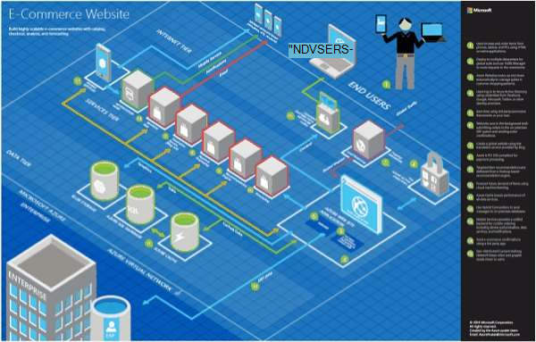

<properties 
    pageTitle="Architektura aplikacji Microsoft Azure | Microsoft Azure" 
    description="Przegląd architektury, zajmującego typowe wzorce projektu" 
    services="" 
    documentationCenter="" 
    authors="Rboucher" 
    manager="jwhit" 
    editor="mattshel"/>

<tags 
    ms.service="multiple" 
    ms.workload="na" 
    ms.tgt_pltfrm="na" 
    ms.devlang="na" 
    ms.topic="article" 
    ms.date="09/13/2016" 
    ms.author="robb"/>

#Architektura aplikacji Microsoft Azure
Zasoby do tworzenia aplikacji, które używają Microsoft Azure. Ta opcja uwzględnia narzędzia ułatwiające narysować diagramy wizualnie Opisz systemów oprogramowania. 

##Plakat wzorców projektu

Desenie firmy Microsoft i wskazówki dotyczące został opublikowany książce [Wzorców projektowania chmurze](http://msdn.microsoft.com/library/dn568099.aspx) jest dostępne zarówno w witrynie MSDN i pobieranie plików PDF. Jest również dostępne plakatu formatu, który zawiera listę wszystkich wzorców. 

##Kurs certyfikacji architektura firmy Microsoft

Firma Microsoft utworzyła kursu architektura pomocniczych Microsoft egzaminów certyfikacji 70-534. Jest [dostępne bezpłatnie na EDX.ORG](https://www.edx.org/course/architecting-microsoft-azure-solutions-microsoft-dev205x).  Użyto [Szablony plan 3-w w programie Visio](#3d-blueprint-visio-template). 

##Rozwiązania firmy Microsoft

Firma Microsoft publikuje zestawu wysokiego poziomu [architektury rozwiązanie](http://aka.ms/azblueprints) przedstawiająca sposób tworzenia określonych typów systemów przy użyciu produktów firmy Microsoft. 

Microsoft opublikowane wcześniej zestaw schematów architektury przykład przedstawiający. Te zostały zastąpione architektury rozwiązania wspomniano wcześniej, a łącze plan został przekierowany, aby wskazywały je. Aby uzyskać dostęp do poprzedniego materiałów schematów jakiegoś powodu, Wyślij wiadomość e-mail [CnESymbols@microsoft.com](mailto:CnESymbols@microsoft.com) z Twoją prośbę.   

Schematów i diagramów architektury rozwiązanie za pomocą części [chmurze i ustawianie Symbol przedsiębiorstwa](#Drawing-symbol-and-icon-sets).   

##Szablon programu Visio plan 3-w

3-w wersji teraz unieczynnione [Schematów architektury Microsoft](http://aka.ms/azblueprints) zostały wstępnie utworzone w narzędziu firmy Microsoft. Szablon programu Visio 2013 (lub nowszy) pozycji 5 sie 2015 jako część [kursu certyfikacji architektury Microsoft distributed na EDX.ORG](#microsoft-architecture-certification-course).

Szablon jest również dostępne poza kursu. 

- [Widok szkolenie wideo](http://aka.ms/3dBlueprintTemplateVideo) pierwszego, dzięki czemu łatwo ustalisz, co można zrobić   
- Pobierz [Microsoft szablon programu Visio plan 3-](http://aka.ms/3DBlueprintTemplate)
- Pobierz [chmury i symbole przedsiębiorstwa](#drawing-symbol-and-icon-sets) do użytku z 3-w szablonie. 

Wiadomość e-mail na adres [CnESymbols@microsoft.com](mailto:CnESymbols@microsoft.com) dla określonych pytań nie odpowiedzi materiały szkoleniowe lub aby przekazać opinię. Szablon nie jest już opracowywane aktywne, ale jest nadal przydatne i istotne ponieważ może używać wszelkich PNG lub na [chmurze i symbole przedsiębiorstwa](#drawing-symbol-and-icon-sets), które zostaną zaktualizowane.  

##Zestawy symbol i ikona rysunku 

[Wyświetlanie programu Visio i symbole szkoleniowe wideo](http://aka.ms/CnESymbolsVideo) , a następnie [Pobierz chmurze i ustawianie Enterprise Symbol](http://aka.ms/CnESymbols) ułatwia utworzenie materiały techniczne, które opisują Azure, Windows Server, SQL Server i inne. Można używać symboli w diagramów architektury, materiały szkoleniowe, prezentacje, arkusze danych, infographics, oficjalne dokumenty i nawet 3 książek firmy, jeśli książce przygotowuje osoby do używania produktów firmy Microsoft. Jednak nie są przeznaczone do użycia w interfejsów użytkownika.

Symbole CnE są dostępne w formacie programu Visio, SVG i PNG. Dodatkowe instrukcje na temat korzystania z łatwością używać symboli w programie PowerPoint są uwzględniane w zestawie. 

Zestaw symbol dostarczany kwartalne i jest aktualizowana, gdy wydawanych nowych usług. 

Dodatkowe symbole dla programu Microsoft Office i technologie pokrewne są dostępne w [Programie Microsoft Office Visio wzornik](http://www.microsoft.com/en-us/download/details.aspx?id=35772), jeśli nie są zoptymalizowane dla diagramów architektury, takich jak zestaw CnE jest.   

**Opinii:** Jeśli wykorzystano symbole CnE, wypełnij krótką 5 pytania [ankiety](http://aka.ms/azuresymbolssurveyv2) lub wiadomość e-mail na adres [CnESymbols@microsoft.com](mailto:CnESymbols@microsoft.com) dla określonych pytań i problemów. Chcemy wiedzieć, co sądzisz, w tym dodatnie opinii abyśmy wiedzieli, aby kontynuować inwestować czasu w nich. 

##Architektura Infographics

Firma Microsoft publikuje architektura kilka powiązanych plakatów i infographics. Zawierają [Aplikacje w chmurze rzeczywisty konstrukcyjnych](https://azure.microsoft.com/documentation/infographics/building-real-world-cloud-apps/) i [Skalowanie z usługami w chmurze](https://azure.microsoft.com/documentation/infographics/cloud-services/) . 

