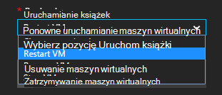

<properties
    pageTitle=" Korygowania alerty Azure maszyn wirtualnych z Runbooks automatyzacji | Microsoft Azure"
    description="W tym artykule przedstawiono sposób integracja alerty maszyn wirtualnych Azure z runbooks automatyzacji Azure i automatycznego korygowania problemów"
    services="automation"
    documentationCenter=""
    authors="mgoedtel"
    manager="jwhit"
    editor="tysonn" />    
<tags
    ms.service="automation"
    ms.devlang="na"
    ms.topic="article"
    ms.tgt_pltfrm="na"
    ms.workload="infrastructure-services"
    ms.date="06/14/2016"
    ms.author="csand;magoedte" />

# <a name="azure-automation-scenario---remediate-azure-vm-alerts"></a>Scenariusz automatyzacji Azure - korygowania alerty maszyn wirtualnych Azure

Azure automatyzacji i maszyn wirtualnych Azure została ogłoszona nowej funkcji, co umożliwia konfigurowanie alertów maszyn wirtualnych (maszyn wirtualnych), aby uruchomić runbooks automatyzacji. Tej nowej funkcji umożliwia automatyczne wykonywanie naprawy standardowy w odpowiedzi na alerty maszyn wirtualnych, takich jak ponowne uruchamianie lub zatrzymywanie maszyn wirtualnych.

Wcześniej podczas tworzenia reguły alertu maszyn wirtualnych udało Ci się [określić webhook automatyzacji](https://azure.microsoft.com/blog/using-azure-automation-to-take-actions-on-azure-alerts/) działań aranżacji do uruchomienia działań aranżacji przy każdym alert uruchomiony. Jednak wymaga to ułatwia pracę tworzenia działań aranżacji, tworzenie webhook dla działań aranżacji, a następnie kopiowania i wklejania webhook podczas tworzenia reguły alertu. Z tej nowej wersji procesu jest o wiele łatwiejsze, ponieważ działań aranżacji można bezpośrednio wybierz z listy, podczas tworzenia reguły alertu i możesz wybrać konto automatyzacji, które uruchamianie działań aranżacji lub łatwo utworzyć konto.

W tym artykule pokazano, jak łatwo jest utworzyć alert maszyn wirtualnych Azure i skonfigurować działań aranżacji automatyzacji jest uruchamiany przy każdym wyzwalane alert. Przykładowe scenariusze zawierać ponownego uruchomienia maszyny, gdy użycie pamięci przekracza próg niektóre z powodu aplikacji na maszyn wirtualnych z wyciekiem pamięci lub zatrzymywanie maszyny, gdy czasu CPU użytkownika zostało poniżej 1% dla ostatniej godziny i nie jest używany. Możemy również wyjaśniono, jak automatyczne tworzenie głównej na koncie automatyzacji usługi upraszcza korzystanie z runbooks w Azure alert działań naprawczych.

## <a name="create-an-alert-on-a-vm"></a>Tworzenie alertu na maszyny

Wykonaj poniższe czynności, aby skonfigurować alert, aby uruchomić działań aranżacji, gdy została osiągnięta progu.

>[AZURE.NOTE] W tej wersji tylko obsługujemy maszyn wirtualnych w wersji 2 i pomocy technicznej dla classic maszyny wirtualne będzie można szybko dodać.  

1. Zaloguj się do portalu Azure, a następnie kliknij pozycję **maszyn wirtualnych**.  
2. Wybierz jeden z maszyn wirtualnych.  Pojawi się karta Pulpit nawigacyjny maszyn wirtualnych i karta **Ustawienia** po jej prawej stronie.  
3. Karta **Ustawienia** w sekcji monitorowanie zaznacz **reguł alertów**.
4. Wybierz polecenie **Dodaj alert**z karta **reguł alertów** .

Spowoduje to otwarcie się karta **dodać regułę alertu** , gdzie możesz skonfigurować warunki alertu i wybrać jeden z nich lub wszystkie z następujących opcji: wysyłanie wiadomości e-mail do osoby, przesyłanie dalej w alercie innego systemu i/lub uruchamianie działań aranżacji automatyzacji próba odpowiedzi korygowania problemu za pomocą webhook.

## <a name="configure-a-runbook"></a>Konfigurowanie działań aranżacji

Aby skonfigurować działań aranżacji do uruchamiania po spełnieniu próg alarmowy maszyn wirtualnych, wybierz pozycję **Działań aranżacji automatyzacji**. W karta **działań aranżacji Konfiguruj** można wybrać do uruchomienia działań aranżacji i konto automatyzacji do uruchomienia działań aranżacji.


>[AZURE.NOTE] W tej wersji można wybierać spośród trzech runbooks, które udostępnia — maszyn wirtualnych ponownie uruchomić, zatrzymać maszyn wirtualnych lub usuwanie maszyn wirtualnych (Usuń je).  Wybrać inne runbooks lub jeden z własnych runbooks będą dostępne w przyszłej wersji.



Po zaznaczeniu jednego z trzech runbooks dostępne jest wyświetlany na liście rozwijanej **automatyzacji konta** i zostanie wybrane konto automatyzacji uruchomienia działań aranżacji jako. Runbooks potrzebne do uruchamiania w kontekście [automatyzacji konta](automation-security-overview.md) , które znajduje się w subskrypcji usługi Azure. Możesz wybrać konto automatyzacji, że już utworzony, lub możesz mieć konto automatyzacji utworzenia.

Runbooks, które zostały udostępnione służą do uwierzytelniania za pomocą wystawcy usługi Azure. Jeśli wybierzesz do uruchomienia działań aranżacji w jednym z istniejącego konta automatyzacji, zostanie automatycznie utworzony usługę kapitału dla Ciebie. Jeśli chcesz utworzyć nowe konto automatyzacji, następnie zostanie automatycznie utworzony konto i wystawcy usługi. W obu przypadkach dwa elementy zawartości zostanie również utworzony na koncie automatyzacji — zasób certyfikat o nazwie **AzureRunAsCertificate** i zasób połączenia o nazwie **AzureRunAsConnection**. Przy użyciu **AzureRunAsConnection** runbooks uwierzytelniania Azure w celu wykonania akcji zarządzania przed maszyn wirtualnych.

>[AZURE.NOTE] Wartość kapitału usługi jest tworzony w zakresie subskrypcji i jest przypisana rola współautora. Ta rola jest wymagana w celu konto ma uprawnienia do uruchamiania runbooks automatyzacji Zarządzanie maszyny wirtualne Azure.  Tworzenie konta Automaton i/lub głównej usługi jest zdarzenia jednorazowego. Po ich utworzeniu, możesz uruchomić runbooks dla alertów o innych maszyn wirtualnych Azure, korzystania z tego konta.

Po kliknięciu **przycisku OK** alert jest skonfigurowany i jeśli wybrano opcję, aby utworzyć nowe konto automatyzacji, jest on tworzony wraz z usługi kapitału.  To może potrwać kilka sekund.  


Po zakończeniu konfiguracji pojawi się nazwa zestawu działań aranżacji są wyświetlane w karta **dodać regułę alertu** .


Kliknij **przycisk OK** w **dodać regułę alertu** karta reguły alertu zostanie utworzona i aktywować, jeśli wirtualna maszyna jest w stanie uruchomienia.

### <a name="enable-or-disable-a-runbook"></a>Włączanie lub wyłączanie działań aranżacji

Bez usuwania konfiguracji działań aranżacji je wyłączyć działań aranżacji skonfigurowane dla alertu. Pozwala zachować alert uruchomiony, prawdopodobnie wypróbować niektóre reguły alertów i później ponownie włączyć działań aranżacji.

## <a name="create-a-runbook-that-works-with-an-azure-alert"></a>Tworzenie działań aranżacji, z którymi współpracuje alertu Azure

Po wybraniu działań aranżacji jako część reguły alertu Azure działań aranżacji musi mieć warunków logicznych w nim zarządzać danymi alertów, co wartość przekazywana do niego.  Po skonfigurowaniu działań aranżacji w regule alertu webhook jest tworzony dla działań aranżacji; tej webhook następnie jest używany do uruchamiania działań aranżacji za każdym razem wyzwalane alert.  Rzeczywista Połącz, aby rozpocząć działań aranżacji jest żądania HTTP POST do adresu URL webhook. Treści wezwania WPIS zawiera sformatowane JSON obiekt, który zawiera przydatne właściwości związanych z alert.  Jak widać poniżej alert dane zawierają szczegóły, takie jak subscriptionID, resourceGroupName resourceName i typu zasobu.

### <a name="example-of-alert-data"></a>Przykład alertu danych
```
{
    "WebhookName": "AzureAlertTest",
    "RequestBody": "{
    \"status\":\"Activated\",
    \"context\": {
        \"id\":\"/subscriptions/<subscriptionId>/resourceGroups/MyResourceGroup/providers/microsoft.insights/alertrules/AlertTest\",
        \"name\":\"AlertTest\",
        \"description\":\"\",
        \"condition\": {
            \"metricName\":\"CPU percentage guest OS\",
            \"metricUnit\":\"Percent\",
            \"metricValue\":\"4.26337916666667\",
            \"threshold\":\"1\",
            \"windowSize\":\"60\",
            \"timeAggregation\":\"Average\",
            \"operator\":\"GreaterThan\"},
        \"subscriptionId\":\<subscriptionID> \",
        \"resourceGroupName\":\"TestResourceGroup\",
        \"timestamp\":\"2016-04-24T23:19:50.1440170Z\",
        \"resourceName\":\"TestVM\",
        \"resourceType\":\"microsoft.compute/virtualmachines\",
        \"resourceRegion\":\"westus\",
        \"resourceId\":\"/subscriptions/<subscriptionId>/resourceGroups/TestResourceGroup/providers/Microsoft.Compute/virtualMachines/TestVM\",
        \"portalLink\":\"https://portal.azure.com/#resource/subscriptions/<subscriptionId>/resourceGroups/TestResourceGroup/providers/Microsoft.Compute/virtualMachines/TestVM\"
        },
    \"properties\":{}
    }",
    "RequestHeader": {
        "Connection": "Keep-Alive",
        "Host": "<webhookURL>"
    }
}
```

Gdy usługa webhook automatyzacji odbierze HTTP POST wyodrębnia dane alertów i przekazuje je do działań aranżacji w parametru wejściowego działań aranżacji WebhookData.  Oto przykładowy działań aranżacji, która pokazuje, jak użyć parametru WebhookData i wyodrębnić dane alertów i umożliwia zarządzanie Azure zasób, którego dotyczy alert.

### <a name="example-runbook"></a>Przykład działań aranżacji

```
#  This runbook will restart an ARM (V2) VM in response to an Azure VM alert.

[OutputType("PSAzureOperationResponse")]

param ( [object] $WebhookData )

if ($WebhookData)
{
    # Get the data object from WebhookData
    $WebhookBody = (ConvertFrom-Json -InputObject $WebhookData.RequestBody)

    # Assure that the alert status is 'Activated' (alert condition went from false to true)
    # and not 'Resolved' (alert condition went from true to false)
    if ($WebhookBody.status -eq "Activated")
    {
        # Get the info needed to identify the VM
        $AlertContext = [object] $WebhookBody.context
        $ResourceName = $AlertContext.resourceName
        $ResourceType = $AlertContext.resourceType
        $ResourceGroupName = $AlertContext.resourceGroupName
        $SubId = $AlertContext.subscriptionId

        # Assure that this is the expected resource type
        Write-Verbose "ResourceType: $ResourceType"
        if ($ResourceType -eq "microsoft.compute/virtualmachines")
        {
            # This is an ARM (V2) VM

            # Authenticate to Azure with service principal and certificate
            $ConnectionAssetName = "AzureRunAsConnection"
            $Conn = Get-AutomationConnection -Name $ConnectionAssetName
            if ($Conn -eq $null) {
                throw "Could not retrieve connection asset: $ConnectionAssetName. Check that this asset exists in the Automation account."
            }
            Add-AzureRMAccount -ServicePrincipal -Tenant $Conn.TenantID -ApplicationId $Conn.ApplicationID -CertificateThumbprint $Conn.CertificateThumbprint | Write-Verbose
            Set-AzureRmContext -SubscriptionId $SubId -ErrorAction Stop | Write-Verbose

            # Restart the VM
            Restart-AzureRmVM -Name $ResourceName -ResourceGroupName $ResourceGroupName
        } else {
            Write-Error "$ResourceType is not a supported resource type for this runbook."
        }
    } else {
        # The alert status was not 'Activated' so no action taken
        Write-Verbose ("No action taken. Alert status: " + $WebhookBody.status)
    }
} else {
    Write-Error "This runbook is meant to be started from an Azure alert only."
}
```

## <a name="summary"></a>Podsumowanie

Podczas konfigurowania alertu maszyn wirtualnych Azure, masz teraz możliwość łatwego konfigurowania działań aranżacji automatyzacji umożliwiają automatyczne wykonywanie akcji naprawy, gdy wyzwalane alert. W tej wersji możesz wybrać z runbooks ponownie uruchomić, zatrzymać lub usuwanie maszyn wirtualnych w zależności od aktualnego scenariusza alertów. Jest to dopiero początek umożliwienie realizacji scenariuszy miejsce, w którym można sterować akcje, które zostaną automatycznie przeniesione do gdy wyzwalane alert (powiadomienie rozwiązywania problemów, rozwiązywanie problemu).

## <a name="next-steps"></a>Następne kroki

- Aby rozpocząć pracę z runbooks graficznych, zobacz [Moje pierwszego graficzne działań aranżacji](automation-first-runbook-graphical.md)
- Aby rozpocząć pracę z runbooks przepływu pracy programu PowerShell, zobacz [Moje pierwszego działań aranżacji przepływu pracy programu PowerShell](automation-first-runbook-textual.md)
- Aby dowiedzieć się więcej na temat typów działań aranżacji, ich zalet i ograniczeń, zobacz [Typy działań aranżacji automatyzacji Azure](automation-runbook-types.md)
