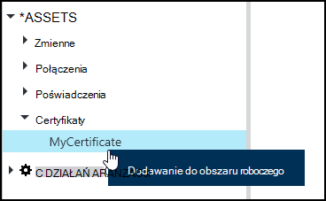
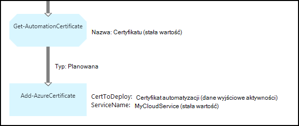

<properties 
   pageTitle="Certyfikat środkami automatyzacji Azure | Microsoft Azure"
   description="Certyfikaty mogą być przechowywane bezpiecznie w automatyzacji Azure, gdzie są dostępne, runbooks lub DSC konfiguracji do uwierzytelniania Azure i zasoby innych firm.  W tym artykule wyjaśniono szczegóły certyfikaty i jak z nimi pracować w tworzeniu zarówno tekstowych i graficznych."
   services="automation"
   documentationCenter=""
   authors="mgoedtel"
   manager="stevenka"
   editor="tysonn" />
<tags 
   ms.service="automation"
   ms.devlang="na"
   ms.topic="article"
   ms.tgt_pltfrm="na"
   ms.workload="infrastructure-services"
   ms.date="02/23/2016"
   ms.author="magoedte;bwren" />

# Certyfikat środkami automatyzacji Azure

Certyfikaty mogą być przechowywane bezpiecznie w automatyzacji Azure, gdzie są dostępne, runbooks lub konfiguracji DSC przy użyciu aktywności **Get-AutomationCertificate** . Umożliwia tworzenie runbooks i konfiguracji DSC, które używają certyfikatów uwierzytelniania, lub dodaje je do zasobów Azure lub innych firm.

>[AZURE.NOTE] Bezpieczny środkami automatyzacji Azure obejmują poświadczeń, certyfikaty, połączeń i zaszyfrowane zmiennych. Te zasoby są szyfrowane i przechowywane w automatyzacji Azure za pomocą Unikatowy klucz, który jest generowany dla każdego konta automatyzacji. Ten klawisz jest zaszyfrowany przy certyfikat i przechowywane w automatyzacji Azure. Przed zapisaniem bezpiecznego elementów zawartości, klucz konta automatyzacji jest odszyfrowane przy użyciu certyfikatu wzorca, a następnie służącego do szyfrowania elementu.

## Polecenia cmdlet programu Windows PowerShell

Polecenia cmdlet w poniższej tabeli służą do tworzenia i zarządzania zasobami certyfikat automatyzacji za pomocą programu Windows PowerShell. Dostarczają jako części [modułu programu PowerShell usługi Azure](../powershell-install-configure.md) , który jest dostępny do użytku w runbooks automatyzacji i konfiguracji DSC.

|Polecenia cmdlet|Opis|
|:---|:---|
|[Get-AzureAutomationCertificate](http://msdn.microsoft.com/library/dn913765.aspx)|Pobiera informacje dotyczące certyfikatu. Samo świadectwo można pobrać tylko z działania Get-AutomationCertificate.|
|[Nowy AzureAutomationCertificate](http://msdn.microsoft.com/library/dn913764.aspx)|Importuje nowego certyfikatu do automatyzacji Azure.|
|[Usuń - AzureAutomationCertificate](http://msdn.microsoft.com/library/dn913773.aspx)|Usuwa certyfikat z automatyzacji Azure.|
|[Ustawianie - AzureAutomationCertificate](http://msdn.microsoft.com/library/dn913763.aspx)|Ustawia właściwości istniejącego certyfikatu, takich jak przekazywanie pliku certyfikatu i ustawienie hasła dla pfx.|

## Czynności, aby uzyskać dostęp do certyfikatów

Działania w poniższej tabeli są używane do dostępu certyfikaty działań aranżacji lub DSC konfiguracji.

|Działania|Opis|
|:---|:---|
|Get-AutomationCertificate|Pobiera certyfikat działań aranżacji lub DSC konfiguracji.|

>[AZURE.NOTE] Należy unikać zmiennych w — Nazwa parametru Get-AutomationCertificate, ponieważ to skomplikować odnajdowania zależności między runbooks lub konfiguracji DSC i certyfikatów składników majątku w czasie projektowania.

## Tworzenie nowego certyfikatu.

Po utworzeniu nowego certyfikatu, możesz przekazać plik cer lub PFX automatyzacji Azure. Po zaznaczeniu certyfikat można eksportować następnie można przenieść go poza magazynie certyfikatów automatyzacji Azure. Jeśli nie jest możliwe do eksportowania, następnie go można używać tylko do logowania się w obrębie działań aranżacji lub DSC konfiguracji.

### Aby utworzyć nowego certyfikatu z portalu klasyczny Azure

1. Z Twojego konta automatyzacji kliknij pozycję **elementy zawartości** w górnej części okna.
1. U dołu okna kliknij pozycję **Dodaj ustawienie**.
1. Kliknij przycisk **Dodaj poświadczenia**.
2. Na liście rozwijanej **Typ poświadczeń** zaznacz **certyfikat**.
3. Wpisz nazwę certyfikatu w polu **Nazwa** , a następnie kliknij strzałkę w prawo.
4. Przeglądaj w poszukiwaniu pliku cer lub pfx.  Jeśli wybierzesz plik PFX, określ hasło i czy powinny być dozwolone do wyeksportowania.
1. Kliknij znacznik wyboru, aby przekazać plik certyfikatu i zapisać nowy trwały certyfikatu.

### Aby utworzyć nowy certyfikat Portal Azure

1. Z Twojego konta automatyzacji kliknij część **aktywów** otworzyć karta **zasoby** .
1. Kliknij część **Certyfikaty** , aby otworzyć karta **Certyfikaty** .
1. Kliknij pozycję **Dodaj certyfikat** u góry karta.
2. Wpisz nazwę certyfikatu, w polu **Nazwa** .
2. Kliknij przycisk **Wybierz plik** , w obszarze **Przekazywanie pliku certyfikatu** , aby odszukać plik cer lub pfx.  Jeśli wybierzesz plik PFX, określ hasło i czy powinny być dozwolone do wyeksportowania.
1. Kliknij przycisk **Utwórz** , aby zapisać nowy trwały certyfikatu.

### Aby utworzyć nowy certyfikat z programu Windows PowerShell

Następujące polecenia przykładowe pokazująca, jak utworzyć nowy certyfikat automatyzacji i oznacza eksportowania. To importuje istniejący plik pfx.

    $certName = 'MyCertificate'
    $certPath = '.\MyCert.pfx'
    $certPwd = ConvertTo-SecureString -String 'P@$$w0rd' -AsPlainText -Force
    
    New-AzureAutomationCertificate -AutomationAccountName "MyAutomationAccount" -Name $certName -Path $certPath –Password $certPwd -Exportable

## Za pomocą certyfikatu

Użyj certyfikatu, należy użyć aktywności **Get-AutomationCertificate** . Nie możesz użyć polecenia cmdlet [Get-AzureAutomationCertificate](http://msdn.microsoft.com/library/dn913765.aspx) , ponieważ zwraca informacji na temat zawartości certyfikatu, ale nie certyfikat.

### Przykładowe tekstowy działań aranżacji

Poniższy przykład kodu pokazano, jak dodać certyfikatu do usługi w chmurze w działań aranżacji. W tym przykładzie hasło jest pobierana z zmiennej zaszyfrowanych automatyzacji.

    $serviceName = 'MyCloudService'
    $cert = Get-AutomationCertificate -Name 'MyCertificate'
    $certPwd = Get-AutomationVariable –Name 'MyCertPassword'
    Add-AzureCertificate -ServiceName $serviceName -CertToDeploy $cert

### Przykładowe graficzne działań aranżacji

**Get-AutomationCertificate** zostanie dodana do graficznego działań aranżacji przez kliknięcie prawym przyciskiem myszy certyfikat w okienku Biblioteka graficznego edytora i wybierając pozycję **Dodaj do obszaru roboczego**.

Poniższa ilustracja przedstawia przykładową w graficzne działań aranżacji za pomocą certyfikatu.  To jest tym samym powyższym przykładzie dodawania certyfikatu do usługi w chmurze z tekstowy działań aranżacji.  

W tym przykładzie użyto parametr **UseConnectionObject** ustawiony dla działania **TwilioSMS Wyślij** używa obiektu połączenia z usługą uwierzytelniania.  [Łącze planowana](automation-graphical-authoring-intro.md#links-and-workflow) muszą być używane tutaj, ponieważ łącze sekwencji zwróci zbiór zawierająca jeden obiekt, którego nie oczekuje parametr połączenia.

## Zobacz też

- [Łącza do tworzenia graficznych](automation-graphical-authoring-intro.md#links-and-workflow) 
