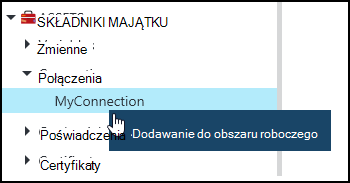
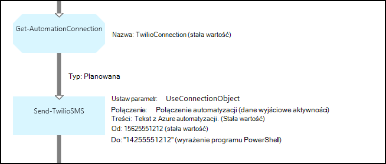
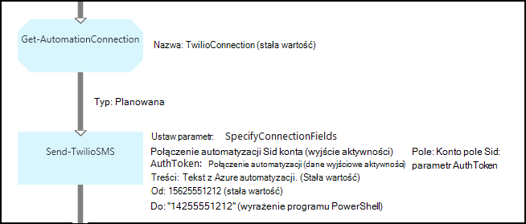

<properties 
   pageTitle="Trwałe połączenie z automatyzacji Azure | Microsoft Azure"
   description="Trwałe połączenie z automatyzacji Azure zawierają informacje wymagane do połączenia do zewnętrznej usługi lub aplikacji z działań aranżacji lub DSC konfiguracji. W tym artykule wyjaśniono szczegóły połączeń i jak z nimi pracować w tworzeniu zarówno tekstowych i graficznych."
   services="automation"
   documentationCenter=""
   authors="bwren"
   manager="stevenka"
   editor="tysonn" />
<tags 
   ms.service="automation"
   ms.devlang="na"
   ms.topic="article"
   ms.tgt_pltfrm="na"
   ms.workload="infrastructure-services"
   ms.date="01/27/2016"
   ms.author="bwren" />

# Trwałe połączenie z automatyzacji Azure

Środka trwałego połączenia automatyzacji zawiera informacje wymagane do połączenia do zewnętrznej usługi lub aplikacji z działań aranżacji lub DSC konfiguracji. Może zawierać informacje wymagane do uwierzytelniania, takie jak nazwy użytkownika i hasła, oprócz informacji o połączeniu, takie jak adres URL lub portem. Wartość połączenia jest gromadzenia wszystkich właściwości do łączenia się z określonej aplikacji w jednego środka trwałego w przeciwieństwie do tworzenia wielu zmiennych. Użytkownik może edytować wartości połączenia w jednym miejscu, a nazwa połączenia można przekazać do działań aranżacji lub Konfiguracja DSC w jeden parametr. Właściwości połączenia są dostępne w działań aranżacji lub DSC konfiguracji z działaniem **Get-AutomationConnection** .

Po utworzeniu połączenia, musisz określić *Typ połączenia*. Typ połączenia jest szablonu, który definiuje zestaw właściwości. Połączenie definiuje wartości dla każdej właściwości zdefiniowane w jego typu połączenia. Typy połączeń są dodawane do automatyzacji Azure w modułach integracji lub utworzone za pomocą [Interfejsu API automatyzacji Azure](http://msdn.microsoft.com/library/azure/mt163818.aspx). Typy tylko połączenia, które są dostępne podczas tworzenia połączenia są zainstalowane na Twoim koncie automatyzacji.

>[AZURE.NOTE] Bezpieczny środkami automatyzacji Azure obejmują poświadczeń, certyfikaty, połączeń i zaszyfrowane zmiennych. Te zasoby są szyfrowane i przechowywane w automatyzacji Azure za pomocą Unikatowy klucz, który jest generowany dla każdego konta automatyzacji. Ten klawisz jest szyfrowane przez certyfikat i przechowywane w automatyzacji Azure. Przed zapisaniem bezpiecznego elementów zawartości, klucz konta automatyzacji jest odszyfrowane przy użyciu certyfikatu wzorca, a następnie służącego do szyfrowania elementu.

## Polecenia cmdlet programu Windows PowerShell

Polecenia cmdlet w poniższej tabeli umożliwiają tworzenie i zarządzanie połączeniami automatyzacji za pomocą programu Windows PowerShell. Dostarczają jako części [modułu programu PowerShell usługi Azure](../powershell-install-configure.md) , który jest dostępny do użytku w runbooks automatyzacji i konfiguracji DSC.

|Polecenie cmdlet|Opis|
|:---|:---|
|[Get-AzureAutomationConnection](http://msdn.microsoft.com/library/dn921828.aspx)|Pobiera połączenia. Zawiera tabelę skrótu z wartości pól połączenia.|
|[Nowy AzureAutomationConnection](http://msdn.microsoft.com/library/dn921825.aspx)|Tworzy nowe połączenie.|
|[Usuń AzureAutomationConnection](http://msdn.microsoft.com/library/dn921827.aspx)|Usuwanie istniejącego połączenia.|
|[Ustawianie AzureAutomationConnectionFieldValue](http://msdn.microsoft.com/library/dn921826.aspx)|Ustawia wartość określonego pola dla istniejącego połączenia.|

## Działania

Działania w poniższej tabeli są używane do połączenia w działań aranżacji lub DSC konfiguracji dostępu.

|Działania|Opis|
|---|---|
|Get-AutomationConnection|Otrzymuje połączenia. Zwraca tabelę skrótu z właściwości połączenia.|

>[AZURE.NOTE] Należy unikać zmiennych w — Nazwa parametru **Get-AutomationConnection** , ponieważ może to skomplikować odnajdowania zależności między runbooks lub DSC konfiguracji i połączenia składników majątku w czasie projektowania.

## Tworzenie nowego połączenia

### Aby utworzyć nowe połączenie z portalem klasyczny Azure

1. Z Twojego konta automatyzacji kliknij pozycję **elementy zawartości** w górnej części okna.
1. U dołu okna kliknij pozycję **Dodaj ustawienie**.
1. Kliknij pozycję **Dodaj połączenie**.
2. Na liście rozwijanej **Typ połączenia** wybierz typ połączenia, który chcesz utworzyć.  Kreator przedstawi właściwości dla określonego typu.
1. Kończenie pracy kreatora, a następnie kliknij pole wyboru, aby zapisać nowe połączenie.

### Aby utworzyć nowe połączenie z portalem Azure

1. Z Twojego konta automatyzacji kliknij część **aktywów** otworzyć karta **zasoby** .
1. Kliknij część **połączenia** , aby otworzyć karta **połączenia** .
1. Kliknij pozycję **Dodaj połączenie** w górnej części karta.
2. Na liście rozwijanej **Typ** wybierz typ połączenia, który chcesz utworzyć. Formularz przedstawia właściwości dla określonego typu.
1. Wypełnij formularz, a następnie kliknij przycisk **Utwórz** , aby zapisać nowe połączenie.

### Aby utworzyć nowe połączenie przy użyciu programu Windows PowerShell

Utwórz nowe połączenie przy użyciu polecenia cmdlet [New-AzureAutomationConnection](http://msdn.microsoft.com/library/dn921825.aspx) środowiska Windows PowerShell. To polecenie cmdlet ma parametr o nazwie **ConnectionFieldValues** oczekuje [tabeli mieszania](http://technet.microsoft.com/library/hh847780.aspx) definiowanie wartości dla każdej właściwości określonego typu połączenia.

Następujące polecenia przykładowe utworzyć nowe połączenie dla [Twilio](http://www.twilio.com) to usługa Telefonia, która pozwala na wysyłanie i odbieranie wiadomości SMS.  Przykładowy moduł integracji, zawierający typ połączenia Twilio jest dostępny w [Centrum skryptów](http://gallery.technet.microsoft.com/scriptcenter/Twilio-PowerShell-Module-8a8bfef8).  Ten typ połączenia definiuje właściwości SID konta i Token autoryzacji wymaganych do sprawdzenia poprawności konta podczas nawiązywania połączenia Twilio.  Należy [pobrać ten moduł](http://gallery.technet.microsoft.com/scriptcenter/Twilio-PowerShell-Module-8a8bfef8) i zainstalować go na swoim koncie automatyzacji ten przykładowy kod do pracy.

    $AccountSid = "DAf5fed830c6f8fac3235c5b9d58ed7ac5"
    $AuthToken  = "17d4dadfce74153d5853725143c52fd1"
    $FieldValues = @{"AccountSid" = $AccountSid;"AuthToken"=$AuthToken}

    New-AzureAutomationConnection -AutomationAccountName "MyAutomationAccount" -Name "TwilioConnection" -ConnectionTypeName "Twilio" -ConnectionFieldValues $FieldValues

## Przy użyciu połączenia działań aranżacji lub DSC konfiguracji

Pobieranie połączenie w działań aranżacji lub DSC konfiguracji przy użyciu polecenia cmdlet **Get-AutomationConnection** .  To działanie pobiera wartości z różnych pól w połączeniu i zwraca je jako [tabeli mieszania](http://go.microsoft.com/fwlink/?LinkID=324844) , które następnie mogą być używane z odpowiednich poleceń w działań aranżacji lub DSC konfiguracji.

### Przykładowe tekstowy działań aranżacji
Następujące polecenia przykładowych pokazano, jak za pomocą połączenia Twilio w poprzednim przykładzie wysyłać wiadomości tekstowe z działań aranżacji.  Działanie Wyślij TwilioSMS używane w tym miejscu ma dwa zestawy parametrów każdego skorzystać z innej metody uwierzytelniania z usługą Twilio.  Korzysta z jednego obiektu połączenia i identyfikator konta zabezpieczeń i autoryzacji Token innego używa poszczególnych parametrów.  W tym przykładzie są wyświetlane obu metod.

    $Con = Get-AutomationConnection -Name "TwilioConnection"
    $NumTo = "14255551212"
    $NumFrom = "15625551212"
    $Body = "Text from Azure Automation."

    #Send text with connection object.
    Send-TwilioSMS -Connection $Con -From $NumFrom -To $NumTo -Body $Body

    #Send text with connection properties.
    Send-TwilioSMS -AccountSid $Con.AccountSid -AuthToken $Con.AuthToken -From $NumFrom -To $NumTo -Body $Body

### Przykłady działań aranżacji graficzne

Możesz dodać działaniem **Get-AutomationConnection** do graficznego działań aranżacji przez kliknięcie prawym przyciskiem myszy połączenie w okienku Biblioteka graficznego edytora i wybierając pozycję **Dodaj do obszaru roboczego**.

Poniższa ilustracja przedstawia przykładową przy użyciu połączenia w graficzne działań aranżacji.  To jest tym samym powyższym przykładzie do wysyłania wiadomości SMS za pomocą Twilio z tekstowy działań aranżacji.  W tym przykładzie użyto parametr **UseConnectionObject** ustawiony dla działania **TwilioSMS Wyślij** używa obiektu połączenia do uwierzytelniania usługi.  [Łącze planowana](automation-graphical-authoring-intro.md#links-and-workflow) jest używana tutaj, ponieważ parametr połączenia oczekuje jeden obiekt.

Przyczyna będącej programu PowerShell wyrażenie zostanie użyte jako wartość parametru **do** zamiast stała wartość oczekuje tablicy wartości tekstowych w ten parametr, więc można wysłać do wielu numerów.  Wyrażenie programu PowerShell umożliwia przekazanie pojedynczą wartość lub tablicy.

Na poniższej ilustracji przedstawiono samej powyższym przykładzie jako, ale będzie używany **SpecifyConnectionFields** ustawiona, które oczekuje parametrów AccountSid i parametr AuthToken określonych pojedynczo w przeciwieństwie do uwierzytelniania za pomocą obiektu połączenie.  W tym przypadku pola połączenia określono zamiast samego obiektu.  

## Artykuły pokrewne

- [Łącza do tworzenia graficznych](automation-graphical-authoring-intro.md#links-and-workflow)
 
