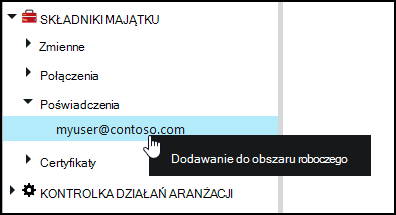
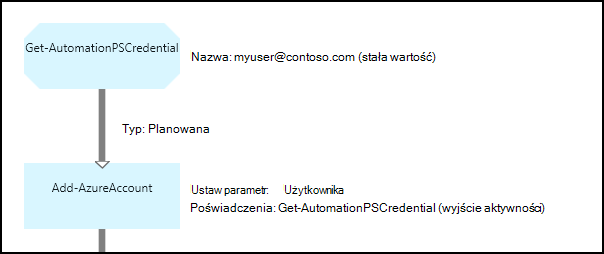

<properties 
   pageTitle="Poświadczeń środkami automatyzacji Azure | Microsoft Azure"
   description="Poświadczenia środkami automatyzacji Azure zawierają poświadczeń zabezpieczeń, które mogą być używane do uwierzytelniania zasobów dostęp działań aranżacji lub DSC konfiguracji. W tym artykule opisano, jak utworzyć trwałe poświadczeń i używania ich w działań aranżacji lub DSC konfiguracji."
   services="automation"
   documentationCenter=""
   authors="mgoedtel"
   manager="jwhit"
   editor="tysonn" />
<tags 
   ms.service="automation"
   ms.devlang="na"
   ms.topic="article"
   ms.tgt_pltfrm="na"
   ms.workload="infrastructure-services"
   ms.date="06/09/2016"
   ms.author="bwren" />

# Poświadczenia środkami automatyzacji Azure

Zasób poświadczeń automatyzacji zawiera obiekt [parametr PSCredential](http://msdn.microsoft.com/library/system.management.automation.pscredential) , który zawiera poświadczeń zabezpieczeń, takich jak nazwy użytkownika i hasła. Konfiguracje Runbooks i DSC może użyć poleceń cmdlet, który akceptować obiektu parametr PSCredential uwierzytelniania lub mogą one wyodrębnić nazwy użytkownika i hasła obiektu parametr PSCredential, aby zapewnić dla niektórych aplikacji lub usługi wymagającej uwierzytelniania. Właściwości dla odpowiedniego poświadczenia są przechowywane bezpiecznie w automatyzacji Azure i można uzyskać w działań aranżacji lub Konfiguracja DSC z działaniem [Get-AutomationPSCredential](http://msdn.microsoft.com/library/system.management.automation.pscredential.aspx) .

>[AZURE.NOTE] Bezpieczny środkami automatyzacji Azure obejmują poświadczeń, certyfikaty, połączeń i zaszyfrowane zmiennych. Te zasoby są szyfrowane i przechowywane w automatyzacji Azure za pomocą Unikatowy klucz, który jest generowany dla każdego konta automatyzacji. Ten klawisz jest szyfrowane przez certyfikat i przechowywane w automatyzacji Azure. Przed zapisaniem bezpiecznego elementów zawartości, klucz konta automatyzacji jest odszyfrowane przy użyciu certyfikatu wzorca, a następnie służącego do szyfrowania elementu. 

## Polecenia cmdlet programu Windows PowerShell

Polecenia cmdlet w poniższej tabeli służą do tworzenia i zarządzania zasobami poświadczeń automatyzacji za pomocą programu Windows PowerShell.  Dostarczają jako części [modułu programu PowerShell usługi Azure](../powershell-install-configure.md) , który jest dostępny do użytku w runbooks automatyzacji i konfiguracji DSC.

|Polecenia cmdlet|Opis|
|:---|:---|
|[Get-AzureAutomationCredential](http://msdn.microsoft.com/library/dn913781.aspx)|Pobiera informacje o trwałym poświadczeń. Poświadczenia się można pobrać tylko z działania **Get-AutomationPSCredential** .|
|[Nowy AzureAutomationCredential](http://msdn.microsoft.com/library/azure/jj554330.aspx)|Tworzy nowy poświadczenie automatyzacji.|
|[Usuń - AzureAutomationCredential](http://msdn.microsoft.com/library/azure/jj554330.aspx)|Usuwa poświadczeń automatyzacji.|
|[Ustawianie - AzureAutomationCredential](http://msdn.microsoft.com/library/azure/jj554330.aspx)|Ustawia właściwości dla istniejących poświadczenia automatyzacji.|

## Działania działań aranżacji

Działania w poniższej tabeli są używane do uzyskać dostęp do poświadczeń w działań aranżacji i konfiguracji DSC.

|Działania|Opis|
|:---|:---|
|Get-AutomationPSCredential|Pobiera poświadczenia używane w działań aranżacji lub DSC konfiguracji. Zwraca obiekt [System.Management.Automation.PSCredential](http://msdn.microsoft.com/library/system.management.automation.pscredential) .|

>[AZURE.NOTE] Należy unikać zmiennych w — Nazwa parametru Get-AutomationPSCredential, ponieważ to skomplikować odnajdowania zależności między runbooks lub konfiguracji DSC i poświadczeń składników majątku w czasie projektowania.

## Tworzenie nowego środka poświadczeń

### Aby utworzyć nowy trwały poświadczenia z portalu klasyczny Azure

1. Z Twojego konta automatyzacji kliknij pozycję **elementy zawartości** w górnej części okna.
1. U dołu okna kliknij pozycję **Dodaj ustawienie**.
1. Kliknij przycisk **Dodaj poświadczenia**.
2. Na liście rozwijanej **Typ poświadczeń** zaznacz **Poświadczeń programu PowerShell**.
1. Kończenie pracy kreatora, a następnie kliknij pole wyboru, aby zapisać nowe poświadczenia.

### Aby utworzyć nowy trwały poświadczeń Portal Azure

1. Z Twojego konta automatyzacji kliknij część **aktywów** otworzyć karta **zasoby** .
1. Kliknij część **poświadczeń** , aby otworzyć karta **poświadczeń** .
1. Kliknij przycisk **Dodaj poświadczenie** u góry karta.
1. Wypełnij formularz, a następnie kliknij przycisk **Utwórz** , aby zapisać nowe poświadczenia.

### Aby utworzyć nowy trwały poświadczeń przy użyciu programu Windows PowerShell

Następujących przykładowych poleceń pokazano, jak utworzyć nowy poświadczenie automatyzacji. Obiekt parametr PSCredential jest utworzony z nazwą i hasłem i następnie użyte do utworzenia trwałego poświadczeń. Można również użyć polecenia cmdlet **Get-poświadczeń** , jest wyświetlany monit o wpisz nazwę i hasło.

    $user = "MyDomain\MyUser"
    $pw = ConvertTo-SecureString "PassWord!" -AsPlainText -Force
    $cred = New-Object –TypeName System.Management.Automation.PSCredential –ArgumentList $user, $pw
    New-AzureAutomationCredential -AutomationAccountName "MyAutomationAccount" -Name "MyCredential" -Value $cred

## Przy użyciu poświadczeń programu PowerShell

Pobieranie zbiór poświadczeń działań aranżacji lub DSC konfiguracji z działaniem **Get-AutomationPSCredential** . To zwraca [parametr PSCredential obiekt](http://msdn.microsoft.com/library/system.management.automation.pscredential.aspx) , który można używać z działania lub polecenia cmdlet, która wymaga parametru parametr PSCredential. Można także pobrać właściwości obiektu poświadczeń, aby używać oddzielnie. Obiekt ma właściwości Nazwa użytkownika i hasło zabezpieczeń lub metoda **GetNetworkCredential** zwraca obiekt [NetworkCredential](http://msdn.microsoft.com/library/system.net.networkcredential.aspx) , który zapewni niezabezpieczoną wersji hasła.

### Przykładowe tekstowy działań aranżacji

Następujące polecenia przykładowych pokazano, jak używać poświadczeń programu PowerShell w działań aranżacji. W tym przykładzie poświadczenia są pobierane i swoją nazwę użytkownika i hasło przypisane do zmiennych.

    $myCredential = Get-AutomationPSCredential -Name 'MyCredential'
    $userName = $myCredential.UserName
    $securePassword = $myCredential.Password
    $password = $myCredential.GetNetworkCredential().Password

### Przykładowe graficzne działań aranżacji

Możesz dodać działaniem **Get-AutomationPSCredential** do graficznego działań aranżacji przez kliknięcie prawym przyciskiem myszy poświadczeń w okienku Biblioteka graficznego edytora i wybierając pozycję **Dodaj do obszaru roboczego**.

Poniższa ilustracja przedstawia przykładową przy użyciu poświadczeń w graficzne działań aranżacji.  W tym przypadku go jest używany do uwierzytelniania działań aranżacji do zasobów Azure zgodnie z opisem w [Runbooks służą do uwierzytelniania za pomocą konta Azure AD użytkownika](automation-sec-configure-aduser-account.md).  Pierwszym działaniem pobiera poświadczenia, które mają dostęp do Azure subskrypcji.  Działanie **AzureAccount Dodaj** używa do uwierzytelniania wszelkie działania, które są formatowane za poświadczenia.  [Łącze planowana](automation-graphical-authoring-intro.md#links-and-workflow) jest w tym miejscu, ponieważ **Get-AutomationPSCredential** oczekuje jeden obiekt.  

## Przy użyciu poświadczeń programu PowerShell w DSC
Podczas konfiguracji DSC automatyzacji Azure można odwołać wyposażenia poświadczeń przy użyciu **Get-AutomationPSCredential**, aktywów poświadczeń również w można przekazać za pośrednictwem parametry, w razie potrzeby. Aby uzyskać więcej informacji zobacz [konfiguracji kompilowanie w DSC automatyzacji Azure](automation-dsc-compile.md#credential-assets).

## Następne kroki

- Aby dowiedzieć się więcej na temat łączy do tworzenia graficznych, zobacz [łącza do tworzenia graficznych](automation-graphical-authoring-intro.md#links-and-workflow)
- Aby zrozumieć różnych metod uwierzytelniania przy użyciu automatyzacji, zobacz [Azure automatyzacji zabezpieczeń](automation-security-overview.md)
- Aby rozpocząć pracę z runbooks graficznych, zobacz [Moje pierwszego graficzne działań aranżacji](automation-first-runbook-graphical.md)
- Aby rozpocząć pracę z runbooks przepływu pracy programu PowerShell, zobacz [Moje pierwszego działań aranżacji przepływu pracy programu PowerShell](automation-first-runbook-textual.md) 

 
