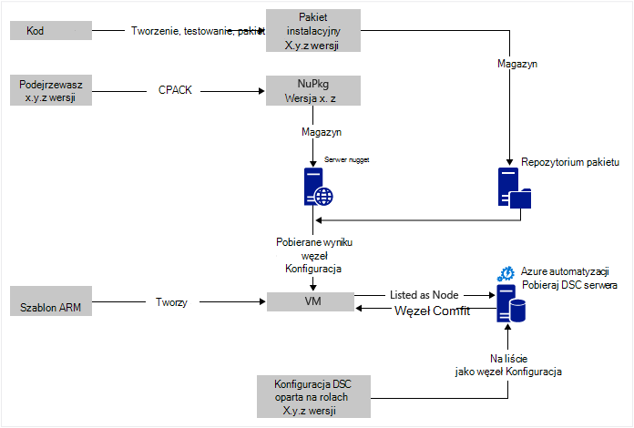
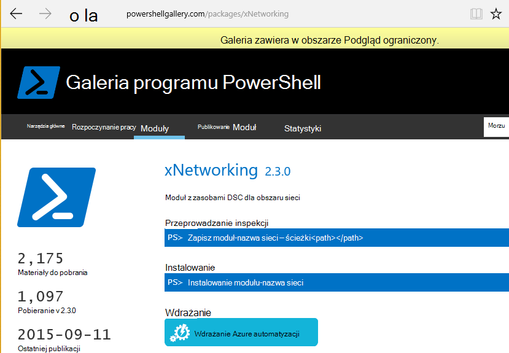

<properties
   pageTitle="Wdrożenie ciągły Azure automatyzacji DSC z Chocolatey | Microsoft Azure"
   description="Wdrażanie ciągły DevOps przy użyciu DSC automatyzacji Azure i Menedżer Chocolatey pakietów.  Przykład: pełny szablon JSON ARM i źródło programu PowerShell."
   services="automation"
   documentationCenter=""
   authors="sebastus"
   manager="stevenka"
   editor=""/>

<tags
   ms.service="automation"
   ms.devlang="na"
   ms.topic="article"
   ms.tgt_pltfrm="vm-windows"
   ms.workload="na"
   ms.date="08/08/2016"
   ms.author="golive"/>

# Przykład użycia: Ciągła rozmieszczania maszyn wirtualnych przy użyciu automatyzacji DSC i Chocolatey

W świecie DevOps istnieje wiele narzędzi ułatwiających z różnych punktach proces integracji ciągły.  Konfiguracja Azure automatyzacji żądany stan (DSC) jest powitalnej Nowość do opcji, które DevOps członkom zespołu można użyć.  W tym artykule przedstawiono ustawienie w górę wdrożenia ciągły (CD) na komputerze z systemem Windows.  Metoda, aby uwzględnić tyle komputerach z systemem Windows w razie potrzeby w roli (na przykład witryną sieci web), a następnie do dodatkowych ról także można z łatwością rozszerzyć.

## Na wysokim poziomie

Jest bardzo nieco przejściem poniżej, ale na szczęście można można podzielić na dwa główne procesy: 

  - Pisanie kodu przetestowaniu, tworzenie i publikowanie pakietów instalacyjnych wersje główne i pomocnicze systemu. 
  - Tworzenie i zarządzanie nimi maszyny wirtualne, które zostanie zainstalowany i wykonywanie kodu w pakietach.  

Po obu tych procesów core znajdują się w miejscu, jest krótki kroku automatycznie zaktualizować pakiet uruchomionych na dowolnym określonego maszyn wirtualnych jak nowsze wersje są tworzone i wdrożony.

## Omówienie składników

Menedżerowie pakiet takich jak [stanie get](https://en.wikipedia.org/wiki/Advanced_Packaging_Tool) to dość dobrze znane na świecie Linux, ale nie tak wiele na świecie systemu Windows.  [Chocolatey](https://chocolatey.org/) jest taki element i Hanselman Scotta [blogu](http://www.hanselman.com/blog/IsTheWindowsUserReadyForAptget.aspx) na temat jest doskonałe wprowadzający.  W skrócie Chocolatey umożliwia zainstalowanie pakietów w centralnym repozytorium opakowań do wiersza polecenia systemu Windows.  Można tworzyć i zarządzać własną repozytorium i Chocolatey można zainstalować pakiety z dowolnej liczby repozytoria kierowane.

Odpowiedniej konfiguracji Państwa (DSC) ([Omówienie](https://technet.microsoft.com/library/dn249912.aspx)) to narzędzie programu PowerShell umożliwia deklarować konfiguracji, która ma dla komputera.  Na przykład można powiedzieć "mają Chocolatey zainstalowane, mają zainstalowanego programu IIS, mają port 80 otwarty, mają 1.0.0 mojej witryny sieci Web zainstalowanej wersji."  Menedżer konfiguracji lokalnych (NAJMN.wsp.WIEL) DSC wykonuje tej konfiguracji. Serwer pobierają DSC zawiera repozytorium konfiguracji komputery. NAJMN.wsp.WIEL na każdym komputerze można okresowo zaewidencjonować czy konfigurację odpowiada przechowywaną konfigurację. Jego raportów o stanie lub spróbuj wprowadzić na komputerze z powrotem do wyrównania z przechowywaną konfiguracją. Możesz edytować konfigurację przechowywaną na serwerze pobieraj spowodowało nazwy komputera lub zestawu maszyn do wyrównania z konfiguracją zmienione.

Azure automatyzacji jest zarządzane usługi Microsoft Azure umożliwiające zautomatyzowanie różnych przy użyciu runbooks, węzły, poświadczeń, zasoby i zasoby, takie jak harmonogramów i zmienne globalne. Azure DSC automatyzacji rozszerza możliwości automatyzacji zawiera narzędzi DSC programu PowerShell.  Oto doskonałe [Omówienie](automation-dsc-overview.md).

Zasób DSC jest moduł kodu, który zawiera określone funkcje, takie jak zarządzanie sieci, usługi Active Directory lub SQL Server.  Chocolatey zasobów DSC wie, jak uzyskać dostęp do serwera NuGet (między innymi), pobrać pakiety, zainstalować pakiety i tak dalej.  Istnieją inne zasoby DSC w [Galerii programu PowerShell](http://www.powershellgallery.com/packages?q=dsc+resources&prerelease=&sortOrder=package-title).  Te moduły są zainstalowane na serwerze pobierają DSC automatyzacji Azure (przez Ciebie) aby można było używać konfiguracji.

Szablony ARM deklaracyjnych umożliwia generowanie infrastruktury — elementy takie jak sieci, podsieci, zabezpieczeń sieci i routingu, załaduj równoważenia, nic, maszyny wirtualne i tak dalej.  Oto [artykułu](../resource-manager-deployment-model.md) , który różni się model wdrożenia ARM (deklaracyjnych) z Zarządzanie usługą Azure (ASM lub klasyczny) model wdrażania (bezwzględne).  I inny [artykuł](../virtual-machines/virtual-machines-windows-compare-deployment-models.md) o podstawowych zasobów dostawców, obliczeń, miejsca do magazynowania i sieci.

Jedną z najważniejszych funkcji szablonu ARM jest możliwość Zainstaluj rozszerzenie maszyn wirtualnych w maszyn wirtualnych, jak zainicjowaniu obsługi administracyjnej.  Rozszerzenie maszyn wirtualnych zawiera określone funkcje, takie jak uruchamianie skryptu niestandardowego, instalowanie oprogramowania antywirusowego lub uruchamianie skryptu konfiguracji DSC.  Istnieje wiele typów rozszerzeń maszyn wirtualnych.

## Szybkie podróży wokół diagramu

Począwszy od góry, wpisz swój kod, tworzenie i testowanie, a następnie utworzyć pakiet instalacji.  Chocolatey mogą obsługiwać różnych typów opakowań instalacji, takich jak ZIP MSI, MSU.  I masz pełnych możliwości programu PowerShell możliwości natywne i Chocolatey nie są bardzo aż do jego czy rzeczywistą instalację.  Umieszczanie pakietu na innym dostępne — repozytorium pakietu.  W tym przykładzie zastosowania użyto folderu publicznego na koncie magazyn obiektów blob platformy Azure, ale można go dowolnego miejsca.  Chocolatey graficznych współpracuje z serwerów NuGet i kilku innych zarządzanie metadanymi pakiet.  [W tym artykule](https://github.com/chocolatey/choco/wiki/How-To-Host-Feed) opisano opcje.  W tym przykładzie zastosowania użyto NuGet.  Nuspec jest metadanych dotyczących pakiety.  Nuspec "kompilowania" do osoby NuPkg i przechowywany na serwerze NuGet.  Podczas konfiguracji żądania pakiet według nazwy i odwołuje się do serwera NuGet, Chocolatey zasobów DSC (teraz na maszyn wirtualnych) grabs pakietu i instaluje je.  Można także zażądać określonej wersji pakietu.

W lewej dolnej części obrazu jest szablon programu Menedżer zasobów Azure (ARM).  W tym przykładzie zastosowania rozszerzenia maszyn wirtualnych rejestruje maszyn wirtualnych na serwerze pobieraj Azure automatyzacji DSC (oznacza to, że serwer pobieraj) jako węzeł.  Konfiguracja są przechowywane na serwerze pobieraj.  W rzeczywistości jest ona przechowywana dwukrotnie: raz, jako zwykły tekst i po skompilowany plik jako plik MOF (dla osób, które wiedzieć o takich elementów,.)  W portalu MOF jest to "węzeł Konfiguracja" (zamiast po prostu "Konfiguracja").  Jest artefaktu, który jest skojarzony z poziomu węzła, więc węzeł wiedzieli, konfigurację.  Szczegóły poniżej pokazano, jak przypisać konfiguracji węzła do węzła.

Prawdopodobnie możesz już wykonywanej bit u góry lub najczęściej.  Tworzenie nuspec, kompilowania i przechowywaniu go na serwerze NuGet jest małych elementu.  I już zarządzasz maszyny wirtualne.  Przejściem do następnego kroku wdrażania ciągły wymaga Konfigurowanie serwera pobieraj (raz), rejestrowanie węzły z nią (raz) i tworzenia i przechowywania konfiguracji (początkowo).  Następnie pakiety są uaktualnione i wdrożony repozytorium odświeżanie Konfiguracja i węzeł Konfiguracja na serwerze pobieraj (powtarzania stosownie do potrzeb).

Jeśli nie zaczynasz z szablonem ARM, to także przycisk OK.  Ma polecenia cmdlet programu PowerShell z myślą o rejestrować pośrednictwem usługi SMS na serwerze pobieraj i wszystkie pozostałe. Aby uzyskać więcej informacji, zobacz ten artykuł: [Rozpoczęcie korzystania maszyn do zarządzania przez DSC automatyzacji Azure](automation-dsc-onboarding.md)

## Krok 1: Konfigurowanie konta serwera i automatyzacji pobieraj

Uwierzytelniony wiersza polecenia programu PowerShell (Dodaj AzureRmAccount): (może potrwać kilka minut podczas serwera pobieraj)

    New-AzureRmResourceGroup –Name MY-AUTOMATION-RG –Location MY-RG-LOCATION-IN-QUOTES
    New-AzureRmAutomationAccount –ResourceGroupName MY-AUTOMATION-RG –Location MY-RG-LOCATION-IN-QUOTES –Name MY-AUTOMATION-ACCOUNT 

Konta automatyzacji można umieścić w dowolnej z następujących regionów (czyli lokalizacja): USA wschodniego 2, południe centralnej nam, Virginia US Gov, zachód Europy, Azji Południowo, Japonia Wschodu, Indie centralnym i kopiec Australia.

## Krok 2: Maszyn wirtualnych rozszerzenia poprawki w szablonie ARM

Szczegóły dotyczące rejestracji maszyn wirtualnych (za pomocą rozszerzenia maszyn wirtualnych DSC programu PowerShell) opisane w tym [Szablonie Szybki Start Azure](https://github.com/Azure/azure-quickstart-templates/tree/master/dsc-extension-azure-automation-pullserver).  W tym kroku rejestruje do nowych maszyn wirtualnych na serwerze pobieraj na liście węzłów DSC.  Część tej rejestracji jest określanie konfiguracji węzeł mają być stosowane do węzła.  Ta konfiguracja węzeł nie ma jeszcze istnieje na serwerze pobieraj, aby była czy krok 4 jest miejsce, w którym ma to po raz pierwszy.  Ale tutaj w kroku 2 trzeba danego nazwa węzła i nazwa konfiguracji.  W tym przykładzie zastosowania węzeł jest "isvbox" i konfiguracja jest "ISVBoxConfig".  Aby nazwa konfiguracji węzeł (określonych w DeploymentTemplate.json) jest "ISVBoxConfig.isvbox".  

## Krok 3: Dodawanie wymaganych zasobów DSC na serwerze pobieraj

W galerii programu PowerShell jest narzędzia do zainstalowania DSC zasobów do konta usługi Azure automatyzacji.  Przejdź do zasobu i kliknij przycisk "Wdrażanie do Azure automatyzacji".

Inną techniką ostatnio dodany do Azure Portal umożliwia uwzględniał nowe moduły lub aktualizowanie istniejącego modułów. Kliknij pozycję do zasobu konta automatyzacji, kafelków składniki majątku i na końcu kafelków moduły.  Ikona galerii Przeglądaj umożliwia zobacz listę urzędów certyfikacji moduły w galerii, przechodzić do szczegółów i ostatecznie zaimportować do konta automatyzacji. Jest to doskonały sposób na moduły na bieżąco od czasu do czasu. Oraz, funkcja importowania kontroli współzależności z innych modułów, aby upewnić się, że nic się nie jest zsynchronizowany.

Lub jest to podejście ręcznego.  Struktura folderów modułu programu PowerShell integrację na komputerze z systemem Windows nieco różni się od oczekiwanego przez automatyzacji Azure struktura folderów.  W tym celu nieco ta ze strony użytkownika.  Ale nie jest trudne, a to zrobić tylko raz dla zasobów (chyba że chcesz uaktualnić go w przyszłości.)  Aby uzyskać więcej informacji dotyczących tworzenia moduły integracji programu PowerShell, zobacz ten artykuł: [Tworzenie moduły integracji automatyzacji Azure](https://azure.microsoft.com/blog/authoring-integration-modules-for-azure-automation/)

-   Zainstaluj moduł potrzebnej w miejscu pracy:
    -   Instalowanie [Windows Management Framework, v5](http://aka.ms/wmf5latest) (zbędny dla systemu Windows 10)
    -   `Install-Module –Name MODULE-NAME`< — grabs moduł z galerii programu PowerShell 
-   Skopiuj folder modułu z `c:\Program Files\WindowsPowerShell\Modules\MODULE-NAME` do folderu temp 
-   Usuwanie próbki i dokumentacji z głównego folderu 
-   Zip w folderze głównym nazewnictwa pliku ZIP, dokładnie taki sam, jak folder 
-   Umieszczanie pliku ZIP na dostępne lokalizację HTTP, na przykład magazyn obiektów blob przy użyciu konta z miejsca do magazynowania Azure.
-   Uruchom ten programu PowerShell:

        New-AzureRmAutomationModule `
            -ResourceGroupName MY-AUTOMATION-RG -AutomationAccountName MY-AUTOMATION-ACCOUNT `
            -Name MODULE-NAME –ContentLink "https://STORAGE-URI/CONTAINERNAME/MODULE-NAME.zip"
        

Przykład uwzględniane wykonuje następujące czynności dla cChoco i xNetworking. Zobacz [Uwagi](#notes) obsługi specjalnie dla cChoco.

## Krok 4: Dodawanie Konfiguracja węzłów na serwerze pobieraj

Nie ma nic specjalne dotyczące importowania konfiguracji do serwera pobieraj i kompilacji po raz pierwszy.  Wszystkie kolejne importowanie/skompiluje o tej samej konfiguracji dokładnie wyglądać inaczej.  Za każdym razem z pakietu aktualizacji i trzeba kopiować go na produkcji, można wykonać ten krok, po upewnieniu się, że plik konfiguracyjny jest poprawny — w tym nową wersję pakietu.  Poniżej przedstawiono pliku konfiguracji i programu PowerShell:

ISVBoxConfig.ps1:

    Configuration ISVBoxConfig 
    { 
        Import-DscResource -ModuleName cChoco 
        Import-DscResource -ModuleName xNetworking
    
        Node "isvbox" {   
    
            cChocoInstaller installChoco 
            { 
                InstallDir = "C:\choco" 
            }
    
            WindowsFeature installIIS 
            { 
                Ensure="Present" 
                Name="Web-Server" 
            }
    
            xFirewall WebFirewallRule 
            { 
                Direction = "Inbound" 
                Name = "Web-Server-TCP-In" 
                DisplayName = "Web Server (TCP-In)" 
                Description = "IIS allow incoming web site traffic." 
                DisplayGroup = "IIS Incoming Traffic" 
                State = "Enabled" 
                Access = "Allow" 
                Protocol = "TCP" 
                LocalPort = "80" 
                Ensure = "Present" 
            }
    
            cChocoPackageInstaller trivialWeb 
            {            
                Name = "trivialweb" 
                Version = "1.0.0" 
                Source = “MY-NUGET-V2-SERVER-ADDRESS” 
                DependsOn = "[cChocoInstaller]installChoco", 
                "[WindowsFeature]installIIS" 
            } 
        }    
    }

Nowy-ConfigurationScript.ps1:

    Import-AzureRmAutomationDscConfiguration ` 
        -ResourceGroupName MY-AUTOMATION-RG –AutomationAccountName MY-AUTOMATION-ACCOUNT ` 
        -SourcePath C:\temp\AzureAutomationDsc\ISVBoxConfig.ps1 ` 
        -Published –Force
    
    $jobData = Start-AzureRmAutomationDscCompilationJob ` 
        -ResourceGroupName MY-AUTOMATION-RG –AutomationAccountName MY-AUTOMATION-ACCOUNT ` 
        -ConfigurationName ISVBoxConfig 
    
    $compilationJobId = $jobData.Id
    
    Get-AzureRmAutomationDscCompilationJob ` 
        -ResourceGroupName MY-AUTOMATION-RG –AutomationAccountName MY-AUTOMATION-ACCOUNT ` 
        -Id $compilationJobId

Te kroki powodują nową konfigurację węzeł o nazwie "ISVBoxConfig.isvbox" zostanie umieszczona na serwerze pobieraj.  Nazwa konfiguracji węzeł jest tworzona jako "configurationName.nodeName".

## Krok 5: Tworzenie i konserwowanie pakiet metadanych

Dla każdego pakietu umieszczenie do repozytorium pakietu należy nuspec, opisujący.  Tej nuspec należy najpierw skompilować tę i przechowywane na serwerze NuGet. Ten proces został opisany [poniżej](http://docs.nuget.org/create/creating-and-publishing-a-package).  Za pomocą MyGet.org jako serwer NuGet.  Ich sprzedaży tej usługi, ale będzie starter SKU, która jest bezpłatna.  U NuGet.org znajdziesz instrukcje dotyczące instalowania własny serwer NuGet dla pakiety prywatne.

## Krok 6: Łącząc je wszystkie razem

Za każdym razem, wersję zatwierdza się i przekazuje pytania i odpowiedzi — wdrożenia pakietu jest tworzony, nuspec i nupkg zaktualizowane i wdrożona na serwerze NuGet.  Ponadto konfiguracji (krok 4 powyżej) muszą zostać zaktualizowane do zgodne z nowy numer wersji.  Musi być przesyłane do serwera pobieraj i skompilowany plik.  Od tej chwili jest maszyny wirtualne, które zależą od tej konfiguracji w celu pobrania aktualizacji, a następnie zainstaluj go.  Wszystkie te aktualizacje są proste — po prostu linii lub dwóch programu PowerShell.  W przypadku programu Visual Studio Team Services niektóre z nich są umieszczane w kompilacji zadania, które można połączonych ze sobą w kompilacji.  Ten [artykuł](https://www.visualstudio.com/en-us/docs/alm-devops-feature-index#continuous-delivery) zawiera szczegółowe informacje.  Ten [GitHub repo](https://github.com/Microsoft/vso-agent-tasks) szczegóły różne zadania dostępne kompilacji.

## Notatki

W tym przykładzie zastosowania zaczyna się maszyn wirtualnych z ogólnego obrazu Windows Server 2012 R2 z galerii Azure.  Można uruchamiać z dowolny obraz i następnie dostosować a stamtąd z konfiguracją DSC.  Jednak zmiana konfiguracji, która jest wypiekany na obraz jest trudniejsze niż dynamiczne aktualizowanie konfiguracji, używając DSC.

Nie trzeba używać tej techniki z pośrednictwem usługi SMS przy użyciu szablonu ARM i rozszerzenia maszyn wirtualnych.  I pośrednictwem usługi SMS nie muszą być Azure się w obszarze Zarządzanie dysk CD.  Niezbędne jest zainstalowania Chocolatey i NAJMN.wsp.WIEL skonfigurowano na maszyn wirtualnych, tak aby wiedzieli, gdzie jest na serwerze pobieraj.  

Oczywiście po zaktualizowaniu opakowania na maszyn wirtualnych, który znajduje się w produkcji, które należy wykonać tego maszyn wirtualnych poza obrotu podczas aktualizacji jest zainstalowany.  Jak to zrobić różni.  Na przykład z Głosowa za równoważenia obciążenia Azure, możesz dodać, sonda niestandardowe.  Podczas aktualizowania maszyn wirtualnych, mają punkt końcowy sondy zwracana 400.  Dostrajał niezbędne do powodować tej zmiany może być wewnątrz konfiguracji, jak dostrajał, aby przełączyć się do zwracania 200 po zakończeniu aktualizacji.

Pełny źródło w tym przykładzie zastosowania jest w [tym projekcie Visual Studio](https://github.com/sebastus/ARM/tree/master/CDIaaSVM) na GitHub.

##Artykuły pokrewne##

- [Azure automatyzacji DSC omówienie] (automatyzacji dsc-overview.md)
- [Poleceń cmdlet azure DSC automatyzacji] (https://msdn.microsoft.com/library/mt244122.aspx)
- [Ułatwiającej rozpoczęcie korzystania maszyn do zarządzania przez DSC automatyzacji Azure] (automatyzacji dsc-onboarding.md)
