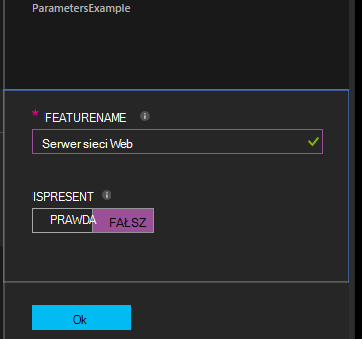

<properties 
   pageTitle="Kompilowanie konfiguracji DSC automatyzacji Azure | Microsoft Azure" 
   description="Omówienie skompilować konfiguracji potrzeby stan konfiguracji (DSC) na dwa sposoby: W portalu Azure i przy użyciu programu Windows PowerShell. " 
   services="automation" 
   documentationCenter="na" 
   authors="coreyp-at-msft" 
   manager="stevenka" 
   editor="tysonn"/>

<tags
   ms.service="automation"
   ms.devlang="na"
   ms.topic="article"
   ms.tgt_pltfrm="powershell"
   ms.workload="na" 
   ms.date="01/25/2016"
   ms.author="coreyp"/>
   
#Kompilowanie konfiguracji DSC automatyzacji Azure#

Można utworzyć konfiguracji potrzeby stan konfiguracji (DSC) na dwa sposoby przy użyciu automatyzacji Azure: W portalu Azure i przy użyciu programu Windows PowerShell. Poniższa tabela pomoże Ci określić, kiedy należy używać z jakiej metody oparte na właściwości każdej: 

###Portal Azure preview###
- Najłatwiejszym metody interaktywnego interfejsu użytkownika
- Formularz, aby podać wartości parametrów prostych
- Łatwe śledzenie stanu zadania
- Dostęp uwierzytelnionych Azure logowania

###Środowiska Windows PowerShell###
- Nawiązywanie połączenia z wiersza polecenia przy użyciu poleceń cmdlet programu Windows PowerShell
- Mogą być zawarte w zautomatyzowanego rozwiązania z wielu kroków
- Podaj wartości parametru proste i złożone
- Śledzenie stanu zadania
- Klient wymagane do obsługi poleceń cmdlet programu PowerShell
- ConfigurationData przebieg
- Można skompilować konfiguracji, które używają poświadczeń

Po określeniu metodę kompilacji, możesz wykonać odpowiednie procedury poniżej, aby rozpocząć kompilowania.

##Kompilowania konfiguracji DSC Portal Azure##

1.  Z Twojego konta automatyzacji kliknij **konfiguracji**.
2.  Kliknij pozycję Konfiguracja, aby otworzyć jego karta.
3.  Kliknij pozycję **kompilację**.
4.  Jeśli konfiguracja zawiera bez parametrów, zostanie wyświetlony monit o potwierdzenie, czy chcesz go skompilować. Jeśli konfiguracja zawiera parametry, karta **Skompilować konfiguracji** zostanie otwarty umożliwiające podanie wartości parametrów. W sekcji <a href="#basic-parameters">**Podstawowe parametry**</a> poniżej szczegółowe informacje o parametrach.
5.  Karta **Zadanie kompilacji** zostanie otwarty, tak aby można śledzić stan zadania kompilacji i konfiguracji węzeł (MOF konfiguracji dokumenty), uszkodzenie je umieścić na serwerze pobierają DSC automatyzacji Azure.

##Kompilowanie konfiguracji DSC z programu Windows PowerShell##

Możesz użyć [`Start-AzureRmAutomationDscCompilationJob`](https://msdn.microsoft.com/library/mt244118.aspx) zacząć kompilowania przy użyciu programu Windows PowerShell. Następujący kod zostanie uruchomiony kompilacji konfiguracji DSC o nazwie **SampleConfig**.

    Start-AzureRmAutomationDscCompilationJob -ResourceGroupName "MyResourceGroup" -AutomationAccountName "MyAutomationAccount" -ConfigurationName "SampleConfig" 
 
`Start-AzureRmAutomationDscCompilationJob`Zwraca obiekt zadania kompilacji, który służy do śledzenia stanu. Następnie można użyć tego obiektu zadania kompilacji [`Get-AzureRmAutomationDscCompilationJob`](https://msdn.microsoft.com/library/mt244120.aspx) do określenia stanu zadania kompilacji i [`Get-AzureRmAutomationDscCompilationJobOutput`](https://msdn.microsoft.com/library/mt244103.aspx) Aby wyświetlić jego strumieni (wynik). Poniższy przykład kodu rozpoczyna kompilacji konfiguracji **SampleConfig** , czeka, aż zostało zakończone, a następnie wyświetli jego strumieni.
    
    $CompilationJob = Start-AzureRmAutomationDscCompilationJob -ResourceGroupName "MyResourceGroup" -AutomationAccountName "MyAutomationAccount" -ConfigurationName "SampleConfig"
    
    while($CompilationJob.EndTime –eq $null -and $CompilationJob.Exception –eq $null)           
    {
        $CompilationJob = $CompilationJob | Get-AzureRmAutomationDscCompilationJob
        Start-Sleep -Seconds 3
    }
    
    $CompilationJob | Get-AzureRmAutomationDscCompilationJobOutput –Stream Any 

##Podstawowe parametry##

Deklaracja parametru w konfiguracji DSC, w tym typy parametrów i właściwości, działa takie same jak runbooks automatyzacji Azure. Zobacz [Rozpoczynanie działań aranżacji w automatyzacji Azure](automation-starting-a-runbook.md) , aby dowiedzieć się więcej na temat działań aranżacji parametrów.

W poniższym przykładzie użyto dwóch parametry **FeatureName** i **IsPresent**, aby określić wartości właściwości w konfiguracji węzeł **ParametersExample.sample** wygenerowane podczas kompilowania.

    Configuration ParametersExample
    {
        param(
            [Parameter(Mandatory=$true)]
    
            [string] $FeatureName,
    
            [Parameter(Mandatory=$true)]
            [boolean] $IsPresent
        )
    
        $EnsureString = "Present"
        if($IsPresent -eq $false)
        {
            $EnsureString = "Absent"
        }
    
        Node "sample"
        {
            WindowsFeature ($FeatureName + "Feature")
            {
                Ensure = $EnsureString
                Name = $FeatureName
            }
        }
    }

Można utworzyć konfiguracji DSC, którego parametry podstawowe w portalu DSC automatyzacji Azure lub przy użyciu programu PowerShell Azure:

###Portal###

W portalu można wprowadzić wartości parametrów po kliknięciu pozycji **skompilować**.

###Programu PowerShell###

PowerShell wymaga parametrów w [skrótów](http://technet.microsoft.com/library/hh847780.aspx) miejsce, w którym klucz odpowiada nazwie parametr, a wartość jest równa wartości parametru.

    $Parameters = @{
            "FeatureName" = "Web-Server"
            "IsPresent" = $False
    }
    
    
    Start-AzureRmAutomationDscCompilationJob -ResourceGroupName "MyResourceGroup" -AutomationAccountName "MyAutomationAccount" -ConfigurationName "ParametersExample" -Parameters $Parameters 
    

Aby dowiedzieć się, jak przekazywanie PSCredentials jako parametry zobacz <a href="#credential-assets">**Aktywów poświadczeń**</a> poniżej.

##ConfigurationData##

**ConfigurationData** pozwala rozdzielić strukturalnych konfiguracji z dowolnym środowisku określonej konfiguracji podczas korzystania z programu PowerShell DSC. Zobacz [oddzielania "Co" od "Jeżeli" w DSC programu PowerShell](http://blogs.msdn.com/b/powershell/archive/2014/01/09/continuous-deployment-using-dsc-with-minimal-change.aspx) , aby dowiedzieć się więcej na temat **ConfigurationData**.

>[AZURE.NOTE] Za pomocą **ConfigurationData** podczas kompilowania w DSC automatyzacji Azure przy użyciu programu PowerShell Azure, ale nie w portalu Azure.

Następujące DSC przykładzie użyto **ConfigurationData** za pośrednictwem słowa kluczowe **$ConfigurationData** i **$AllNodes** . Musisz również [modułu **xWebAdministration** ](https://www.powershellgallery.com/packages/xWebAdministration/) w tym przykładzie:

     Configuration ConfigurationDataSample
     {
        Import-DscResource -ModuleName xWebAdministration -Name MSFT_xWebsite
    
        Write-Verbose $ConfigurationData.NonNodeData.SomeMessage 
    
        Node $AllNodes.Where{$_.Role -eq "WebServer"}.NodeName
        {
            xWebsite Site
            {
                Name = $Node.SiteName
                PhysicalPath = $Node.SiteContents
                Ensure   = "Present"
            }
        }
    }

Można skompilować konfiguracji DSC powyżej przy użyciu programu PowerShell. Poniżej programu PowerShell dodaje dwie konfiguracje węzeł do Azure automatyzacji DSC pobierają serwera: **ConfigurationDataSample.MyVM1** i **ConfigurationDataSample.MyVM3**:

    $ConfigData = @{
        AllNodes = @(
            @{
                NodeName = "MyVM1"
                Role = "WebServer"
            },
            @{
                NodeName = "MyVM2"
                Role = "SQLServer"
            },
            @{
                NodeName = "MyVM3"
                Role = "WebServer"
    
            }
    
        )
    
        NonNodeData = @{
            SomeMessage = "I love Azure Automation DSC!"
    
        }
    
    } 
    
    Start-AzureRmAutomationDscCompilationJob -ResourceGroupName "MyResourceGroup" -AutomationAccountName "MyAutomationAccount" -ConfigurationName "ConfigurationDataSample" -ConfigurationData $ConfigData

##Składniki majątku##

Odwołania do zawartości jest taki sam w konfiguracji DSC automatyzacji Azure i runbooks. Zobacz poniższe czynności, aby uzyskać więcej informacji:

- [Certyfikaty](automation-certificates.md)
- [Połączenia](automation-connections.md)
- [Poświadczenia](automation-credentials.md)
- [Zmienne](automation-variables.md)

###Składniki majątku poświadczeń###
Podczas konfiguracji DSC automatyzacji Azure można odwołać wyposażenia poświadczeń przy użyciu **Get-AzureRmAutomationCredential**, aktywów poświadczeń również w można przekazać za pośrednictwem parametry, w razie potrzeby. Jeśli konfiguracja parametru typu **parametr PSCredential** , należy przekazać Nazwa ciągu środka trwałego poświadczeń automatyzacji Azure jako wartość parametru, a nie obiektu parametr PSCredential. W tle trwałego poświadczeń automatyzacji Azure o tej nazwie będą pobierane i przekazywane do konfiguracji.

Przechowywanie poświadczeń zabezpieczeń w konfiguracji węzeł (MOF konfiguracji dokumenty) wymaga szyfrowania poświadczeń w pliku MOF węzeł Konfiguracja. Azure automatyzacji trwa ten krok dalej i szyfrowanie całego pliku MOF. Jednak obecnie możesz należy określić DSC programu PowerShell jest edytowane przez poświadczeń w celu wyprodukowania w formacie zwykłego tekstu podczas generowania MOF węzeł Konfiguracja, ponieważ DSC programu PowerShell nie wie, że automatyzacji Azure będzie można zaszyfrowanie całego pliku MOF po jego Generowanie za pośrednictwem zadanie kompilacji.

Możesz określić DSC programu PowerShell jest poprawny dla poświadczeń w celu wyprodukowania w formacie zwykłego tekstu w konfiguracji węzeł wygenerowanych za pomocą <a href="#configurationdata">**ConfigurationData**</a>. Należy przekazać `PSDscAllowPlainTextPassword = $true` za pośrednictwem **ConfigurationData** dla każdego bloku węzeł nazwy, która pojawia się w konfiguracji DSC i używa poświadczeń.

W poniższym przykładzie pokazano konfiguracji DSC, która używa środka trwałego poświadczeń automatyzacji.

    Configuration CredentialSample
    {
       $Cred = Get-AzureRmAutomationCredential -Name "SomeCredentialAsset"
    
        Node $AllNodes.NodeName
        { 
            File ExampleFile
            { 
                SourcePath = "\\Server\share\path\file.ext" 
                DestinationPath = "C:\destinationPath" 
                Credential = $Cred 
            }
        }
    }

Można skompilować konfiguracji DSC powyżej przy użyciu programu PowerShell. Poniżej programu PowerShell dodaje dwie konfiguracje węzeł do Azure automatyzacji DSC pobierają serwera: **CredentialSample.MyVM1** i **CredentialSample.MyVM2**.

    $ConfigData = @{
        AllNodes = @(
            @{
                NodeName = "*"
                PSDscAllowPlainTextPassword = $True
            },
            @{
                NodeName = "MyVM1"
            },
            @{
                NodeName = "MyVM2"
            }
        )
    }
    
    Start-AzureRmAutomationDscCompilationJob -ResourceGroupName "MyResourceGroup" -AutomationAccountName "MyAutomationAccount" -ConfigurationName "CredentialSample" -ConfigurationData $ConfigData
