<properties
   pageTitle="Wprowadzenie do programu DSC automatyzacji Azure"
   description="Opis i przykłady dotyczące typowych zadań w Azure automatyzacji potrzeby stan konfiguracji (DSC)"
   services="automation" 
   documentationCenter="na" 
   authors="eslesar" 
   manager="dongill" 
   editor="tysonn"/>

<tags
   ms.service="automation"
   ms.devlang="na"
   ms.topic="article"
   ms.tgt_pltfrm="powershell"
   ms.workload="na" 
   ms.date="06/06/2016"
   ms.author="magoedte;eslesar"/>
   

# <a name="getting-started-with-azure-automation-dsc"></a>Wprowadzenie do programu DSC automatyzacji Azure

W tym temacie wyjaśniono sposób wykonywania typowych zadań z Azure automatyzacji potrzeby stan konfiguracji (DSC), takich jak tworzenie, importowanie i kompilowania konfiguracji komputerów ułatwiającej rozpoczęcie korzystania, aby zarządzać i wyświetlanie raportów. Zawiera omówienie co to jest Azure automatyzacji DSC zobacz [Omówienie DSC automatyzacji Azure](automation-dsc-overview.md). Dokumentacji DSC zobacz [Potrzeby stan konfiguracji Omówienie środowiska Windows PowerShell](https://msdn.microsoft.com/PowerShell/dsc/overview).

W tym temacie przedstawiono procedurę krok po kroku przy użyciu DSC automatyzacji Azure. Jeśli chcesz środowisku próbki, która jest już skonfigurowana bez wykonując kroki opisane w tym temacie, można użyć [następującego szablonu ARM](https://github.com/azureautomation/automation-packs/tree/master/102-sample-automation-setup). Ten szablon konfiguruje złożonym środowiska DSC automatyzacji Azure, w tym maszyn wirtualnych Azure, która zarządza DSC automatyzacji Azure.
 
## <a name="prerequisites"></a>Wymagania wstępne

Aby wykonać w przykładach w tym temacie, potrzebne są następujące:

- Konto Azure automatyzacji. Aby uzyskać instrukcje dotyczące tworzenia konta Azure automatyzacji Uruchom jako zobacz [Uruchamianie jako konta na platformie Azure](automation-sec-configure-azure-runas-account.md).
- Maszyn wirtualnych Azure Menedżera zasobów (nie klasyczny) systemem Windows Server 2008 R2 lub nowszy. Aby uzyskać instrukcje dotyczące tworzenia maszyn wirtualnych zobacz [Tworzenie komputera pierwszego wirtualnych w portalu Azure](../virtual-machines/virtual-machines-windows-hero-tutorial.md)

## <a name="creating-a-dsc-configuration"></a>Tworzenie konfiguracji DSC

Prosta [DSC konfiguracji](https://msdn.microsoft.com/powershell/dsc/configurations) , która zapewnia obecności lub nieobecności z programu **Serwer sieci Web** systemu Windows funkcji (IIS), w zależności od tego, jak przypisać węzły zostanie utworzony.

1. Uruchom program Windows PowerShell ISE (lub dowolnego edytora tekstu).

2. Wpisz następujący tekst:

    ```powershell
    configuration TestConfig
    {
        Node WebServer
        {
            WindowsFeature IIS
            {
                Ensure               = 'Present'
                Name                 = 'Web-Server'
                IncludeAllSubFeature = $true

            }
        }

        Node NotWebServer
        {
            WindowsFeature IIS
            {
                Ensure               = 'Absent'
                Name                 = 'Web-Server'

            }
        }
        }
    ```
3. Zapisz plik jako `TestConfig.ps1`.

Ta konfiguracja połączeń jeden zasób w każdym bloku węzeł [WindowsFeature zasobów](https://msdn.microsoft.com/powershell/dsc/windowsfeatureresource), który zapewnia obecności lub braku funkcja **Serwera sieci Web** .

## <a name="importing-a-configuration-into-azure-automation"></a>Importowanie konfiguracji automatyzacji Azure

Firma Microsoft zostanie następnie zaimportować konfigurację pod uwagę automatyzacji.

1. Zaloguj się do [portalu Azure](https://portal.azure.com).

2. W menu Centrum kliknij **wszystkie zasoby** , a następnie nazwę swojego konta automatyzacji.

3. Wybierz polecenie karta **konta automatyzacji** **DSC konfiguracji**.

4. Na karta **DSC konfiguracji** kliknij przycisk **Dodaj konfiguracji**.

5. Na karta **Importuj konfigurację** `TestConfig.ps1` pliku na komputerze.
    
    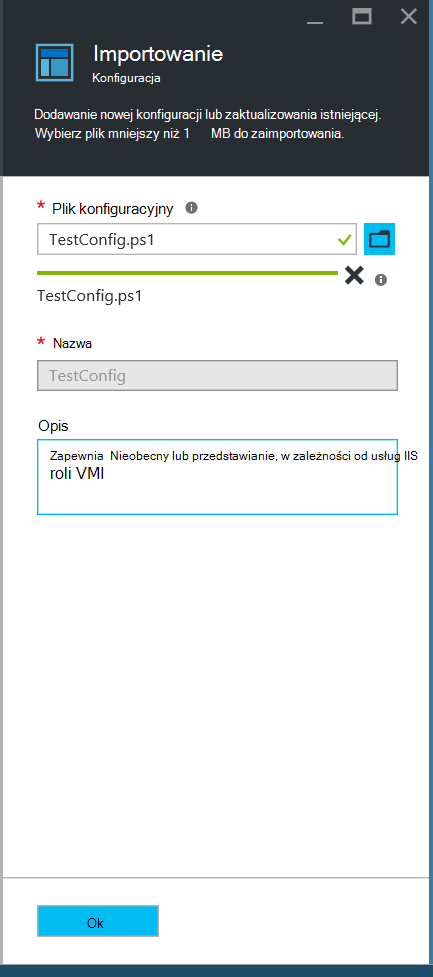
    

6. Kliknij **przycisk OK**.

## <a name="viewing-a-configuration-in-azure-automation"></a>Przeglądanie konfiguracji w usłudze automatyzacji Azure

Po zakończeniu importowania konfiguracji, można wyświetlić go w portalu Azure.

1. Zaloguj się do [portalu Azure](https://portal.azure.com).

2. W menu Centrum kliknij **wszystkie zasoby** , a następnie nazwę swojego konta automatyzacji.

3. Karta **automatyzacji konta** wybierz polecenie **Konfiguracji DSC**

4. Wybierz polecenie karta **Konfiguracji DSC** **TestConfig** (jest to nazwa importowanego w poprzedniej procedurze konfiguracji).

5. Na karta **TestConfig konfiguracji** kliknij przycisk **Pokaż źródło konfiguracji**.

    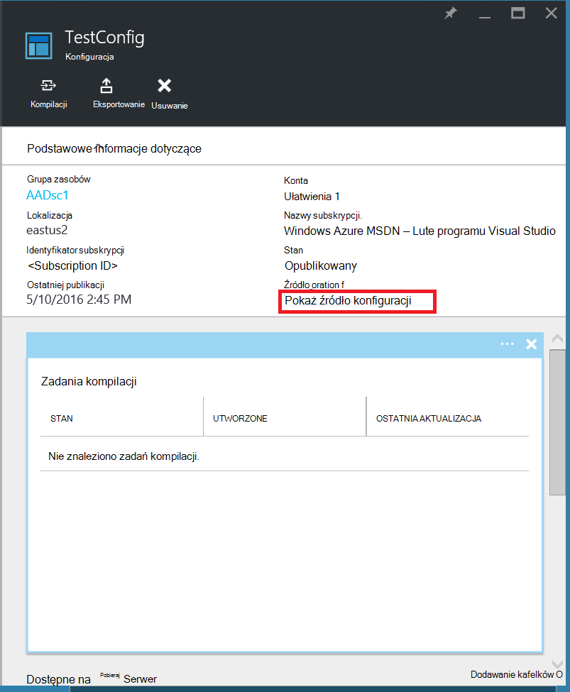
    
    Zostanie wyświetlona karta **źródło konfiguracji TestConfig** wyświetlanie kodu programu PowerShell dla konfiguracji.
    
## <a name="compiling-a-configuration-in-azure-automation"></a>Kompilowanie Konfiguracja w automatyzacji Azure

Przed pożądany stan można stosować do węzła, konfiguracji DSC definiowania Państwa musi być łączone w jeden lub więcej konfiguracji węzeł (dokument MOF), a umieszczony na serwerze pobierają DSC automatyzacji. Dla bardziej szczegółowy opis kompilowania konfiguracji DSC automatyzacji Azure zobacz [kompilowania konfiguracji DSC automatyzacji Azure](automation-dsc-compile.md). Aby uzyskać więcej informacji na temat kompilowania konfiguracji zobacz [DSC konfiguracji](https://msdn.microsoft.com/PowerShell/DSC/configurations).

1. Zaloguj się do [portalu Azure](https://portal.azure.com).

2. W menu Centrum kliknij **wszystkie zasoby** , a następnie nazwę swojego konta automatyzacji.

3. Karta **automatyzacji konta** wybierz polecenie **Konfiguracji DSC**

4. Wybierz polecenie karta **Konfiguracji DSC** **TestConfig** (nazwa wcześniej zaimportowanych konfiguracji).

5. Na karta **Konfiguracji TestConfig** kliknij, **skompilować**, a następnie kliknij przycisk **Tak**. Zostanie uruchomiony zadanie kompilacji.
    
    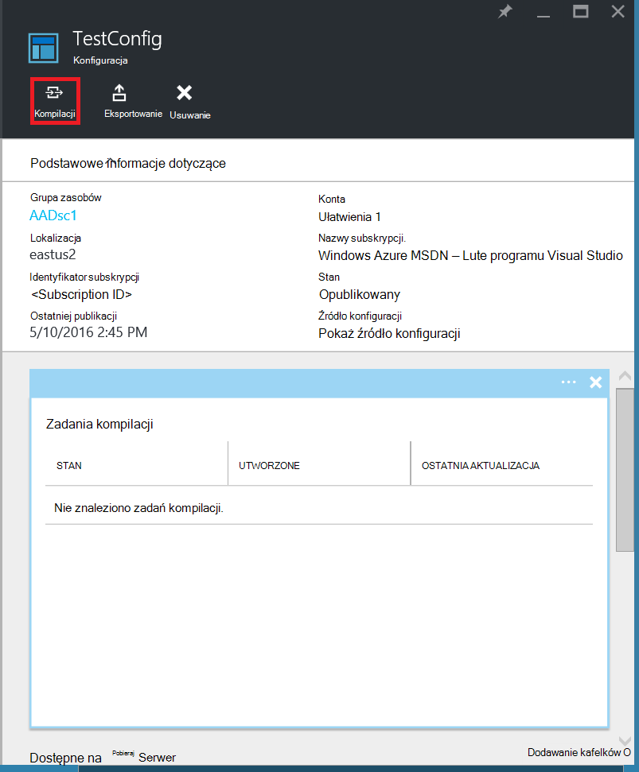
    
> [AZURE.NOTE] Skompilować Konfiguracja w automatyzacji Azure, automatycznie wdraża żadnej konfiguracji węzeł utworzonego za na serwerze pobieraj.

## <a name="viewing-a-compilation-job"></a>Wyświetlanie zadanie kompilacji

Po uruchomieniu zestawienie można wyświetlić go na kafelku **zadania kompilacji** w karta **konfiguracji** . Kafelków **kompilacji zadania** zawiera obecnie uruchomione, ukończone i nie powiodło się zadania. Po otwarciu karta zadania kompilacji jest wyświetlany informacji na temat tego zadania, łącznie z występują błędy lub ostrzeżenia napotkał, parametrów wejściowych używane w konfiguracji i kompilacji dzienników.

1. Zaloguj się do [portalu Azure](https://portal.azure.com).

2. W menu Centrum kliknij **wszystkie zasoby** , a następnie nazwę swojego konta automatyzacji.

3. Wybierz polecenie karta **konta automatyzacji** **DSC konfiguracji**.

4. Wybierz polecenie karta **Konfiguracji DSC** **TestConfig** (nazwa wcześniej zaimportowanych konfiguracji).

5. Na kafelku **zadania kompilacji** programu karta **TestConfig konfiguracji** kliknij dowolne zadania na liście. Zostanie wyświetlona karta **Zadanie kompilacji** z datą rozpoczęcia zadania kompilacji.

    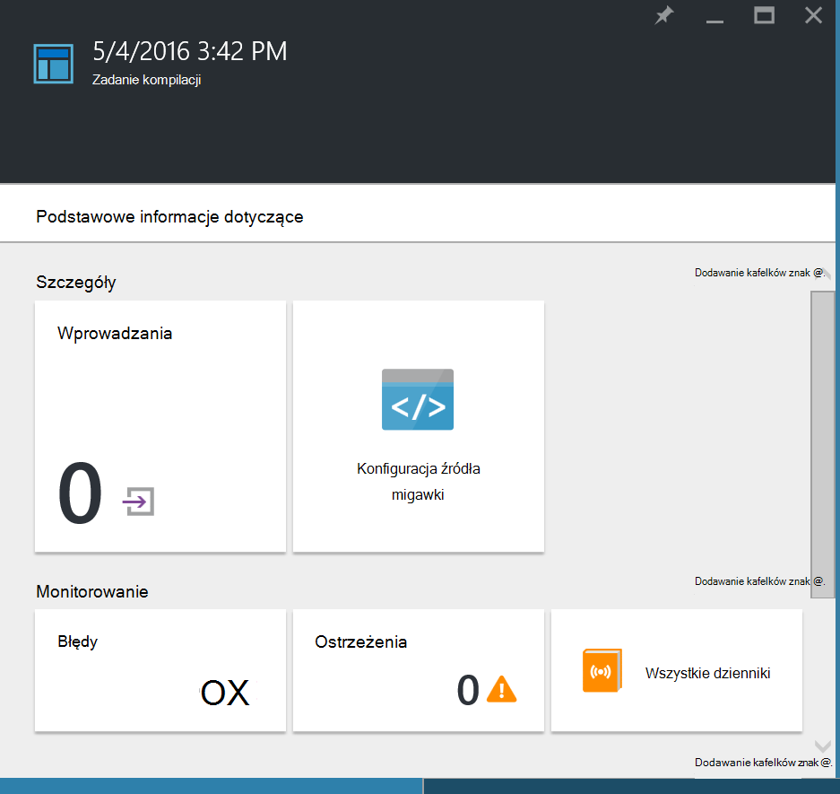
  
6. Kliknij dowolny Kafelek w karta **Zadanie kompilacji** , aby zobaczyć więcej szczegółowych informacji o zadaniu.

## <a name="viewing-node-configurations"></a>Wyświetlanie konfiguracji węzeł

Ukończenie zadania kompilacji tworzy nowe konfiguracje węzeł jeden lub więcej. Węzeł Konfiguracja jest MOF dokumentu, który jest używany na serwerze pobieraj i gotowa do pobierane i stosowane przez jeden lub więcej węzłów. Konfiguracje węzeł można wyświetlać na swoim koncie automatyzacji w karta **DSC węzeł konfiguracji** . Konfiguracja węzeł ma nazwę z formularzem *ConfigurationName*. *NazwaWęzła*.

1. Zaloguj się do [portalu Azure](https://portal.azure.com).

2. W menu Centrum kliknij **wszystkie zasoby** , a następnie nazwę swojego konta automatyzacji.

3. Wybierz polecenie karta **konta automatyzacji** **DSC węzeł konfiguracji**.

    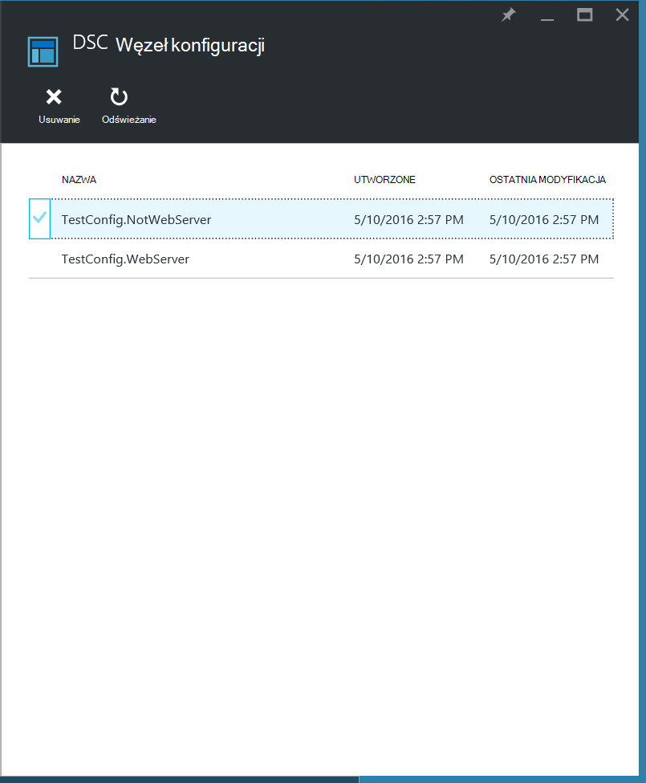
    
## <a name="onboarding-an-azure-vm-for-management-with-azure-automation-dsc"></a>Rozpoczęcie korzystania Azure maszyn do wirtualnych zarządzania z DSC automatyzacji Azure

DSC automatyzacji Azure umożliwia zarządzanie maszyny Azure wirtualne (klasyczny i Menedżera zasobów), maszyny wirtualne lokalnego, maszyn Linux, maszyny wirtualne AWS i fizycznych komputerów lokalnego. Kwestie omawiane w tym temacie, jak wbudowany tylko Azure Menedżera zasobów maszyny wirtualne. Zagadnienie ułatwiającej rozpoczęcie korzystania innych urządzeń, zobacz [komputerów ułatwiającej rozpoczęcie korzystania do zarządzania przez DSC automatyzacji Azure](automation-dsc-onboarding.md).

### <a name="to-onboard-an-azure-resource-manager-vm-for-management-by-azure-automation-dsc"></a>Do wewnętrznego maszyn wirtualnych Azure Menedżera zasobów do zarządzania przez DSC automatyzacji Azure

1. Zaloguj się do [portalu Azure](https://portal.azure.com).

2. W menu Centrum kliknij **wszystkie zasoby** , a następnie nazwę swojego konta automatyzacji.

3. Wybierz polecenie karta **konta automatyzacji** **Węzły DSC**.

4. Karta **Węzły DSC** kliknij **Dodaj maszyn wirtualnych Azure**.

    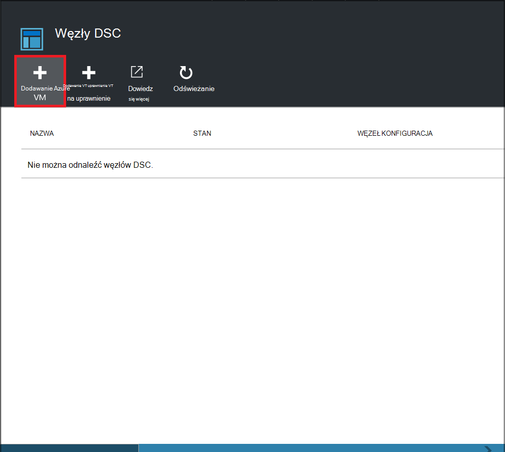

5. W karta **Dodawanie maszyny wirtualne Azure** kliknij przycisk **Wybierz maszyn wirtualnych do wewnętrznego**.

6. W karta **Wybierz maszyny wirtualne** wybierz maszyn wirtualnych, aby płycie i kliknij **przycisk OK**.

    >[AZURE.IMPORTANT] Musi to być maszyn wirtualnych Menedżera zasobów Azure systemem Windows Server 2008 R2 lub nowszy.
    
7. W karta **Dodawanie maszyny wirtualne Azure** kliknij pozycję **Konfiguruj rejestracji dane**.

8. W karta **rejestracji** wprowadź nazwę konfiguracji węzeł, który chcesz zastosować do maszyn wirtualnych w polu **Nazwa konfiguracji węzeł** . To musi dokładnie odpowiadać nazwie konfiguracji węzeł na koncie automatyzacji. Dodawanie nazwy w tym momencie jest opcjonalna. Możesz zmienić konfiguracji przydzielonych węzeł po ułatwiającej rozpoczęcie korzystania węzeł.
**Uruchom ponownie węzeł w razie potrzeby**zaznacz, a następnie kliknij **przycisk OK**.
    
    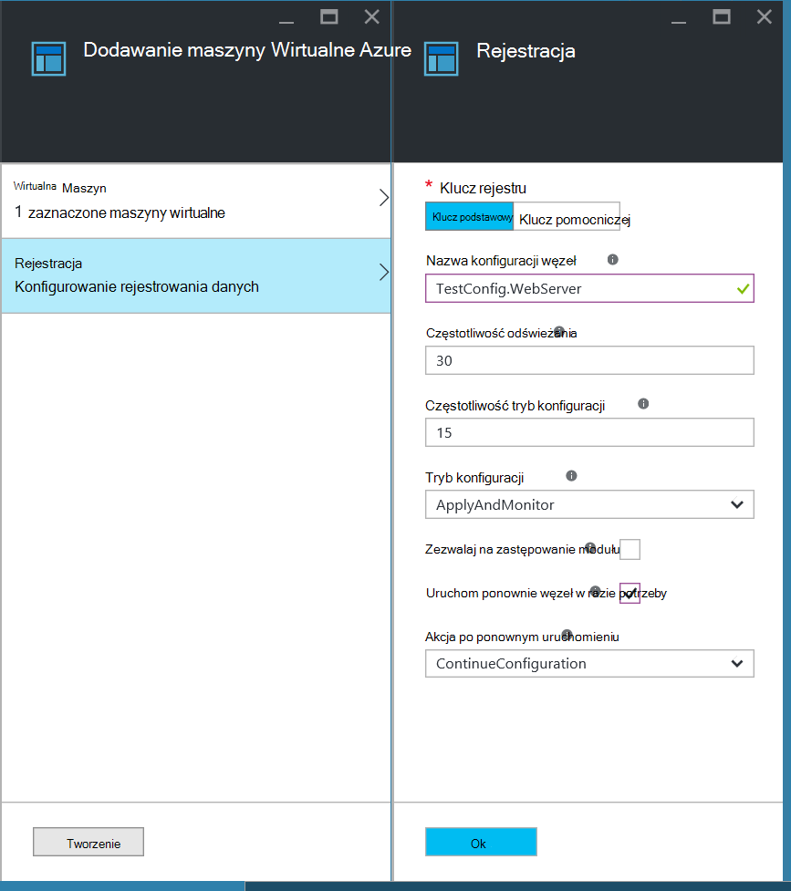
    
    Konfiguracja węzeł określonej zostanie zastosowany do maszyn wirtualnych w odstępach czasu określonych przez **Częstotliwości trybu konfiguracji**, a maszyn wirtualnych będzie sprawdzać dostępność aktualizacji konfiguracji węzeł w odstępach czasu określonych przez **Częstotliwość odświeżania**. Aby uzyskać więcej informacji o używaniu tych wartości zobacz [Konfigurowanie Menedżer konfiguracji lokalnej](https://msdn.microsoft.com/PowerShell/DSC/metaConfig).
    
9. W karta **Dodawanie maszyny wirtualne Azure** kliknij przycisk **Utwórz**.

Azure rozpocznie proces ułatwiającej rozpoczęcie korzystania maszyn wirtualnych. Po jego zakończeniu maszyn wirtualnych pojawi się w karta **DSC węzłów** na koncie automatyzacji.

## <a name="viewing-the-list-of-dsc-nodes"></a>Wyświetlanie listy węzłów DSC

Można wyświetlić listę wszystkich komputerach, które zostały onboarded zarządzania na swoim koncie automatyzacji w karta **Węzły DSC** .

1. Zaloguj się do [portalu Azure](https://portal.azure.com).

2. W menu Centrum kliknij **wszystkie zasoby** , a następnie nazwę swojego konta automatyzacji.

3. Wybierz polecenie karta **konta automatyzacji** **Węzły DSC**.

## <a name="viewing-reports-for-dsc-nodes"></a>Wyświetlanie raportów dla węzłów DSC

Za każdym razem DSC automatyzacji Azure przeprowadza sprawdzanie spójności w węźle zarządzanych węzeł wysyła raport o stanie na serwerze pobieraj. Umożliwia wyświetlanie tych raportów na karta dla tego węzła.

1. Zaloguj się do [portalu Azure](https://portal.azure.com).

2. W menu Centrum kliknij **wszystkie zasoby** , a następnie nazwę swojego konta automatyzacji.

3. Wybierz polecenie karta **konta automatyzacji** **Węzły DSC**.

4. Na kafelku **raportów** kliknij dowolne z raportów na liście.

    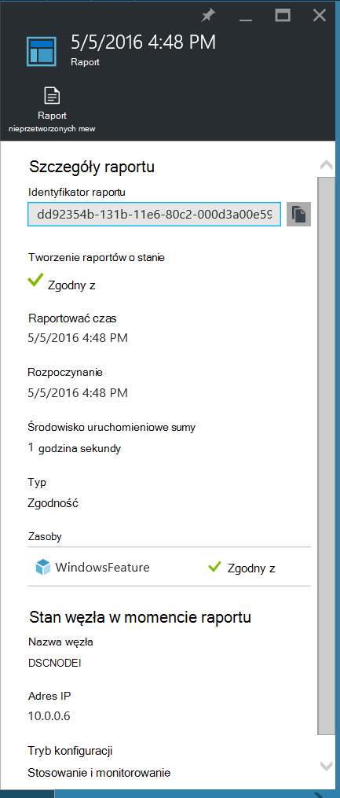

Na karta dla konkretnego raportu można wyświetlić następujące informacje o stanie dla odpowiednich sprawdzanie zgodności:

- Tworzenie raportów o stanie — węzeł jest "Zgodne" Konfiguracja "Nie powiodło się", czy węzeł jest "Nie spełnia" (gdy jest w trybie **applyandmonitor** i komputer nie jest w stanie odpowiednie).
- Godzina rozpoczęcia sprawdzanie zgodności.
- Łącznego czasu wykonywania sprawdzanie zgodności.
- Typ Sprawdzanie spójności.
- Wszystkie błędy, łącznie z kodem błędu i komunikat o błędzie. 
- Wszystkie zasoby DSC używane w konfiguracji i stanu każdego zasobu (tego, czy węzeł jest w stanie odpowiednie dla tego zasobu) — możesz kliknąć każdego zasobu, aby uzyskać więcej szczegółowych informacji dla tego zasobu.
- Nazwa, adres IP i tryb konfiguracji węzła.

Możesz również kliknąć **Wyświetl nieprzetworzonych raport** , aby wyświetlić dane, węzeł wysyła do serwera. Aby uzyskać więcej informacji na temat korzystania z tych danych zobacz [Korzystanie DSC serwera raportów](https://msdn.microsoft.com/powershell/dsc/reportserver).

Może upłynąć trochę czasu, po węzeł onboarded przed udostępnieniem pierwszy raport. Konieczne może być oczekiwanie pierwszy raport do 30 minut po podłączone węzeł.

## <a name="reassigning-a-node-to-a-different-node-configuration"></a>Ponowne przypisywanie poziomu węzła konfiguracji innego węzła

Można przypisywać węzeł, aby użyć innego węzła konfiguracji niż ta, którą pierwotnie przydzielone.

1. Zaloguj się do [portalu Azure](https://portal.azure.com).

2. W menu Centrum kliknij **wszystkie zasoby** , a następnie nazwę swojego konta automatyzacji.

3. Wybierz polecenie karta **konta automatyzacji** **Węzły DSC**.

4. Na karta **Węzły DSC** kliknij nazwę węzła, które chcesz przypisać ponownie.

5. Karta dla tego węzła wybierz polecenie **Przypisz węzeł**.

    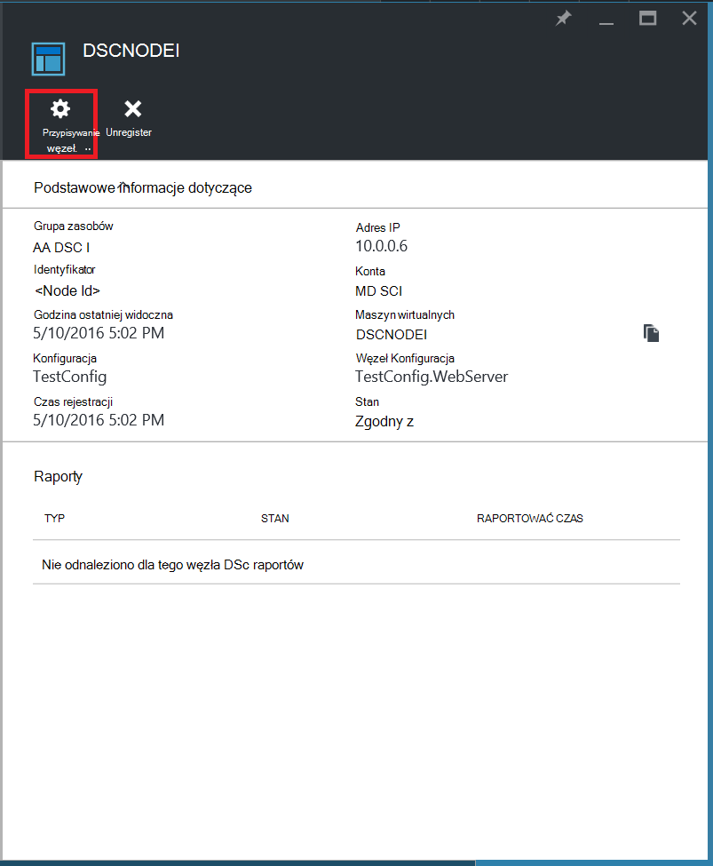

6. Na karta **Przypisywanie węzeł Konfiguracja** wybierz konfigurację węzeł, do którego chcesz przypisać węzeł, a następnie kliknij **przycisk OK**.

    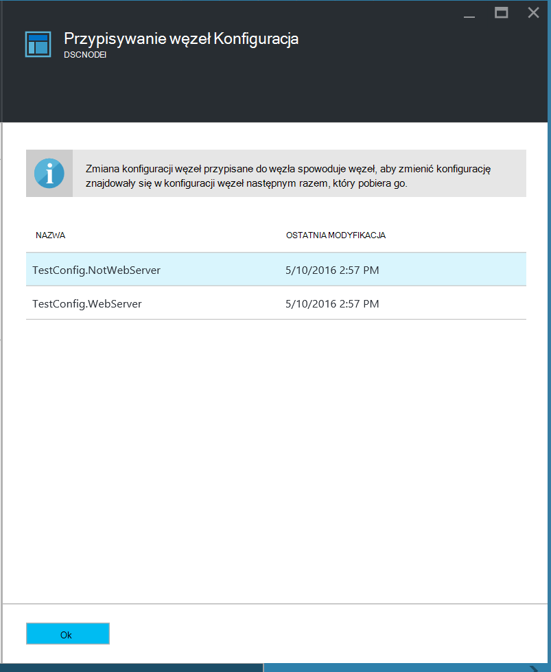
    
## <a name="unregistering-a-node"></a>Wyrejestrowywanie węzeł

Jeśli nie chcesz już poziomu węzła zarządza DSC automatyzacji Azure, możesz go unregister.

1. Zaloguj się do [portalu Azure](https://portal.azure.com).

2. W menu Centrum kliknij **wszystkie zasoby** , a następnie nazwę swojego konta automatyzacji.

3. Wybierz polecenie karta **konta automatyzacji** **Węzły DSC**.

4. Na karta **Węzły DSC** kliknij nazwę węzeł, który chcesz unregister.

5. Na karta dla tego węzła kliknij przycisk **Unregister**.

    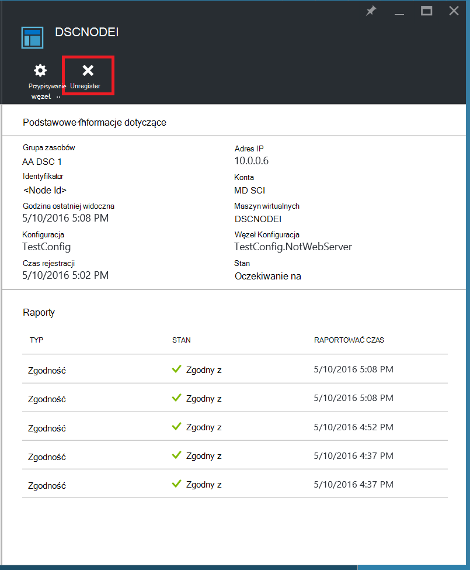

## <a name="related-articles"></a>Artykuły pokrewne
* [Omówienie DSC automatyzacji Azure](automation-dsc-overview.md)
* [Rozpoczęcie korzystania maszyn do zarządzania przez DSC automatyzacji Azure](automation-dsc-onboarding.md)
* [Omówienie konfiguracji stanu potrzeby środowiska Windows PowerShell](https://msdn.microsoft.com/powershell/dsc/overview)
* [Azure cmdlet DSC automatyzacji](https://msdn.microsoft.com/library/mt244122.aspx)
* [Azure ceny DSC automatyzacji](https://azure.microsoft.com/pricing/details/automation/)

