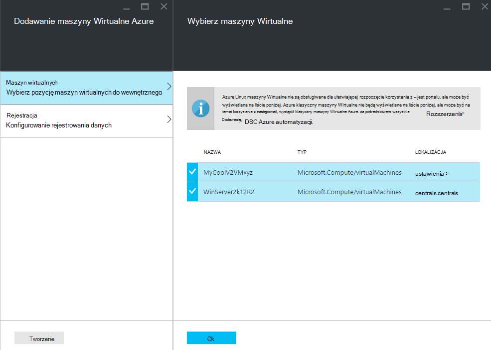

<properties 
   pageTitle="Rozpoczęcie korzystania fizycznych i wirtualnych maszyn do zarządzania przez DSC automatyzacji Azure | Microsoft Azure" 
   description="Jak skonfigurować maszyny do zarządzania z DSC automatyzacji Azure" 
   services="automation" 
   documentationCenter="dev-center-name" 
   authors="coreyp-at-msft" 
   manager="stevenka" 
   editor="tysonn"/>

<tags
   ms.service="automation"
   ms.devlang="NA"
   ms.topic="article"
   ms.tgt_pltfrm="powershell"
   ms.workload="TBD" 
   ms.date="04/22/2016"
   ms.author="coreyp"/>

# Rozpoczęcie korzystania maszyn do zarządzania przez DSC automatyzacji Azure

## Dlaczego warto zarządzać maszyny z DSC automatyzacji Azure?

Przykład [Programu PowerShell potrzeby stan konfiguracji](https://technet.microsoft.com/library/dn249912.aspx)konfiguracji stan potrzeby automatyzacji Azure to usługa zarządzania konfiguracji proste, ale, dla węzłów DSC (fizycznych i maszyn wirtualnych) w dowolnym chmury lub lokalnego centrum danych. Umożliwia skalowalność wielu tysięcy maszyn szybkie i łatwe w centralnym, bezpiecznym miejscu. Można łatwo płycie maszyn, zgodności do odpowiedniej stanu określonej przypisać im deklaracyjnych konfiguracji i wyświetlanie raportów z każdego komputera. Warstwy zarządzania DSC automatyzacji Azure jest DSC warstwa zarządzania automatyzacji Azure jest skryptów programu PowerShell. Innymi słowy w ten sam sposób automatyzacji Azure ułatwia zarządzanie skryptów programu PowerShell, pomaga także zarządzanie DSC konfiguracji. Aby dowiedzieć się więcej na temat korzyści wynikające z używania DSC automatyzacji Azure, zobacz [Omówienie DSC automatyzacji Azure](automation-dsc-overview.md). 

Azure DSC automatyzacji może służyć do zarządzania różnych komputerach:

*    Azure maszyn wirtualnych (klasyczny)
*    Azure maszyn wirtualnych
*    Maszyn wirtualnych Amazon usług sieci Web (AWS)
*    W lokalnym maszyny fizycznych i wirtualnych systemu Windows lub w chmurze innych niż Azure-AWS
*    Linux fizycznej i wirtualnej maszyny w lokalnym w Azure lub w chmurze innych niż Azure

Ponadto jeśli nie możesz przystąpić do zarządzania konfiguracją komputera z chmury, DSC automatyzacji Azure można także jako punkt końcowy tylko do raportu. Umożliwia ustawianie konfiguracja docelowa (naciśnięcie) za pośrednictwem DSC lokalnego i wyświetlanie szczegółów raportowania sformatowanego węzeł zgodności z pożądany stan w automatyzacji Azure.

W poniższych sekcjach opisano sposoby podłączone każdego typu komputera DSC automatyzacji Azure.

## Azure maszyn wirtualnych (klasyczny)

Z DSC automatyzacji Azure możesz łatwo płycie Azure maszyn wirtualnych (klasyczny) do zarządzania konfiguracją przy użyciu Azure portal, albo programu PowerShell. W obszarze Ustawienia zaawansowane, a bez konieczności zdalnego do maszyn wirtualnych administratora rozszerzenia konfiguracji stan potrzeby maszyn wirtualnych Azure rejestruje maszyn wirtualnych DSC automatyzacji Azure. Ponieważ rozszerzenie konfiguracji stan potrzeby maszyn wirtualnych Azure asynchroniczne uruchamia czynności, aby śledzić postęp lub Rozwiązywanie problemów z znajdują się w poniższej sekcji [**Rozpoczęcie korzystania z maszyn wirtualnych Azure rozwiązywania problemów**](#troubleshooting-azure-virtual-machine-onboarding) .

### Azure portal

W [portalu Azure](http://portal.azure.com/), kliknij przycisk **Przeglądaj** -> **maszyn wirtualnych (klasyczny)**. Wybierz pozycję maszyn wirtualnych systemu Windows ma zostać wbudowany. Karta pulpit nawigacyjny maszyny wirtualnej, wybierz polecenie **wszystkie ustawienia** -> **rozszerzenia** -> **Dodaj** -> **DSC automatyzacji Azure** -> **Tworzenie**. Wprowadź [wartości Menedżer konfiguracji programu PowerShell DSC lokalnej](https://msdn.microsoft.com/powershell/dsc/metaconfig4) wymagane dla usługi przypadków użycia, klucz rejestru konta automatyzacji i rejestracji adresu URL i opcjonalnie węzeł Konfiguracja, aby przypisać do maszyn wirtualnych.

Aby znaleźć rejestracji adresu URL i klucza automatyzacji konta podłączone komputera, zobacz poniższą sekcję [**bezpiecznego rejestracji**](#secure-registration) .

### Programu PowerShell

    # log in to both Azure Service Management and Azure Resource Manager
    Add-AzureAccount
    Add-AzureRmAccount
    
    # fill in correct values for your VM/Automation account here
    $VMName = ""
    $ServiceName = ""
    $AutomationAccountName = ""
    $AutomationAccountResourceGroup = ""

    # fill in the name of a Node Configuration in Azure Automation DSC, for this VM to conform to
    $NodeConfigName = ""

    # get Azure Automation DSC registration info
    $Account = Get-AzureRmAutomationAccount -ResourceGroupName $AutomationAccountResourceGroup -Name $AutomationAccountName
    $RegistrationInfo = $Account | Get-AzureRmAutomationRegistrationInfo

    # use the DSC extension to onboard the VM for management with Azure Automation DSC
    $VM = Get-AzureVM -Name $VMName -ServiceName $ServiceName
    
    $PublicConfiguration = ConvertTo-Json -Depth 8 @{
      SasToken = ""
      ModulesUrl = "https://eus2oaasibizamarketprod1.blob.core.windows.net/automationdscpreview/RegistrationMetaConfigV2.zip"
      ConfigurationFunction = "RegistrationMetaConfigV2.ps1\RegistrationMetaConfigV2"

    # update these PowerShell DSC Local Configuration Manager defaults if they do not match your use case.
    # See https://technet.microsoft.com/library/dn249922.aspx?f=255&MSPPError=-2147217396 for more details
     Properties = @{
        RegistrationKey = @{
          UserName = 'notused'
          Password = 'PrivateSettingsRef:RegistrationKey'
        }
        RegistrationUrl = $RegistrationInfo.Endpoint
        NodeConfigurationName = $NodeConfigName
        ConfigurationMode = "ApplyAndMonitor"
        ConfigurationModeFrequencyMins = 15
        RefreshFrequencyMins = 30
        RebootNodeIfNeeded = $False
        ActionAfterReboot = "ContinueConfiguration"
        AllowModuleOverwrite = $False
      }
    }

    $PrivateConfiguration = ConvertTo-Json -Depth 8 @{
      Items = @{
         RegistrationKey = $RegistrationInfo.PrimaryKey
      }
    }
    
    $VM = Set-AzureVMExtension `
     -VM $vm `
     -Publisher Microsoft.Powershell `
     -ExtensionName DSC `
     -Version 2.19 `
     -PublicConfiguration $PublicConfiguration `
     -PrivateConfiguration $PrivateConfiguration `
     -ForceUpdate

    $VM | Update-AzureVM

## Azure maszyn wirtualnych

Azure DSC automatyzacji pozwala na łatwe płycie Azure maszyn wirtualnych do zarządzania konfiguracją przy użyciu Azure portal, szablony Menedżera zasobów Azure lub programu PowerShell. W obszarze Ustawienia zaawansowane, a bez konieczności zdalnego do maszyn wirtualnych administratora rozszerzenia konfiguracji stan potrzeby maszyn wirtualnych Azure rejestruje maszyn wirtualnych DSC automatyzacji Azure. Ponieważ rozszerzenie konfiguracji stan potrzeby maszyn wirtualnych Azure asynchroniczne uruchamia czynności, aby śledzić postęp lub Rozwiązywanie problemów z znajdują się w poniższej sekcji [**Rozpoczęcie korzystania z maszyn wirtualnych Azure rozwiązywania problemów**](#troubleshooting-azure-virtual-machine-onboarding) .

### Azure portal

W [portalu Azure](https://portal.azure.com/)przejdź do konta automatyzacji Azure, której chcesz płycie maszyn wirtualnych. Na pulpicie nawigacyjnym automatyzacji konta, kliknij pozycję **Węzły DSC** -> **Dodawanie maszyn wirtualnych Azure**.

W obszarze **Wybierz maszyn wirtualnych do wewnętrznego**wybierz jeden lub więcej Azure maszyn wirtualnych do wewnętrznego.

W obszarze **Konfiguruj rejestracji danych**wprowadź [wartości Menedżer konfiguracji programu PowerShell DSC lokalnej](https://msdn.microsoft.com/powershell/dsc/metaconfig4) wymagane dla usługi przypadków użycia i opcjonalnie konfiguracji węzeł do przypisywania do maszyn wirtualnych.

 
### Azure szablony Menedżera zasobów

Azure maszyn wirtualnych mogą być rozmieszczone i onboarded do DSC automatyzacji Azure za pomocą Menedżera zasobów Azure szablonów. Zobacz temat [Konfigurowanie maszyn wirtualnych za pomocą rozszerzenia DSC i DSC automatyzacji Azure](https://azure.microsoft.com/documentation/templates/dsc-extension-azure-automation-pullserver/) szablonu przykład tej onboards istniejących maszyn wirtualnych do DSC automatyzacji Azure. Znajdowanie klucza rejestru i adres URL rejestracji sporządzone jako dane wejściowe w tym szablonie, zobacz poniższą sekcję [**bezpiecznego rejestracji**](#secure-registration) .

### Programu PowerShell

Polecenia cmdlet [AzureRmAutomationDscNode rejestru](https://msdn.microsoft.com/library/mt603833.aspx) może służyć do wewnętrznego maszyn wirtualnych w portalu Azure za pomocą programu PowerShell.

## Maszyn wirtualnych Amazon usług sieci Web (AWS)

Możesz łatwo płycie maszyn wirtualnych Amazon usług sieci Web do zarządzania konfiguracją przez DSC automatyzacji Azure za pomocą narzędzi DSC AWS. Dowiedz się więcej na temat narzędzi [tutaj](https://blogs.msdn.microsoft.com/powershell/2016/04/20/aws-dsc-toolkit/).

## W lokalnym maszyny fizycznych i wirtualnych systemu Windows lub w chmurze innych niż Azure-AWS

Lokalnego maszyn systemu Windows i komputerów systemu Windows w innych niż Azure chmury (na przykład usługi sieci Web Amazon) mogą być także onboarded do DSC automatyzacji Azure, jak mają ruchu wychodzącego dostęp do Internetu, kilka prostych czynności:

1. Upewnij się, że zainstalowano najnowszą wersję pakietu [WMF 5](http://aka.ms/wmf5latest) na komputerach, odpowiedni wbudowany do DSC automatyzacji Azure.
2. Postępuj zgodnie z instrukcjami w sekcji [**metaconfigurations generowania DSC**](#generating-dsc-metaconfigurations) poniżej do generowania folder zawierający potrzebne metaconfigurations DSC.
3. Zdalne stosowanie metaconfiguration DSC programu PowerShell na komputerach, które chcesz wbudowany. W **komputerze, na którym to polecenie jest wykonywane z musi mieć najnowszej wersji [WMF 5](http://aka.ms/wmf5latest) zainstalowany**:

    `Set-DscLocalConfigurationManager -Path C:\Users\joe\Desktop\DscMetaConfigs -ComputerName MyServer1, MyServer2`

4. Jeśli nie możesz zastosować metaconfigurations DSC programu PowerShell zdalnie, skopiuj metaconfigurations folder w kroku 2 na każdym komputerze, na wbudowany. Następnie zadzwoń **DscLocalConfigurationManager zestaw** lokalnie na każdym komputerze do wewnętrznego.
5. Używanie Azure portal lub polecenia cmdlet, sprawdź, czy maszyny do wewnętrznego teraz wyświetlane jako węzły DSC zarejestrowana na koncie automatyzacji Azure.

## Linux fizycznej i wirtualnej maszyny w lokalnym w Azure lub w chmurze innych niż Azure

Maszyny Linux lokalnego, Linux maszyn platformy Azure i Linux oraz komputery w innych niż Azure chmury mogą być także onboarded do DSC automatyzacji Azure, jak mają ruchu wychodzącego dostęp do Internetu, kilka prostych czynności:

1. Upewnij się, że zainstalowano najnowszą wersję programu [agent DSC Linux](http://www.microsoft.com/download/details.aspx?id=49150) na komputerach, odpowiedni wbudowany do DSC automatyzacji Azure.

2. Jeśli [domyślne Menedżer konfiguracji programu PowerShell DSC lokalnej](https://msdn.microsoft.com/powershell/dsc/metaconfig4) Uwzględnij wielkość liter do użycia i chcesz do wewnętrznego maszyny takie że **zarówno** pobierać z i przekazać DSC automatyzacji Azure:

    *    Na każdym komputerze Linux do wewnętrznego do DSC automatyzacji Azure umożliwia Register.py wbudowany, przy użyciu ustawień domyślnych Menedżer konfiguracji programu PowerShell DSC lokalnej:

        `/opt/microsoft/dsc/Scripts/Register.py <Automation account registration key> <Automation account registration URL>`

    *    Aby znaleźć klucz rejestru i rejestracji adresu URL dla Twojego konta automatyzacji, zobacz poniższą sekcję [**bezpiecznego rejestracji**](#secure-registration) .

    Jeśli Menedżer konfiguracji programu PowerShell DSC lokalnej domyślne, **czy** **nie** pasują do przypadków użycia lub gdy chcesz płycie maszyny tak, aby tylko podlegają DSC automatyzacji Azure, ale wykonaj nie pobieraj konfiguracji lub moduły programu PowerShell z niego, wykonaj kroki od 3 do 6. W przeciwnym razie przejdź bezpośrednio do kroku 6.

3.  Postępuj zgodnie z instrukcjami w sekcji [**metaconfigurations generowania DSC**](#generating-dsc-metaconfigurations) poniżej, aby wygenerować folder zawierający potrzebne metaconfigurations DSC.
4.  Zdalne stosowanie metaconfiguration DSC programu PowerShell na komputerach, które chcesz wbudowany:
        
        $SecurePass = ConvertTo-SecureString -String "<root password>" -AsPlainText -Force
        $Cred = New-Object System.Management.Automation.PSCredential "root", $SecurePass
        $Opt = New-CimSessionOption -UseSsl -SkipCACheck -SkipCNCheck -SkipRevocationCheck

        # need a CimSession for each Linux machine to onboard
        
        $Session = New-CimSession -Credential $Cred -ComputerName <your Linux machine> -Port 5986 -Authentication basic -SessionOption $Opt
        
        Set-DscLocalConfigurationManager -CimSession $Session –Path C:\Users\joe\Desktop\DscMetaConfigs
    
Komputer, do którego to polecenie jest wykonywane z musi mieć najnowszej wersji [WMF 5](http://aka.ms/wmf5latest) zainstalowany.

5.  Jeśli nie możesz zastosować metaconfigurations DSC programu PowerShell zdalnie, dla każdego komputera Linux do wewnętrznego, skopiuj metaconfiguration odpowiadające na komputerze z folderu w kroku 5 na komputerze Linux. Następnie zadzwoń `SetDscLocalConfigurationManager.py` lokalnie na każdym komputerze Linux ma do wewnętrznego do DSC automatyzacji Azure:

    `/opt/microsoft/dsc/Scripts/SetDscLocalConfigurationManager.py –configurationmof <path to metaconfiguration file>`

6.  Używanie Azure portal lub polecenia cmdlet, sprawdź, czy maszyny do wewnętrznego teraz wyświetlane jako węzły DSC zarejestrowana na koncie automatyzacji Azure.

##Generowanie DSC metaconfigurations
Aby ogólnie płycie dowolnego komputera DSC automatyzacji Azure, DSC metaconfiguration może być generowany, po zastosowaniu informuje agenta DSC na komputerze, aby pobierać z i/lub przekazać DSC automatyzacji Azure. DSC metaconfigurations dla Azure automatyzacji DSC mogą być generowane za pomocą konfiguracji DSC programu PowerShell lub polecenia cmdlet programu PowerShell automatyzacji Azure.

**Uwaga:** DSC metaconfigurations zawierają hasła, potrzebne do wewnętrznego komputera w celu automatyzacji konto do zarządzania. Upewnij się, że poprawnie ochrona metaconfigurations DSC, wszelkie utworzone lub usuwanie ich po ich użyciu.

###Przy użyciu konfiguracji DSC
1.  Otwórz środowiska PowerShell ISE jako administrator na komputerze w środowisku lokalnym. Komputer musi mieć najnowszej wersji [WMF 5](http://aka.ms/wmf5latest) zainstalowany.

2.  Skopiuj poniższy skrypt lokalnie. Ten skrypt zawiera konfiguracji DSC programu PowerShell dla tworzenia metaconfigurations i polecenia, aby rozpocząć tworzenie metaconfiguration.
    
        # The DSC configuration that will generate metaconfigurations
        [DscLocalConfigurationManager()]
        Configuration DscMetaConfigs 
        { 
            param 
            ( 
                [Parameter(Mandatory=$True)] 
                [String]$RegistrationUrl,
         
                [Parameter(Mandatory=$True)] 
                [String]$RegistrationKey,

                [Parameter(Mandatory=$True)] 
                [String[]]$ComputerName,

                [Int]$RefreshFrequencyMins = 30, 
            
                [Int]$ConfigurationModeFrequencyMins = 15, 
            
                [String]$ConfigurationMode = "ApplyAndMonitor", 
            
                [String]$NodeConfigurationName,

                [Boolean]$RebootNodeIfNeeded= $False,

                [String]$ActionAfterReboot = "ContinueConfiguration",

                [Boolean]$AllowModuleOverwrite = $False,

                [Boolean]$ReportOnly
            )

    
            if(!$NodeConfigurationName -or $NodeConfigurationName -eq "") 
            { 
                $ConfigurationNames = $null 
            } 
            else 
            { 
                $ConfigurationNames = @($NodeConfigurationName) 
            }

            if($ReportOnly)
            {
               $RefreshMode = "PUSH"
            }
            else
            {
               $RefreshMode = "PULL"
            }

            Node $ComputerName
            {

                Settings 
                { 
                    RefreshFrequencyMins = $RefreshFrequencyMins 
                    RefreshMode = $RefreshMode 
                    ConfigurationMode = $ConfigurationMode 
                    AllowModuleOverwrite = $AllowModuleOverwrite 
                    RebootNodeIfNeeded = $RebootNodeIfNeeded 
                    ActionAfterReboot = $ActionAfterReboot 
                    ConfigurationModeFrequencyMins = $ConfigurationModeFrequencyMins 
                }

                if(!$ReportOnly)
                {
                   ConfigurationRepositoryWeb AzureAutomationDSC 
                    { 
                        ServerUrl = $RegistrationUrl 
                        RegistrationKey = $RegistrationKey 
                        ConfigurationNames = $ConfigurationNames 
                    }

                    ResourceRepositoryWeb AzureAutomationDSC 
                    { 
                       ServerUrl = $RegistrationUrl 
                       RegistrationKey = $RegistrationKey 
                    }
                }

                ReportServerWeb AzureAutomationDSC 
                { 
                    ServerUrl = $RegistrationUrl 
                    RegistrationKey = $RegistrationKey 
                }
            } 
        }
        
        # Create the metaconfigurations
        # TODO: edit the below as needed for your use case
        $Params = @{
             RegistrationUrl = '<fill me in>';
             RegistrationKey = '<fill me in>';
             ComputerName = @('<some VM to onboard>', '<some other VM to onboard>');
             NodeConfigurationName = 'SimpleConfig.webserver';
             RefreshFrequencyMins = 30;
             ConfigurationModeFrequencyMins = 15;
             RebootNodeIfNeeded = $False;
             AllowModuleOverwrite = $False;
             ConfigurationMode = 'ApplyAndMonitor';
             ActionAfterReboot = 'ContinueConfiguration';
             ReportOnly = $False;  # Set to $True to have machines only report to AA DSC but not pull from it
        }
        
        # Use PowerShell splatting to pass parameters to the DSC configuration being invoked
        # For more info about splatting, run: Get-Help -Name about_Splatting
        DscMetaConfigs @Params

3.  Wprowadź klucz rejestru i adres URL dla Twojego konta automatyzacji, a także nazwy maszyny do wewnętrznego. Wszystkie inne parametry są opcjonalne. Aby znaleźć klucz rejestru i rejestracji adresu URL dla Twojego konta automatyzacji, zobacz poniższą sekcję [**bezpiecznego rejestracji**](#secure-registration) .

4.  Jeśli chcesz komputerach, aby zgłosić informacje o DSC automatyzacji Azure stanie DSC, ale nie pobierają konfiguracji lub moduły programu PowerShell, ustaw parametr **ReportOnly** na wartość true.

5.  Uruchom skrypt. Teraz trzeba folder o nazwie **DscMetaConfigs** w katalogu roboczym zawierające metaconfigurations DSC programu PowerShell dla komputerów do wewnętrznego.

###Przy użyciu poleceń cmdlet automatyzacji Azure
Jeśli domyślne Menedżer konfiguracji programu PowerShell DSC lokalnej Uwzględnij wielkość liter do użycia i wbudowany maszyn chcesz zmienić, tak, aby były zarówno pobierać z i przekazać DSC automatyzacji Azure, polecenia cmdlet automatyzacji Azure wprowadź stosowania uproszczonej metody generowania metaconfigurations DSC potrzeb:

1.  Otwieranie konsoli programu PowerShell lub środowiska PowerShell ISE jako administrator na komputerze w środowisku lokalnym.

2.  Łączenie do Azure Menedżera zasobów za pomocą **AzureRmAccount Dodaj**

3.  Pobierz metaconfigurations DSC programu PowerShell dla komputerów, które mają na płycie z konta automatyzacji, do którego chcesz płycie węzły:

        # Define the parameters for Get-AzureRmAutomationDscOnboardingMetaconfig using PowerShell Splatting
        $Params = @{
            ResourceGroupName = 'ContosoResources'; # The name of the ARM Resource Group that contains your Azure Automation Account
            AutomationAccountName = 'ContosoAutomation'; # The name of the Azure Automation Account where you want a node on-boarded to
            ComputerName = @('web01', 'web02', 'sql01'); # The names of the computers that the meta configuration will be generated for
            OutputFolder = "$env:UserProfile\Desktop\";
        }
        
        # Use PowerShell splatting to pass parameters to the Azure Automation cmdlet being invoked
        # For more info about splatting, run: Get-Help -Name about_Splatting
        Get-AzureRmAutomationDscOnboardingMetaconfig @Params

Teraz masz należy folder o nazwie ***DscMetaConfigs***, zawierające metaconfigurations DSC programu PowerShell dla komputerów do wewnętrznego.

##Zabezpieczanie rejestracji

Komputery można bezpiecznie podłączone konto Azure automatyzacji przy użyciu protokołu rejestracji WMF 5 DSC, dzięki czemu węzeł DSC do uwierzytelniania na serwerze programu PowerShell DSC w wersji 2 rozsunąć lub raportowania (w tym DSC automatyzacji Azure). Węzeł rejestruje na serwerze w **Rejestracji adresu URL**, uwierzytelnianie przy użyciu **klucza rejestru**. Podczas rejestrowania węzeł DSC i serwer DSC pobieraj i raportowania Wynegocjuj certyfikatu unikatowe dla tego węzła służącego do uwierzytelniania serwera rejestracji po. Dzięki temu węzły onboarded z personifikacji język, który jest inny, na przykład jeśli węzeł zostało naruszone i zachowuje złośliwie. Po zarejestrowaniu klucz rejestru nie jest używany do uwierzytelniania ponownie, a zostanie usunięty z węzła.

Możesz uzyskać informacji wymaganych dla protokołu rejestracji DSC ze karta **Narzędzia do zarządzania kluczami** w portal Azure preview. Ta karta otworzyć, klikając ikonę klucza na panelu **podstawowe informacje dotyczące** konta automatyzacji.

*    Pole adresu URL w karta Narzędzia do zarządzania kluczami jest używany adres URL rejestracji.
*    Klucz rejestru jest klucza podstawowego programu Access lub pomocnicza klawisz dostępu karta Narzędzia do zarządzania kluczami. Albo klucz może być używany.

Aby zwiększyć bezpieczeństwo klawisze dostępu głównego i pomocniczego konta automatyzacji można generowane w dowolnym momencie (na karta **Narzędzia do zarządzania kluczami** ) aby zapobiec rejestracji przyszłych węzeł przy użyciu poprzednich kluczy.

##Rozwiązywanie problemów z ułatwiającej rozpoczęcie korzystania z platformy Azure maszyn wirtualnych

Azure DSC automatyzacji pozwala łatwo płycie maszyny wirtualne systemu Windows Azure dla zarządzania konfiguracją. W obszarze Ustawienia zaawansowane rozszerzenia konfiguracji stan potrzeby maszyn wirtualnych Azure służy do rejestrowania maszyn wirtualnych z DSC automatyzacji Azure. Ponieważ rozszerzenie konfiguracji stan potrzeby maszyn wirtualnych Azure uruchamia asynchroniczne, śledzenia postępu i rozwiązywanie problemów z jego wykonanie może być istotny. 

>[AZURE.NOTE] Każda metoda ułatwiającej rozpoczęcie korzystania maszyn wirtualnych systemu Windows Azure do DSC automatyzacji Azure, z rozszerzeniem Azure maszyn wirtualnych potrzeby stan konfiguracji może zająć do godziny dla węzeł, aby wyświetlić maksymalnie zarejestrowanej w automatyzacji Azure. To jest ze względu na instalację Windows Management Framework 5.0 na maszyn wirtualnych przez rozszerzenie DSC maszyn wirtualnych Azure jest wymagane do wewnętrznego maszyn wirtualnych do DSC automatyzacji Azure.

Rozwiązywanie problemów z ani wyświetlać stan rozszerzenia konfiguracji stan potrzeby maszyn wirtualnych Azure, w Azure portal przejdź do maszyn wirtualnych, jest onboarded, a następnie kliknij pozycję -> **wszystkie ustawienia** -> **rozszerzenia** -> **DSC**. Aby uzyskać więcej informacji możesz kliknąć **wyświetlić szczegółowe informacje**.

## Wygasanie certyfikatu i rejestracja

Po zarejestrowaniu machine jako węzeł DSC DSC automatyzacji Azure istnieją z kilku powodów, dlaczego trzeba zarejestrować tego węzła w przyszłości:

* Po zarejestrowaniu każdy węzeł automatycznie negocjuje unikatowe certyfikatu uwierzytelniania wygasa po jeden rok. Obecnie protokół rejestracji DSC programu PowerShell nie zostanie odnowiona automatycznie certyfikatów po ich zbliża się wygaśnięcia, więc musisz zarejestrować węzły chwilę rok. Przed ponownego rejestrowania środowiska, upewnij się, że każdy węzeł działa system Windows Management Framework 5.0 RTM. Jeśli certyfikatu uwierzytelniania węzła wygaśnie, a następnie węzeł nie jest zarejestrowane węzeł będzie mógł komunikować się z automatyzacji Azure i zostaną oznaczone jako "Unresponsive." Rejestracja wykonać 90 dni lub mniejsza od czasu wygaśnięcia certyfikat lub w dowolnym momencie po czas wygaśnięcia certyfikatu spowoduje nowego certyfikatu jest generowane i używane.

* Aby zmienić wszystkie [wartości Menedżer konfiguracji programu PowerShell DSC lokalnej](https://msdn.microsoft.com/powershell/dsc/metaconfig4) ustawiany podczas początkowej rejestracji węzła, takich jak we właściwości ConfigurationMode. Obecnie te wartości agenta DSC mogą być zmieniane przez rejestracja. Jedynym wyjątkiem jest konfiguracji węzeł przypisane do węzła — to można zmienić w DSC automatyzacji Azure bezpośrednio.

Rejestracja mogą być wykonywane w taki sam sposób zarejestrowana węzeł początkowo za pomocą dowolnej z metod ułatwiającej rozpoczęcie korzystania opisanych w tym dokumencie. Nie musisz unregister węzeł z DSC automatyzacji Azure przed reregistering go.

## Artykuły pokrewne
* [Omówienie DSC automatyzacji Azure](automation-dsc-overview.md)
* [Azure cmdlet DSC automatyzacji](https://msdn.microsoft.com/library/mt244122.aspx)
* [Azure ceny DSC automatyzacji](https://azure.microsoft.com/pricing/details/automation/)

