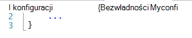
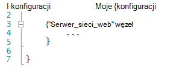
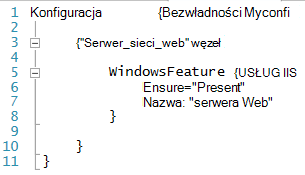
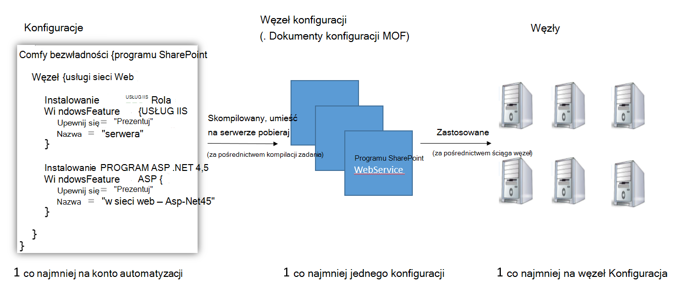
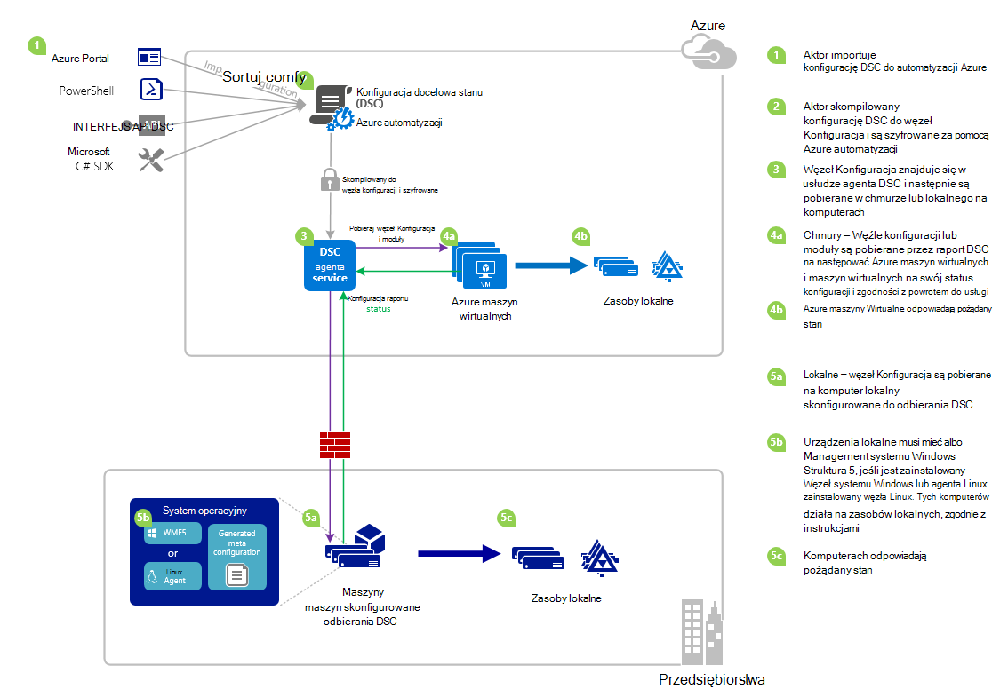

<properties 
   pageTitle="Omówienie DSC Azure automatyzacji | Microsoft Azure" 
   description="Omówienie programu Azure automatyzacji potrzeby stan konfiguracji (DSC), jego terminów i znane problemy" 
   services="automation" 
   documentationCenter="dev-center-name" 
   authors="coreyp-at-msft" 
   manager="stevenka" 
   editor="tysonn"
   keywords="PowerShell dsc, pożądany stan konfiguracji, azure dsc programu powershell"/>

<tags
   ms.service="automation"
   ms.devlang="NA"
   ms.topic="article"
   ms.tgt_pltfrm="powershell"
   ms.workload="TBD" 
   ms.date="05/10/2016"
   ms.author="magoedte;coreyp"/>

# Omówienie DSC Azure automatyzacji #

##Co to jest Azure automatyzacji DSC?##
Wdrażanie i konserwację żądany stan serwerów i zasoby aplikacji może być niewygodny i podatne błędów. Z Azure automatyzacji odpowiedniej stan konfiguracji (DSC), można spójne wdrażanie, niezawodne monitorowanie i automatycznie aktualizuje żądany stan wszystkich zasobów IT, w skali z chmury. DSC automatyzacji, oparty na DSC programu PowerShell, można wyrównać konfiguracji komputera ze stanem określonego przez fizycznych i wirtualnych maszyn, przy użyciu systemu Windows i Linux oraz i w chmurze lub lokalnego. Można włączyć ciągły dostarczaniem usług informatycznych kontrolki spójne i zarządzanie szybkie zmiany za pośrednictwem usługi niejednorodnymi hybrydowych informatyczną z łatwością.

Tworzy Azure DSC automatyzacji na bieżąco podstawy wprowadzone w DSC programu PowerShell zapewniające jeszcze łatwiejsze środowisko zarządzania konfiguracji. Azure DSC automatyzacji powoduje tej samej warstwie zarządzania [programu PowerShell potrzeby stan](https://msdn.microsoft.com/powershell/dsc/overview) konfiguracji, jak automatyzacji Azure umożliwia obecnie wykonywanie skryptów programu PowerShell.

Azure DSC automatyzacji umożliwia [Tworzenie i zarządzanie programu PowerShell potrzeby stan konfiguracji](https://technet.microsoft.com/library/dn249918.aspx), importowanie [Zasobów DSC](https://technet.microsoft.com/library/dn282125.aspx)i generowanie konfiguracji węzeł DSC (MOF dokumenty), w chmurze. Te elementy DSC zostaną umieszczone na automatyzacji Azure [DSC pobierają serwera](https://technet.microsoft.com/library/dn249913.aspx) tak, aby węzły docelowej (na przykład fizycznych i maszyn wirtualnych) w chmurze lub lokalnego może odbierać je, automatycznie odpowiadają pożądany stan, które określają i sprawozdanie ich zgodności z odpowiednim Państwo automatyzacji Azure.

Wolisz oglądanie do odczytu? Masz przyjrzeć się poniżej klipu wideo z maj 2015 r., kiedy najpierw zostało ogłoszone DSC automatyzacji Azure. **Uwaga:** Podczas pojęcia i cyklu życia omawiane w tym klipie wideo są poprawne, DSC automatyzacji Azure zanotowano znacznie od został zapisany w tym klipie wideo. Ona jest zazwyczaj dostępny, ma znacznie szerszym interfejs użytkownika w portalu Azure i obsługuje wiele dodatkowe funkcje.

> [AZURE.VIDEO microsoft-ignite-2015-heterogeneous-configuration-management-using-microsoft-azure-automation]

## Warunki Azure automatyzacji DSC ##
### Konfiguracja ###
DSC programu PowerShell wprowadzona nowa koncepcja o nazwie konfiguracji. Konfiguracje Umożliwia definiowanie przy użyciu składni programu PowerShell żądany stan środowiska. Aby skonfigurować środowisko za pomocą DSC, najpierw zdefiniować blok skryptu programu Windows PowerShell, za pomocą słowa kluczowego konfiguracji, a następnie po nim przy użyciu identyfikatora, następnie klamrowych ({}), aby ograniczyć bloku.

Wewnątrz bloku konfiguracji można zdefiniować węzeł Konfiguracja bloków, które Określ, czy konfiguracja docelowa dla zestawu węzłów (komputery) w środowisku, który ma być skonfigurowany dokładnie tak samo. W ten sposób konfiguracji węzeł przedstawia "rolę" dla jednego lub więcej węzłów zachowaniu. Węzeł Konfiguracja blok rozpoczyna się od słowa kluczowego węzeł. Postępuj zgodnie z tego słowa kluczowego o nazwie roli, który może być zmienna lub wyrażenie. Po nazwie roli umożliwia ograniczania bloku węzeł Konfiguracja nawiasami klamrowymi {}.

 
Wewnątrz bloku węzeł Konfiguracja można zdefiniować bloków zasobów skonfigurowanie określonych zasobów DSC. Blokowanie zasobów zaczyna się od nazwy zasobów, następuje identyfikator określić dla danego bloku, a następnie nawiasy klamrowe {}, aby ograniczyć bloku.

Aby uzyskać szczegółowe informacje dotyczące słowa kluczowego konfiguracji, zobacz: [Opis konfiguracji słów na potrzeby konfiguracji stan](http://blogs.msdn.com/b/powershell/archive/2013/11/05/understanding-configuration-keyword-in-desired-state-configuration.aspx "Słowo kluczowe konfiguracji opis na potrzeby konfiguracji stan")

Uruchamianie (Kompilacja) konfiguracji DSC spowodują jeden lub więcej DSC węzeł konfiguracji (MOF dokumenty), które są węzły DSC stosowanie do wykonania pożądany stan.

Azure DSC automatyzacji umożliwia zaimportowanie autor i konfiguracji DSC kompilacji w automatyzacji Azure, podobnie jak runbooks mogą być importowane, utworzone, a pracę w automatyzacji Azure.

>[AZURE.IMPORTANT] Konfiguracja powinny zawierać tylko jeden blok konfiguracji, z taką samą nazwę jak konfiguracji, w DSC automatyzacji Azure. 

###Węzeł Konfiguracja###

Podczas kompilowania konfiguracji DSC jeden lub więcej konfiguracji węzeł wyprodukowano w zależności od bloków węzeł w konfiguracji. Konfiguracja węzeł jest taki sam jako "MOF" lub "dokument konfiguracji" (Jeśli znasz tych terminów PS DSC) i przedstawia "rolę", takich jak serwer_sieci_Web lub pracownika potrzeby stan jeden lub więcej węzłów należy przyjąć lub Sprawdź zgodność przed. Nazwiska węzła konfiguracji DSC automatyzacji Azure formę "Konfiguracji Name.NodeConfigurationBlockName".

PS Węzły DSC poznawania węzeł konfiguracji, które powinny one ustanowić za pośrednictwem wypychanych DSC i pobieraj metod. Azure DSC automatyzacji zależy od metody pobieraj DSC, gdzie węzły żądanie węzeł konfiguracji, które powinny być stosowane od DSC automatyzacji Azure pobierają serwera. Ponieważ węzły wprowadzić żądanie DSC automatyzacji Azure, mogą być węzły zapory, znajdują się wszystkie przychodzące porty zamknięty, itd. Potrzebują tylko ruchu wychodzącego dostęp do Internetu (bezpośrednio lub za pośrednictwem serwera proxy).

###Węzeł###

Węzeł DSC jest każde urządzenie, które ma konfigurację zarządzane przez DSC. Może to być systemu Windows i Linux oraz Azure Głosowa, maszyn wirtualnych lokalnego / fizycznie hosta lub machine w chmurze innej publicznej. Węzły przyjąć węzeł konfiguracji i zachowania zgodności z pożądany stan, które definiują i może również raportu Powrót do serwera raportowania w ich stan konfiguracji i zgodność a żądany stan.

Azure DSC automatyzacji ułatwia rozpoczęcie korzystania węzłów do zarządzania przez DSC automatyzacji Azure i umożliwia zmianę konfiguracji węzeł przypisane do każdego węzła po stronie serwera, aby następnym razem węzeł sprawdzi serwer instrukcje zostanie założono inną rolę i zmienić jego konfiguracji i stanu complaince go Zgłoś przed zgodnie z.

###Zasób###
DSC zasoby są bloków konstrukcyjnych, które umożliwia definiowanie konfiguracji systemu Windows PowerShell potrzeby stan konfiguracji (DSC). DSC zawiera zestaw wbudowanych zasobów, takie jak kontakty dla plików i folderów, funkcje serwera i ról, ustawień rejestru, zmienne środowiska i usług i procesów. Aby uzyskać informacje o pełną listę wbudowanych zasoby DSC i sposobach ich używania, zobacz [Wbudowane systemu Windows PowerShell potrzeby stan konfiguracji Zasoby](https://technet.microsoft.com/library/dn249921.aspx).

DSC zasobów można zaimportować w taki sposób, w ramach programu PowerShell modułów rozszerzanie zestaw wbudowanych DSC zasobów. Zasoby inne niż domyślne będzie obniżona przez węzły DSC na serwerze pobieraj DSC, jeśli konfiguracji węzeł, który ma przyjąć węzeł zawiera odwołania do tych zasobów. Aby dowiedzieć się, jak tworzyć niestandardowe zasobów, zobacz [Tworzenie niestandardowych systemu Windows PowerShell potrzeby stan konfiguracji zasobów](https://technet.microsoft.com/library/dn249927.aspx).

Azure DSC automatyzacji jest dostarczany z wbudowanych tych samych zasobów DSC jak PS DSC. Dodatkowe zasoby można dodawać do DSC automatyzacji Azure, importując moduły programu PowerShell zawierającego zasoby do automatyzacji Azure.

###Zadanie kompilacji###
Zadanie kompilacji w DSC automatyzacji Azure to wystąpienie kompilacji konfiguracji, aby utworzyć jeden lub więcej konfiguracji węzeł. Są podobne do zadania działań aranżacji automatyzacji Azure, z wyjątkiem, że ta osoba nie dokonać dowolne zadanie, z wyjątkiem tworzenia konfiguracji węzeł. Węzeł konfiguracji utworzonych przez zadanie kompilacji są automatycznie umieszczane na serwerze pobieraj DSC automatyzacji Azure i zastępują poprzednie wersje węzeł konfiguracji, aby dla tej konfiguracji. Nazwa konfiguracji węzeł tworzone przez zadanie kompilacji ma postać "ConfigurationName.NodeConfigurationBlockName". Na przykład kompilowania poniżej konfiguracji przyjmie konfiguracji jeden węzeł o nazwie "MyConfiguration.webserver"

>[AZURE.NOTE] Podobnie jak runbooks można opublikować konfiguracji. Nie odnosi się do umieszczania DSC elementów na serwerze pobieraj DSC automatyzacji Azure. Zadania kompilacji powodować DSC elementy do umieszczenia na serwerze pobieraj DSC automatyzacji Azure. Aby uzyskać więcej informacji na "publikowania" w automatyzacji Azure zobacz [Publikowanie działań aranżacji](https://msdn.microsoft.com/library/dn903765.aspx).

##Cykl życia DSC Azure automatyzacji##
Rozpoczęcie pracy z konta pustego automatyzacji do zestawu zarządzanych węzłów poprawnie skonfigurowany obejmuje zestaw procesów do definiowania konfiguracji, włączając tych konfiguracji do węzła konfiguracji i węzły ułatwiającej rozpoczęcie korzystania DSC automatyzacji Azure i w tych konfiguracjach węzeł. Na poniższym diagramie przedstawiono cyklu życia DSC automatyzacji Azure:

Poniższa ilustracja przedstawia szczegółowe procedury krok po kroku w cyklu życia DSC. Zawiera różne sposoby konfiguracji jest zaimportowane i zastosowany do węzłów w automatyzacji Azure składniki wymagane dla komputera lokalnego do obsługi DSC i interakcje między różnych elementów. 

     

##Niespodzianki / znane problemy dotyczące:##

- Podczas uaktualniania do WMF 5 RTM, jeśli komputer jest już zarejestrowany jako węzeł DSC automatyzacji Azure, unregister go z DSC automatyzacji Azure i zarejestrować ją po uaktualnieniu WMF 5 RTM.

- Azure DSC automatyzacji nie obsługuje konfiguracji DSC częściowego lub złożonego w tym czasie. Jednak zasoby złożone DSC można zaimportować i używane w konfiguracji DSC automatyzacji Azure tak samo jak w programie PowerShell lokalnych, włączanie konfiguracji ponownego użycia.

- Najnowsza wersja pakietu WMF 5 musi być zainstalowany agenta DSC programu PowerShell dla systemu Windows można było komunikować się z automatyzacji Azure. Najnowszą wersję programu PowerShell DSC agenta Linux musi być zainstalowany Linux można było komunikować się z automatyzacji Azure.

- Serwer tradycyjnych pobieraj DSC programu PowerShell oczekuje modułu zips do umieszczenia na serwerze pobieraj w formacie **ModuleName_Version.zip "**. Azure automatyzacji oczekuje moduły programu PowerShell do zaimportowania z nazwami w postaci **ModuleName.zip**. Zobacz [Ten wpis w blogu](https://azure.microsoft.com/blog/2014/12/15/authoring-integration-modules-for-azure-automation/) , aby uzyskać więcej informacji o formacie modułu integracji, aby zaimportować moduł automatyzacji Azure. 

- Moduły programu PowerShell zaimportowanych automatyzacji Azure nie może zawierać plików doc i docx. Niektóre moduły programu PowerShell zawierających zasoby DSC zawierają te pliki do celów pomocy. Te pliki powinny usunięte z modułów, przed zaimportować do automatyzacji Azure.

- Gdy węzeł najpierw jest zarejestrowany przy użyciu konta automatyzacji Azure lub węzeł zostanie zmieniony do zamapować na inny węzeł Konfiguracja po stronie serwera, jego stan będzie "Zgodne", nawet jeśli stan węzła nie jest faktycznie zgodny z konfiguracją węzeł, które obecnie są mapowane na. Po węzeł wykonuje jego pierwszego pobieraj i wysyła jego pierwszy raport po rejestracji lub zmianę mapowania konfiguracji węzeł, węzeł stan można ufać.

- Gdy ułatwiającej rozpoczęcie korzystania maszyn wirtualnych systemu Windows Azure do zarządzania przez DSC automatyzacji Azure za pomocą jednej z naszych metod bezpośredni ułatwiającej rozpoczęcie korzystania go może zająć do godziny dla maszyn wirtualnych się pojawić jako węzeł DSC automatyzacji Azure. To jest ze względu na instalację Windows Management Framework 5.0 na maszyn wirtualnych przez rozszerzenie DSC maszyn wirtualnych Azure jest wymagane do wewnętrznego maszyn wirtualnych do DSC automatyzacji Azure.

- Po zarejestrowaniu każdy węzeł automatycznie negocjuje unikatowe certyfikatu uwierzytelniania wygasa po jeden rok. W tej chwili protokołu rejestracji programu PowerShell DSC nie zostanie odnowiona automatycznie certyfikatów po ich zbliża się wygaśnięcia, więc musisz zarejestrować węzły chwilę rok. Przed ponownego rejestrowania środowiska, upewnij się, że każdy węzeł działa system Windows Management Framework 5.0 RTM. Jeśli certyfikatu uwierzytelniania węzła wygaśnie, a następnie węzeł nie jest zarejestrowane węzeł będzie mógł komunikować się z automatyzacji Azure i zostaną oznaczone jako "Unresponsive." Rejestracja odbywa się w taki sam sposób, początkowo zarejestrowana węzeł. Rejestracja wykonać 90 dni lub mniejsza od czasu wygaśnięcia certyfikatu lub w dowolnym momencie po czas wygaśnięcia certyfikatu spowoduje nowego certyfikatu jest generowane i używane.

- Podczas uaktualniania do WMF 5 RTM, jeśli komputer jest już zarejestrowany jako węzeł DSC automatyzacji Azure, unregister go z DSC automatyzacji Azure i zarejestrować ją po uaktualnieniu WMF 5 RTM. Przed ponownego rejestrowania środowiska, usuń plik $env:windir\system32\configuration\DSCEngineCache.mof.

- Polecenia cmdlet programu PowerShell DSC mogą nie działać, jeśli WMF 5 RTM jest zainstalowany na bieżąco WMF 5 produkcji Podgląd. Aby rozwiązać ten problem, uruchom następujące polecenie w pełnych sesji programu PowerShell (polecenie Uruchom jako administrator):`mofcomp $env:windir\system32\wbem\DscCoreConfProv.mof`
 

##Artykuły pokrewne##

- [Ułatwiającej rozpoczęcie korzystania maszyn do zarządzania przez DSC automatyzacji Azure] (.. /Automation/Automation-DSC-onboarding.MD)
- [Kompilowania konfiguracji DSC automatyzacji Azure] (.. /Automation/Automation-DSC-Compile.MD)
- [Poleceń cmdlet azure DSC automatyzacji] (https://msdn.microsoft.com/library/mt244122.aspx)
- [Azure DSC automatyzacji ceny] (https://azure.microsoft.com/pricing/details/automation/)
- [Ciągły rozmieszczania maszyny wirtualne IaaS przy użyciu automatyzacji Azure DSC i Chocolatey] (automatyzacji dsc-cd-chocolatey.md)
