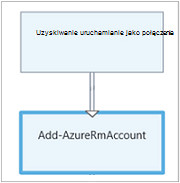

<properties
    pageTitle="Mój pierwszy działań aranżacji graficznych w automatyzacji Azure | Microsoft Azure"
    description="Samouczek, który przeprowadzi Cię przez tworzenie, testowanie i publikowanie z prostego graficzne działań aranżacji."
    services="automation"
    documentationCenter=""
    authors="mgoedtel"
    manager="jwhit"
    editor=""
    keywords="działań aranżacji, szablon działań aranżacji, automatyzacji działań aranżacji, azure działań aranżacji"/>
<tags
    ms.service="automation"
    ms.workload="tbd"
    ms.tgt_pltfrm="na"
    ms.devlang="na"
    ms.topic="get-started-article"
    ms.date="07/06/2016"
    ms.author="magoedte;bwren"/>

# <a name="my-first-graphical-runbook"></a>Mój pierwszy graficzne działań aranżacji

> [AZURE.SELECTOR] - [Graficzne](automation-first-runbook-graphical.md) - [programu PowerShell](automation-first-runbook-textual-PowerShell.md) - [Przepływu pracy programu PowerShell](automation-first-runbook-textual.md)

Ten samouczek przeprowadzi Cię przez tworzenie [działań aranżacji graficznych](automation-runbook-types.md#graphical-runbooks) w automatyzacji Azure.  Zaczniemy od prostych działań aranżacji, firma Microsoft będzie testowanie i publikowanie podczas możemy wyjaśniono, jak umożliwia śledzenie stanu zadania działań aranżacji.  Firma Microsoft będzie zmodyfikować działań aranżacji do rzeczywistego zarządzania zasobami Azure, w tym przypadku uruchamianie Azure maszyn wirtualnych.  Zostanie następnie udzielamy działań aranżacji bardziej rozbudowany przez dodanie parametrów działań aranżacji i warunkowego łącza.

## <a name="prerequisites"></a>Wymagania wstępne

Aby użyć tego samouczka, będą potrzebne następujące elementy.

-   Azure subskrypcji.  Jeśli nie masz jeszcze, możesz [uaktywnić korzyści subskrybentów usługi MSDN](https://azure.microsoft.com/pricing/member-offers/msdn-benefits-details/) lub <a href="/pricing/free-account/" target="_blank"> [utworzyć bezpłatne konto](https://azure.microsoft.com/free/).
-   [Uruchamianie jako konta na platformie azure](automation-sec-configure-azure-runas-account.md) do przechowywania działań aranżacji i identyfikację Azure zasoby.  To konto musi mieć uprawnienie do rozpoczynania i kończenia maszyny wirtualnej.
-   Azure maszyn wirtualnych.  Firma Microsoft będzie zatrzymać i uruchomić ten komputer, aby nie powinny być produkcji.


## <a name="step-1---create-new-runbook"></a>Krok 1 — Tworzenie nowych działań aranżacji

Początek przez utworzenie prostej działań aranżacji, która wyświetla tekst *Witaj świecie*.

1.  Otwórz Azure Portal konta automatyzacji.  
    Strona konta automatyzacji umożliwia szybki podgląd zasoby z tego konta.  Niektóre składniki majątku powinna już.  Większość osób to moduły, które zostaną automatycznie dołączone do nowego konta automatyzacji.  Powinny mieć również trwałego poświadczeń, który jest wymieniony w [wymagania wstępne](#prerequisites).
2.  Kliknij Kafelek **Runbooks** , aby otworzyć listę runbooks.<br> 
3.  Tworzenie nowych działań aranżacji, klikając przycisk **Dodaj działań aranżacji** , a następnie **Utwórz nowy działań aranżacji**.
4.  Nazwę działań aranżacji *MyFirstRunbook graficznego*.
5.  W tym przypadku możemy zacząć tworzenie [graficzne działań aranżacji](automation-graphical-authoring-intro.md) tak wybierz **Typ działań aranżacji** **graficznej** .<br> <br>
6.  Kliknij przycisk **Utwórz** , aby utworzyć działań aranżacji i Otwórz edytor graficzny.

## <a name="step-2---add-activities-to-the-runbook"></a>Krok 2 — Dodawanie działania do działań aranżacji

Formant biblioteki po lewej stronie edytora pozwala wybrać działania, aby dodać do swojej działań aranżacji.  Firma Microsoft zacząć dodawać **Zapisu wynik** polecenia cmdlet celu wyprowadzenia tekstu z działań aranżacji.

1.  W formancie biblioteki kliknij w polu tekstowym Wyszukaj i wpisz **Dane wyjściowe zapisu**.  Wyniki wyszukiwania będą wyświetlane poniżej. <br> 
2.  Przewiń w dół listy.  Możesz można albo **Dane wyjściowe zapisu** kliknij prawym przyciskiem myszy i wybierz opcję **Dodaj do obszaru roboczego** lub kliknij elipsa obok polecenia cmdlet i wybierz pozycję **Dodaj do obszaru roboczego**.
3.  Kliknij działanie **Dane wyjściowe zapisu** w obszarze roboczym.  Spowoduje to otwarcie karta sterowania konfiguracji, dzięki czemu można skonfigurować działanie.
4.  **Etykiety** domyślne nazwę polecenia cmdlet, ale firma Microsoft może zmienić ją na bardziej opisową. Zmień go *Pisanie Witaj świata wyjściowy*.
5.  Kliknij przycisk **Parametry** o podanie wartości parametrów polecenia cmdlet.  
    Niektóre polecenia cmdlet mieć wiele zestawów parametr, a następnie należy wybrać, które będą używane. W tym przypadku **Dane wyjściowe zapisu** ma tylko jeden zestaw parametr, więc nie musisz wybrać jedną. <br> 
6.  Wybierz parametr **InputObject** .  Jest to parametr, którym będzie określić tekst do wysłania do strumienia wyjściowego.
7.  Na liście rozwijanej **źródła danych** wybierz **wyrażenie programu PowerShell**.  Lista rozwijana **źródła danych** zawiera różnych źródeł, które umożliwia wypełnianie wartości parametru.  
    Umożliwia wyjście z tych źródeł, takich jak innej działalności, środka trwałego automatyzacji lub wyrażenie programu PowerShell.  W tym przypadku tylko potrzebne wyjściowy tekstu *Witaj świecie*. Firma Microsoft można użyć wyrażeń programu PowerShell i określić ciąg.
8.  W polu **wyrażenie** wpisz *"Witaj świecie"* , a następnie kliknij przycisk **OK** dwa razy, aby wrócić do obszaru roboczego.<br> 
9.  Zapisywanie działań aranżacji, klikając przycisk **Zapisz**.<br> 

## <a name="step-3---test-the-runbook"></a>Krok 3 — testowanie działań aranżacji

Zanim możemy opublikowanie działań aranżacji, aby udostępnić w produkcji, chcemy je przetestować, aby upewnić się, że działa poprawnie.  Podczas testowania działań aranżacji uruchomieniu jej wersję **roboczą** i wyświetlić jej wyniki interakcyjne.

1.  Kliknij pozycję **okienko Test** , aby otworzyć karta Test.<br> 
2.  Kliknij przycisk **Start** , aby rozpocząć test.  Należy to jedyna opcja włączone.
3.  Utworzono [działań aranżacji zadania](automation-runbook-execution.md) , a jego stan jest wyświetlany w okienku.  
    Stan zadania zostanie uruchomiony jako *kolejce* wskazująca oczekuje pracownika działań aranżacji w chmurze stanie się dostępna.  Następnie przejdzie do *Uruchamianie* podczas pracownikiem roszczeń zadania, a następnie *uruchomione* podczas działań aranżacji faktycznie uruchamiania.  
4.  Po zakończeniu wykonywania zadania działań aranżacji jej wyniki są wyświetlane. W naszym przypadku możemy powinna być widoczna *Witaj świecie*.<br> 
5.  Zamknij karta Test, aby powrócić do obszaru roboczego.

## <a name="step-4---publish-and-start-the-runbook"></a>Krok 4 — publikowanie i rozpoczynanie działań aranżacji

Działań aranżacji, która właśnie utworzona jest nadal w trybie Wersja robocza. Trzeba opublikować go przed w produkcji możemy go uruchomić.  Podczas publikowania działań aranżacji, możesz zastąpić istniejący opublikowana wersja wersję roboczą.  W naszym przypadku nie mamy opublikowana wersja jeszcze ponieważ możemy właśnie utworzony działań aranżacji.

1.  Kliknij przycisk **Publikuj** , aby opublikować działań aranżacji, a następnie **Tak** po wyświetleniu monitu.<br> 
2.  Wyświetlanie działań aranżacji w karta **Runbooks** przewijania lewej, będzie widoczny **Tworzenia stanu** **opublikowany**.
3.  Przewiń w prawo, aby wyświetlić karta **MyFirstRunbook**.  
    Opcje u góry zezwalają na rozpoczynanie działań aranżacji, planowanie zaczynają się od pewnego czasu w przyszłości lub tworzenie [webhook](automation-webhooks.md) , więc można uruchamiać za pośrednictwem połączenia HTTP.
4.  Firma Microsoft po prostu chcesz rozpocząć działań aranżacji tak kliknij przycisk **Start** , a następnie **Tak** po wyświetleniu monitu.<br> 
5.  Karta zadanie zostanie otwarty dla zadania działań aranżacji właśnie utworzony.  Będziemy mogli zamknąć to karta, ale w tym przypadku pozostanie go otwórz więc możemy Obejrzyj postęp zadania.
6.  Stan zadania jest wyświetlany w **Podsumowanie zadań** i dopasowanie statusy, które możemy wyświetlony przy przetestowaliśmy działań aranżacji.<br> 
7.  Gdy stan działań aranżacji pokazuje *wykonane*, kliknij **wynik**. Karta **dane wyjściowe** zostanie otwarty, a nasz *Witaj świecie* w okienku są wyświetlane.<br>   
8.  Zamknij karta dane wyjściowe.
9.  Kliknij pozycję **Wszystkie dzienniki** , aby otworzyć karta strumienie działań aranżacji zadania.  Firma Microsoft tylko powinna być widoczna *Witaj świecie* w strumieniu dane wyjściowe, ale to można wyświetlić inne strumienie dla zadania działań aranżacji, takich jak pełne i błędów, jeśli działań aranżacji zapisuje je.<br> 
10. Zamknij wszystkie dzienniki karta i karta zadanie, aby powrócić do karta MyFirstRunbook.
11. Kliknij pozycję **zadania** , aby otworzyć karta zadań dla tego działań aranżacji.  Ta lista zawiera wszystkie zadania utworzone przez ten działań aranżacji. Widzimy należy tylko jednego zadania, ponieważ tylko zostało zadania raz na liście.<br> 
12. Kliknięcie w tym zadaniu, aby otworzyć okienko zadań samej możemy wyświetlany podczas uruchamiania możemy działań aranżacji.  Pozwala przejść wstecz w czasie i służy do wyświetlania szczegółów każde zadanie, które zostało utworzone dla określonego działań aranżacji.

## <a name="step-5---create-variable-assets"></a>Krok 5 — Tworzenie zmiennych składników majątku

Firma Microsoft zostały przetestowane i opublikowany naszych działań aranżacji, ale pory go nic nie robi przydatne. Chcemy go zarządzania zasobami Azure.  Przed możemy skonfigurować działań aranżacji do uwierzytelnienia, zostanie utworzony zmiennej do przechowywania identyfikator subskrypcji i odwoływać po możemy konfiguracji aktywności do uwierzytelnienia w kroku 6 poniżej.  Odwołanie do kontekstu subskrypcji w tym pozwala na łatwe współpraca między wiele subskrypcji.  Przed kontynuowaniem, skopiuj identyfikator subskrypcji z opcją subskrypcje poza okienka nawigacji.  

1. W karta konta automatyzacji kliknij na kafelku **składniki majątku** i karta **aktywów** zostanie otwarty.
2. W karta Zasoby kliknij na kafelku **zmiennych** .
3. Wybierz polecenie **Dodaj zmiennej**z karta zmiennych.<br>
4. W nowej karta zmiennych, w polu **Nazwa** wprowadź **AzureSubscriptionId** i w polu **wartość** wprowadź identyfikatora subskrypcji  Zachowaj *ciąg* **typu** oraz wartość domyślna **szyfrowania**.  
5. Kliknij przycisk **Utwórz** , aby utworzyć zmiennej.  


## <a name="step-6---add-authentication-to-manage-azure-resources"></a>Krok 6 — Dodawanie uwierzytelniania do zarządzania zasobami Azure

Teraz gdy mamy już zmiennej do przechowania naszych identyfikator subskrypcji, możemy skonfigurować naszych działań aranżacji do uwierzytelnienia przy użyciu poświadczeń Uruchom jako określone w [wymagania wstępne](#prerequisites).  Firma Microsoft to zrobić, dodając Azure Uruchom jako połączenia **aktywa** i **Dodaj AzureRMAccount** polecenia cmdlet do obszaru roboczego.  

1.  Otwórz edytor graficzny, klikając pozycję **Edytuj** karta MyFirstRunbook.<br> 
2.  Firma Microsoft nie **Pisanie Witaj świata wyjściowy** są już potrzebne, więc kliknij prawym przyciskiem myszy go i wybierz polecenie **Usuń**.
3.  W formancie biblioteki rozwiń **połączenia** i dodać **AzureRunAsConnection** do obszaru roboczego, wybierając pozycję **Dodaj do obszaru roboczego**.
4.  W obszarze roboczym zaznacz **AzureRunAsConnection** , a w Panelu sterowania konfiguracji wpisz **Uzyskiwanie uruchamianie jako połączenia** w polu tekstowym **Etykieta** .  Jest to połączenie 
5.  W formancie biblioteki wpisz **Dodaj AzureRmAccount** w polu tekstowym wyszukiwania.
6.  Dodaj **AzureRmAccount Dodaj** do obszaru roboczego.<br> 
7.  Umieść wskaźnik myszy na **Uzyskiwanie uruchamianie jako połączenia** do momentu wyświetlenia koła w dolnej części kształtu. Kliknij koło, a następnie przeciągnij strzałkę, aby **AzureRmAccount Dodaj**.  Strzałka, która została właśnie utworzona jest *łącze*.  Działań aranżacji będzie rozpoczynać się **Uzyskać uruchamianie jako połączenia** , a następnie uruchom **AzureRmAccount Dodaj**.<br> 
8.  W obszarze roboczym wybierz pozycję **Dodaj AzureRmAccount** i w konfiguracji kontrolowanie okienka typu **logowania Azure** w polu tekstowym **Etykieta** .
9.  Kliknij przycisk **Parametry** i konfiguracja parametru czynności, zostanie wyświetlona karta. 
10.  **Dodaj AzureRmAccount** ma wiele zestawów parametr, więc należy wybrać jedną przed firma Microsoft udostępnia wartości parametrów.  Kliknij przycisk **Ustaw parametr** , a następnie wybierz zestaw parametrów **ServicePrincipalCertificate** . 
11.  Po wybraniu zestaw parametrów parametry są wyświetlane w Karta Konfiguracja parametru czynności.  Kliknij **Identyfikator aplikacji**.<br> 
12.  W karta wartości parametru zaznacz **wynik działania** dla **źródła danych** i wybierz **Uzyskiwanie uruchamianie jako połączenie** z listy, w polu Typ pola tekstowego **ścieżka pola** **Identyfikator aplikacji**, a następnie kliknij **przycisk OK**.  Firma Microsoft są określający nazwę właściwości ścieżki pól, ponieważ działanie wyświetla obiekt z wielu właściwości.
13.  Kliknij pozycję **CERTIFICATETHUMBPRINT**, a w karta wartości parametru wybierz **wynik działania** dla **źródła danych**.  Wybierz **Uzyskiwanie uruchamianie jako połączenie** z listy, w polu Typ pola tekstowego **ścieżka pole** **CertificateThumbprint**, a następnie kliknij **przycisk OK**. 
14.  Kliknij **SERVICEPRINCIPAL**i w karta wartości parametru wybierz **ConstantValue** dla **źródła danych**, kliknij opcję **wartość PRAWDA**, a następnie kliknij **przycisk OK**.
15.  Kliknij pozycję **TENANTID**, a w karta wartości parametru wybierz **wynik działania** dla **źródła danych**.  Wybierz **Uzyskiwanie uruchamianie jako połączenie** z listy, w polu Typ pola tekstowego **ścieżka pola** **TenantId**i kliknij przycisk **OK** .  
16.  W formancie biblioteki wpisz **AzureRmContext zestawu** w polu tekstowym wyszukiwania.
17.  Dodawanie **Zestawu AzureRmContext** do obszaru roboczego.
18.  W obszarze roboczym wybierz **Zestaw AzureRmContext** , a w konfiguracji kontrolowanie okienka typu **Określ identyfikator subskrypcji** w polu tekstowym **Etykieta** .
19.  Kliknij przycisk **Parametry** i konfiguracja parametru czynności, zostanie wyświetlona karta. 
20. **Ustawianie AzureRmContext** ma wiele zestawów parametrów, więc należy wybrać jedną przed firma Microsoft udostępnia wartości parametrów.  Kliknij przycisk **Ustaw parametr** , a następnie wybierz zestaw parametrów **SubscriptionId** .  
21.  Po wybraniu zestaw parametrów parametry są wyświetlane w Karta Konfiguracja parametru czynności.  Kliknij przycisk **SubscriptionID**
22.  W karta wartości parametru wybierz **Trwały zmiennych** dla **źródła danych** i wybierz z listy **AzureSubscriptionId** i kliknij przycisk **OK** .   
23.  Umieść wskaźnik myszy na **logujesz się do Azure** aż okręgu pojawi się w dolnej części kształtu. Kliknij koło, a następnie przeciągnij strzałkę, aby **Określić identyfikator subskrypcji**.


Do działań aranżacji powinna wyglądać podobnie do następujących czynności w tym momencie: <br>

## <a name="step-7---add-activity-to-start-a-virtual-machine"></a>Krok 7 — Dodaj działanie, aby rozpocząć maszyny wirtualnej

Teraz dodamy działaniem **Start AzureRmVM** do uruchomienia maszyny wirtualnej.  Może to być obecna maszyn wirtualnych w ramach subskrypcji Azure, a teraz będziemy hardcoding o nazwie do polecenia cmdlet.

1. W formancie biblioteki wpisz **Start AzureRm** w polu tekstowym wyszukiwania.
2. Dodawanie **Start AzureRmVM** do obszaru roboczego, a następnie kliknij i przeciągnij go pod **Określ identyfikator subskrypcji**.
3. Umieść wskaźnik myszy na **Określ identyfikator subskrypcji** do momentu wyświetlenia koła w dolnej części kształtu.  Kliknij koło, a następnie przeciągnij strzałkę, aby **Start AzureRmVM**. 
4.  Wybierz pozycję **Rozpocznij AzureRmVM**.  Kliknij przycisk **Parametry** , a następnie **Ustaw parametr** Aby wyświetlić zestawy **Start AzureRmVM**.  Wybierz polecenie Ustaw parametr **ResourceGroupNameParameterSetName** . Należy pamiętać, że **ResourceGroupName** i **nazwę** program punktów wykrzyknika dalej je.  Oznacza to, że są one wymagane parametry.  Pamiętaj również, że oba oczekiwać wartości ciągu.
5.  Wybierz **nazwę**.  Wybierz **wyrażenie programu PowerShell** dla **źródła danych** i wpisz nazwę maszyny wirtualnej ujęty w cudzysłów, które możemy zaczyna się od tej działań aranżacji.  Kliknij **przycisk OK**.<br>
6.  Wybierz pozycję **ResourceGroupName**. Użyj **wyrażenia programu PowerShell** dla **źródła danych** i wpisz nazwę grupy zasobów ujęty w podwójny cudzysłów.  Kliknij **przycisk OK**.<br> 
8.  Kliknij polecenie Okienko Test, czego można sprawdzać, czy działań aranżacji.
9.  Kliknij przycisk **Start** , aby rozpocząć test.  Po zakończeniu instalacji sprawdź uruchomienia maszyny wirtualnej.

Do działań aranżacji powinna wyglądać podobnie do następujących czynności w tym momencie: <br>

## <a name="step-8---add-additional-input-parameters-to-the-runbook"></a>Krok 8 — Dodawanie dodatkowych parametrów wejściowych do działań aranżacji

Nasze działań aranżacji obecnie uruchamia maszyny wirtualnej w grupie zasobów, wymienionym w polecenia cmdlet **Start AzureRmVM** , ale naszych działań aranżacji będzie bardziej przydatne, jeśli firma Microsoft może zarówno określić po uruchomieniu działań aranżacji.  Firma Microsoft będzie dodanie parametrów wejściowych do działań aranżacji umożliwiają korzystanie z tej funkcji.

1. Otwórz edytor graficzny, klikając pozycję **Edytuj** w okienku **MyFirstRunbook** .
2. Kliknij pozycję **dane wejściowe i wyjściowe** , a następnie **dodać wprowadzania** aby otworzyć okienko działań aranżacji parametru wejściowego.<br> 
3. Określ **nazwę** *VMName* .  Zachowaj *ciąg* dla danego **typu**, ale zmienić **obowiązkowe** na wartość *Tak*.  Kliknij **przycisk OK**.
4. Utwórz drugą obowiązkowe parametru wejściowego o nazwie *ResourceGroupName* , a następnie kliknij **przycisk OK** , aby zamknąć okienko **dane wejściowe i wyjściowe** .<br> 
5. Wybierz opcję aktywności **Start AzureRmVM** , a następnie kliknij przycisk **Parametry**.
6. Zmienianie **źródła danych** dla **nazwy** **działań aranżacji** danych wejściowych, a następnie wybierz pozycję **VMName**.<br>
7. Zmienianie **źródła danych** dla **ResourceGroupName** **działań aranżacji** danych wejściowych, a następnie wybierz pozycję **ResourceGroupName**.<br> 
8. Zapisz działań aranżacji i otwórz okienko Test.  Należy zauważyć, że można teraz podać wartości dla dwóch zmiennych wprowadzania danych, które zostanie użyte w teście.
9. Zamknij okienko Test.
10. Kliknij przycisk **Publikuj** Publikowanie nowej wersji zestawu działań aranżacji.
11. Zatrzymywanie maszyny wirtualnej, który został uruchomiony w poprzednim kroku.
12. Kliknij przycisk **Start** , aby rozpocząć działań aranżacji.  Wpisz **VMName** i **ResourceGroupName** dla maszyny wirtualnej, który zamierzasz uruchomić.<br> 
13. Po zakończeniu działań aranżacji Sprawdź uruchomienia maszyny wirtualnej.

## <a name="step-9---create-a-conditional-link"></a>Krok 9 — Tworzenie łącza warunkowe

Firma Microsoft będzie teraz zmodyfikować działań aranżacji tak, aby tylko spróbuje uruchamiania maszyny wirtualnej, jeśli nie jest już uruchomiony.  Firma Microsoft będzie to zrobić, dodając polecenia cmdlet **Get-AzureRmVM** do działań aranżacji, które otrzymają stan poziomu wystąpienia maszyny wirtualnej. Następnie dodamy moduł kodu programu PowerShell przepływu pracy o nazwie **Get Status** wstawkę kodu programu PowerShell w celu ustalenia, czy stan maszyny wirtualnej jest uruchomiona, czy zatrzymana.  Łącze warunkowe w module **Get Status** działa tylko **Start AzureRmVM** po zatrzymaniu bieżący stan działania.  Ponadto firma Microsoft będzie wyjściowy wiadomość w celu poinformowania Jeśli maszyn wirtualnych została pomyślnie uruchomiona lub nie przy użyciu polecenia cmdlet programu PowerShell zapisu-wyników.

1. Otwórz **MyFirstRunbook** w edytorze graficznego.
2. Usuwanie łącza między **Określ identyfikator subskrypcji** i **Start AzureRmVM** , klikając go i naciskając klawisz *Delete* .
3. W formancie biblioteki wpisz **Get-AzureRm** w polu tekstowym wyszukiwania.
4. Dodawanie **Get-AzureRmVM** do obszaru roboczego.
5. Wybierz pozycję **Get-AzureRmVM** , a następnie **Ustaw parametr** Aby wyświetlić zestawy **Get-AzureRmVM**.  Wybierz polecenie Ustaw parametr **GetVirtualMachineInResourceGroupNameParamSet** .  Należy pamiętać, że **ResourceGroupName** i **nazwę** program punktów wykrzyknika dalej je.  Oznacza to, że są one wymagane parametry.  Pamiętaj również, że oba oczekiwać wartości ciągu.
6. W obszarze **źródło danych** dla **nazwy**wybierz **działań aranżacji wprowadzania** , a następnie pozycję **VMName**.  Kliknij **przycisk OK**.
7. W obszarze **źródło danych** dla **ResourceGroupName**wybierz **działań aranżacji wprowadzania** , a następnie wybierz **ResourceGroupName**.  Kliknij **przycisk OK**.
8. W obszarze **źródło danych** dla **stanu**wybierz **wartość stałej** , a następnie kliknij polecenie **wartość PRAWDA**.  Kliknij **przycisk OK**.  
9. Tworzenie łącza z **Określ identyfikator subskrypcji** do **Get-AzureRmVM**.
10. W formancie biblioteki **Działań aranżacji formant** rozwijania i dodawanie **kodu** do obszaru roboczego.  
11. Tworzenie łącza z **Get-AzureRmVM** do **kodu**.  
12. Kliknij pozycję **Kod** , a następnie w okienku Konfiguracja Zmienianie etykiety do **Get Status**.
13. Wybierz parametr **Kod** i karta **Edytor kodu** pojawi się.  
14. W edytorze kodu Wklej poniższy fragment kodu:

     ```
     $StatusesJson = $ActivityOutput['Get-AzureRmVM'].StatusesText 
     $Statuses = ConvertFrom-Json $StatusesJson 
     $StatusOut ="" 
     foreach ($Status in $Statuses){ 
     if($Status.Code -eq "Powerstate/running"){$StatusOut = "running"} 
     elseif ($Status.Code -eq "Powerstate/deallocated") {$StatusOut = "stopped"} 
     } 
     $StatusOut 
     ```

15. Tworzenie łącza z **Get Status** do **Rozpoczęcia AzureRmVM**.<br>   
16. Zaznacz łącze, a następnie w okienku konfiguracja zmienianie **warunku Zastosuj** na wartość **Tak**.   Uwaga łącze zmieni się linii kreskowanej wskazująca, że działania celu będą uruchamiane tylko jeśli warunek jest rozpoznawana jako true.  
17. **Wyrażenie warunkowe**wpisz *$ActivityOutput ["Pobierz stan"] - eq "Zatrzymania"*.  **Rozpocznij AzureRmVM** obecnie działa tylko po zatrzymaniu maszyny wirtualnej.
18. W formancie biblioteki rozwiń **polecenia cmdlet** , a następnie **Microsoft.PowerShell.Utility**.
19. Dodaj **Dane wyjściowe zapisu** do obszaru roboczego dwa razy.<br> 
20. Na pierwszej kontrolce **Dane wyjściowe zapisu** kliknij przycisk **Parametry** i zmień wartość **etykiety** *Powiadom*pracę maszyn wirtualnych.
21. Dla **InputObject**zmienić **źródła danych** do **wyrażeń programu PowerShell** i wpisz wyrażenie *"$VMName pomyślnie uruchomiona."*.
22. Na drugi formant **Dane wyjściowe zapisu** kliknij przycisk **Parametry** i zmień wartość **etykiety** na *Powiadom maszyn wirtualnych rozpocząć Failed*
23. Dla **InputObject**zmienić **źródła danych** do **wyrażeń programu PowerShell** i wpisz wyrażenie *"$VMName nie można uruchomić."*.
24. Utworzyć łącze z **Start AzureRmVM** **Powiadom pracę maszyn wirtualnych** i **Powiadom maszyn wirtualnych rozpocząć Failed**.
25. Zaznacz łącze, aby **Powiadomić pracę maszyn wirtualnych** i zmień **warunek Zastosuj** **wartość PRAWDA**.
26. **Wyrażenie warunkowe**wpisz *$ActivityOutput ["AzureRmVM Start"]. IsSuccessStatusCode - eq $true*.  Tego formantu dane wyjściowe zapisu obecnie działa tylko po pomyślnym uruchomieniu maszyny wirtualnej.
27. Zaznacz łącze, aby **Powiadomić maszyn wirtualnych rozpocząć Failed** i zmień **warunek Zastosuj** **wartość PRAWDA**.
28. **Wyrażenie warunkowe**wpisz *$ActivityOutput ["AzureRmVM Start"]. IsSuccessStatusCode — No $true*.  Tego formantu dane wyjściowe zapisu obecnie działa tylko jeśli maszyny wirtualnej nie zostanie pomyślnie uruchomiona.
29. Zapisz działań aranżacji i otwórz okienko Test.
30. Rozpoczynanie działań aranżacji z maszyny wirtualnej zatrzymane, a nazwa powinna rozpoczynać się.

## <a name="next-steps"></a>Następne kroki

-   Aby dowiedzieć się więcej na temat tworzenia graficznych, zobacz [Tworzenie graficznej w automatyzacji Azure](automation-graphical-authoring-intro.md)
-   Aby rozpocząć pracę z runbooks programu PowerShell, zobacz [Moje pierwszego działań aranżacji programu PowerShell](automation-first-runbook-textual-powershell.md)
-   Aby rozpocząć pracę z runbooks przepływu pracy programu PowerShell, zobacz [Moje pierwszego działań aranżacji przepływu pracy programu PowerShell](automation-first-runbook-textual.md)
