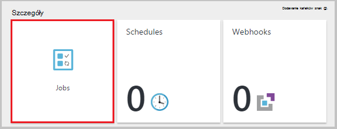

<properties
    pageTitle="Mój pierwszy działań aranżacji programu PowerShell w automatyzacji Azure | Microsoft Azure"
    description="Samouczek, który przeprowadzi Cię przez tworzenie, testowanie i publikowanie z prostych działań aranżacji programu PowerShell."
    services="automation"
    documentationCenter=""
    authors="mgoedtel"
    manager="jwhit"
    editor=""
    keywords="Azure programu powershell, samouczek skrypt programu powershell, automatyzacji programu powershell"/>
<tags
    ms.service="automation"
    ms.workload="tbd"
    ms.tgt_pltfrm="na"
    ms.devlang="na"
    ms.topic="get-started-article"
    ms.date="07/19/2016"
    ms.author="magoedte;sngun"/>

# <a name="my-first-powershell-runbook"></a>Mój pierwszy działań aranżacji programu PowerShell

> [AZURE.SELECTOR] - [Graficzne](automation-first-runbook-graphical.md) - [programu PowerShell](automation-first-runbook-textual-PowerShell.md) - [Przepływu pracy programu PowerShell](automation-first-runbook-textual.md)  

Ten samouczek przeprowadzi Cię przez tworzenie [działań aranżacji programu PowerShell](automation-runbook-types.md#powershell-runbooks) w automatyzacji Azure. Zaczniemy od prostych działań aranżacji, firma Microsoft będzie testowanie i publikowanie podczas możemy wyjaśniono, jak umożliwia śledzenie stanu zadania działań aranżacji. Firma Microsoft będzie zmodyfikować działań aranżacji do rzeczywistego zarządzania zasobami Azure, w tym przypadku uruchamianie Azure maszyn wirtualnych. Zostanie następnie udzielamy działań aranżacji bardziej rozbudowany przez dodanie parametrów działań aranżacji.

## <a name="prerequisites"></a>Wymagania wstępne

Aby użyć tego samouczka, będą potrzebne następujące elementy.

-   Azure subskrypcji. Jeśli nie masz jeszcze, możesz [uaktywnić korzyści subskrybentów usługi MSDN](https://azure.microsoft.com/pricing/member-offers/msdn-benefits-details/) lub <a href="/pricing/free-account/" target="_blank"> [utworzyć bezpłatne konto](https://azure.microsoft.com/free/).
-   [Konto automatyzacji](automation-security-overview.md) do przechowywania działań aranżacji i identyfikację Azure zasoby.  To konto musi mieć uprawnienie do rozpoczynania i kończenia maszyny wirtualnej.
-   Azure maszyn wirtualnych. Firma Microsoft będzie zatrzymać i uruchomić ten komputer, aby nie powinny być produkcji.

## <a name="step-1---create-new-runbook"></a>Krok 1 — Tworzenie nowych działań aranżacji

Początek przez utworzenie prostej działań aranżacji, która wyświetla tekst *Witaj świecie*.

1.  Otwórz Azure Portal konta automatyzacji.  
    Strona konta automatyzacji umożliwia szybki podgląd zasoby z tego konta. Niektóre składniki majątku powinna już. Większość osób to moduły, które zostaną automatycznie dołączone do nowego konta automatyzacji. Powinny mieć również trwałego poświadczeń, który jest wymieniony w [wymagania wstępne](#prerequisites).
2.  Kliknij Kafelek **Runbooks** , aby otworzyć listę runbooks.  
      
3.  Tworzenie nowych działań aranżacji, klikając przycisk **Dodaj działań aranżacji** , a następnie **Utwórz nowy działań aranżacji**.
4.  Nazwę działań aranżacji *Programu PowerShell MyFirstRunbook*.
5.  W tym przypadku ma, możemy utworzyć [działań aranżacji programu PowerShell](automation-runbook-types.md#powershell-runbooks) tak wybierz **Typ działań aranżacji** **programu Powershell** .  
      
6.  Kliknij przycisk **Utwórz** , aby utworzyć działań aranżacji i Otwórz edytor tekstowy.

## <a name="step-2---add-code-to-the-runbook"></a>Krok 2 — Dodawanie kodu do działań aranżacji

Można albo kod typu bezpośrednio do działań aranżacji lub można wybrać polecenia cmdlet, runbooks i zasoby z kontrolki biblioteki i dodać je do działań aranżacji wszystkie powiązane parametry. W tym instruktażu firma Microsoft będzie wpisz bezpośrednio do działań aranżacji.

1.  Nasze działań aranżacji jest obecnie pusty typ *dane wyjściowe zapisu "Witaj świecie."*.  
      
2.  Zapisywanie działań aranżacji, klikając przycisk **Zapisz**.  
      

## <a name="step-3---test-the-runbook"></a>Krok 3 — testowanie działań aranżacji

Zanim możemy opublikowanie działań aranżacji, aby udostępnić w produkcji, chcemy je przetestować, aby upewnić się, że działa poprawnie. Podczas testowania działań aranżacji uruchomieniu jej wersję **roboczą** i wyświetlić jej wyniki interakcyjne.

1.  Kliknij pozycję **okienko Test** , aby otworzyć okienko Test.  
      
2.  Kliknij przycisk **Start** , aby rozpocząć test. Należy to jedyna opcja włączone.
3.  Utworzono [zadanie działań aranżacji](automation-runbook-execution.md) i wyświetlony stan.  
    Stan zadania zostanie uruchomiony jako *kolejce* wskazująca oczekuje dla pracownika działań aranżacji wkrótce nowe funkcje dostępne w chmurze. Następnie przejdzie do *Uruchamianie* podczas pracownikiem roszczeń zadania, a następnie *uruchomione* podczas działań aranżacji faktycznie uruchamiania.  
4.  Po zakończeniu wykonywania zadania działań aranżacji jej wyniki są wyświetlane. W naszym przypadku możemy powinna być widoczna *Witaj świecie*  
      
5.  Zamykanie okienka Test, aby wrócić do obszaru roboczego.

## <a name="step-4---publish-and-start-the-runbook"></a>Krok 4 — publikowanie i rozpoczynanie działań aranżacji

Działań aranżacji, która właśnie utworzona jest nadal w trybie Wersja robocza. Trzeba opublikować go przed w produkcji możemy go uruchomić. Podczas publikowania działań aranżacji, możesz zastąpić istniejący opublikowana wersja wersję roboczą. W naszym przypadku nie mamy opublikowana wersja jeszcze ponieważ możemy właśnie utworzony działań aranżacji.

1.  Kliknij przycisk **Publikuj** , aby opublikować działań aranżacji, a następnie **Tak** po wyświetleniu monitu.  
      
2.  Przewijaniu lewej wyświetlanie działań aranżacji w okienku **Runbooks** teraz, będzie widoczny **Do tworzenia stanu** **opublikowany**.
3.  Przewiń w prawo, aby wyświetlić okienko dla **Programu PowerShell MyFirstRunbook**.  
    Opcje u góry zezwalają na rozpoczynanie działań aranżacji, wyświetlanie działań aranżacji, planowanie zaczynają się od pewnego czasu w przyszłości lub tworzenie [webhook](automation-webhooks.md) , więc można uruchamiać za pośrednictwem połączenia HTTP.
4.  Firma Microsoft po prostu chcesz rozpocząć działań aranżacji tak kliknij przycisk **Start** , a następnie kliknij przycisk **Ok** po otwarciu karta Rozpoczynanie działań aranżacji.  
      
5.  Okienko zadań zostanie otwarty dla zadania działań aranżacji właśnie utworzony. Będziemy mogli zamknąć w tym okienku, ale w tym przypadku pozostanie go otwórz więc możemy Obejrzyj postęp zadania.
6.  Stan zadania jest wyświetlany w **Podsumowanie zadań** i dopasowanie statusy, które możemy wyświetlony przy przetestowaliśmy działań aranżacji.  
      
7.  Gdy stan działań aranżacji pokazuje *wykonane*, kliknij **wynik**. Zostanie otwarty w okienku dane wyjściowe i widać naszych *Witaj świecie*.  
    
8.  Zamknij okienko dane wyjściowe.
9.  Kliknij pozycję **Wszystkie dzienniki** , aby otworzyć okienko strumienie działań aranżacji zadania. Firma Microsoft tylko powinna być widoczna *Witaj świecie* w strumieniu dane wyjściowe, ale to można wyświetlić inne strumienie dla zadania działań aranżacji, takich jak pełne i błędów, jeśli działań aranżacji zapisuje je.  
      
10. Zamknij okienko strumieni i okienko zadań, aby wrócić do okienka programu PowerShell MyFirstRunbook.
11. Kliknij pozycję **zadania** , aby otworzyć okienko zadań dla tego działań aranżacji. Ta lista zawiera wszystkie zadania utworzone przez ten działań aranżacji. Widzimy należy tylko jednego zadania, ponieważ tylko zostało zadania raz na liście.  
      
12. Kliknięcie w tym zadaniu, aby otworzyć okienko zadań samej możemy wyświetlany podczas uruchamiania możemy działań aranżacji. Pozwala przejść wstecz w czasie i służy do wyświetlania szczegółów każde zadanie, które zostało utworzone dla określonego działań aranżacji.

## <a name="step-5---add-authentication-to-manage-azure-resources"></a>Krok 5 — Dodawanie uwierzytelniania do zarządzania zasobami Azure

Firma Microsoft zostały przetestowane i opublikowany naszych działań aranżacji, ale pory go nic nie robi przydatne. Chcemy go zarządzania zasobami Azure. Nie będzie można to zrobić, jeśli chyba że mamy uwierzytelnienia przy użyciu poświadczeń, które są określane w [wymagania wstępne](#prerequisites). Firma Microsoft to zrobić przy użyciu polecenia cmdlet **AzureRmAccount Dodaj** .

1.  Otwórz edytor tekstowy, klikając pozycję **Edytuj** w okienku programu PowerShell MyFirstRunbook.  
      
2.  Firma Microsoft nie wiersza **Danych wyjściowych zapisu** są już potrzebne, dlatego wtyczce i usuń go.
3.  Wpisz lub skopiuj i wklej następujący kod, który będzie obsługi uwierzytelniania za pomocą konta automatyzacji Uruchom jako:

    ```
     $Conn = Get-AutomationConnection -Name AzureRunAsConnection 
     Add-AzureRMAccount -ServicePrincipal -Tenant $Conn.TenantID `
     -ApplicationId $Conn.ApplicationID -CertificateThumbprint $Conn.CertificateThumbprint
    ``` 
<br>
4.  Kliknij polecenie **Testowanie okienko** , czego można sprawdzać, czy działań aranżacji.
5.  Kliknij przycisk **Start** , aby rozpocząć test. Po zakończeniu instalacji powinien otrzymać dane wyjściowe podobne do następujących, w którym są wyświetlane podstawowe informacje z Twojego konta. Jest to potwierdzenie, że poświadczenie jest prawidłowe. <br> 

## <a name="step-6---add-code-to-start-a-virtual-machine"></a>Krok 6 — Dodawanie kodu do uruchomienia maszyny wirtualnej

Teraz, gdy naszych działań aranżacji uwierzytelnia do naszych Azure subskrypcji, możemy zarządzanie zasobami. Będziemy dodawać polecenia do uruchamiania maszyny wirtualnej. Może to być obecna maszyn wirtualnych w ramach subskrypcji Azure, a teraz będziemy hardcoding o nazwie do polecenia cmdlet.

1.  Po *AzureRmAccount Dodaj*, wpisz *Start AzureRmVM-nazwa "VMName" - ResourceGroupName "NameofResourceGroup"* podanie nazwy i nazwę grupy zasobów maszyny wirtualnej, aby rozpocząć.  
    
    ```
     $Conn = Get-AutomationConnection -Name AzureRunAsConnection 
     Add-AzureRMAccount -ServicePrincipal -Tenant $Conn.TenantID `
     -ApplicationID $Conn.ApplicationID -CertificateThumbprint $Conn.CertificateThumbprint 
     Start-AzureRmVM -Name 'VMName' -ResourceGroupName 'ResourceGroupName'
     ```
<br>
2.  Zapisywanie działań aranżacji, a następnie kliknij pozycję **Testowanie okienko** tak, aby można sprawdzać, czy go.
3.  Kliknij przycisk **Start** , aby rozpocząć test. Po zakończeniu instalacji sprawdź uruchomienia maszyny wirtualnej.

## <a name="step-7---add-an-input-parameter-to-the-runbook"></a>Krok 7 — Dodawanie parametru wejściowego do działań aranżacji

Nasze działań aranżacji obecnie zaczyna się wirtualnego komputera tego możemy ustalony w działań aranżacji, ale będzie bardziej użyteczna Jeśli firma Microsoft może określić maszyny wirtualnej po uruchomieniu działań aranżacji. Firma Microsoft będzie dodanie parametrów wejściowych do działań aranżacji umożliwiają korzystanie z tej funkcji.

1.  Dodawanie parametrów *VMName* i *ResourceGroupName* do działań aranżacji i zmienne za pomocą polecenia cmdlet **Start AzureRmVM** , tak jak w poniższym przykładzie.  
    
    ```
    Param(
       [string]$VMName,
       [string]$ResourceGroupName
    )
     $Conn = Get-AutomationConnection -Name AzureRunAsConnection 
     Add-AzureRMAccount -ServicePrincipal -Tenant $Conn.TenantID `
     -ApplicationID $Conn.ApplicationID -CertificateThumbprint $Conn.CertificateThumbprint 
     Start-AzureRmVM -Name $VMName -ResourceGroupName $ResourceGroupName
     ```
<br> 
2.  Zapisz działań aranżacji i otwórz okienko Test. Należy zauważyć, że można teraz podać wartości dla dwóch zmiennych wprowadzania danych, które zostanie użyte w teście.
3.  Zamknij okienko Test.
4.  Kliknij przycisk **Publikuj** , aby opublikować nową wersję zestawu działań aranżacji.
5.  Zatrzymywanie maszyny wirtualnej, który został uruchomiony w poprzednim kroku.
6.  Kliknij przycisk **Start** , aby rozpocząć działań aranżacji. Wpisz **VMName** i **ResourceGroupName** dla maszyny wirtualnej, który zamierzasz uruchomić.  
      
7.  Po zakończeniu działań aranżacji Sprawdź uruchomienia maszyny wirtualnej.

## <a name="differences-from-powershell-workflow"></a>Różnice w stosunku do przepływu pracy programu PowerShell

Runbooks programu PowerShell mieć takie same cyklu życia, możliwości i zarządzanie runbooks przepływu pracy programu PowerShell, ale istnieją pewne różnice i ograniczenia:

1.  Runbooks programu PowerShell Szybkie uruchamianie porównaniu do przepływu pracy programu PowerShell runbooks nie mają kroku kompilacji.
2.  Przepływ pracy programu PowerShell runbooks obsługi punktów kontrolnych, przy użyciu punktów kontrolnych, wznowić runbooks przepływu pracy programu PowerShell z dowolnego miejsca działań aranżacji należy runbooks programu PowerShell tylko wznowić od początku.
3.  Runbooks przepływu pracy programu PowerShell obsługuje wykonanie szeregowych i równoległych, należy runbooks programu PowerShell tylko może wykonać polecenia pojedynczo.
4.  Działań aranżacji przepływu pracy programu PowerShell działanie, polecenia lub blok skryptu mogą mieć własne działania konieczne w działań aranżacji programu PowerShell, wszystkie elementy skrypt jest uruchamiany w jednym działania. Istnieją również pewne [składni różnice](https://technet.microsoft.com/magazine/dn151046.aspx) między natywnych działań aranżacji programu PowerShell i działań aranżacji przepływu pracy programu PowerShell.

## <a name="next-steps"></a>Następne kroki

-   Aby rozpocząć pracę z runbooks graficznych, zobacz [Moje pierwszego graficzne działań aranżacji](automation-first-runbook-graphical.md)
-   Aby rozpocząć pracę z runbooks przepływu pracy programu PowerShell, zobacz [Moje pierwszego działań aranżacji przepływu pracy programu PowerShell](automation-first-runbook-textual.md)
-   Aby dowiedzieć się więcej na temat typów działań aranżacji, ich zalet i ograniczeń, zobacz [Typy działań aranżacji automatyzacji Azure](automation-runbook-types.md)
-   Aby uzyskać więcej informacji na temat skrypt programu PowerShell obsługi funkcji, zobacz [skrypt PowerShell natywnych pomocy technicznej w automatyzacji Azure](https://azure.microsoft.com/blog/announcing-powershell-script-support-azure-automation-2/)
