<properties 
    pageTitle="Do tworzenia graficznych w Azure automatyzacji | Microsoft Azure"
    description="Do tworzenia graficznych pozwala na tworzenie runbooks automatyzacji Azure bez pracy z kodem. Ten artykuł zawiera wprowadzenie do tworzenia graficznych i wszystkie szczegóły, aby rozpocząć tworzenie graficzne działań aranżacji."
    services="automation"   
    documentationCenter=""
    authors="mgoedtel"
    manager="jwhit"
    editor="tysonn" />
<tags 
    ms.service="automation"
    ms.devlang="na"
    ms.topic="article"
    ms.tgt_pltfrm="na"
    ms.workload="infrastructure-services"
    ms.date="06/03/2016"
    ms.author="magoedte;bwren" />

# Graficzne, tworzenia w automatyzacji Azure

## Wprowadzenie

Narzędzia do tworzenia graficznych umożliwia tworzenie runbooks automatyzacji Azure bez złożoności źródłowych kodu programu Windows PowerShell lub przepływu pracy programu PowerShell. Dodawanie działania do obszaru roboczego z biblioteki poleceń cmdlet i runbooks, łączyć ze sobą i konfigurowanie do tworzenia przepływu pracy.  Jeśli kiedykolwiek mają doświadczenia w systemie Centrum Orchestrator lub automatyzacji Management Service (SMA), następnie to powinna wyglądać znane.   

Ten artykuł zawiera wprowadzenie do tworzenia graficznych i pojęcia, że musisz rozpocząć tworzenie graficzne działań aranżacji.

## Graficzne runbooks

Wszystkie runbooks w automatyzacji Azure są przepływy pracy programu Windows PowerShell.  Runbooks graficznej i graficzne przepływu pracy programu PowerShell generowanie kodu programu PowerShell, uruchamianego przez pracowników automatyzacji, ale nie będą mogli go wyświetlić lub zmodyfikować bezpośrednio.  Graficzne działań aranżacji można konwertować działań aranżacji graficzne programu PowerShell przepływu pracy i odwrotnie, ale nie mogą one zostać przekonwertowane tekstowy działań aranżacji. Istniejące działań aranżacji tekstowych nie można importować do edytora graficznego.  

## Omówienie edytora graficznego

Możesz otworzyć edytor graficzny w portalu Azure przez tworzenie lub edytowanie graficzne działań aranżacji.

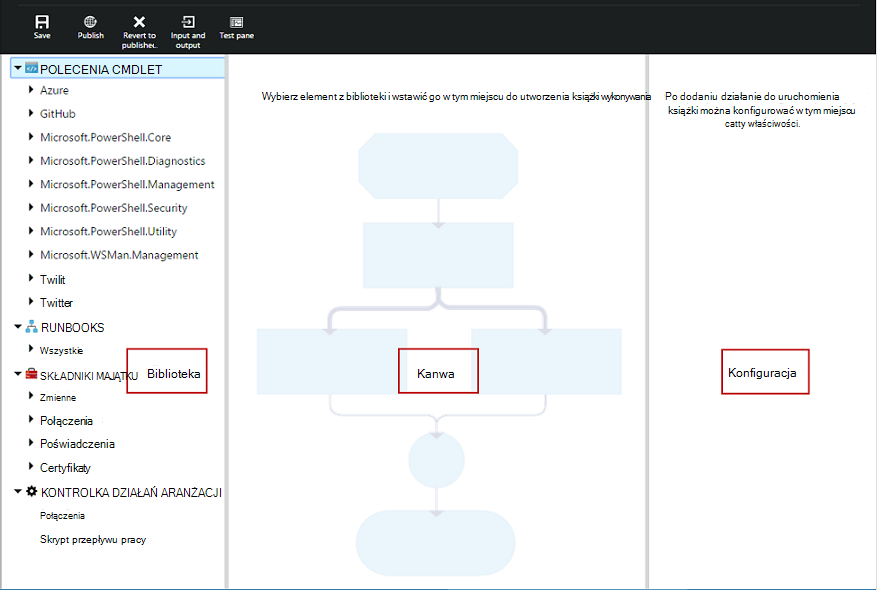

W poniższych sekcjach opisano kontrolek w edytorze graficznego.

### Kanwa
Obszar roboczy znajduje się miejsce, w którym projektowania programu działań aranżacji.  Dodawanie działań z węzły w formancie biblioteki do działań aranżacji i połączyć je z łączami do definiowania logiki działań aranżacji.

Formanty w dolnej części obszaru roboczego umożliwia powiększanie i pomniejszanie.

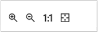

### Formant biblioteki

Formant biblioteki to miejsce, w którym możesz wybrać [działania](#activities) , aby dodać do swojej działań aranżacji.  Możesz dodać je do obszaru roboczego, w którym połączenia na inne działania.  Zawiera cztery sekcje opisane w poniższej tabeli.

| Sekcja | Opis |
|:---|:---|
| Polecenia cmdlet | Zawiera wszystkie polecenia cmdlet, które mogą być używane w Twojej działań aranżacji.  Polecenia cmdlet są zorganizowane według modułu.  Wszystkie moduły, zainstalowanych na Twoim koncie automatyzacji będą dostępne.  |
| Runbooks |  Zawiera runbooks na Twoim koncie automatyzacji. Te runbooks można dodawać do obszaru roboczego, może być używany jako runbooks podrzędne. Wyświetlane są tylko runbooks tego samego typu core jako działań aranżacji edytowany; graficznej runbooks tylko oparte na programie PowerShell runbooks są pokazane, gdy dla runbooks graficzne programu PowerShell przepływu pracy są wyświetlane tylko programu PowerShell przepływów pracy opartych na runbooks.
| Składniki majątku | Zawiera [elementy zawartości automatyzacji](http://msdn.microsoft.com/library/dn939988.aspx) na Twoim koncie automatyzacji, który może być używany w swojej działań aranżacji.  Po dodaniu środka trwałego do działań aranżacji doda działania przepływu pracy, która pobiera zaznaczonego elementu.  W przypadku zmiennych zasobów można określić, czy dodanie czynności, aby uzyskać zmiennej lub ustawić zmiennej.
| Kontrolka działań aranżacji | Zawiera działań aranżacji sterowania działania, które mogą być używane w Twojej bieżącej działań aranżacji. *Połączenia* ma wiele wartości wejściowych i czeka, aż ukończenie wszystkich przed kontynuowaniem przepływu pracy. Działania *Kod* uruchamia jeden lub więcej wierszy kodu programu PowerShell lub przepływu pracy programu PowerShell w zależności od typu działań aranżacji graficznego.  Za pomocą tej czynności dla kodu niestandardowego lub funkcje, które jest trudne do osiągnięcia z innymi działaniami.|

### Kontrola konfiguracji

Formant konfiguracji to miejsce, w którym podać szczegóły dotyczące obiektu, który został zaznaczony w obszarze roboczym. Właściwości dostępne w tym formancie zależy od typu obiektu, zaznaczona.  Po wybraniu opcji w formancie konfiguracji dodatkowe karty zostanie otwarta w celu udostępniania dodatkowe informacje.

### Testowanie sterowania

Kontrola testu nie jest wyświetlany po pierwszym uruchomieniu graficznego edytora. Po otwarciu możesz interakcyjnie [Testowanie graficzne działań aranżacji](#graphical-runbook-procedures).  

## Procedury działań aranżacji graficzne 

### Eksportowanie i importowanie graficzne działań aranżacji

Można eksportować tylko opublikowana wersja graficzne działań aranżacji.  Jeśli działań aranżacji nie został opublikowany, przycisk **Eksportuj opublikowanych** zostaną wyłączone.  Po kliknięciu przycisku **Eksportuj opublikowany** działań aranżacji są pobierane na komputer lokalny.  Nazwa pliku odpowiada nazwie działań aranżacji z rozszerzeniem *graphrunbook* .

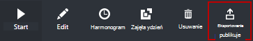

Po zaznaczeniu opcji **importowania** , dodając działań aranżacji można zaimportować plik działań aranżacji graficznej lub graficzne programu PowerShell przepływu pracy.   Gdy wybierzesz plik do zaimportowania, możesz zachować tę samą **nazwę** lub podaj nową.  W polu Typ działań aranżacji zostanie wyświetlona typu działań aranżacji, po jej ocenia wybrany plik i przy próbie wybrania innego typu, która nie jest poprawny, zostanie wyświetlona wiadomość zauważyć istnieją potencjalne konflikty i podczas konwersji, może być występują błędy składniowe.  

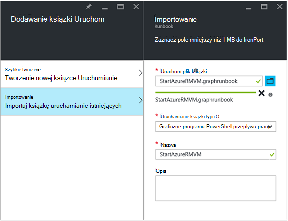

### Testowanie graficzne działań aranżacji

Można sprawdzić wersję roboczą działań aranżacji w portalu Azure, pozostawiając opublikowaną wersję działań aranżacji lub możesz przetestować nowy działań aranżacji przed został opublikowany. Dzięki temu będzie można sprawdzić, czy działań aranżacji działa poprawnie przed zamianą opublikowany. Podczas testowania działań aranżacji działań aranżacji projektu jest wykonywana i wykonywane są wszystkie akcje, które wykonuje. Zostanie utworzona nie historii zadań, ale dane wyjściowe są wyświetlane w okienku wynik testu. 

Otwórz sterowania Test dla działań aranżacji, otwierając działań aranżacji do edycji, a następnie kliknij przycisk **Testuj okienko** .

Kontrolka Test wyświetli monit o wszystkich jej parametrów wejściowych, a działań aranżacji można uruchomić, klikając przycisk **Start** .

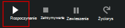

### Publikowanie graficzne działań aranżacji

Każdy działań aranżacji w automatyzacji Azure ma wersję roboczą i opublikowana wersja. Opublikowana wersja jest można używać i można edytować tylko wersję roboczą. Opublikowana wersja jest nie mają wpływu zmiany wersję roboczą. Jeśli wersja robocza jest gotowa do udostępnienia, następnie można publikować go, który zastępuje opublikowana wersja z wersję roboczą.

Możesz opublikować graficzne działań aranżacji, otwierając działań aranżacji do edycji, a następnie klikając przycisk **Publikuj** .

Gdy działań aranżacji nie został opublikowany, ma stan **Nowy**.  Po opublikowaniu ma stan **opublikowany**.  Jeśli edytujesz działań aranżacji po opublikowaniu i różnią się wersje robocze i opublikowane, działań aranżacji ma stan **w trybie edycji**.

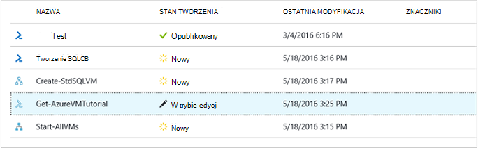 

Masz również opcję, aby przywrócić opublikowana wersja działań aranżacji.  Z dala od komputera zgłasza wszystkie zmiany wprowadzone od działań aranżacji ostatniej publikacji i zastępuje wersję roboczą działań aranżacji opublikowana wersja.

## Działania

Działania są elementy składowe działań aranżacji.  Działanie może być polecenia cmdlet programu PowerShell, działań aranżacji podrzędny lub działania przepływu pracy.  Możesz dodać działanie do działań aranżacji prawym przyciskiem myszy klikając ją w formancie biblioteki i wybranie pozycji **Dodaj do obszaru roboczego**.  Następnie można kliknąć i przeciągnąć działanie, aby umieścić w dowolnym miejscu obszaru roboczego, który chcesz.  Lokalizacja działania w obszarze roboczym nie działać operację działań aranżacji w dowolny sposób.  Możesz układu do działań aranżacji jednak możesz znaleźć najbardziej odpowiednie dla wizualizacji jego działania. 

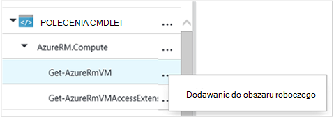

Wybierz działania w obszarze roboczym, aby skonfigurować jego właściwości i parametrów w karta konfiguracji.  **Etykieta** działania można zmienić na inną opisową dla Ciebie.  Nadal trwa oryginalny polecenia cmdlet, możesz po prostu zmienić jego nazwę wyświetlaną, która będzie używana w edytorze graficznego.  Etykieta musi być unikatowa w działań aranżacji. 

### Zestawów parametrów

Ustaw parametr określa parametry obowiązkowe i opcjonalne, które akceptuje wartości dla określonego polecenia cmdlet.  Wszystkie polecenia cmdlet mieć co najmniej jeden parametr, ustaw, a niektóre mają wiele.  Jeśli polecenia cmdlet zawiera wiele zestawów parametr, następnie należy wybrać który z nich będzie używany przed skonfigurowaniem parametry.  Parametry, które można skonfigurować zależy od wybranego zestaw parametrów.  Możesz zmienić zestaw parametrów używane przez działanie, wybierając **Ustawiona** i wybierając inny zestaw.  W tym przypadku wartości parametrów skonfigurowane zostają utracone.

W poniższym przykładzie polecenia cmdlet Get-AzureRmVM występują trzy zestawów parametrów.  Nie można skonfigurować wartości parametrów, aż wybierzesz jeden z zestawów parametru.  Ustaw parametr ListVirtualMachineInResourceGroupParamSet jest do zwracania wszystkich maszyn wirtualnych w grupie zasobów i ma jeden parametr opcjonalne.  GetVirtualMachineInResourceGroupParamSet służy do określania maszyny wirtualnej, aby zwrócić i ma dwa obowiązkowe i jeden parametr opcjonalny.

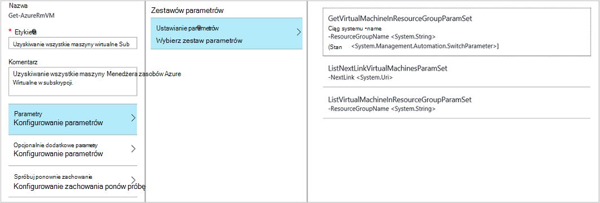

#### Wartości parametru

Po określeniu wartości parametru wybierz źródło danych, aby określić, jak określona wartość.  Źródła danych, które są dostępne dla określonego parametru zależy prawidłowe wartości parametru.  Na przykład wartość Null nie będzie dostępna opcja parametr, który nie jest możliwe wartości null.

| Źródła danych | Opis |
|:---|:---|
|Stała wartość|Wpisz wartość parametru.  To jest dostępna tylko dla następujących typów danych: Int32 Int64, ciąg, wartość logiczna, daty i godziny, Przełącz. |
|Wynik działania|Wynik z działania poprzedzającej bieżącego działania w przepływie pracy.  Zostaną wyświetlone wszystkie prawidłowe działania.  Wybierz właśnie czynność do używania jej wyniki dla wartości parametru.  Jeśli działanie wyświetla obiekt o wiele właściwości, można wpisać nazwę właściwości po wybraniu działania.|
|Wprowadzania działań aranżacji |Wybierz parametr wprowadzania działań aranżacji jako dane wejściowe parametr działania.|  
|Zmienna składników majątku|Wybierz polecenie Zmienna automatyzacji jako danych wejściowych.|  
|Poświadczenia zawartości|Wybierz pozycję poświadczeń automatyzacji jako danych wejściowych.|  
|Certyfikat zawartości|Wybierz certyfikat automatyzacji jako danych wejściowych.|  
|Połączenie składników majątku|Wybierz połączenie automatyzacji jako danych wejściowych.| 
|Wyrażenie programu PowerShell|Określ proste [wyrażenie programu PowerShell](#powershell-expressions).  Wyrażenie będzie obliczane przed działania i wyników wartości parametru.  Aby odwołać się do wynik działania lub działań aranżacji parametru wejściowego można używać zmiennych.|
|Nieskonfigurowane|Usuwa każdą wartość, która wcześniej została skonfigurowana.|

#### Opcjonalnie dodatkowe parametry

Wszystkie polecenia cmdlet uzyskuje opcję, aby zapewnić dodatkowe parametry.  Są to parametry typowych programu PowerShell lub inne parametry niestandardowe.  Dostępne są przy użyciu pola tekstowego, w którym można przekazywać parametry przy użyciu składni programu PowerShell.  Na przykład, aby użyć parametru typowych **pełne** , możesz określić **"— pełne: $True"**.

### Spróbuj ponownie aktywności

**Zachowanie ponów próbę** umożliwia działanie, które ma być uruchamiane wielokrotnie do momentu określony warunek jest spełniony, podobnie jak pętli.  Można używać tej funkcji dla działania, które powinny być uruchamiane wielokrotnie, zawierają podatne na błędy, a może potrzebujesz więcej niż jedna próba praktyczne lub Testuj dane wyjściowe działania na prawidłowych danych.    

Po włączeniu ponów próbę wykonania można ustawić opóźnienie i warunku.  Opóźnienie jest czas (w sekundach lub minutach) czy działań aranżacji czeka przed ponownym uruchomieniem działania.  Jeśli określono bez opóźnienia działania zostanie uruchomione ponownie natychmiast po zakończeniu. 

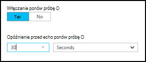

Warunek ponów próbę to wyrażenie programu PowerShell, której wartość jest szacowana po każdym uruchomieniu działania.  Jeśli wyrażenie jest rozpoznawana jako wartość PRAWDA, następnie działania uruchamia ponownie.  Jeśli wyrażenie jest rozpoznawana jako FAŁSZ następnie działanie kończy się niepowodzeniem ponownie i działań aranżacji przechodzi do następnej aktywności. 

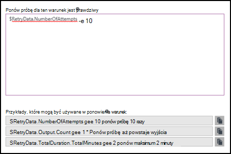

Warunek ponów próbę można użyć zmiennej o nazwie $RetryData zapewniająca dostęp do informacji o ponowne próby aktywności.  Zmienna ma właściwości w poniższej tabeli.

| Właściwość | Opis |
|:--|:--|
| NumberOfAttempts | Liczba uruchamianych działania.              |
| Wynik           | Wynik z ostatniego uruchomienia działania.                    |
| TotalDuration    | Przekroczono, jaka upłynęła od działania uruchomienia po raz pierwszy. |
| StartedAt        | Najpierw uruchomienia godzinę w formacie UTC działania.           |

Poniżej przedstawiono przykłady działań ponów próbę warunków.

    # Run the activity exactly 10 times.
    $RetryData.NumberOfAttempts -ge 10 

    # Run the activity repeatedly until it produces any output.
    $RetryData.Output.Count -ge 1 

    # Run the activity repeatedly until 2 minutes has elapsed. 
    $RetryData.TotalDuration.TotalMinutes -ge 2

Po skonfigurowaniu warunku ponów próbę wykonania działania zawiera dwa wizualnych wyświetlane przypomnienia.  Jeden są prezentowane w działaniu, a druga po przejrzeniu konfiguracji działania.

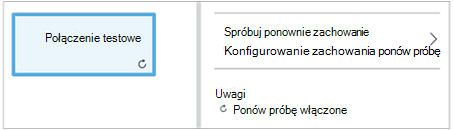

### Kontrolka skrypt przepływu pracy

Kontrola kodu jest działaniem specjalne akceptującym skrypt programu PowerShell lub przepływu pracy programu PowerShell, zależnie od typu graficzne działań aranżacji tworzona w celu udostępniania funkcji, które w przeciwnym razie nie można znaleźć.  Nie można akceptować parametry, ale można go używać zmiennych aktywności dane wyjściowe i działań aranżacji parametrów wejściowych.  Dowolne dane wyjściowe działania jest dodawana do databus, chyba że jego nie wychodzącej łącze w takim przypadku zostanie dodany w wyniku działań aranżacji.

Na przykład poniższy kod wykonuje obliczenia daty przy użyciu zmiennej wprowadzania działań aranżacji o nazwie $NumberOfDays.  Następnie wysyła obliczeniowe daty godziny jako dane wyjściowe mają być używane przez kolejne czynności w działań aranżacji.

    $DateTimeNow = (Get-Date).ToUniversalTime()
    $DateTimeStart = ($DateTimeNow).AddDays(-$NumberOfDays)}
    $DateTimeStart

## Łącza i przepływu pracy

**Łącze** w graficzne działań aranżacji łączy dwa działania.  Jest on wyświetlany w obszarze roboczym jako strzałki wskazującej z działania źródła działania miejsca docelowego.  Działania Uruchom zgodnie z kierunkiem strzałki z działaniem miejsce docelowe, rozpoczynając po zakończeniu działania źródła.  

### Tworzenie łącza

Tworzenie łącza między dwoma działania, wybierając aktywności źródła i klikając koła w dolnej części kształtu.  Przeciągnij strzałkę działania docelowego i udostępniania.

Wybierz łącze, aby skonfigurować właściwości w karta konfiguracji.  Obejmuje to typ łącza, które zostało opisane w poniższej tabeli.

| Typ łącza | Opis |
|:---|:---|
| Potok | Działania miejsce docelowe jest uruchamiane raz dla każdej dane wyjściowe obiektu z działania źródła.  Aktywności miejsce docelowe nie działa, jeśli aktywności źródła wyników żadne dane wyjściowe.  Wynikiem działania źródła jest dostępny jako obiektu.  |
| Sekwencji | Działanie miejsce docelowe jest wykonywane tylko raz.  Otrzymuje tablicę obiektów z aktywności źródła.  Wynikiem działania źródła jest dostępny jako tablicę obiektów. |

### Rozpoczynanie działań

Graficzne działań aranżacji zaczyna się od dowolnego działania, które nie mają łącza w wiadomości przychodzących.  Często będzie tylko jedna działania, które będą działać jako początkowe aktywności dla działań aranżacji.  Jeśli wiele działań nie masz połączenie przychodzące, działań aranżacji zostanie uruchomiona przez uruchomienie równolegle.  Go zostanie następnie skorzystaj z łączy Aby uruchomić inne działania po ukończeniu każdego.

### Warunki

Po określeniu warunku łącze aktywności miejsce docelowe jest uruchamiane tylko, gdy warunek jest rozpoznawana jako true.  Zazwyczaj użyjesz zmiennej $ActivityOutput w warunku do pobierania danych wyjściowych z działania źródła.  

Łącza do procesu Określ warunek dla pojedynczego obiektu, a warunek jest obliczane dla każdego dane wyjściowe obiektu działalności źródła.  Działanie pola Lokalizacja docelowa następnie jest uruchamiany dla każdego obiektu, która spełnia warunku.  Na przykład z działaniem źródła w Get-AzureRmVm następującej składni mogą służyć łącza do procesu warunkowe do pobierania tylko maszyn wirtualnych w grupie zasobów o nazwie *grupa1*.  

    $ActivityOutput['Get Azure VMs'].Name -match "Group1"

Łącza do sekwencji warunek jest tylko obliczane raz od pojedynczej tablicy jest zwracana, zawierającego wszystkie obiekty dane wyjściowe aktywności źródła.  Ze względu na to łącze sekwencji nie można użyć do filtrowania, takich jak łącze planowana, ale po prostu określić, czy jest uruchamiany następnej aktywności. Na przykład następujący zestaw działań w wziąć naszych działań aranżacji rozpocząć maszyn wirtualnych.  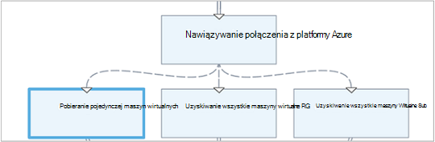 
Istnieją trzy łącza różnych sekwencji, które zweryfikować wartości podano do dwóch parametrów wejściowych działań aranżacji reprezentujący nazwę maszyn wirtualnych i grupa zasobów w celu ustalenia, który jest odpowiednią akcję do wykonania — Rozpoczynanie pojedynczy maszyn wirtualnych, uruchom wszystkie maszyny wirtualne w grupie zasobów lub wszystkich maszyny wirtualne w subskrypcji.  Sekwencja łącza między nawiązywanie połączenia z Azure i pobieranie pojedynczej maszyn wirtualnych Oto warunek logiczny:

    <# 
    Both VMName and ResourceGroupName runbook input parameters have values 
    #>
    (
    (($VMName -ne $null) -and ($VMName.Length -gt 0))
    ) -and (
    (($ResourceGroupName -ne $null) -and ($ResourceGroupName.Length -gt 0))
    )

Użycie warunkowe łącza, dane uzyskane od aktywności źródła na inne działania w tym gałąź będą filtrowane według warunek.  Działanie w przypadku źródła do wielu łączy, danych dostępnych do działania w każdej gałęzi będzie zależeć od warunek w polu łącze nawiązywanie połączeń z tego oddziału.

Na przykład wszystkie maszyn wirtualnych rozpoczęcia działania **Start AzureRmVm** w działań aranżacji poniżej.  Ma dwa łącza warunkowe.  Pierwsze łącze warunkowego używa wyrażenia *$ActivityOutput ["AzureRmVM Start"]. IsSuccessStatusCode - eq $true* do filtrowania, jeśli aktywności Start AzureRmVm ukończona pomyślnie.  Druga używa wyrażenia *$ActivityOutput ["AzureRmVM Start"]. IsSuccessStatusCode — No $true* do filtrowania, jeśli nie można uruchomić maszyny wirtualnej aktywności Start AzureRmVm.  

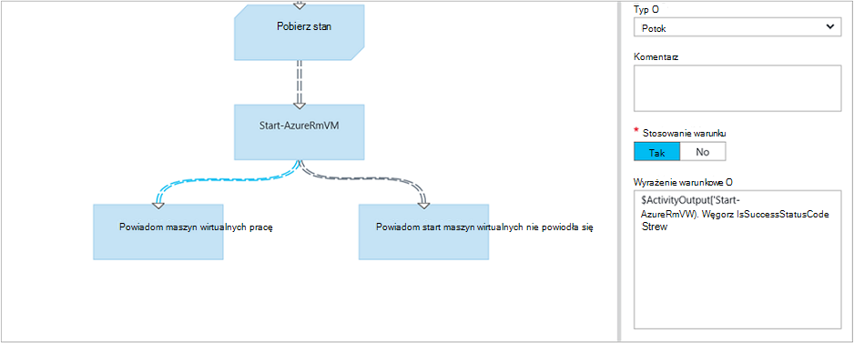

Czynność występujący pierwszy łącze i zastosowania wyniki działania Get-AzureVM tylko otrzymają maszyn wirtualnych, które zostały uruchomione w chwili uruchomienia Get-AzureVM.  Czynność znajdujący się drugiego połączenia tylko otrzymają maszyn wirtualnych, które zostały zatrzymane w chwili uruchomienia Get-AzureVM.  Czynność trzecia łącze otrzymają wszystkich maszyn wirtualnych niezależnie od ich stanie uruchomienia.

### Skrzyżowania

Połączenie jest specjalne działanie, które będą poczekaj, aż wszystkie przychodzące gałęzie została ukończona.  Pozwala na równolegle wiele działań i upewnij się, że ukończenie wszystkich przed przejściem.

Podczas połączenia może mieć dowolną liczbę łącza przychodzące, nie więcej niż jedno z tych łączy może być potok.  Liczba łącza przychodzące sekwencji nie jest ograniczona.  Użytkownik będzie mógł Tworzenie połączenia z wieloma łączami planowana przychodzących i zapisywanie działań aranżacji, ale jej zakończy się niepowodzeniem, gdy jest uruchomiony.

W poniższym przykładzie jest częścią działań aranżacji rozpoczynająca się zestaw maszyn wirtualnych podczas jednoczesnego pobierania poprawek, które mają być stosowane do tych komputerów.  Połączenie jest używany do upewnij się, że oba procesów są wypełnione, przed kontynuowaniem działań aranżacji.

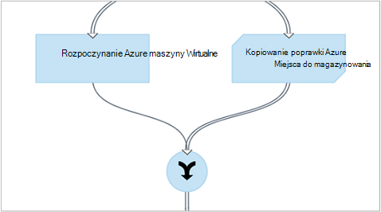

### Cykli

Cykl jest, gdy docelowy łącza aktywności do jego działalności źródła lub inne czynności, które warto łączy z powrotem do źródła.  Cykli obecnie nie są dozwolone w tworzeniu graficznego.  Jeśli do działań aranżacji zawiera cykl, zostanie zapisany poprawnie, ale wystąpi błąd, gdy zostanie uruchomiony.

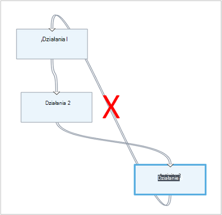

### Udostępnianie danych działań

Wszystkie dane, które jest wyświetlany przez działanie z łącza w wiadomości wychodzącej jest zapisywany *databus* dla działań aranżacji.  Czynność w działań aranżacji umożliwia danych na databus wypełnianie wartości parametru lub umieścić kod skryptu.  Działanie dostęp do wyniku działania poprzedniego w przepływie pracy.     

Sposób zapisywania danych do databus zależy od typu łącza na działanie.  Dla **potoku**danych jest wyświetlany jako obiekty wielokrotności.  Łącza do **sekwencji** dane są wynik w postaci tablicy.  Jeśli istnieje tylko jedna wartość, będzie wynik jako tablicę pojedynczego elementu.

Masz dostęp do danych na databus przy użyciu jednej z dwóch metod.  Najpierw jest wypełnianie za pomocą źródła danych **Wynik działania** parametru innej działalności.  Jeśli wynik jest obiektem, można określić jedną właściwość.

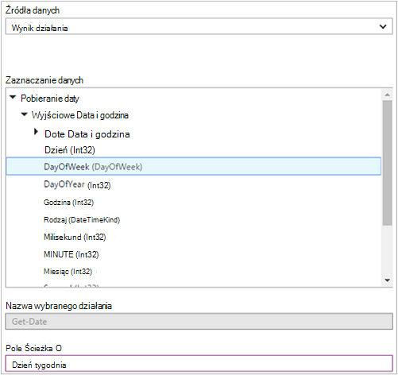

Można także pobrać wynik działania w źródle danych **Wyrażenia programu PowerShell** lub z działaniem **Skrypt przepływu pracy** z zmienną ActivityOutput.  Jeśli wynik jest obiektem, można określić jedną właściwość.  Zmienne ActivityOutput należy użyć następującej składni.

    $ActivityOutput['Activity Label']
    $ActivityOutput['Activity Label'].PropertyName 

### Punkty kontrolne

[Punkty kontrolne](automation-powershell-workflow.md#checkpoints) można ustawić w działań aranżacji graficzne programu PowerShell przepływu pracy, wybierając *punkt kontrolny działań aranżacji* jakiejkolwiek działalności.  Spowoduje to punkt kontrolny należy ustawić po uruchomieniu działania.

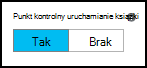

Punkty kontrolne tylko są włączone w runbooks graficzne programu PowerShell przepływu pracy, nie jest dostępna w runbooks graficznego.  Jeśli działań aranżacji używa Azure polecenia cmdlet, należy wykonać czynność sprawdzany za pomocą AzureRMAccount Dodaj w przypadku działań aranżacji zostało zawieszone i ponownym uruchomieniu z tego punktu kontrolnego na innego pracownika. 

## Uwierzytelnianie do zasobów Azure

Runbooks w automatyzacji Azure, którzy zarządzają Azure zasobów wymaga uwierzytelniania Azure.  Nowa funkcja [konta Uruchom jako](automation-sec-configure-azure-runas-account.md) (nazywane również głównej usługi) jest domyślna metoda dostępu do Menedżera zasobów Azure zasobów w ramach subskrypcji z runbooks automatyzacji.  Tej funkcji można dodać do graficznego działań aranżacji, dodając trwałego połączenia **AzureRunAsConnection** , która używa polecenia cmdlet programu PowerShell [Get-AutomationConnection](https://technet.microsoft.com/library/dn919922%28v=sc.16%29.aspx) i polecenia cmdlet [AzureRmAccount Dodaj](https://msdn.microsoft.com/library/mt619267.aspx) do obszaru roboczego. To przedstawiono w poniższym przykładzie. 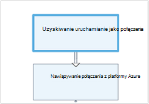 
Aktywność uzyskiwanie uruchamianie jako połączenia (to znaczy Get-AutomationConnection), jest skonfigurowany ze źródłem danych stała wartość o nazwie AzureRunAsConnection. 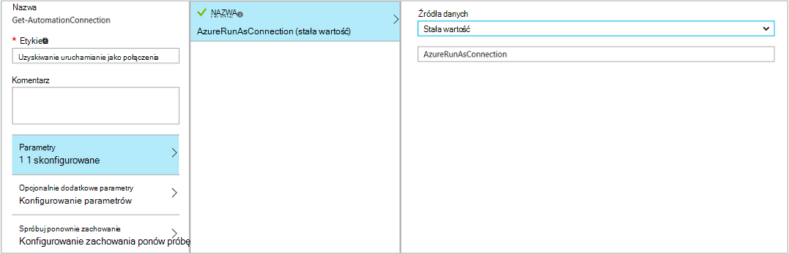 
Następnej aktywności, Dodaj-AzureRmAccount dodaje uwierzytelnionego konta Uruchom jako do użytku w działań aranżacji. 
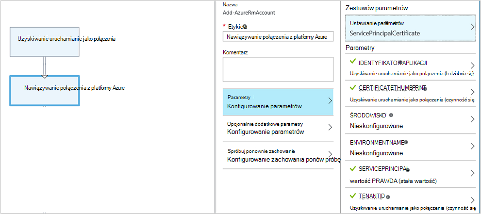 
Dla parametrów **Identyfikator aplikacji**, **CERTIFICATETHUMBPRINT**i **TENANTID** należy określić nazwę właściwości ścieżki pól, ponieważ działania wyświetla obiekt z wielu właściwości.  W przeciwnym razie po wykonaniu działań aranżacji go zakończy się niepowodzeniem, próba uwierzytelnienia.  Jest to, co jest potrzebne co najmniej do uwierzytelnienia użytkownika działań aranżacji za pomocą konta Uruchom jako.

Aby zachować zgodność z poprzednimi zgodności dla subskrybentów, którzy utworzyli konto automatyzacji za pomocą [konta Azure AD użytkownika](automation-sec-configure-aduser-account.md) do zarządzania zasobami Azure usługi zarządzania (ASM) lub Menedżer zasobów Azure, metody uwierzytelniania jest polecenia cmdlet Dodaj AzureAccount z [trwałego poświadczeń](http://msdn.microsoft.com/library/dn940015.aspx) , oznaczającej użytkownika usługi Active Directory z dostępem do konto Azure.

Tej funkcji można dodać do graficznego działań aranżacji, dodając trwałego poświadczeń do obszaru roboczego następuje działanie AzureAccount Dodaj.  Dodawanie AzureAccount używa aktywności poświadczeń dla swojego wejścia.  To przedstawiono w poniższym przykładzie.

Masz do uwierzytelnienia na początku zestawu działań aranżacji i po każdym punkt kontrolny.  Oznacza to, Dodawanie działania dodanie AzureAccount Dodaj po czynność punktu kontrolnego z przepływem pracy. Nie ma potrzeby działanie poświadczeń dodanie, gdyż można stosować takie same 

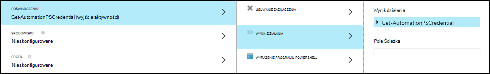

## Działań aranżacji wejścia i wyjścia

### Wprowadzania działań aranżacji

Działań aranżacji może wymagać danych wejściowych od użytkownika po rozpoczęciu działań aranżacji za pośrednictwem portalu Azure lub z innego działań aranżacji, jeśli bieżącym wierszem jest używany jako element podrzędny.
Na przykład jeśli masz działań aranżacji, która umożliwia utworzenie maszyny wirtualnej, może być konieczne o podanie informacji, takich jak nazwy maszyny wirtualnej i inne właściwości każdym uruchomieniu działań aranżacji.  

Akceptowanie danych wejściowych dla działań aranżacji definiując jedną lub więcej wprowadzania parametry.  Podane wartości dla tych parametrów każdym razem, gdy jest uruchomiona działań aranżacji.  Po uruchomieniu działań aranżacji Portal Azure monituje o podanie wartości dla każdego z działań aranżacji parametrów wejściowych.

Masz dostęp do parametrów wejściowych dla działań aranżacji, klikając przycisk **dane wejściowe i wyjściowe** na pasku narzędzi działań aranżacji.  

 

Spowoduje to otwarcie kontrolkę **dane wejściowe i wyjściowe** miejsce, w którym można edytować istniejący parametr wprowadzania lub utworzyć nową, klikając pozycję **Dodaj danych wejściowych**. 

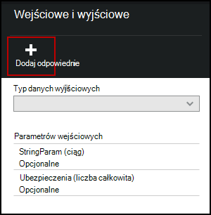

Każdego parametru wejściowego jest określona przez właściwości w poniższej tabeli.

|Właściwość|Opis|
|:---|:---|
| Nazwa | Unikatowa nazwa parametru.  To może zawierać tylko cyfry alfa i nie może zawierać spacji. |
| Opis | Opcjonalny opis parametru wejściowego.  |
| Typ | Typ danych dla wartości parametru.  Azure portal zapewni formantu odpowiedni typ danych dla każdego parametru podczas monitowanie o podanie danych wejściowych. |
| Obowiązkowe | Określa, czy należy podać wartość parametru.  Nie można uruchomić działań aranżacji, jeśli nie zostanie określona wartość dla każdego parametru obowiązkowe, który nie zawiera wartości domyślnej. |
| Wartość domyślna | Określa, która wartość jest używana w parametrze, jeśli nie zostanie podany.  Można Null lub określonej wartości. |

### Wynik działań aranżacji

Dane utworzone przez działalności, która nie ma łącza w wiadomości wychodzących zostaną dodane do [wynik działań aranżacji](http://msdn.microsoft.com/library/azure/dn879148.aspx).  Wyniki są zapisywane z zadaniem działań aranżacji i są dostępne dla działań aranżacji nadrzędnej, gdy działań aranżacji jest używana jako element podrzędny.  

## Wyrażenia programu PowerShell

Jedną z zalet tworzenia graficznych oferuje Ci możliwość tworzenia działań aranżacji znający minimalnego programu PowerShell.  Obecnie należy wiedzieć bit programu PowerShell, chociaż podczas wypełniania określonych [wartości parametrów](#activities) oraz [warunki łącze](#links-and-workflow)ustawienia.  Ta sekcja zawiera krótkie wprowadzenie do wyrażeń programu PowerShell dla tych użytkowników, którzy mogą nie być znajomym.  Pełne informacje na temat programu PowerShell są dostępne na [Tworzenie skryptów w programie Windows PowerShell](http://technet.microsoft.com/library/bb978526.aspx). 

### Źródło danych wyrażenia programu PowerShell

Aby wypełnić wartości [parametru aktywności](#activities) z wynikami kodu programu PowerShell, można użyć wyrażenia programu PowerShell jako źródła danych.  Może to być pojedynczy wiersz kodu, który wykonuje kilka prostych funkcji lub wiele wierszy, które wykonują złożone logikę.  Wszelkie dane wyjściowe polecenia, którego nie jest przypisana do zmiennej są kierowane do wartości parametru. 

Na przykład następujące polecenie czy wyjściowy bieżącą datę. 

    Get-Date

Następujące polecenia Utwórz ciąg od bieżącej daty i przypisać go do zmiennej.  Zawartość zmiennej następnie są wysyłane do wyników 

    $string = "The current date is " + (Get-Date)
    $string

Następujące polecenia Szacowanie bieżącej daty i zwrócić Ciąg wskazującą, czy bieżący dzień jest weekend lub dnia tygodnia. 

    $date = Get-Date
    if (($date.DayOfWeek = "Saturday") -or ($date.DayOfWeek = "Sunday")) { "Weekend" }
    else { "Weekday" }
    
 
### Wynik działania

Aby użyć dane wyjściowe z poprzedniego aktywności w działań aranżacji, za pomocą zmiennej $ActivityOutput przy użyciu następującej składni.

    $ActivityOutput['Activity Label'].PropertyName

Na przykład może być działanie właściwość, która wymaga nazwy maszyny wirtualnej w takim przypadku można użyć następującego wyrażenia.

    $ActivityOutput['Get-AzureVm'].Name

Właściwość, którą wymagane maszyny wirtualnej obiektu zamiast tylko właściwość, czy zwrócić całego obiektu, używając następującej składni.

    $ActivityOutput['Get-AzureVm']

Za pomocą wynik działania w wyrażeniu bardziej złożone, takie jak poniższy łączy tekst do nazwy maszyn wirtualnych.

    "The computer name is " + $ActivityOutput['Get-AzureVm'].Name

### Warunki

[Operatory porównania](https://technet.microsoft.com/library/hh847759.aspx) służą do porównywania wartości lub jeśli wartość pasuje do określonego wzorca.  Porównanie zwraca wartość $true lub $false.

Na przykład poniższy warunek określa, czy maszyny wirtualnej z działania o nazwie *Get-AzureVM* jest obecnie *zatrzymane*. 

    $ActivityOutput["Get-AzureVM"].PowerState –eq "Stopped"

Poniższy warunek sprawdza, czy tej samej maszyny wirtualnej jest w Państwie niż *zatrzymane*.

    $ActivityOutput["Get-AzureVM"].PowerState –ne "Stopped"

Można dołączyć wiele warunków przy użyciu [operatorów logicznych](https://technet.microsoft.com/library/hh847789.aspx) , takich jak **- i** lub **- lub**.  Na przykład poniższy warunek sprawdza, czy tej samej maszyny wirtualnej w poprzednim przykładzie jest w stanie *zatrzymana* lub *Zatrzymywanie*.

    ($ActivityOutput["Get-AzureVM"].PowerState –eq "Stopped") -or ($ActivityOutput["Get-AzureVM"].PowerState –eq "Stopping") 

### Hashtables

[Hashtables](http://technet.microsoft.com/library/hh847780.aspx) są pary nazwa wartość, które są przydatne do zwracania zestawu wartości.  Właściwości dla niektórych działań może oczekiwać skrótów zamiast prostą wartością.  Ponadto może się pojawić jako skrótów określane jako słownika. 

Możesz utworzyć skrótów przy użyciu następującej składni.  Skrótów może zawierać dowolną liczbę wpisów, ale każdy jest definiowana według nazwy i wartości.

    @{ <name> = <value>; [<name> = <value> ] ...}

Na przykład następujące wyrażenie tworzy skrótów do użytku w źródle danych parametru działań, oczekiwanego skrótów z wartościami dla wyszukiwania w Internecie.

    $query = "Azure Automation"
    $count = 10
    $h = @{'q'=$query; 'lr'='lang_ja';  'count'=$Count}
    $h

W poniższym przykładzie użyto wynikiem działania o nazwie *Uzyskiwanie połączenia serwisu Twitter* do zapełnienia skrótów.

    @{'ApiKey'=$ActivityOutput['Get Twitter Connection'].ConsumerAPIKey;
      'ApiSecret'=$ActivityOutput['Get Twitter Connection'].ConsumerAPISecret;
      'AccessToken'=$ActivityOutput['Get Twitter Connection'].AccessToken;
      'AccessTokenSecret'=$ActivityOutput['Get Twitter Connection'].AccessTokenSecret}

## Następne kroki

- Aby rozpocząć pracę z runbooks przepływu pracy programu PowerShell, zobacz [Moje pierwszego działań aranżacji przepływu pracy programu PowerShell](automation-first-runbook-textual.md) 
- Aby rozpocząć pracę z runbooks graficznych, zobacz [Moje pierwszego graficzne działań aranżacji](automation-first-runbook-graphical.md)
- Aby dowiedzieć się więcej na temat typów działań aranżacji, ich zalet i ograniczeń, zobacz [Typy działań aranżacji automatyzacji Azure](automation-runbook-types.md)
- Aby dowiedzieć się, jak uwierzytelnianie za pomocą konta automatyzacji Uruchom jako, zobacz [Konfigurowanie Azure konta Uruchom jako](automation-sec-configure-azure-runas-account.md)
 
