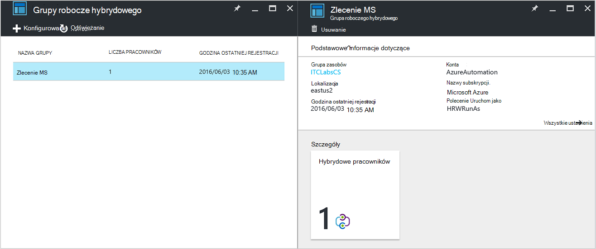

<properties
   pageTitle="Azure automatyzacji hybrydowych działań aranżacji pracowników | Microsoft Azure"
   description="Ten artykuł zawiera informacje dotyczące instalacji i używania hybrydowego działań aranżacji pracownika, która jest funkcją automatyzacji Azure, który pozwala na uruchamianie runbooks na komputerach za pomocą Centrum danych lokalnych."
   services="automation"
   documentationCenter=""
   authors="mgoedtel"
   manager="jwhit"
   editor="tysonn" />
<tags
   ms.service="automation"
   ms.devlang="na"
   ms.topic="article"
   ms.tgt_pltfrm="na"
   ms.workload="infrastructure-services"
   ms.date="10/14/2016"
   ms.author="bwren" />

# Azure automatyzacji hybrydowych działań aranżacji pracowników

Runbooks w automatyzacji Azure nie dostęp do centrum danych lokalnych zasobów, ponieważ są one uruchamiane w chmurze Azure.  Funkcji hybrydowych działań aranżacji pracownik automatyzacji Azure umożliwia uruchamianie runbooks na komputerach znajduje się w centrum danych, aby można było zarządzać zasobów lokalnych. Runbooks są przechowywane i zarządzane w automatyzacji Azure i następnie dostarczane do co najmniej jednym komputerze lokalnym.  

Ta funkcja przedstawiono na poniższym obrazie.   

W centrum danych do działania jako pracownik działań aranżacji hybrydowych i uruchom runbooks z automatyzacji Azure można określić jednym lub kilku komputerach.  Każdy pracownik wymaga programu Microsoft Agent zarządzania za pomocą połączenia dla pakietu zarządzania operacje Microsoft i środowiska działań aranżacji automatyzacji Azure.  Pakiet administracyjny operacji służy tylko zainstalować i zachować agenta zarządzania i monitorowanie funkcji pracownika.  Dostarczenie runbooks i instrukcje, aby uruchomić je są wykonywane automatycznie Azure.

Nie ma żadnych wymagań zapory dla ruchu przychodzącego do obsługi hybrydowego działań aranżacji pracowników. Agent na komputerze lokalnym inicjuje całą komunikację z automatyzacji Azure w chmurze. Po uruchomieniu działań aranżacji automatyzacji Azure tworzy instrukcji, która zostanie pobrana przez agenta. Przed uruchomieniem agent pobiera działań aranżacji i wszystkich jej parametrów.  Również pobierze wszelkich [zasoby](http://msdn.microsoft.com/library/dn939988.aspx) są używane przez działań aranżacji z automatyzacji Azure.

>[AZURE.NOTE] Pracowników działań aranżacji hybrydowych nie jest obecnie obsługiwany [DSC konfiguracji](automation-dsc-overview.md).

## Grup roboczych działań aranżacji hybrydowego

Każdy pracownik działań aranżacji hybrydowego jest członkiem grupy hybrydowych działań aranżacji pracownik, określonym przez użytkownika podczas instalacji agenta.  Grupy mogą zawierać jeden pełnomocnik, ale można zainstalować wiele czynników w grupie wysokiej dostępności.

Po uruchomieniu działań aranżacji dla pracownika działań aranżacji hybrydowych Określ grupę, do której będzie działać na.  Członkowie grupy określi, które pracownik będzie obsługi żądania.  Nie można określić pracownika określonego.

## Wymagania dotyczące działań aranżacji pracownik hybrydowego

Należy wyznaczyć co najmniej jeden komputera lokalnego w celu uruchomienia hybrydowych działań aranżacji zadania.  Ten komputer musi mieć następujące czynności:

- Windows Server 2012 lub nowszym
- Środowiska Windows PowerShell w wersji 4.0 lub nowszy
- Co najmniej dwa rdzenie i 4 GB pamięci RAM

Należy rozważyć następujące zalecenia dla pracowników hybrydowych: 

- Wyznacza wielu pracowników hybrydowych w każdej grupie wysokiej dostępności.  
- Hybrydowe pracowników można współistnienie usługi zarządzania automatyzacji lub Orchestrator Centrum systemu serwerów działań aranżacji.
- Warto rozważyć użycie komputera fizycznie znajdującego się wewnątrz lub obok obszaru swojego konta automatyzacji, ponieważ danych zadania są wysyłane do automatyzacji Azure po ukończeniu zadania.

>[AZURE.NOTE] Pracownik działań aranżacji hybrydowych wersji 7.2.11136.0 obsługuje obecnie komunikowanie się za pośrednictwem serwera proxy tylko w przypadku skryptów programu PowerShell.  Obsługa skryptów programu PowerShell przepływu pracy będą dostępne w przyszłej wersji.  

### Konfigurowanie ustawień serwera proxy i zapory

Nawiązywanie i zarejestrować w firmie Microsoft operacje zarządzania pakietu () usługę pracownika działań aranżacji hybrydowego lokalna on mieć dostęp do numer portu i adresy URL opisany poniżej.  Oprócz [porty i adresy URL wymagane dla agenta monitorowania firmy Microsoft](../log-analytics/log-analytics-proxy-firewall.md#configure-proxy-and-firewall-settings-with-the-microsoft-monitoring-agent) jest nawiązywania połączenia z usługi OMS. Jeśli korzystasz z serwera proxy dla komunikacji między agentem i usługę, musisz upewnij się, że odpowiednie zasoby są dostępne. Jeśli używasz zapory, aby ograniczyć dostęp do Internetu, należy skonfigurować zaporę, aby zezwolić na dostęp. 

Poniższe informacje listy portów i adresy URL, które są wymagane do pracownika działań aranżacji hybrydowego można komunikować się z automatyzacji.

- Port: Tylko port TCP 443 jest wymagane na potrzeby ruchu wychodzącego dostęp do Internetu
- Globalny adres URL: *.azure-automation.net

Jeśli masz konto usługi automatyzacji zdefiniowane dla określonego regionu i chcesz ograniczyć komunikowanie się z tym regionalnego centrum danych, Poniższa tabela zawiera rekordu DNS dla każdego regionu.

|**Region**|**Rekord DNS**|
|--------------|--------------|
|Południowej centralnej Stany Zjednoczone|scus-jobruntimedata zlecenie su1.azure-automation.net|
|Wschodniej USA 2|eus2-jobruntimedata zlecenie su1.azure-automation.net|
|Europa Zachodnia|Firma Microsoft jobruntimedata zlecenie su1.azure-automation.net|
|Europa Północna|n jobruntimedata zlecenie su1.azure-automation.net|
|Kanada Środkowa|DW — jobruntimedata — zlecenie su1.azure-automation.net|
|Południowej wschodnioazjatyckie|morzu jobruntimedata zlecenie su1.azure-automation.net|
|Indie centralnej|CID-jobruntimedata zlecenie su1.azure-automation.net|
|Wschód Japonia|jpe-jobruntimedata zlecenie su1.azure-automation.net|
|Południe wschód Australia|ASE-jobruntimedata zlecenie su1.azure-automation.net|

## Instalowanie hybrydowych działań aranżacji pracownika

W poniższej procedurze opisano sposób instalowania i konfigurowania hybrydowego działań aranżacji pracownika.  Jednokrotnie wykonać dwa pierwsze kroki w środowisku usługi automatyzacji, a następnie powtórz pozostałe kroki dla każdego komputera pracownika.

### 1. Tworzenie obszaru roboczego w pakiecie zarządzania operacji

Jeśli nie masz już z obszarem roboczym pakiet administracyjny operacji, następnie utworzyć zgodnie z instrukcjami zawartymi w [Konfigurowanie obszaru roboczego](https://technet.microsoft.com/library/mt484119.aspx). Jeśli już istnieje, możesz użyć istniejącego obszaru roboczego.

### 2. Dodaj rozwiązanie automatyzacji do obszaru roboczego w pakiecie zarządzania operacji

Rozwiązania dodać funkcję w pakiecie zarządzania operacji.  Rozwiązanie automatyzacji dodaje funkcje automatyzacji Azure, w tym obsługę hybrydowych działań aranżacji pracownika.  Po dodaniu rozwiązanie do obszaru roboczego go automatycznie przesunie składniki pracownika w dół do agenta komputera, na którym zostaną zainstalowane w następnym kroku.

Postępuj zgodnie z instrukcjami w [celu dodania rozwiązanie przy użyciu galerii rozwiązań](../log-analytics/log-analytics-add-solutions.md) Dodaj rozwiązanie **automatyzacji** do obszaru roboczego pakiet administracyjny operacji.

### 3. Zainstaluj monitorowania agenta firmy Microsoft

Program Microsoft Agent monitorowania łączy komputery w pakiecie zarządzania operacji.  Po zainstalowaniu agenta na komputerze lokalnym i połączyć go z obszaru roboczego, automatycznie pobierze składniki wymagane dla hybrydowych działań aranżacji pracownika.

Postępuj zgodnie z instrukcjami na [komputerach Łączenie systemu Windows do analizy dziennika](../log-analytics/log-analytics-windows-agents.md) zainstalować agenta na komputerze lokalnym.  Można powtórzyć ten proces na wielu komputerach w celu dodania wielu pracowników do środowiska.

Gdy agent został pomyślnie połączony w pakiecie zarządzania operacji, znajdzie się ona na karcie **Połączenia źródła** okienka pakiet administracyjny operacje **Ustawienia** .  Można sprawdzić, czy agent poprawnie pobranie rozwiązanie automatyzacji po folderu o nazwie **AzureAutomationFiles** w C:\Program Files\Microsoft monitorowania Agent\Agent.  Aby sprawdzić wersję pracownika działań aranżacji hybrydowe, można przejść do Notatka i C:\Program Files\Microsoft monitorowania Agent\Agent\AzureAutomation\ \\podfolder *wersji* .   

### 4. Zainstaluj środowisko działań aranżacji i łączność z automatyzacji Azure

Po dodaniu agenta w pakiecie zarządzania operacje rozwiązanie automatyzacji umieszcza modułu programu PowerShell **HybridRegistration** , zawierającego polecenie cmdlet **Dodaj HybridRunbookWorker** w dół.  Instalowanie środowiska działań aranżacji na komputerze i zarejestrować go przy użyciu automatyzacji Azure za pomocą tego polecenia cmdlet.

Otwórz sesję programu PowerShell w trybie administratora i uruchom następujące polecenia, aby zaimportować modułu.

    cd "C:\Program Files\Microsoft Monitoring Agent\Agent\AzureAutomation\<version>\HybridRegistration"
    Import-Module HybridRegistration.psd1

Następnie uruchom polecenie cmdlet **Dodaj HybridRunbookWorker** , używając następującej składni:

    Add-HybridRunbookWorker –Name <String> -EndPoint <Url> -Token <String>

Aby uzyskać informacje wymagane dla tego polecenia cmdlet z karta **Narzędzia do zarządzania kluczami** w portalu Azure.  Ta karta otworzyć, klikając ikonę klucza na panelu elementy konta automatyzacji.

- **Nazwa** jest nazwą grupy Pracownik działań aranżacji hybrydowych. Jeśli ta grupa już istnieje w oknie konta automatyzacji, bieżącego komputera zostaną dodane do niego.  Jeśli już istnieje, następnie jest dodawana.
- **Punkt końcowy** jest polem **adresu URL** w karta **Narzędzia do zarządzania kluczami** .
- **Token** jest **Klucz podstawowy dostęp** w karta **Narzędzia do zarządzania kluczami** .  

Używanie **-pełne** przełącznik z **HybridRunbookWorker Dodaj** , aby uzyskać szczegółowe informacje o instalacji.

### 5. Zainstaluj moduły programu PowerShell

Runbooks służy do działania i poleceń cmdlet zdefiniowane w modułach zainstalowanych w środowisku usługi Azure automatyzacji.  Te moduły nie są automatycznie wdrażane na komputerach lokalnych, więc musi zainstalować je ręcznie.  Wyjątkiem jest moduł Azure, który jest instalowany domyślnie zapewnienia dostępu do poleceń cmdlet dla wszystkich usług Azure i działania automatyzacji Azure.

Ponieważ głównym celem funkcji hybrydowych działań aranżacji pracownik jest zarządzanie zasobów lokalnych, najprawdopodobniej będzie musisz zainstalować modułów, w których te zasoby pomocy technicznej.  Informacje na temat instalowania programu Windows PowerShell moduły może dotyczyć [Instalowaniem modułów](http://msdn.microsoft.com/library/dd878350.aspx) .

## Usuwanie hybrydowych działań aranżacji pracownika

Jeden lub więcej pracowników działań aranżacji hybrydowego można usunąć z grupy lub usunąć grupę, w zależności od potrzeb.  Aby usunąć pracownikiem działań aranżacji hybrydowego z komputera lokalnego, otwórz sesję programu PowerShell w trybie administratora, a następnie uruchom następujące polecenie - **HybridRunbookWorker Usuń** polecenia cmdlet.  Używanie **— pełne** Zmień szczegółowy dziennik procesu usuwania. 

To nie powoduje usunięcia agenta monitorowania firmy Microsoft na komputerze, tylko funkcje i konfiguracji roli hybrydowych działań aranżacji pracownika.  

Aby usunąć grupę, należy najpierw usunąć pracownika działań aranżacji hybrydowego z na każdym komputerze, który jest członkiem grupy za pomocą polecenia przedstawionym wcześniej, a następnie wykonaj następujące czynności, aby usunąć grupę.  

1. Otwórz konto automatyzacji w portalu Azure.
2. Wybierz kafelków **Hybrydowego grup roboczych** i karta **Grup roboczych hybrydowego** wybierz grupę, którą chcesz usunąć.  Po wybraniu określonej grupy, zostanie wyświetlona karta właściwości **grupy roboczych hybrydowego** .     
3. Karta właściwości dla wybranej grupy wybierz polecenie **Usuń**.  Wiadomości są wyświetlane monitem o potwierdzenie tej akcji i wybierz opcję **Tak** , jeśli masz pewność, że chcesz kontynuować.    Ten proces może potrwać kilka sekund, a następnie z menu można śledzić postęp w obszarze **powiadomień** .  

## Uruchamianie runbooks hybrydowych działań aranżacji pracownika

[Rozpoczynanie działań aranżacji w automatyzacji Azure](automation-starting-a-runbook.md) zamieszczono opis różnych metod tworzenia działań aranżacji.  Pracownik działań aranżacji hybrydowych dodaje opcję **RunOn** miejsce, w którym można określić nazwę grupy Pracownik działań aranżacji hybrydowych.  Jeśli określono grupę działań aranżacji jest pobierana i wykonywane przez pracowników w tej grupie.  Jeśli ta opcja nie jest określony, następnie jest uruchamiany w automatyzacji Azure w zwykły sposób.

Po rozpoczęciu działań aranżacji w portalu Azure, zostanie wyświetlona za pomocą opcji **Uruchom na** miejsce, w którym można wybrać **Azure** lub **Hybrydowych pracownika**.  Po wybraniu **Pracownika hybrydowego**można wybierać grupy z listy rozwijanej.

Należy użyć parametru **RunOn** może Użyj następującego polecenia, aby uruchomić działań aranżacji o nazwie działań aranżacji Test na grupę hybrydowych działań aranżacji pracowników o nazwie MyHybridGroup przy użyciu programu Windows PowerShell.

    Start-AzureRmAutomationRunbook –AutomationAccountName "MyAutomationAccount" –Name "Test-Runbook" -RunOn "MyHybridGroup"

>[AZURE.NOTE] Parametr **RunOn** został dodany do polecenia cmdlet **Start AzureAutomationRunbook** w wersji 0.9.1 Microsoft Azure programu PowerShell.  Należy [pobrać najnowszą wersję](https://azure.microsoft.com/downloads/) , jeśli wcześniej zainstalowany jeden.  Należy zainstalować tę wersję na komputerze, na którym można będzie można od działań aranżacji programu Windows PowerShell.  Nie musisz zainstalować go na komputerze pracownika, chyba że chcesz rozpocząć runbooks z tego komputera.  Obecnie nie można uruchomić działań aranżacji na Pracownik działań aranżacji hybrydowego z innego działań aranżacji, ponieważ jest wymagany najnowszą wersję programu Powershell Azure musi być zainstalowany na Twoim koncie automatyzacji.  Najnowszą wersję zostaną automatycznie zaktualizowane w automatyzacji Azure i automatycznie przypisany w dół do pracowników wkrótce.

## Uprawnienia działań aranżacji

Runbooks uruchomionych pracownikiem działań aranżacji hybrydowego nie można używać samego [zazwyczaj używany do runbooks metody uwierzytelniania Azure zasobów](automation-configuring.md#configuring-authentication-to-azure-resources) , od nich będą uzyskiwać dostęp do zasobów poza Azure.  Działań aranżacji można ustalić własne uwierzytelnienie do zasobów lokalnych lub można określić konta RunAs zapewnia kontekst użytkownika do wszystkich runbooks.

### Uwierzytelnianie działań aranżacji

Domyślnie runbooks będzie działać w kontekście lokalnego konta System na komputerze lokalnym, muszą one własne uwierzytelniania zasobów, które będą uzyskiwać dostęp do usługi.  

Za pomocą [poświadczeń](http://msdn.microsoft.com/library/dn940015.aspx) i [certyfikat](http://msdn.microsoft.com/library/dn940013.aspx) w swojej działań aranżacji z poleceń cmdlet, które umożliwiają określenie poświadczeń, więc można uwierzytelnić różne zasoby.  W poniższym przykładzie pokazano część działań aranżacji, który powoduje ponowne uruchomienie komputera.  Jego pobiera poświadczenia z zbiór poświadczeń i nazwę komputera z zmiennych elementów zawartości, a następnie używa tych wartości przy użyciu polecenia cmdlet Uruchom ponownie komputer.

    $Cred = Get-AzureRmAutomationCredential -ResourceGroupName "ResourceGroup01" -Name "MyCredential"
    $Computer = Get-AzureRmAutomationVariable -ResourceGroupName "ResourceGroup01" -Name  "ComputerName"

    Restart-Computer -ComputerName $Computer -Credential $Cred

Można również wykorzystać [InlineScript](automation-powershell-workflow.md#inline-script) , co umożliwi uruchamianie bloki kodu na innym komputerze przy użyciu poświadczeń określonej przez [parametr PSCredential typowych parametru](http://technet.microsoft.com/library/jj129719.aspx).

### Konto RunAs

Zamiast runbooks zapewnić własne uwierzytelnienie zasobów lokalnych, można określić konta **RunAs** dla grupy Pracownik hybrydowych.  Określ [poświadczenia zawartości](automation-credentials.md) , który ma dostęp do zasobów lokalnych, a wszystkie runbooks będzie uruchamiana tych poświadczeń uruchamianej na pracownika działań aranżacji hybrydowych w grupie.  

Nazwa użytkownika dla poświadczenia muszą być w jednym z następujących formatów:

- domena 
- username@domain
- Nazwa użytkownika (w przypadku konta lokalne komputera lokalnego)

Poniższa procedura umożliwia określenie konta RunAs dla grupy Pracownik hybrydowych:

1. Utwórz [trwałego poświadczenia](automation-credentials.md) z dostępem do zasobów lokalnych.
2. Otwórz konto automatyzacji w portalu Azure.
2. Zaznacz opcję Podziel **Grup roboczych hybrydowe** , a następnie wybierz odpowiednią grupę.
3. Wybierz **wszystkie ustawienia** , a następnie **ustawień grup roboczych hybrydowych**.
4. Zmienianie **Uruchamianie jako** z **domyślne** **niestandardowe**.
5. Wybierz poświadczenia, a następnie kliknij przycisk **Zapisz**.

## Tworzenie runbooks dla hybrydowych działań aranżacji pracownika

Nie różni się w strukturze runbooks, które są uruchamiane w automatyzacji Azure i tych, które uruchamiać na pracownika działań aranżacji hybrydowych. Runbooks używanej z każdego będzie najprawdopodobniej różnią się znacznie ale ponieważ runbooks dla pracownika działań aranżacji hybrydowego zwykle Zarządzanie zasobów lokalnych za pomocą Centrum danych, gdy runbooks w automatyzacji Azure zwykle zarządzania zasobami w chmurze Azure. 

Możesz edytować działań aranżacji dla pracownika działań aranżacji hybrydowych w automatyzacji Azure, ale mogą mieć problemy, jeśli testujesz działań aranżacji w edytorze.  Które uzyskiwać dostęp do tych zasobów lokalnych mogą nie być zainstalowane w środowisku automatyzacji Azure w takim przypadku moduł programu PowerShell test przestaną działać.  Po zainstalowaniu wymaganych modułów, działań aranżacji zostanie uruchomione, ale nie będą mogli uzyskać dostęp do zasobów lokalnych do wykonania testu.

## Rozwiązywanie problemów z runbooks na hybrydowego działań aranżacji pracownika

[Wynik działań aranżacji i wiadomości](automation-runbook-output-and-messages.md) są wysyłane do automatyzacji Azure z hybrydowego pracowników, podobnie jak zadania działań aranżacji Uruchom w chmurze.  Można także włączyć strumienie pełne i informacje o postępie tak samo jak dla innych runbooks.  

Dzienniki są przechowywane lokalnie na każdego pracownika hybrydowych w C:\ProgramData\Microsoft\System Center\Orchestrator\7.2\SMA\Sandboxes.

Jeśli zadanie sumaryczne jest wyświetlany stan **zawieszone**usługi runbooks nie są pomyślnie completeing, przejrzyj artykuł dotyczący rozwiązywania problemów [hybrydowych działań aranżacji pracownika: zadanie działań aranżacji kończy się ze stanem zawieszone](automation-troubleshooting-hrw-runbook-terminates-suspended.md).   

## Relacje z usługi zarządzania automatyzacji

[Usługa zarządzania automatyzacji (SMA)](https://technet.microsoft.com/library/dn469260.aspx) umożliwia uruchamianie samej runbooks, które są obsługiwane przez automatyzacji Azure za pomocą Centrum danych lokalnych. SMA zazwyczaj jest wdrożona razem z dodatkiem Service Pack systemu Windows Azure, zgodnie z interfejsem graficznym służącym do zarządzania SMA zawiera Windows Azure dodatkiem Service Pack. W przeciwieństwie do automatyzacji Azure SMA wymaga instalacji lokalnej, zawierające serwerów sieci web do obsługi interfejsu API bazy danych ma zawierać runbooks i konfiguracji SMA i pracowników działań aranżacji wykonywanie działań aranżacji zadania. Azure automatyzacji zawiera tych usług w chmurze i tylko wymaga Obsługa pracowników działań aranżacji hybrydowych w środowisku lokalnym.

W przypadku istniejącego użytkownika SMA, możesz przenieść do runbooks do automatyzacji Azure ma być używane z hybrydowego działań aranżacji pracownika bez żadnych zmian, przy założeniu, że wykonują własne uwierzytelniania zasoby, jak opisano w temacie [Tworzenie runbooks dla pracownika działań aranżacji hybrydowych](#creating-runbooks-for-hybrid-runbook-worker).  Runbooks w SMA Uruchom w ramach konta usługi na serwerze pracownik, który mogą udostępniać uwierzytelniania dla runbooks.

Następujące kryteria umożliwia określanie, czy automatyzacji Azure z hybrydowego działań aranżacji pracownik lub Usługa zarządzania automatyzacji jest bardziej odpowiednie dla potrzeb.

- SMA wymaga instalacji lokalnej części źródłowych połączonych z dodatkiem Service Pack systemu Windows Azure, jeśli wymagane jest interfejsem graficznym zarządzania. Więcej zasobów lokalnych będą potrzebne z kosztów utrzymania wyższymi niż automatyzacji Azure musi tylko agenta zainstalowany na lokalnym działań aranżacji pracowników. Agentów są zarządzane przez pakiet zarządzania operacji, dodatkowo zmniejszyć koszty obsługi.
- Azure automatyzacji przechowuje jego runbooks w chmurze i udostępnia je pracownikom działań aranżacji hybrydowych lokalnego. Zasady dotyczące zabezpieczeń nie zezwala na to zachowanie, należy użyć SMA.
- SMA jest dołączany do systemu Centrum; i dlatego wymaga systemu Centrum 2012 R2 licencji. Azure automatyzacji jest oparty na warstwowych subskrypcji.
- Zaawansowane funkcje, takie jak runbooks graficzne, które nie są dostępne w SMA Azure automatyzacji.

## Następne kroki

- Aby dowiedzieć się więcej na temat różnych metod, które mogą być używane do uruchomienia działań aranżacji, zobacz [Rozpoczynanie działań aranżacji w automatyzacji Azure](automation-starting-a-runbook.md)
- Aby poznać różne procedury dotyczące pracy z programu PowerShell i przepływ pracy programu PowerShell runbooks w automatyzacji Azure za pomocą edytora tekstowych, zobacz [Edytowanie działań aranżacji w automatyzacji Azure](automation-edit-textual-runbook.md)

 
