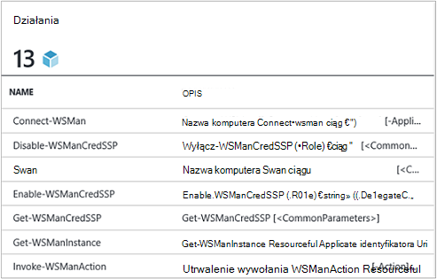
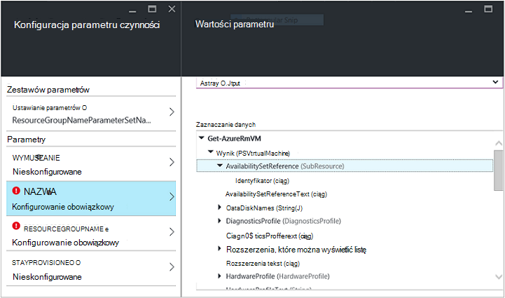
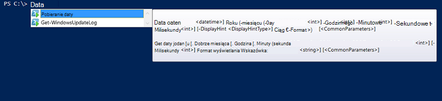

<properties
   pageTitle="Tworzenie modułu integracji Azure automatyzacji | Microsoft Azure"
   description="Samouczki który przeprowadzi Cię przez tworzenie, testowanie i przykład stosowania moduły integracji w automatyzacji Azure."
   services="automation"
   documentationCenter=""
   authors="mgoedtel"
   manager="jwhit"
   editor="" />

<tags
   ms.service="automation"
   ms.workload="tbd"
   ms.tgt_pltfrm="na"
   ms.devlang="na"
   ms.topic="get-started-article"
   ms.date="09/12/2016"
   ms.author="magoedte" />

# <a name="azure-automation-integration-modules"></a>Moduły integracji Azure automatyzacji

PowerShell jest podstawową technologią za automatyzacji Azure. Ponieważ automatyzacji Azure jest oparty na programu PowerShell, klucz rozszerzeń automatyzacji Azure są moduły programu PowerShell. W tym artykule firma Microsoft przeprowadzi Cię przez proces szczegółowe informacje na temat stosowania automatyzacji Azure modułów programu PowerShell, nazywane "Moduły integracji" i najlepsze rozwiązania dotyczące tworzenia moduły programu PowerShell, aby upewnić się, że działają jako moduły integracji w automatyzacji Azure. 

## <a name="what-is-a-powershell-module"></a>Co to jest modułu programu PowerShell?

Modułu programu PowerShell jest grupą poleceń cmdlet programu PowerShell, takie jak **Data Get** lub **Kopiuj element**, który może być używany z konsoli programu PowerShell, skryptów, przepływy pracy, runbooks i zasoby DSC programu PowerShell, takie jak WindowsFeature lub plik, który może być używany z konfiguracji DSC programu PowerShell. Wszystkie funkcje programu PowerShell jest dostępne za pośrednictwem polecenia cmdlet i zasoby DSC i wszystkich zasobów polecenia cmdlet-DSC jest przechowywana w modułu programu PowerShell wiele z której są dostarczane z programu PowerShell się. Na przykład polecenia cmdlet **Get-Data** jest częścią modułu programu PowerShell usługi Microsoft.PowerShell.Utility i polecenia cmdlet **Kopiuj element** jest częścią modułu programu Microsoft.PowerShell.Management PowerShell i zasobów DSC pakiet jest częścią modułu programu PSDesiredStateConfiguration PowerShell. Obie te moduły są dostarczane z programu PowerShell. Ale wielu modułów programu PowerShell nie są dostarczane jako część programu PowerShell i zamiast tego są rozdzielane z produktami pierwszego lub innych firm, takich jak Menedżer konfiguracji systemu Centrum 2012 lub ogromną społeczności programu PowerShell na miejsca na przykład galerii programu PowerShell.  Moduły są przydatne, ponieważ ich wykonywanie złożonych zadań za pomocą funkcji encapsulated prostsze.  Przedstawiono więcej informacji na temat [modułów programu PowerShell w witrynie MSDN](https://msdn.microsoft.com/library/dd878324%28v=vs.85%29.aspx). 

## <a name="what-is-an-azure-automation-integration-module"></a>Co to jest moduł integracji automatyzacji Azure?

Moduł integracji nie jest znacznie różni się od modułu programu PowerShell. Jego po prostu moduł programu PowerShell opcjonalnie zawierający jeden dodatkowy plik - pliku metadanych, określając automatyzacji Azure typu połączenia może być używany przy użyciu poleceń cmdlet modułu w runbooks. Opcjonalnie pliku lub nie, te programu PowerShell moduły można zaimportować do automatyzacji Azure udostępnienie ich poleceń cmdlet do użytku w obrębie runbooks i ich zasobów DSC dostępne do użytku w obrębie DSC konfiguracji. W tle automatyzacji Azure przechowuje te moduły i działań aranżacji zadania i czas wykonywania zadania compiliation DSC ładuje je do piasecznic automatyzacji Azure, gdzie są wykonywane runbooks i konfiguracji DSC są tworzone.  Wszystkie zasoby DSC w modułach są również automatycznie umieszczane na serwerze pobieraj DSC automatyzacji tak, aby mogą być pobierane przez komputery próby stosowanie DSC konfiguracji.  Liczba modułów Azure programu PowerShell możemy wysłać okno w automatyzacji Azure do użycia, więc można rozpocząć od razu Automatyzowanie Azure zarządzania, ale można łatwo importować moduły programu PowerShell dla niezależnie od systemu, usług lub narzędzi, które chcesz zintegrować z. 

>[AZURE.NOTE] Niektóre moduły są dostarczane jako "modułów globalnych" w usłudze automatyzacji. Te globalnej moduły są dostępne dla Ciebie okno po utworzeniu konta automatyzacji i firma Microsoft zaktualizuje ich tak, czasami, która automatycznie umieszcza ich do swojego konta automatyzacji. Jeśli nie mają być aktualizowane automatycznie, możesz zawsze zaimportować tego samego modułu samodzielnie, a które ma pierwszeństwo wersję modułu globalnej tego modułu, wysyłanej w usłudze. 

Format, w którym możesz zaimportować pakietu integracji modułu jest skompresowany plik z taką samą nazwę jak moduł i rozszerzeniem zip. Zawiera moduł programu Windows PowerShell i wszystkie pliki pomocnicze, w tym pliku manifestu (.psd1), jeśli moduł ma jedną.

Jeśli moduł ma zawierać typu połączenia automatyzacji Azure, musi zawierać plik o tej nazwie *<ModuleName>*-Automation.json, która określa właściwości Typ połączenia. To jest plik json umieszczony w folderze modułu plik skompresowany ZIP i zawiera pola "połączenia" jest wymagany do nawiązania połączenia systemu lub usługa reprezentuje modułu. Spowoduje to zakończenie tworzenia typu połączenia w automatyzacji Azure w górę. Przy użyciu tego pliku, możesz ustawić nazwy pól, typy, i tego, czy pola powinny być zaszyfrowane i / lub opcjonalne dla tego typu połączenia modułu. Szablon w formacie json jest następująca:

```
{ 
   "ConnectionFields": [
   {
      "IsEncrypted":  false,
      "IsOptional":  false,
      "Name":  "ComputerName",
      "TypeName":  "System.String"
   },
   {
      "IsEncrypted":  false,
      "IsOptional":  true,
      "Name":  "Username",
      "TypeName":  "System.String"
   },
   {
      "IsEncrypted":  true,
      "IsOptional":  false,
      "Name":  "Password",
   "TypeName":  "System.String"
   }],
   "ConnectionTypeName":  "DataProtectionManager",
   "IntegrationModuleName":  "DataProtectionManager"
}
```

Jeśli wdrożono usługi zarządzania automatyzacji i utworzony pakietów moduły integracji usługi runbooks automatyzacji, to powinna wyglądać dobrze znany użytkownikowi. 


## <a name="authoring-best-practices"></a>Do tworzenia najważniejsze wskazówki

Fakt, że jest to moduły integracji są zasadniczo moduły programu PowerShell, to nie oznacza, że nie mamy zbiór wskazówki wokół tworzenia ich. Nadal jest wiele czynności, które zalecamy zapoznanie należy rozważyć podczas tworzenia modułu programu PowerShell, aby nadać mu najbardziej użyteczne w automatyzacji Azure. Niektóre z nich są Azure automatyzacji określonego, a niektóre z nich są przydatne, tak moduły działa poprawnie przepływ pracy programu PowerShell, niezależnie od tego, czy korzystasz z automatyzacji. 

1. Zawierać streszczenie, opis i pomagają identyfikatora URI dla każdego polecenia cmdlet w module. W programie PowerShell można definiować określone informacje o polecenia cmdlet, aby umożliwić użytkownikowi uzyskać pomoc dotyczącą używania ich z polecenia cmdlet **Get-Help** . Na przykład Oto jak można definiować streszczenie i pomoc identyfikatora URI dla modułu programu PowerShell zapisane w pliku .psm1.<br>  

    ```
    <#
        .SYNOPSIS
         Gets all outgoing phone numbers for this Twilio account 
    #>
    function Get-TwilioPhoneNumbers {
    [CmdletBinding(DefaultParameterSetName='SpecifyConnectionFields', `
    HelpUri='http://www.twilio.com/docs/api/rest/outgoing-caller-ids')]
    param(
       [Parameter(ParameterSetName='SpecifyConnectionFields', Mandatory=$true)]
       [ValidateNotNullOrEmpty()]
       [string]
       $AccountSid,

       [Parameter(ParameterSetName='SpecifyConnectionFields', Mandatory=$true)]
       [ValidateNotNullOrEmpty()]
       [string]
       $AuthToken,

       [Parameter(ParameterSetName='UseConnectionObject', Mandatory=$true)]
       [ValidateNotNullOrEmpty()]
       [Hashtable]
       $Connection
    )

    $cred = CreateTwilioCredential -Connection $Connection -AccountSid $AccountSid -AuthToken $AuthToken

    $uri = "$TWILIO_BASE_URL/Accounts/" + $cred.UserName + "/IncomingPhoneNumbers"
    
    $response = Invoke-RestMethod -Method Get -Uri $uri -Credential $cred

    $response.TwilioResponse.IncomingPhoneNumbers.IncomingPhoneNumber
    }
    ```
<br> 
Zapewniające te informacje o nie będą wyświetlane tylko pomoc przy użyciu polecenia cmdlet **Get-Help** w konsoli programu PowerShell, również będą uwidaczniają co ta funkcja pomocy w automatyzacji Azure, na przykład podczas wstawiania działania podczas tworzenia działań aranżacji. Klikając pozycję "Wyświetl szczegółową pomoc" otworzy pomocy identyfikatora URI na innej karcie przeglądarki sieci web, którego używasz, aby uzyskać dostęp do automatyzacji Azure.<br>
2. Jeśli moduł jest uruchamiany przed system zdalny. Powinien zawierać plik metadanych integracji modułu, który definiuje informacje wymagane do połączenia zdalnego systemu, co oznacza typu połączenia. b. Każdego polecenia cmdlet w module powinno być możliwe podjęcie w obiekcie połączenia (wystąpienia tego typu połączenia) jako parametru.  
    Polecenia cmdlet w module łatwiejsza do użycia w automatyzacji Azure, jeśli są dozwolone przekazując obiekt z polami typu połączenia jako parametr do polecenia cmdlet. Ten sposób użytkownicy nie mają do mapowania parametrów połączenia trwałego odpowiednich parametrów polecenia cmdlet za każdym razem, wywołują polecenia cmdlet. Zasób połączenia Twilio o nazwie CorpTwilio oparty na powyższym przykładzie działań aranżacji, są używane do dostępu Twilio i zwrócić wszystkie numery telefonów w oknie konta.  Zwróć uwagę, jak ją jest mapowania pól połączenia na parametry polecenia cmdlet?<br>

    ```
    workflow Get-CorpTwilioPhones
    {
      $CorpTwilio = Get-AutomationConnection -Name 'CorpTwilio'
    
      Get-TwilioPhoneNumbers 
        -AccountSid $CorpTwilio.AccountSid  
        -AuthToken $CorptTwilio.AuthToken
    }
    ```
<br>
Łatwiejszy i poprawić sposób to podejście jest bezpośrednio przekazywania obiekt połączenia do polecenia cmdlet-

    ```
    workflow Get-CorpTwilioPhones
    {
      $CorpTwilio = Get-AutomationConnection -Name 'CorpTwilio'

      Get-TwilioPhoneNumbers -Connection $CorpTwilio
    }
    ```
<br>
Umożliwia zachowanie takiego do polecenia cmdlet, co pozwala im akceptować obiektu połączenia bezpośrednio jako parametr, a nie tylko połączenia pola dla parametrów. Zazwyczaj warto ustawić dla każdego parametru tak, aby użytkownik nie przy użyciu automatyzacji Azure można zadzwonić do polecenia cmdlet bez tworzenia skrótów ma pełnić rolę obiektu połączenie. Zestaw parametrów używanych **SpecifyConnectionFields** poniżej, aby przekazać połączenie właściwości pola pojedynczo. **UseConnectionObject** pozwala przekazać połączenie prosty. Jak widać, polecenia cmdlet TwilioSMS Wyślij w [modułu programu Twilio PowerShell](https://gallery.technet.microsoft.com/scriptcenter/Twilio-PowerShell-Module-8a8bfef8) umożliwia przekazywanie obie te metody: 

    ```
    function Send-TwilioSMS {
      [CmdletBinding(DefaultParameterSetName='SpecifyConnectionFields', `
      HelpUri='http://www.twilio.com/docs/api/rest/sending-sms')]
      param(
         [Parameter(ParameterSetName='SpecifyConnectionFields', Mandatory=$true)]
         [ValidateNotNullOrEmpty()]
         [string]
         $AccountSid,

         [Parameter(ParameterSetName='SpecifyConnectionFields', Mandatory=$true)]
         [ValidateNotNullOrEmpty()]
         [string]
         $AuthToken,

         [Parameter(ParameterSetName='UseConnectionObject', Mandatory=$true)]
         [ValidateNotNullOrEmpty()]
         [Hashtable]
         $Connection

       )
    }
    ```
<br>
3. Typ danych wyjściowych dla wszystkich apletów poleceń w module. Definiowanie typ danych wyjściowych dla polecenia cmdlet umożliwia IntelliSense projektowania ułatwiającymi właściwości wynik polecenia cmdlet do użytku podczas tworzenia. Jest szczególnie przydatne podczas automatyzacji działań aranżacji graficzne tworzenia, gdzie wiedzy czasu projektu jest klucz wrażenia użytkownika łatwe z modułu.<br> <br> To jest podobna do funkcji "wpisz przyszłość" wynik polecenia cmdlet w środowiska PowerShell ISE bez konieczności go uruchomić.<br> <br>
4. Polecenia cmdlet w module nie ma wykonywać typy obiektów złożonych parametrów. Przepływ pracy programu PowerShell różni się od programu PowerShell, w tym przechowywanych w niej typów złożonych w formularzu rozszeregowanym. Typy pierwotne zostanie zachowany jako pierwotnych, ale złożone typy są konwertowane na rozszeregowanym wersji, które są zasadniczo zbiory właściwości. Na przykład jeśli użyto polecenia cmdlet **Get-Process** działań aranżacji (lub przepływ pracy programu PowerShell dla tej sprawie) go zwróci obiekt typu [Deserialized.System.Diagnostic.Process], zamiast oczekiwanego typu [System.Diagnostic.Process]. Ten typ ma takie same właściwości jako typ rozszeregować, ale żadna z metod. A Jeśli spróbujesz przekazać tę wartość jako parametr do polecenia cmdlet, gdzie polecenia cmdlet oczekuje wartości [System.Diagnostic.Process] ten parametr, otrzymasz następujący komunikat o błędzie: *nie może przetworzyć argumentu przekształcenia w parametrze "proces". Błąd: "nie można przekonwertować wartości"System.Diagnostics.Process (CcmExec)"typ"Deserialized.System.Diagnostics.Process", aby wpisać"System.Diagnostics.Process".*   Jest tak, ponieważ istnieje niezgodność typu oczekiwanego typu [System.Diagnostic.Process] i danego typu [Deserialized.System.Diagnostic.Process]. Jak korzystać z tego problemu jest upewnij się, że polecenia cmdlet modułu nie zostać złożone typy parametrów. Oto sposób problem to zrobić.

    ```
    function Get-ProcessDescription {
      param (
            [System.Diagnostic.Process] $process
      )
      $process.Description
    }
    ``` 
<br>
A Oto sposób prawo, w podstawowy, który może być używany wewnętrznie przez polecenie cmdlet chwyć złożonych obiektu i używać go. Ponieważ polecenia cmdlet wykonać w kontekście programu PowerShell, nie programu PowerShell przepływu pracy wewnątrz polecenia cmdlet $process staje się poprawnych typów [System.Diagnostic.Process].  

    ```
    function Get-ProcessDescription {
      param (
            [String] $processName
      )
      $process = Get-Process -Name $processName

      $process.Description
    }
    ```
<br>
Połączenie środkami runbooks są hashtables, które są typu złożonego, a jeszcze te hashtables wydaje się, że można do przekazania do polecenia cmdlet dla ich — parametr połączenia dokładnie, z wyjątkiem nie cast. Technicznego niektóre typy programu PowerShell będą mogli rzutowania prawidłowo z ich seryjnych formularza do formularza rozszeregowanym i w związku z tym mogą być przekazywane do poleceń cmdlet parametrów akceptowania rozszeregowanym typu innego niż. Skrótów jest jednym z następujących. Istnieje możliwość autora modułu zdefiniowanych typów realizowane w sposób, który można poprawnie deserializacji także, ale istnieją pewne kompromisów nawiązać. Typ musi mieć konstruktora domyślnego, wszystkich właściwości publicznej i mieć PSTypeConverter. Dla typów już zdefiniowane, których nie ma modułu author, istnieje jednak sposobem "naprawczych", w związku z tym rekomendacji, aby uniknąć złożonych typów parametrów wszystko w jednym. Do tworzenia działań aranżacji Porada: Jeśli niektóre przyczyny Twoim potrzebom poleceń cmdlet podjęcie parametru złożony lub korzystasz z innej osoby modułu, który wymaga parametru złożony, obejście runbooks przepływu pracy programu PowerShell i PowerShel przepływów pracy w lokalnym programie PowerShell, jest zawijanie cmdlet generuje typu złożonego i polecenia cmdlet, który używa typu złożonego w tym samym działaniu InlineScript. Ponieważ InlineScript wykonuje jego zawartość jako programu PowerShell zamiast przepływu pracy programu PowerShell, polecenia cmdlet generowania typu złożonego przyjmie tego typu poprawna nie rozszeregowanym złożony.
5. Wprowadź wszystkie polecenia cmdlet w module bezstanowym. PowerShell przepływ pracy jest uruchamiany co polecenia cmdlet o nazwie w ramach przepływu pracy w innej sesji. Oznacza to, że wszelkie polecenia cmdlet, które są zależne od stanu sesji utworzone / zmodyfikowane przez inne polecenia cmdlet, w tym samym module nie będzie działać w runbooks przepływu pracy programu PowerShell.  Oto przykład co nie.

    ```
    $globalNum = 0
    function Set-GlobalNum {
       param(
           [int] $num
       )
      
       $globalNum = $num
    }
    function Get-GlobalNumTimesTwo {
       $output = $globalNum * 2
     
       $output
    }
    ```
<br>
6. Moduł powinien w pełni zawarte w pakiecie Xcopy możliwe. Ponieważ moduły automatyzacji Azure są rozdzielane piasecznic automatyzacji po runbooks potrzebny do wykonania, muszą działają niezależnie od hosta, które działają w. Co to oznacza to, że powinno być możliwe do pliku Zip w górę pakietu modułu przeniesienie go do innych hosta z tym samym lub nowsza wersja programu PowerShell, a ich działania w normalny sposób importowane do środowiska PowerShell internetowej hosta. Aby, który występował moduł nie należy uwzględniać pliki poza folderem modułu (folder, który pobiera zip w górę, podczas importowania danych do automatyzacji Azure) lub wszelkie ustawienia rejestru unikatowe na hoście, takich jak ustawionych przy użyciu instalacji produktu. Jeśli nie zostanie użyte tej najważniejszej wskazówki, moduł będzie niemożliwe w automatyzacji Azure.  

## <a name="next-steps"></a>Następne kroki

- Aby rozpocząć pracę z runbooks przepływu pracy programu PowerShell, zobacz [Moje pierwszego działań aranżacji przepływu pracy programu PowerShell](automation-first-runbook-textual.md)
- Aby dowiedzieć się więcej na temat tworzenia modułów programu PowerShell, zobacz [Zapisywanie moduł Windows PowerShell](https://msdn.microsoft.com/library/dd878310%28v=vs.85%29.aspx)