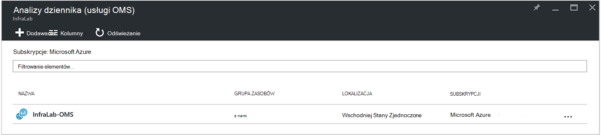

<properties
    pageTitle="Przesyłanie dalej stan zadania i zadania strumieni z automatyzacji do dziennika analizy (usługi OMS) | Microsoft Azure"
    description="W tym artykule przedstawiono sposób Wyślij stan zadania i działań aranżacji strumienie zadania do programu Microsoft operacje zarządzania pakietu dziennika analizy do przeprowadzania dodatkowy wgląd i zarządzania."
    services="automation"
    documentationCenter=""
    authors="MGoedtel"
    manager="jwhit"
    editor="tysonn" />
<tags
    ms.service="automation"
    ms.devlang="na"
    ms.topic="article"
    ms.tgt_pltfrm="na"
    ms.workload="infrastructure-services"
    ms.date="09/22/2016"
    ms.author="magoedte" />

# Przesyłanie dalej stan zadania i zadania strumieni z automatyzacji do dziennika analizy (usługi OMS)

Automatyzacja można wysłać działań aranżacji strumienie stanu i zlecenia zadania do obszaru roboczego analizy dziennika pakietu Microsoft operacje zarządzania usługi (OMS).  Gdy można wyświetlić te informacje w portalu Azure lub za pomocą programu PowerShell według stanu poszczególnych zadań lub wszystkich zadań dla określonego konta automatyzacji, nic zaawansowane do obsługi wymagań operacyjnych wymaga do tworzenia własnych skryptów programu PowerShell.  Teraz Anaytics dziennika umożliwiają:

- Uzyskać informacje na temat automatyzację zadań 
- Wyświetlanie wiadomości e-mail lub alert według stanu zadań wykonywania działań aranżacji (np. nie powiodło się lub zawieszone) 
- Pisanie zapytania zaawansowane przez strumienie zadania 
- Przeniesionym zadania na kontach automatyzacji 
- Wizualizowanie historii zadania w czasie     

## Wymagania wstępne i zagadnienia dotyczące rozmieszczania

Aby rozpocząć wysyłanie dzienników automatyzacji do analizy dziennika, musi mieć następujące czynności:

1. Subskrypcja usługi OMS. Aby uzyskać dodatkowe informacje zobacz [Wprowadzenie do analizy dziennika](../log-analytics/log-analytics-get-started.md).  

    >[AZURE.NOTE]Obszar roboczy usługi OMS i automatyzacji konta muszą być w tej samej subskrypcji Azure w kolejności dla tej konfiguracji działać poprawnie. 
  
2. [Magazyn Azure konta](../storage/storage-create-storage-account.md).  
   
    >[AZURE.NOTE]Konto miejsca do magazynowania *musi* być w tym samym regionie jako konto automatyzacji. 
 
3. Azure programu PowerShell z wersji 1.0.8 lub nowszej poleceń cmdlet operacyjne wnioski. Aby uzyskać informacje o tej wersji i jak ją zainstalować zobacz [jak zainstalować i skonfigurować Azure programu PowerShell](../powershell-install-configure.md).
4. Azure diagnostyki i programu PowerShell analizy dziennika.  Aby uzyskać więcej informacji o tej wersji i jak ją zainstalować zobacz [Azure diagnostyczne i analizy dziennika](https://www.powershellgallery.com/packages/AzureDiagnosticsAndLogAnalytics/0.1).  
5. Pobierz skrypt programu PowerShell **Włącz AzureDiagnostics.ps1** z [Galerii programu PowerShell](https://www.powershellgallery.com/packages/Enable-AzureDiagnostics/1.0/DisplayScript). Ten skrypt będzie skonfigurować następujące ustawienia:
 - Konto miejsca do magazynowania do przechowywania działań aranżacji zadania stan i strumienia dane dla konta automatyzacji.
 - Włącz zbieranie danych z Twojego konta automatyzacji, aby zapisać go na koncie magazyn obiektów Blob platformy Azure w formacie JSON.
 - Konfigurowanie zbierania danych z Twojego konta magazyn obiektów Blob do analizy dziennika usługi OMS.
 - Włącz rozwiązanie automatyzacji dziennika analizy usługi OMS obszaru roboczego.   

Skrypt **AzureDiagnostics.ps1 Włącz** wymaga następujących parametrów podczas wykonywania:

- *AutomationAccountName* - nazwę swojego konta automatyzacji
- *LogAnalyticsWorkspaceName* - nazwę obszaru roboczego usługi OMS

Aby znaleźć wartości *AutomationAccountName*, w portalu Azure Wybieranie konta automatyzacji z karta **konta automatyzacji** oraz **wszystkie ustawienia**.  Z karta **wszystkie ustawienia** w obszarze **Ustawienia konta** wybierz pozycję **Właściwości**.  Karta **Właściwości** Zanotuj te wartości.  .

## Konfigurowanie integracji z analizy dziennika

1. Na komputerze uruchom program **Windows PowerShell** na ekranie **startowym** .  
2. Z powłoka wiersza polecenia programu PowerShell *- AutomationAccountName* i *- LogAnalyticsWorkspaceName*przejdź do folderu, który zawiera skrypt pobierane i wykonaj ją zmiana wartości parametrów.

    >[AZURE.NOTE] Wyświetli monit o uwierzytelniania Azure po wykonaniu skryptu.  , **Musisz** zalogować się przy użyciu konta, które jest członkiem roli Administratorzy subskrypcji i Współtworzenie administrator subskrypcji.   
    
        .\Enable-AzureDiagnostics -AutomationAccountName <NameofAutomationAccount> `
        -LogAnalyticsWorkspaceName <NameofOMSWorkspace> `

3. Po uruchomieniu tego skryptu znajdą około 30 minut po nowe dane diagnostyczne napisano w celu przechowywania rekordów w dzienniku analizy.  Jeśli rekordy nie są dostępne po tej chwili można znaleźć w sekcji rozwiązywania problemów w [plikach JSON w magazynie obiektów blob](../log-analytics/log-analytics-azure-storage-json.md#troubleshooting-configuration-for-azure-diagnostics-written-to-blob-in-json).

### Sprawdź konfigurację

Aby potwierdzić, że skrypt swoje konto automatyzacji i wokspace usługi OMS został pomyślnie skonfigurowany, można wykonywać następujące czynności w programie PowerShell.  Przed możesz to zrobić, w celu znalezienia wartości swoją nazwę obszaru roboczego usługi OMS i nazwa grupy zasobów z poziomu portalu Azure, przejdź do dziennika analizy (usługi OMS) i karta usługi dziennika analizy (OMS) Zanotuj wartość dla **nazwy** i **Grupa zasobów**.   użyjemy tych dwóch wartości, gdy mamy Sprawdź konfigurację w obszarze roboczym usługi OMS przy użyciu polecenia cmdlet [Get-AzureRmOperationalInsightsStorageInsight](https://msdn.microsoft.com/library/mt603567.aspx)programu PowerShell.

1.  Z poziomu portalu Azure przejdź do miejsca do magazynowania kont i wyszukaj następujące konta miejsca do magazynowania, które korzysta z konwencji nazewnictwa - *AutomationAccountNameomsstorage*.  Po działań aranżacji zadanie kończy wkrótce po powinny być widoczne dwie obiektów Blob kontenerów utworzony — **wnioski dzienniki joblogs** i **wniosków dzienniki jobstreams**.  

2.  Z programu PowerShell uruchom poniższy kod programu PowerShell, zmiana wartości parametrów **ResourceGroupName** i **WorkspaceName** , który został skopiowany lub wspomniano wcześniej.  

    AzureRmAccount logowania Get-AzureRmSubscription - SubscriptionName "SubscriptionName" | Pobieranie zestawu AzureRmContext-AzureRmOperationalInsightsStorageInsight - ResourceGroupName "OMSResourceGroupName" "-"OMSWorkspaceName"obszaru roboczego 

    Spowoduje to przywrócenie wglądu miejsca do magazynowania dla określonego obszaru roboczego usługi OMS.  Chcemy potwierdzić wglądu miejsca do magazynowania dla konta automatyzacji, które możemy określonej wcześniej istnieje i obiekt **stanu** zawiera wartości **OK**.  .

## Rekordy analizy dziennika

Automatyzacja tworzy dwa typy rekordów w repozytorium usługi OMS.

### Dzienniki zadania

Właściwość | Opis|
----------|----------|
Czas | Data i godzina, kiedy zadanie działań aranżacji wykonane.|
resourceId | Określa typ zasobu w Azure.  Automatyzacji wartość jest konto automatyzacji skojarzone z działań aranżacji.|
operationName | Określa rodzaj operacji wykonywanych w Azure.  Automatyzacja wartość będzie zadania.|
resultType | Stan zadania działań aranżacji.  Możliwe wartości są następujące: — Wprowadzenie -Zatrzymane -Zawieszone — Nie powiodła się -Powiodła się|
resultDescription | W tym artykule opisano stan wynik działań aranżacji zadania.  Możliwe wartości są następujące: -Zadanie jest uruchomione -Zadania nie powiodła się -Zadanie zostało zakończone|
CorrelationId | Identyfikator GUID, który jest identyfikator korelacji działań aranżacji zadania.|
Kategoria | Klasyfikacja typu danych.  Automatyzacja wartość jest JobLogs.|
RunbookName | Nazwa zestawu działań aranżacji.|
JobId | Identyfikator GUID, który jest identyfikator zadania działań aranżacji.|
Rozmówcy |  Kto rozpoczął operację.  Możliwe wartości to adres e-mail lub systemu zaplanowanych zadań.|

### Strumienie zadania
Właściwość | Opis|
----------|----------|
Czas | Data i godzina, kiedy zadanie działań aranżacji wykonane.|
resourceId | Określa typ zasobu w Azure.  Automatyzacji wartość jest konto automatyzacji skojarzone z działań aranżacji.|
operationName | Określa rodzaj operacji wykonywanych w Azure.  Automatyzacja wartość będzie zadania.|
resultType | Stan zadania działań aranżacji.  Możliwe wartości są następujące: -Trakcie wykonywania|
resultDescription | Zawiera strumienia wyjściowego ze działań aranżacji.|
CorrelationId | Identyfikator GUID, który jest identyfikator korelacji działań aranżacji zadania.|
Kategoria | Klasyfikacja typu danych.  Automatyzacja wartość jest JobStreams.|
RunbookName | Nazwa zestawu działań aranżacji.|
JobId | Identyfikator GUID, który jest identyfikator zadania działań aranżacji.|
Rozmówcy | Kto rozpoczął operację.  Możliwe wartości to adres e-mail lub systemu zaplanowanych zadań.| 
StreamType | Typ zadania strumienia. Możliwe wartości są następujące: -Postępu -Wyników -Ostrzeżenie -Błąd -Debugowanie — Pełne|

## Wyświetlanie automatyzacji dzienniki w analizy dziennika 

Teraz, gdy zostało rozpoczęte wysyłanie dzienników zadania automatyzacji do analizy dziennika, zobaczmy, co można zrobić za pomocą tych dzienników wewnątrz usługi OMS.   

### Wysyłanie wiadomości e-mail, gdy zadanie działań aranżacji nie powiedzie się lub zawiesza 

Jeden z naszych górny klienta zapytaniem, aby uzyskać możliwość wysyłania wiadomości e-mail lub tekstu, gdy wystąpią problemy z zadaniem działań aranżacji.   

Aby utworzyć regułę alertu, rozpoczyna się od utworzenia dziennika wyszukiwanie działań aranżacji rekordów zadań, które należy wywołać alert.  Przycisk **Alert** będzie dostępny, można utworzyć i skonfigurować regułę alertu.

1.  Na stronie Omówienie usługi OMS kliknij przycisk **Wyszukaj dziennika**.
2.  Tworzenie kwerendy wyszukiwania dziennika alertu, wpisując następujące w polu kwerendy: `Category=JobLogs (ResultType=Failed || ResultType=Suspended)`.  Można również grupować dane według RunbookName przy użyciu: `Category=JobLogs (ResultType=Failed || ResultType=Suspended) | measure Count() by RunbookName_s`.   
  
    Jeśli masz skonfigurowane dzienników z więcej niż jednego konta automatyzacji lub subskrypcji w obszarze roboczym, także mogą skorzystać z grupowania alertów przez subskrypcję lub konto automatyzacji.  Nazwa konta automatyzacji mogą pochodzić z pola zasobu w wyszukiwaniu JobLogs.  

3.  Kliknij pozycję **Alert** w górnej części strony Aby otworzyć ekran **Dodaj regułę alertu** .  Aby uzyskać szczegółowe informacje na temat opcji, aby skonfigurować alert zobacz [alerty w dzienniku analizy](../log-analytics/log-analytics-alerts.md#creating-an-alert-rule).

### Znajdowanie wszystkich zadań, które zostały wykonane z błędami 

Oprócz alertu podstawie poza błędy, prawdopodobnie chcesz wiedzieć, kiedy zadanie działań aranżacji miał błędem zakończenie (programu PowerShell tworzy strumień błędu, ale -zakończenie błędy nie powodują zadania wstrzymać lub zakończyć się niepowodzeniem).    

1. W portalu usługi OMS kliknij przycisk **Wyszukaj dziennika**.
2. W polu kwerendy wpisz `Category=JobStreams StreamType_s=Error | measure count() by JobId_g` , a następnie kliknij przycisk **Wyszukaj**.

### Widok strumieni zadania dla zadania  

Podczas debugowania zadanie, możesz do strumieni zadania.  Poniższa kwerenda przedstawia wszystkie strumienie dla pojedynczego zadania z 2ebd22ea-e05e-4eb9 - 9d GUID 76-d73cbd4356e0:   

`Category=JobStreams JobId_g="2ebd22ea-e05e-4eb9-9d76-d73cbd4356e0" | sort TimeGenerated | select ResultDescription` 

### Stan zadania historycznych widoku 

Ponadto można wizualizowanie historii zadania w czasie.  Za pomocą tej kwerendy wyszukiwania stanu zadań w czasie. 

`Category=JobLogs NOT(ResultType="started") | measure Count() by ResultType interval 1day`  
   

## Podsumowanie

Wysyłając automatyzację zadań stanu strumienia danych i do analizy dziennika, możesz uzyskać lepszy wgląd w stan zadań automatyzacji konfigurując alerty o osiągnięciu problem i niestandardowe pulpity nawigacyjne za pomocą zapytania zaawansowane wizualizacji wyniki działań aranżacji, stan zadania działań aranżacji i innych powiązanych kluczowych wskaźników lub metryki.  Dzięki temu zapewniają większą widoczność operacyjne i zdarzeń adres szybsze.  

## Następne kroki

- Aby dowiedzieć się więcej na temat konstruowania kwerend wyszukiwania różnych i przejrzyj dzienniki zadania automatyzacji z analizy dziennika, zobacz [wyszukiwania dziennika do analizy dziennika](../log-analytics/log-analytics-log-searches.md)
- Aby dowiedzieć się, jak tworzyć i pobierać dane wyjściowe i komunikaty o błędach z runbooks, zobacz [dane wyjściowe działań aranżacji i wiadomości](automation-runbook-output-and-messages.md) 
- Aby dowiedzieć się więcej na temat wykonywanie działań aranżacji jak monitorowanie działań aranżacji zadania i inne szczegóły techniczne, zobacz [Śledzenie działań aranżacji zadania](automation-runbook-execution.md)
- Aby dowiedzieć się więcej na temat analizy dziennika usługi OMS i źródła zbioru danych, zobacz [Zbieranie Azure miejsca do magazynowania danych w omówienie analizy dziennika](../log-analytics/log-analytics-azure-storage.md)