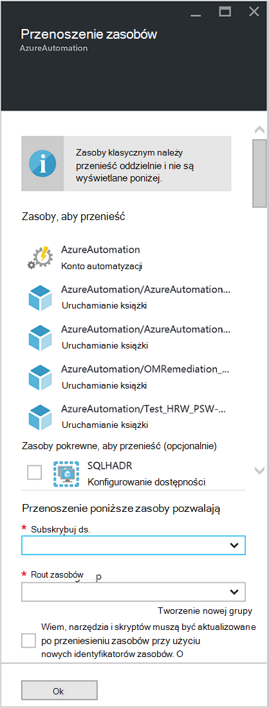

<properties
   pageTitle="Migrowanie kont automatyzacji i zasoby | Microsoft Azure"
   description="W tym artykule opisano, jak przenieść konto automatyzacji w automatyzacji Azure i skojarzonych z nimi zasobów z jedną subskrypcję."
   services="automation"
   documentationCenter=""
   authors="MGoedtel"
   manager="jwhit"
   editor="tysonn" />
<tags
   ms.service="automation"
   ms.devlang="na"
   ms.topic="article"
   ms.tgt_pltfrm="na"
   ms.workload="infrastructure-services"
   ms.date="07/07/2016"
   ms.author="magoedte" />

# <a name="migrate-automation-account-and-resources"></a>Migrowanie kont automatyzacji i zasobów

Dla kont automatyzacji i jego zasobów skojarzony (to znaczy aktywa, runbooks, moduły itp.), które zostały utworzone w portalu Azure i chcesz przeprowadzić migrację z jednej grupy zasobów do innego lub z jedną subskrypcję do innej można to zrobić łatwo funkcją [Przenoszenie zasobów](../resource-group-move-resources.md) dostępnych w portalu Azure. Jednak przed wykonaniem tej czynności, należy najpierw przejrzeć Poniższa [Lista kontrolna przed przeniesieniem zasobów](../resource-group-move-resources.md#Checklist-before-moving-resources) , a ponadto listą poniższe automatyzacji.   

1.  Grupa subskrypcji i zasobów miejsce docelowe musi być w tym samym regionie jako źródła.  To znaczy, automatyzacji konta nie można przenosić między różnymi regionami.
2.  Podczas przenoszenia zasobów (runbooks, zadania, itd.), zarówno w grupie źródła, jak i w grupie docelowej są zablokowane na czas wykonywania operacji. Pisanie i usuwanie operacji są blokowane w grupach, aż do zakończenia Przenieś.  
3.  Wszelkie runbooks lub zmienne, które odwoływać identyfikator zasobu lub innej subskrypcji z istniejącej subskrypcji będzie konieczne będzie aktualizowany po zakończeniu migracji.   


>[AZURE.NOTE] Ta funkcja nie obsługuje przenoszenie klasyczny automatyzacji zasobów.

## <a name="to-move-the-automation-account-using-the-portal"></a>Aby przenieść konto automatyzacji za pomocą portalu

1. Z Twoim kontem automatyzacji kliknij przycisk **Przenieś** w górnej części karta.<br> <br> 
2. Na karta **przenosić zasoby** należy zauważyć, że prezentowane przy jego użyciu zasobów powiązanych zarówno konta automatyzacji, jak i do grup zasobów.  Wybierz **subskrypcję** i **Grupa zasobów** z list rozwijanych, lub wybierz opcję **Utwórz nową grupę zasobów** i wprowadź nazwę nowej grupy zasobów w dostępnym polu.  
3. Przeglądanie i zaznacz pole wyboru, aby potwierdzić możesz *Opis narzędzia i skrypty muszą być aktualizowane po przeniesieniu zasobów za pomocą nowego zasobu identyfikatorów* , a następnie kliknij **przycisk OK**.<br> <br>   

Ta akcja potrwa kilka minut.  **Powiadomienia**, zostaną wyświetlone ze stanem każdej akcji, która ma być wykonywana — sprawdzanie poprawności, migracji, a następnie na końcu, gdy zostanie ukończona.     

## <a name="to-move-the-automation-account-using-powershell"></a>Aby przenieść konto automatyzacji za pomocą programu PowerShell

Aby przenieść istniejących zasobów automatyzacji do innej grupy zasobów lub subskrypcji, użyj polecenia cmdlet **Get-AzureRmResource** , aby uzyskać określone konto automatyzacji, a następnie **Przenieś AzureRmResource** polecenia cmdlet, aby wykonać przenoszenie.

W pierwszym przykładzie pokazano sposób przenoszenia konta automatyzacji do nowej grupy zasobów.

   ```
    $resource = Get-AzureRmResource -ResourceName "TestAutomationAccount" -ResourceGroupName "ResourceGroup01"
    Move-AzureRmResource -ResourceId $resource.ResourceId -DestinationResourceGroupName "NewResourceGroup"
   ``` 

Po wykonać w powyższym przykładzie kodu, pojawi się monit, aby sprawdzić, czy chcesz wykonać tę akcję.  Po kliknij przycisk **Tak** i skryptów kontynuować, nie będziesz odbierać powiadomienia, gdy działa ona migracji.  

Aby przejść do nowej subskrypcji, Uwzględnij wartości parametru *DestinationSubscriptionId* .

   ```
    $resource = Get-AzureRmResource -ResourceName "TestAutomationAccount" -ResourceGroupName "ResourceGroup01"
    Move-AzureRmResource -ResourceId $resource.ResourceId -DestinationResourceGroupName "NewResourceGroup" -DestinationSubscriptionId "SubscriptionId"
   ``` 

Podobnie jak w poprzednim przykładzie zostanie wyświetlony monit o potwierdzenie Przenieś.  

## <a name="next-steps"></a>Następne kroki

- Aby uzyskać więcej informacji na temat przenoszenia zasobów do nowej grupy zasobów lub innej subskrypcji zobacz [Przenoszenie zasobów do nowej grupy zasobów lub innej subskrypcji](../resource-group-move-resources.md)
- Aby uzyskać więcej informacji na temat oparta na rolach kontrola dostępu w usłudze automatyzacji Azure dotyczą [Kontrola dostępu oparta na rolach w automatyzacji Azure](../automation/automation-role-based-access-control.md).
- Aby uzyskać informacje dotyczące poleceń cmdlet środowiska PowerShell do zarządzania subskrypcji, zobacz [Za pomocą programu Azure przy użyciu Menedżera zasobów](../powershell-azure-resource-manager.md)
- Aby uzyskać informacje o portalu funkcje związane z zarządzaniem subskrypcji, zobacz [Używanie Portal Azure do zarządzania zasobami](../azure-portal/resource-group-portal.md). 
