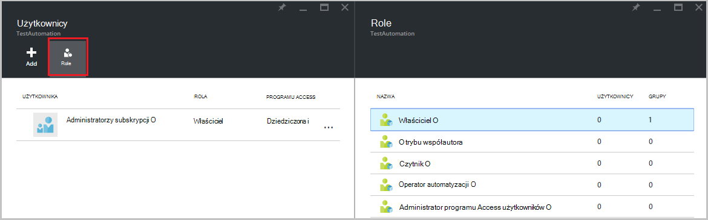
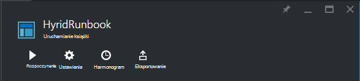

<properties 
   pageTitle="Kontrola dostępu oparta na rolach w automatyzacji Azure | Microsoft Azure"
   description="Kontrola dostępu oparta na rolach (RBAC) umożliwia zarządzanie dostępem Azure zasobów. W tym artykule opisano, jak skonfigurować RBAC w automatyzacji Azure."
   services="automation"
   documentationCenter=""
   authors="mgoedtel"
   manager="jwhit"
   editor="tysonn"
   keywords="rbac automatyzacji azure rbac kontrola dostępu oparta na rolach" />
<tags 
   ms.service="automation"
   ms.devlang="na"
   ms.topic="get-started-article"
   ms.tgt_pltfrm="na"
   ms.workload="infrastructure-services"
   ms.date="09/12/2016"
   ms.author="magoedte;sngun"/>

# Kontrola dostępu oparta na rolach w automatyzacji Azure

## Kontrola dostępu oparta na rolach

Kontrola dostępu oparta na rolach (RBAC) umożliwia zarządzanie dostępem Azure zasobów. Przy użyciu [RBAC](../active-directory/role-based-access-control-configure.md), można oddzielnie różnic obowiązków w obrębie organizacji i udzielić tylko ilość dostępu użytkowników, grupy i aplikacje, które są potrzebne do wykonywania zadań. Oparta na rolach programu access mogą być przyznane użytkowników przy użyciu Azure portal, Azure narzędzia wiersza polecenia lub interfejsy API zarządzania Azure.

## RBAC w automatyzacji konta

W automatyzacji Azure dostęp jest przyznany przypisując odpowiednią rolę RBAC do użytkowników, grupy i aplikacje w zakresie kont automatyzacji. Poniżej wymieniono role wbudowanych obsługiwane za pomocą konta automatyzacji:  

|**Rola** | **Opis** |
|:--- |:---|
| Właściciel | Rola właściciel umożliwia dostęp do wszystkich zasobów i akcje w ramach jednego konta automatyzacji, umieszczając dostęp do innych użytkowników, grupy i aplikacje do zarządzania kontem automatyzacji. |
| Trybu współautora | Rola współautora umożliwia zarządzanie wszystko oprócz modyfikowanie uprawnień dostępu przez innego użytkownika z klientem automatyzacji. |
| Czytnik | Rola czytnik umożliwia wyświetlenie wszystkich zasobów na koncie automatyzacji, ale nie można wprowadzać zmiany.|
| Operator automatyzacji | Operator automatyzacji roli umożliwia wykonywanie zadań operacyjnych, takich jak rozpoczęcie, Zatrzymaj, zawieszania, życiorys i planowanie zadań. Ta rola jest przydatne, jeśli chcesz ochronić zasobów automatyzacji konta takie jak aktywa poświadczenia i runbooks przed wyświetlać lub modyfikować, ale nadal umożliwia członkom Twojej organizacji wykonać te runbooks. |
| Administrator dostępu użytkowników | Rola administratora dostępu użytkowników umożliwia zarządzanie dostępem użytkowników z kontami automatyzacji Azure. |

>[AZURE.NOTE] Nie można udzielić praw dostępu do określonych działań aranżacji lub runbooks, tylko do zasobów i akcje w ramach konta automatyzacji.  

W tym artykule możemy przeprowadzi Cię przez konfigurowania RBAC w automatyzacji Azure. Ale najpierw Przyjrzyjmy się przyjrzeć się bliżej poszczególnych uprawnień współautora, czytnika, Operator automatyzacji i Administrator dostępu użytkowników tak, aby uzyskać możemy dobrze zapoznać się przed przyznaniem każdy uprawnień do konta automatyzacji.  W przeciwnym razie może powodować niezamierzonych lub niepożądane skutki.     

## Uprawnienia roli współautora

W poniższej tabeli przedstawiono określone akcje, które mogą być wykonywane przez Rola współautora w przypadku automatyzacji.

| **Typ zasobu** | **Odczyt** | **Pisanie** | **Usuwanie** | **Inne akcje** |
|:--- |:---|:--- |:---|:--- |
| Konto Azure automatyzacji |  |  |  | | 
| Automatyzacja certyfikat zawartości |  |  |  | |
| Automatyzacja połączenia zawartości |  |  |  | | 
| Automatyzacja połączenia typu zawartości |  |  |  | | 
| Automatyzacja poświadczeń zawartości |  |  |  | |
| Automatyzacja harmonogram zasobów |  |  |  | |
| Automatyzacja zmiennych składników majątku |  |  |  | |
| Automatyzacja potrzeby stanu konfiguracji | | | |  |
| Typ zasobu pracownik działań aranżacji hybrydowego |  | |  | | 
| Zadanie Azure Automation |  |  | |  | 
| Automatyzacja zadań strumienia |  | | | | 
| Harmonogram zadań automatyzacji |  |  |  | |
| Moduł automatyzacji |  |  |  | |
| Azure automatyzacji działań aranżacji |  |  |  |  |
| Wersja robocza działań aranżacji automatyzacji |  | | |  |
| Zadania testowego projekt działań aranżacji automatyzacji |  |  | |  | 
| Webhook automatyzacji |  |  |  |  |

## Uprawnienia roli Reader

W poniższej tabeli przedstawiono określonych akcji, które mogą być wykonywane przez tę rolę czytnika w automatyzacji.

| **Typ zasobu** | **Odczyt** | **Pisanie** | **Usuwanie** | **Inne akcje** |
|:--- |:---|:--- |:---|:--- |
| Administrator klasyczny subskrypcji |  | | | 
| Zarządzanie blokady |  | | | 
| Uprawnień |  | | |
| Operacje dostawcy |  | | | 
| Przypisanie roli |  | | | 
| Definicja roli |  | | | 

## Uprawnienia roli operatora automatyzacji

W poniższej tabeli przedstawiono określonych akcji, które mogą być wykonywane przez tę rolę Operator automatyzacji w automatyzacji.

| **Typ zasobu** | **Odczyt** | **Pisanie** | **Usuwanie** | **Inne akcje** |
|:--- |:---|:--- |:---|:--- |
| Konto Azure automatyzacji |  | | | 
| Automatyzacja certyfikat zawartości | | | |
| Automatyzacja połączenia zawartości | | | |
| Automatyzacja połączenia typu zawartości | | | |
| Automatyzacja poświadczeń zawartości | | | |
| Automatyzacja harmonogram zasobów |  |  | | |
| Automatyzacja zmiennych składników majątku | | | |
| Automatyzacja potrzeby stanu konfiguracji | | | | |
| Typ zasobu pracownik działań aranżacji hybrydowego | | | | | 
| Zadanie Azure Automation |  |  | |  | 
| Automatyzacja zadań strumienia |  | | |  
| Harmonogram zadań automatyzacji |  |  | | |
| Moduł automatyzacji | | | |
| Azure automatyzacji działań aranżacji |  | | | |
| Wersja robocza działań aranżacji automatyzacji | | | |
| Zadania testowego projekt działań aranżacji automatyzacji | | | |  
| Webhook automatyzacji | | | |

Aby uzyskać szczegółowe informacje, [Akcje operator automatyzacji](../active-directory/role-based-access-built-in-roles.md#automation-operator) wymieniono akcje obsługiwane przez tę rolę operator automatyzacji na rachunku automatyzacji i jego zasobów.

## Uprawnienia roli administratora dostępu użytkowników

W poniższej tabeli przedstawiono określonych akcji, które mogą być wykonywane przez tę rolę administratora dostępu użytkowników w usłudze automatyzacji.

| **Typ zasobu** | **Odczyt** | **Pisanie** | **Usuwanie** | **Inne akcje** |
|:--- |:---|:--- |:---|:--- |
| Konto Azure automatyzacji |  | | | |
| Automatyzacja certyfikat zawartości |  | | | |
| Automatyzacja połączenia zawartości |  | | | |
| Automatyzacja połączenia typu zawartości |  | | | |
| Automatyzacja poświadczeń zawartości |  | | | |
| Automatyzacja harmonogram zasobów |  | | | |
| Automatyzacja zmiennych składników majątku |  | | | |
| Automatyzacja potrzeby stanu konfiguracji | | | | |
| Typ zasobu pracownik działań aranżacji hybrydowego |  | | | | 
| Zadanie Azure Automation |  | | | | 
| Automatyzacja zadań strumienia |  | | | | 
| Harmonogram zadań automatyzacji |  | | | |
| Moduł automatyzacji |  | | | |
| Azure automatyzacji działań aranżacji |  | | | |
| Wersja robocza działań aranżacji automatyzacji |  | | | |
| Zadania testowego projekt działań aranżacji automatyzacji |  | | | | 
| Webhook automatyzacji |  | | |

## Konfigurowanie RBAC dla Twojego konta automatyzacji przy użyciu Azure Portal

1.  Zaloguj się do usługi [Azure Portal](https://portal.azure.com/) i otwórz konta automatyzacji z karta konta automatyzacji.  

2.  Wybierz polecenie Kontrola **dostępu** w prawym górnym rogu. Spowoduje to otwarcie karta **użytkowników** , w którym można dodawać nowych użytkowników, grupy i aplikacji zarządzać swoim kontem automatyzacji i wyświetlanie istniejących ról skonfigurowane dla konta automatyzacji.  

      

>[AZURE.NOTE] **Administratorzy subskrypcja** już istnieje jako użytkownika domyślnego. Grupy usługi active directory Administratorzy Subskrypcja obejmuje administratorom usługi i co-administrator(s) Azure subskrypcji. Administrator usługi jest właścicielem subskrypcji usługi Azure i jego zasobów, a zostanie mają roli właściciel dziedziczone w przypadku kont automatyzacji zbyt. Oznacza to, że dostęp jest **dziedziczone** dla **administratorów usług i administratorów współpracujących** subskrypcję i jej **przypisane** dla wszystkich innych użytkowników. Kliknij pozycję **Administratorzy subskrypcji** , aby wyświetlić szczegółowe informacje o jego uprawnień.  

### Dodawanie nowego użytkownika i przypisywanie roli

1.  Z karta użytkowników kliknij przycisk **Dodaj** , aby otworzyć **Karta dostęp Dodaj** miejsce, w którym można dodać użytkownika, grupy lub aplikacji i przypisywanie roli do nich.  

      

2.  Wybierz rolę z listy dostępnych ról. Firma Microsoft wybierze roli **czytnika** , ale możesz wybrać jedną z dostępnych ról wbudowane konta automatyzacji obsługiwane przez lub niestandardową rolę, które zostały zdefiniowane.  

      

3.  Kliknij pozycję **Dodawaj użytkowników** , aby otworzyć karta **Dodawanie użytkowników** . Po dodaniu odpowiednich użytkowników, grup lub aplikacje, aby zarządzać subskrypcją znajdują się tych użytkowników, a następnie możesz wybrać je w celu dodania programu access. Jeśli nie ma żadnych użytkowników na liście lub jeśli użytkownik interesuje Cię dodawania nie ma na liście kliknij pozycję **Zaproś** , aby otworzyć karta **Zaproś gości** , gdzie możesz zaprosić użytkownika z prawidłowy adres e-mail konta Microsoft, takich jak Outlook.com, OneDrive i Xbox Live ID. Po wprowadzeniu adres e-mail użytkownika, kliknij przycisk **Wybierz** , aby dodać użytkownika, a następnie kliknij **przycisk OK**. 

      
 
    Teraz powinny być widoczne użytkownika dodane do karta **użytkowników** z roli **czytnika** przydzielone.  

      

    Można również przypisywanie roli do użytkownika z karta **role** . 

1. Kliknij pozycję **role** z karta użytkowników, aby otworzyć **karta Role**. W tym karta może wyświetlać nazwę roli, liczba użytkownicy i grupy przypisane do tej roli.

      
   
    >[AZURE.NOTE] Kontrola dostępu oparta na rolach można ustawić tylko na poziomie automatyzacji konta, a nie na wszystkich zasobów poniżej konta automatyzacji.

    Więcej niż jednej roli można przypisać użytkownikowi, grupie lub aplikacji. Na przykład jeśli dodajemy roli **Operatora automatyzacji** wraz z **roli czytnika** użytkownikowi następnie ich można wyświetlić wszystkie zasoby automatyzacji, a także wykonywanie zadań działań aranżacji. Możesz rozwinąć listę rozwijaną, aby wyświetlić listę role przypisane do użytkownika.  

      
 
### Usuwanie użytkownika

Możesz usunąć uprawnienia dostępu dla osób, które nie obsługuje konta automatyzacji lub który przestaje działać w organizacji użytkownika. Poniżej przedstawiono czynności, aby usunąć użytkownika: 

1.  Karta **Użytkownicy** zaznacz przypisanie roli, które chcesz usunąć.

2.  Kliknij przycisk **Usuń** w Karta Szczegóły przydziału.

3.  Kliknij przycisk **Tak,** aby potwierdzić usunięcie. 

      

## Rola użytkownika przydzielonych

Gdy użytkownik przypisany do roli loguje się do swojego konta automatyzacji, teraz widzi właściciela konta na liście **Domyślne**katalogów. Aby można było wyświetlić konta automatyzacji, które zostały dodane do, ich przełączanie domyślny katalog do właściciela domyślnego katalogu.  

  

### Środowisko użytkownika dla roli operatora automatyzacji

Gdy użytkownik, który jest przypisany do widoków roli operatora automatyzacji konta automatyzacji, które są przypisane, mogą tylko wyświetlać listę runbooks, działań aranżacji zadania i harmonogramy utworzone konta automatyzacji, ale nie można wyświetlić ich definicji. Ich można uruchomić, zatrzymać, zawieszania, życiorys lub Planowanie zadania działań aranżacji. Użytkownik nie będą mieć dostęp do innych zasobów automatyzacji, takich jak konfiguracji hybrydowych pracownik grup lub węzły DSC.  

  

Gdy użytkownik kliknie działań aranżacji, poleceń, aby wyświetlić źródła lub edytować działań aranżacji nie są dostarczane zgodnie z roli operatora automatyzacji nie zezwalaj na dostęp do nich.  

  

Użytkownik uzyskuje dostęp do wyświetlania oraz tworzenie harmonogramów, ale nie będą mieć dostępu do dowolnego typu zawartości.  

  

Również tego użytkownika nie ma uprawnienia do wyświetlania webhooks skojarzonego z działań aranżacji

  

## Konfigurowanie RBAC dla Twojego konta automatyzacji przy użyciu programu PowerShell Azure

Oparta na rolach programu access można również skonfigurować do konta automatyzacji przy użyciu następujących [poleceń cmdlet środowiska PowerShell Azure](../active-directory/role-based-access-control-manage-access-powershell.md).

• [Get-AzureRmRoleDefinition](https://msdn.microsoft.com/library/mt603792.aspx) zawiera listę wszystkich ról RBAC, które są dostępne w usłudze Azure Active Directory. To polecenie wraz z właściwość **Name** służy do listy wszystkie akcje, które mogą być wykonywane przez konkretnej roli.  
    **Przykład:**  
      

• [Get-AzureRmRoleAssignment](https://msdn.microsoft.com/library/mt619413.aspx) lista Azure AD RBAC przypisania ról w określonym zakresie. Bez parametrów to polecenie zwraca przypisania ról w ramach subskrypcji. Należy użyć parametru **ExpandPrincipalGroups** do listy programu access przydziałów dla określonego użytkownika, a także grup, do których użytkownik jest członkiem.  
    **Przykład:** Użyj następującego polecenia, aby wyświetlić listę wszystkich użytkowników i ich role w ramach jednego konta automatyzacji.

    Get-AzureRMRoleAssignment -scope “/subscriptions/<SubscriptionID>/resourcegroups/<Resource Group Name>/Providers/Microsoft.Automation/automationAccounts/<Automation Account Name>” 

• [AzureRmRoleAssignment nowy](https://msdn.microsoft.com/library/mt603580.aspx) udzielania dostępu użytkownikom, grupy i aplikacji do określonego zakresu.  
    **Przykład:** Użyj następującego polecenia przypisanie roli "Automatyzacji operatora" dla użytkownika w zakresie automatyzacji konta.

    New-AzureRmRoleAssignment -SignInName <sign-in Id of a user you wish to grant access> -RoleDefinitionName "Automation operator" -Scope “/subscriptions/<SubscriptionID>/resourcegroups/<Resource Group Name>/Providers/Microsoft.Automation/automationAccounts/<Automation Account Name>”  

• Umożliwia [AzureRmRoleAssignment Usuń](https://msdn.microsoft.com/library/mt603781.aspx) usuwanie dostępu do określonego użytkownika, grupy lub aplikacji z określonego zakresu.  
    **Przykład:** Użyj następującego polecenia, aby usunąć użytkownika z roli "Automatyzacji operatora" w zakresie automatyzacji konta.

    Remove-AzureRmRoleAssignment -SignInName <sign-in Id of a user you wish to remove> -RoleDefinitionName "Automation Operator" -Scope “/subscriptions/<SubscriptionID>/resourcegroups/<Resource Group Name>/Providers/Microsoft.Automation/automationAccounts/<Automation Account Name>”

W powyższym przykładzie Zamień **Zaloguj identyfikator**, **identyfikator subskrypcji**, **Nazwa grupy zasobów** i **nazwę konta automatyzacji** szczegółowe informacje o koncie. Wybierz pozycję **Tak,** po wyświetleniu monitu o potwierdzenie przed przejściem do usunięcia przypisania roli użytkownika.   

## Następne kroki
-  Aby uzyskać informacje na różne sposoby skonfigurowania RBAC automatyzacji Azure odwołują się do [Zarządzanie RBAC przy użyciu programu PowerShell Azure](../active-directory/role-based-access-control-manage-access-powershell.md).
- Aby uzyskać szczegółowe informacje na różne sposoby uruchamiania działań aranżacji zobacz [Rozpoczynanie działań aranżacji](automation-starting-a-runbook.md)
- Informacje dotyczące działań aranżacji różnych typów można znaleźć w [Typy działań aranżacji automatyzacji Azure](automation-runbook-types.md)

