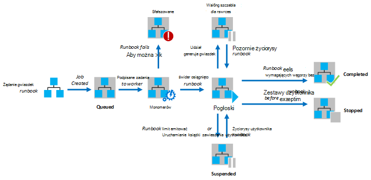
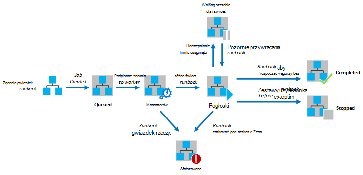

<properties
   pageTitle="Wykonywanie działań aranżacji w automatyzacji Azure"
   description="W tym artykule opisano szczegóły dotyczące sposobu przetwarzania działań aranżacji w automatyzacji Azure."
   services="automation"
   documentationCenter=""
   authors="mgoedtel"
   manager="stevenka"
   editor="tysonn" />
<tags
   ms.service="automation"
   ms.devlang="na"
   ms.topic="article"
   ms.tgt_pltfrm="na"
   ms.workload="infrastructure-services"
   ms.date="03/21/2016"
   ms.author="bwren" />

# Wykonywanie działań aranżacji w automatyzacji Azure

Po uruchomieniu działań aranżacji w automatyzacji Azure zadanie zostanie utworzona. Zadanie jest wystąpieniem jednego wykonywanie działań aranżacji. Pracownik automatyzacji Azure zostanie przypisany do każdego zadania. Gdy pracownicy są udostępniane przez wielu kont Azure, zadania z różnych kont automatyzacji są ze sobą. Nie masz kontroli nad którym pracownik będzie usługi żądanie dla zadania.  Pojedynczy działań aranżacji może mieć wielu zadań jednocześnie uruchomiony. Po wyświetleniu listy runbooks w portalu Azure spowoduje wyświetlenie listy stanu ostatniego zadania rozpoczęcia dla każdego działań aranżacji. Można wyświetlić listę zadania dla każdego działań aranżacji w celu śledzenia stanu poszczególnych. Aby uzyskać opis stany różne zadania zobacz [Stany zadania](#job-statuses).

Na poniższym diagramie przedstawiono do zarządzania cyklem życia zadanie działań aranżacji [graficzne runbooks](automation-runbook-types.md#graphical-runbooks) i [runbooks przepływu pracy programu PowerShell](automation-runbook-types.md#powershell-workflow-runbooks).

Na poniższym diagramie przedstawiono do zarządzania cyklem życia zadanie działań aranżacji dla [runbooks programu PowerShell](automation-runbook-types.md#powershell-runbooks).

Zadań uzyskuje dostęp do zasobów Azure przez utworzenie połączenia do subskrypcji usługi Azure. Są tylko uzyskuje dostęp do zasobów za pomocą Centrum danych jeśli te zasoby są dostępne w chmurze publicznej.

## Stany zadania

W poniższej tabeli opisano różne stany, które są dostępne dla zadania.

| Stan| Opis|
|:---|:---|
|Ukończone|Zadanie zostało zakończone pomyślnie.|
|Nie powiodła się| Dla [przepływów pracy programu PowerShell i graficznej runbooks](automation-runbook-types.md)działań aranżacji nie można skompilować.  Aby uzyskać [runbooks skrypt programu PowerShell](automation-runbook-types.md)działań aranżacji nie można uruchomić lub zadanie napotkał wyjątek. |
|Nie powiodło się, trwa oczekiwanie na zasoby|Zadanie nie powiodło się, ponieważ osiągnięto limit [Udostępnianie projektu naukowego](#fairshare) trzy razy i pracę z tym samym punktu kontrolnego lub od początku działań aranżacji zawsze.|
|W kolejce|Zadanie oczekuje dla zasobów pracownik automatyzacji zostanie dodane później dostępne tak, aby można go uruchomić.|
|Uruchamianie|Zadanie została przypisana do pracownika, a systemu trwa go uruchomić.|
|Wznawianie|System Trwa wznawianie zadania po zostało zawieszone.|
|Uruchamianie|Zadanie jest uruchomione.|
|Uruchomiony, trwa oczekiwanie na zasoby|Zadanie została usunięta z pamięci, ponieważ osiągnął limit [projektu naukowego Udostępnij](#fairshare) . Będzie ją wznowić wkrótce z jego ostatniego punktu kontrolnego.|
|Zatrzymano|Zadanie zostało zatrzymane przez użytkownika przed ukończeniem.|
|Zatrzymywanie|System Trwa zatrzymywanie zadania.|
|Zawieszone|Zadanie zostało zawieszone przez użytkownika, przez system lub przy użyciu polecenia w działań aranżacji. Zadania, które zostało zawieszone można uruchomić ponownie i będzie życiorys z jego ostatniego punktu kontrolnego lub od początku działań aranżacji, jeśli został nie punktów kontrolnych. Działań aranżacji będzie zawieszone wyłącznie przez system w przypadku wyjątek. Domyślnie ErrorActionPreference jest ustawiona na **Kontynuuj** oznacza to, że zadanie zostanie zachować uruchomione na komunikat o błędzie. Jeśli tej zmiennej preferencji jest ustawiona na **Zatrzymaj** zadanie zostanie zawiesza się na komunikat o błędzie.  Dotyczy tylko programu [PowerShell przepływów pracy i graficznej runbooks](automation-runbook-types.md) .|
|Zawieszenia|System próbuje zawieszenia zadania na żądanie użytkownika. Działań aranżacji musi dotrzeć jej dalej punkt kontrolny, zanim może zostać zawieszone. Jeśli już minął jego ostatniego punktu kontrolnego, będzie on również wykonaj przed może zostać zawieszone.  Dotyczy tylko programu [PowerShell przepływów pracy i graficznej runbooks](automation-runbook-types.md) .|

## Wyświetlanie stanu zadania za pomocą portalu zarządzania Azure

### Pulpit nawigacyjny automatyzacji

Pulpit nawigacyjny automatyzacji zawiera podsumowanie wszystkich runbooks automatyzacji określonego konta. Zawiera omówienie zastosowania dla konta. Podsumowanie wykres pokazuje liczbę zadań dla wszystkich runbooks, które wprowadzić każdy stan w określonej liczbie dni lub godziny. Możesz wybrać zakres czasu w prawym górnym rogu wykresu. Osi czasu wykresu zmienią się zgodnie z typem przedziału czasu zaznaczeniu. Możesz wybrać, czy mają być wyświetlane na linii stanem określonego przez kliknięcie jej w górnej części ekranu.

Poniższe kroki służy do wyświetlania na pulpicie nawigacyjnym automatyzacji.

1. W portalu zarządzania Azure wybierz **automatyzacji** , a następnie kliknij pozycję w nazwę konta automatyzacji.
1. Wybierz kartę **pulpitu nawigacyjnego** .

### Pulpit nawigacyjny działań aranżacji

Pulpit nawigacyjny działań aranżacji zawiera podsumowanie dla pojedynczego działań aranżacji. Podsumowanie wykres pokazuje liczbę zadań dla działań aranżacji wprowadzanej każdy stan w określonej liczbie dni lub godziny. Możesz wybrać zakres czasu w prawym górnym rogu wykresu. Osi czasu wykresu zmienią się zgodnie z typem przedziału czasu zaznaczeniu. Możesz wybrać, czy mają być wyświetlane na linii stanem określonego przez kliknięcie jej w górnej części ekranu.

Poniższe kroki służy do wyświetlania działań aranżacji pulpitu nawigacyjnego.

1. W portalu zarządzania Azure wybierz **automatyzacji** , a następnie kliknij pozycję w nazwę konta automatyzacji.
1. Kliknij nazwę działań aranżacji.
1. Wybierz kartę **pulpitu nawigacyjnego** .

### Podsumowanie zadań

Można wyświetlić listę wszystkich zadań, które zostały utworzone dla określonego działań aranżacji i ich stanu ostatnio. Można filtrować tej listy według stanu zadania i zakres dat dla ostatniej zmiany zadania. Kliknij nazwę zadania, aby wyświetlić szczegółowe informacje i jej wyniki. Szczegółowe informacje dotyczące zadania zawiera wartości parametrów działań aranżacji, które zostały udostępnione do tego zadania.

Poniższe kroki służy do wyświetlania zadań dla działań aranżacji.

1. W portalu zarządzania Azure wybierz **automatyzacji** , a następnie kliknij pozycję w nazwę konta automatyzacji.
1. Kliknij nazwę działań aranżacji.
1. Wybierz kartę **zadania** .
1. Kliknij kolumnę **Zadanie utworzone** dla zadania wyświetlić jego szczegóły i dane wyjściowe.

## Pobieranie stan zadania przy użyciu programu Windows PowerShell

[Get-AzureAutomationJob](http://msdn.microsoft.com/library/azure/dn690263.aspx) służy do pobierania zadań utworzoną dla działań aranżacji i szczegóły określonego zadania. Jeśli zaczniesz działań aranżacji przy użyciu programu Windows PowerShell przy użyciu [Start AzureAutomationRunbook](http://msdn.microsoft.com/library/azure/dn690259.aspx)go może zwrócić wynikowej zadania. Aby uzyskać wydruk zadania za pomocą raportu [Get-AzureAutomationJob](http://msdn.microsoft.com/library/azure/dn690263.aspx).

Następujące polecenia próbki pobiera ostatniego zadania dla działań aranżacji próbki i wyświetla jego stan, wartości umożliwiają dla parametrów działań aranżacji i dane wyjściowe zadania.

    $job = (Get-AzureAutomationJob –AutomationAccountName "MyAutomationAccount" –Name "Test-Runbook" | sort LastModifiedDate –desc)[0]
    $job.Status
    $job.JobParameters
    Get-AzureAutomationJobOutput –AutomationAccountName "MyAutomationAccount" -Id $job.Id –Stream Output

## Udostępnianie projektu naukowego

Aby można było współużytkowanie zasobów między wszystkie runbooks w chmurze, automatyzacji Azure spowoduje tymczasowe zwolnienie każde zadanie po jego działaniu przez 3 godziny.    Runbooks [Przepływów pracy programu PowerShell](automation-runbook-types.md#powershell-workflow-runbooks) i [graficznej](automation-runbook-types.md#graphical-runbooks) będzie wznowieniu ich ostatni [punkt kontrolny](http://technet.microsoft.com/library/dn469257.aspx#bk_Checkpoints). W tym czasie zadania będzie wyświetlany stan uruchomiony, oczekiwanie na zasoby. Jeśli zadania nie osiągnęła pierwszy punkt kontrolny przed zwalnianie działań aranżacji występują nie punktów kontrolnych, następnie go zostanie uruchomiony ponownie od początku.  Runbooks [programu PowerShell](automation-runbook-types.md#powershell-runbooks) są zawsze ponownie uruchomić od początku, ponieważ nie obsługują punktów kontrolnych.

>[AZURE.NOTE] Limit udostępnianie projektu Naukowego nie dotyczy zadania działań aranżacji dotyczące hybrydowych działań aranżacji pracowników.

Jeśli działań aranżacji uruchomieniu z tym samym punktu kontrolnego lub od początku zestawu działań aranżacji trzy razy zostaną zakończone ze stanem Niepowodzenie, trwa oczekiwanie na zasoby. To ochronę przed runbooks uruchomienie czas nieokreślony bez wykonywania, ponieważ nie mogą był do następnego punktu kontrolnego jest dozwolony ponownie. W tym przypadku zostanie wyświetlony następujący wyjątek z błędem.

*Zadanie nie może kontynuować, uruchamianie, ponieważ wielokrotnie został usunięty z tym samym punkt kontrolny. Upewnij się, że do działań aranżacji nie operacji długiej bez utrzymuje stanu.*

Po utworzeniu działań aranżacji należy upewnić się, że godzinę uruchomienia działań między dwoma punktami kontrolnymi nie przekroczy 3 godziny. Może być konieczne dodawanie punktów kontrolnych do swojego działań aranżacji, aby upewnić się, że nie osiągnięciu tego limitu 3 godziny i Rozdziel długiego długotrwałych operacji. Na przykład do działań aranżacji mogą wykonywać indeksowanie z dużą bazą danych SQL. Jeśli ten jednej operacji nie kończy się w limicie udostępnianie projektu naukowego, następnie zadania zostaną usunięty i ponownie uruchomić od początku. W tym przypadku należy podzielić operacji indeksowanie w wielu czynności, takich jak indeksowanie jedną tabelę naraz, a następnie wstawić punktu kontrolnego po każdej operacji, dzięki czemu zadania może wznowić po ostatniej operacji do wykonania.

## Następne kroki

- [Rozpoczynanie działań aranżacji w automatyzacji Azure](automation-starting-a-runbook.md)
