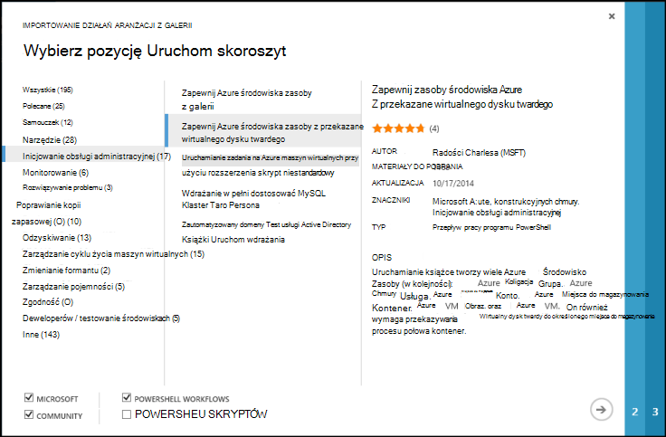
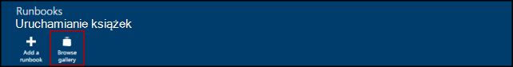
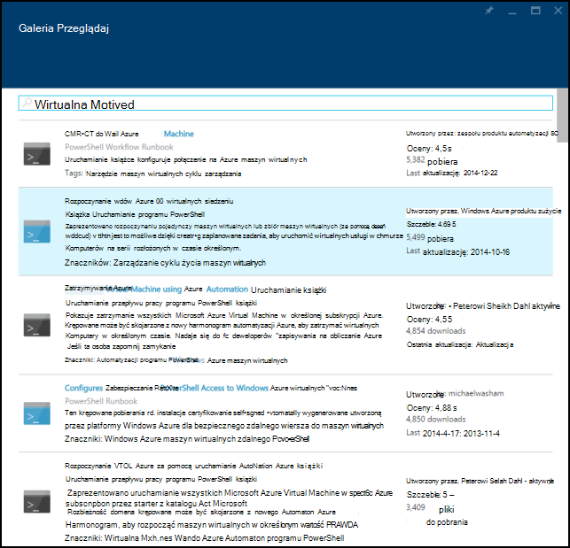
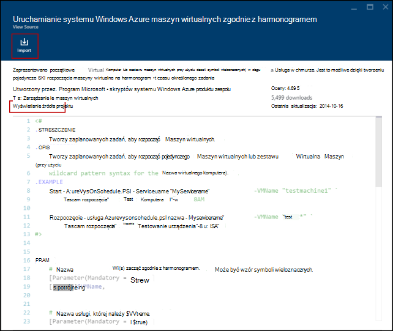
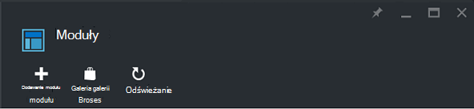
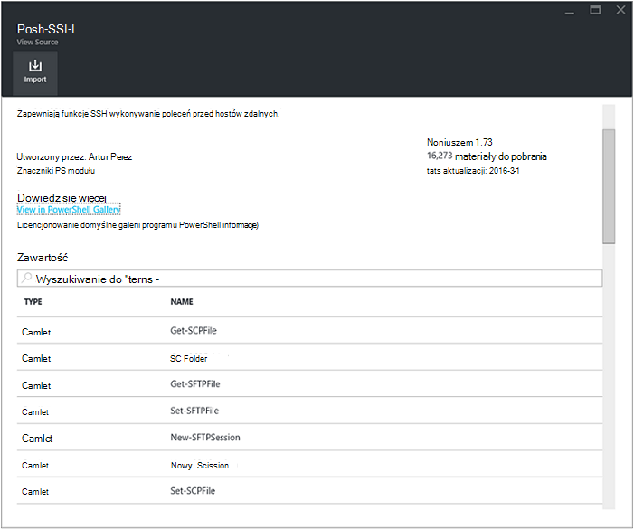
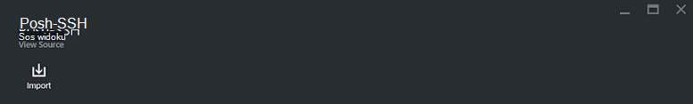
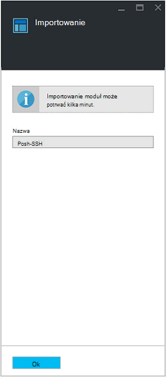

<properties
    pageTitle="Galerie działań aranżacji i moduł automatyzacji Azure | Microsoft Azure"
    description="Runbooks i moduły firmy Microsoft i społeczności są dostępne umożliwiają instalowanie i używanie w środowisku usługi Azure automatyzacji.  W tym artykule opisano sposób uzyskiwania dostępu do tych zasobów i aby pomóc Twojej runbooks do galerii."
    services="automation"
    documentationCenter=""
    authors="mgoedtel"
    manager="jwhit"
    editor="tysonn" />
<tags
    ms.service="automation"
    ms.devlang="na"
    ms.topic="article"
    ms.tgt_pltfrm="na"
    ms.workload="infrastructure-services"
    ms.date="09/18/2016"
    ms.author="magoedte;bwren" />

# Galerie działań aranżacji i moduł automatyzacji Azure

Zamiast tworzyć własne runbooks i moduły w automatyzacji Azure, masz dostęp do różnych scenariuszy, które zostały już utworzone przez firmę Microsoft i społeczności.  Możesz użyć tych scenariuszy bez modyfikacji lub można używać ich jako punktu wyjścia i edytować je do określonych potrzeb użytkownika.

Runbooks można przejść z galerii [Działań aranżacji](#runbooks-in-runbook-gallery) i moduły z [Galerii programu PowerShell](#modules-in-powerShell-gallery).  Również może przyczynić się do społeczności użytkowników dzięki udostępnieniu scenariusze tworzonych.

## Runbooks w galerii działań aranżacji

[Galeria działań aranżacji](http://gallery.technet.microsoft.com/scriptcenter/site/search?f[0].Type=RootCategory&f[0].Value=WindowsAzure&f[1].Type=SubCategory&f[1].Value=WindowsAzure_automation&f[1].Text=Automation) udostępnia szereg runbooks firmy Microsoft i społeczności, który można zaimportować do automatyzacji Azure. Możesz albo pobierania działań aranżacji z galerii, który znajduje się w [Centrum skryptów TechNet](http://gallery.technet.microsoft.com/)lub runbooks można zaimportować bezpośrednio z galerii z portal Azure klasyczny lub Azure portal.

Można zaimportować tylko bezpośrednio z galerii działań aranżacji przy użyciu portal Azure klasyczny lub Azure portal. Nie można wykonać tę funkcję, za pomocą programu Windows PowerShell.

>[AZURE.NOTE] Należy sprawdzić, czy zawartość dowolnego runbooks nadchodzi z galerii działań aranżacji, a następnie należy zachować ostrożność skrajnych w instalowania i uruchamiania ich w środowisku produkcyjnym. |

### Aby zaimportować działań aranżacji z galerii działań aranżacji z portalem klasyczny Azure

1. W portalu Azure kliknij, **Nowy**, a **aplikacji usług**, **automatyzacji**, **działań aranżacji** **Z galerii**.
2. Wybierz kategorię, aby wyświetlić runbooks pokrewne, a następnie wybierz działań aranżacji, aby wyświetlić jego szczegóły. Po zaznaczeniu działań aranżacji, które mają, kliknij przycisk strzałki w prawo.

    

3. Przejrzyj zawartość zestawu działań aranżacji i zanotuj wymagań w opisie. Kliknij przycisk strzałki w prawo, po zakończeniu.
4. Wprowadź szczegóły działań aranżacji, a następnie kliknij przycisk znacznika wyboru. Nazwa działań aranżacji będzie już wypełnione.
5. Działań aranżacji pojawią się na karcie **Runbooks** dla konta automatyzacji.

### Aby zaimportować działań aranżacji z galerii działań aranżacji Portal Azure

1. Otwórz Azure Portal konta automatyzacji.
2. Kliknij Kafelek **Runbooks** , aby otworzyć listę runbooks.
3. Kliknij przycisk **Przeglądaj galerii** .

    

4. Znajdź elementu galerii i wybierz go, aby wyświetlić jego szczegóły.

    

4. Kliknij polecenie **Widok projektu źródłowego** , aby wyświetlić element w [Centrum skryptów w witrynie TechNet](http://gallery.technet.microsoft.com/).
5. Aby zaimportować element, kliknij go, aby wyświetlić jego szczegóły, a następnie kliknij przycisk **Importuj** .

    

6. Opcjonalnie można zmienić nazwę zestawu działań aranżacji, a następnie kliknij **przycisk OK** , aby zaimportować działań aranżacji.
5. Działań aranżacji pojawią się na karcie **Runbooks** dla konta automatyzacji.

### Dodawanie działań aranżacji do galerii działań aranżacji

Firma Microsoft zaleca dodawanie runbooks do galerii działań aranżacji, które Twoim zdaniem będą przydatne dla innych klientów.  Możesz dodać działań aranżacji, [przekazania go do Centrum skrypt](http://gallery.technet.microsoft.com/site/upload) , uwzględniając następujące informacje.

- *Platformy Windows Azure* należy określić dla **kategorii** i *automatyzacji* **Podkategoria** dla działań aranżacji, które mają być wyświetlane w kreatorze.  

- Przekaż plik musi mieć pojedynczy .ps1 lub .graphrunbook.  Jeśli działań aranżacji wymaga dowolnego modułów, runbooks podrzędny lub aktywów, następnie możesz powinien zawierać w opisie składania, a także w sekcji komentarze zestawu działań aranżacji.  Jeśli masz scenariusz wymagające wielu runbooks wysłanie każdego oddzielnie i wyświetlić listę nazw runbooks pokrewne w każdej z ich opisy. Upewnij się, użyj tych samych znaczników, tak aby były pojawi się w tej samej kategorii. Użytkownik będzie miał odczytać opis, aby sprawdzić, czy inne runbooks są wymagane scenariusz do pracy.

- Dodawanie znacznika "GraphicalPS", jeśli publikujesz **graficznego działań aranżacji** (nie graficznego przepływu pracy). 

- Wstawianie wstawkę kodu programu PowerShell lub przepływu pracy programu PowerShell do pola opisu za pomocą ikony **Wstaw sekcję kodu** .

- Podsumowanie przekazywanie będą wyświetlane w wynikach działań aranżacji galerii, powinien zawierać szczegółowe informacje, które mogą pomóc użytkownikowi określenie funkcji zestawu działań aranżacji.

- Jednego do trzech następujące tagi należy przypisać do przekazywania.  Działań aranżacji zostaną zapisane w kreatorze, w obszarze Kategorie, które są zgodne z jego znaczniki.  Wszystkie znaczniki nie ma na tej liście będą ignorowane przez kreatora. Jeśli nie określisz wszelkie pasujące znaczniki, działań aranżacji będzie widoczny pod drugiej kategorii.

 - Wykonywanie kopii zapasowych
 - Zarządzanie wydajności
 - Zmienianie formantu
 - Zgodność
 - Deweloperów / testowanie środowiskach
 - Odzyskiwanie
 - Monitorowanie
 - Poprawianie
 - Inicjowanie obsługi administracyjnej
 - Rozwiązywanie problemu
 - Zarządzanie cyklu życia maszyn wirtualnych

- Automatyzacja aktualizacje Galerii raz na godzinę, więc przekazanych materiałów, nie będą widoczne od razu.

## Moduły w galerii programu PowerShell

Moduły programu PowerShell zawierają polecenia cmdlet, używanej w swojej runbooks i istniejących modułów, które można zainstalować automatyzacji Azure są dostępne w [Galerii programu PowerShell](http://www.powershellgallery.com).  Można uruchomić tej galerii z portalu Azure i zainstaluj je bezpośrednio do automatyzacji Azure lub można je pobrać i zainstalować je ręcznie.  Nie można zainstalować moduł bezpośrednio z poziomu portalu klasyczny Azure, ale można pobrać zainstaluj je, jak w przypadku innych modułu.

### Aby zaimportować moduł z galerii modułu automatyzacji Portal Azure

1. Otwórz Azure Portal konta automatyzacji.
2. Kliknij Kafelek **elementy zawartości** , aby otworzyć listę elementów.
3. Kliknij Kafelek **modułów** , aby otworzyć listę modułów.
4. Kliknij przycisk **Przeglądaj galerii** i karta galerii Przeglądaj zostanie uruchomione.

      
5. Po uruchomieniu karta galerii Przeglądaj, możesz wyszukiwać przy następujące pola:

   - Nazwa modułu
   - Znaczniki
   - Autor
   - Polecenie cmdlet-DSC Nazwa zasobu

6. Znajdź modułu, który Cię interesuje i zaznacz go, aby wyświetlić jego szczegóły.  
Przechodzenie do szczegółów w module określonych, można wyświetlić więcej informacji na temat modułu, łącznie z łączem Powrót do galerii programu PowerShell wszelkie wymagane zależności i wszystkich poleceń cmdlet i/lub DSC zasoby, które zawiera moduł.

      

7. Aby zainstalować moduł bezpośrednio do automatyzacji Azure, kliknij przycisk **Importuj** .

    

8. Gdy klikniesz przycisk Importuj, pojawi się nazwa modułu, który chcesz zaimportować. Jeśli są zainstalowane wszystkie zależności, przycisk **OK** jest aktywny. Jeśli brakuje zależności, należy zaimportować te przed zaimportowaniem tego modułu.
9. Kliknij **przycisk OK** , aby zaimportować moduł, i uruchomi karta modułu. Gdy automatyzacji Azure importowania modułu do swojego konta, wyodrębnia metadanych o module i poleceń cmdlet.

    

    Może potrwać kilka minut, ponieważ każdego działania musi być wyodrębnione.
10. Otrzymasz powiadomienie, że moduł został wdrożony i powiadomienie po zakończeniu.
11. Po zaimportowaniu moduł widoczne będą dostępne działania i umożliwia jego zasobów w runbooks i potrzeby konfiguracji stan.

## Żądanie działań aranżacji lub modułu

Możesz wysłać żądania na [Głos użytkownika](https://feedback.azure.com/forums/246290-azure-automation/).  Jeśli potrzebujesz pomocy, pisanie działań aranżacji lub masz pytania dotyczące programu PowerShell, Zadaj pytanie na naszym [forum](http://social.msdn.microsoft.com/Forums/windowsazure/en-US/home?forum=azureautomation&filter=alltypes&sort=lastpostdesc).

## Następne kroki

- Aby rozpocząć pracę z runbooks, zobacz [Tworzenie lub importowanie działań aranżacji w automatyzacji Azure](automation-creating-importing-runbook.md)
- Aby poznać różnice między programu PowerShell i przepływu pracy programu PowerShell z runbooks, zobacz [Przepływ pracy programu PowerShell szkoleniowe](automation-powershell-workflow.md)
