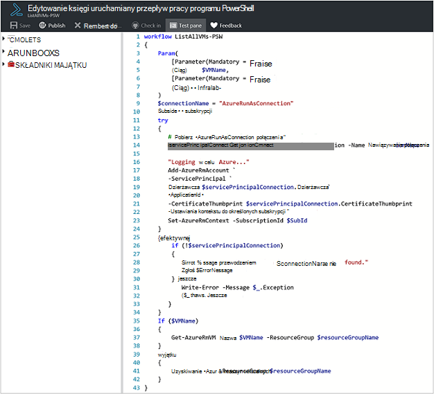
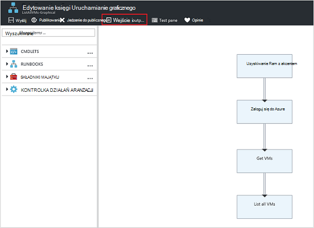
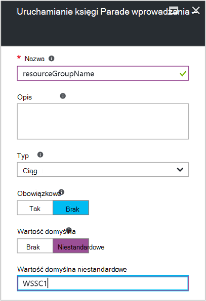
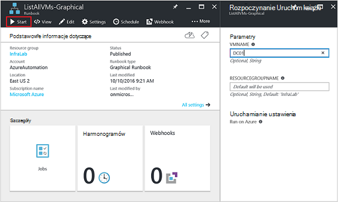
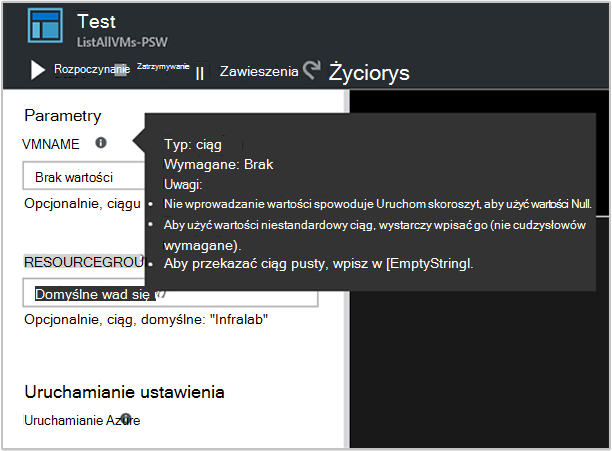
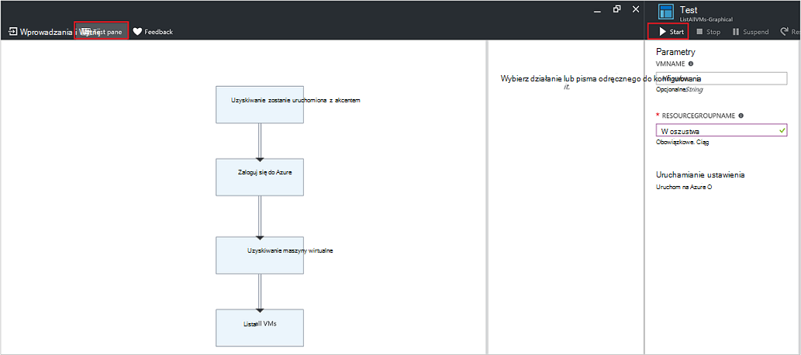
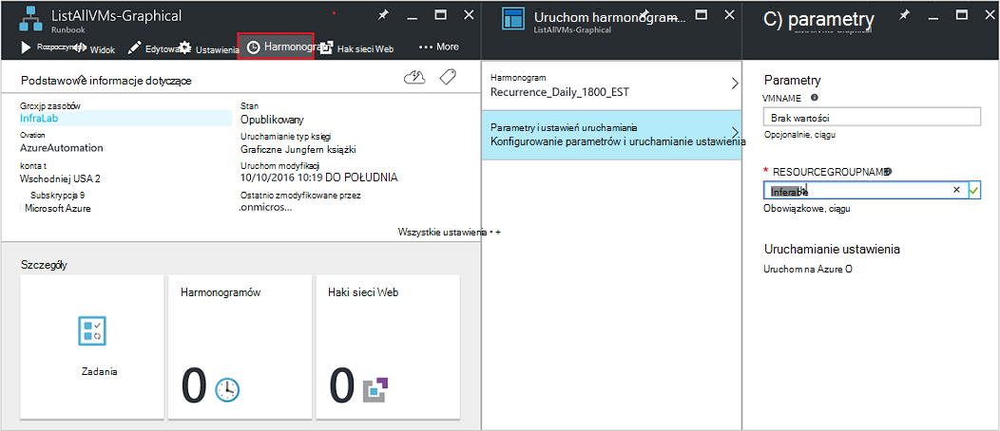
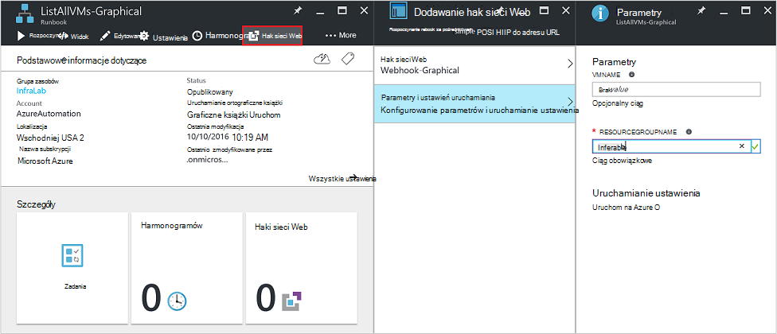
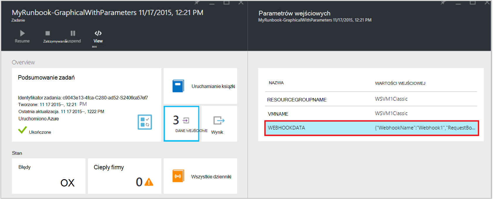

<properties
   pageTitle="Parametry wejścia działań aranżacji | Microsoft Azure"
   description="Parametrów wejściowych działań aranżacji zwiększyć elastyczność runbooks umożliwia przekazywanie danych do działań aranżacji po uruchomieniu. W tym artykule opisano różne scenariusze używania parametrów wejściowych w runbooks."
   services="automation"
   documentationCenter=""
   authors="MGoedtel"
   manager="jwhit"
   editor="tysonn" />
<tags
   ms.service="automation"
   ms.devlang="na"
   ms.topic="article"
   ms.tgt_pltfrm="na"
   ms.workload="infrastructure-services"
   ms.date="10/11/2016"
   ms.author="sngun"/>

# <a name="runbook-input-parameters"></a>Parametrów wejściowych działań aranżacji

Parametrów wejściowych działań aranżacji zwiększyć elastyczność runbooks pozwala w celu przekazania danych do niego po uruchomieniu. Parametry umożliwiają akcji działań aranżacji skierowane do określonych scenariuszach i środowiska. W tym artykule firma Microsoft przeprowadzi Cię przez różne scenariusze używania parametrów wejściowych w runbooks.

## <a name="configure-input-parameters"></a>Konfigurowanie parametrów wejściowych

W programu PowerShell, przepływ pracy programu PowerShell i graficzne runbooks można skonfigurować parametrów wejściowych. Działań aranżacji może mieć wiele parametrów z różnymi typami danych lub bez parametrów w ogóle. Wprowadź parametry mogą być obowiązkowe lub opcjonalne i można przypisać wartość domyślną dla parametrów. Możesz przypisać wartości parametrów wejściowych dla działań aranżacji po rozpoczęciu przez jedno z dostępnych metod. Metody te obejmują uruchamianie działań aranżacji z portalem lub usługi sieci web. Można również rozpocząć jako działań aranżacji podrzędny, wskazany w tekście w innym działań aranżacji.

## <a name="configure-input-parameters-in-powershell-and-powershell-workflow-runbooks"></a>Konfigurowanie parametrów wejściowych w runbooks programu PowerShell i przepływ pracy programu PowerShell

Obsługa parametrów wejściowych, które są definiowane przez następujące atrybuty, programu PowerShell i [runbooks przepływu pracy programu PowerShell](automation-first-runbook-textual.md) w automatyzacji Azure.  

| **Właściwość** | **Opis** |
|:--- |:---|
| Typ | Wymagane. Typ danych dla wartości parametru. Dowolny typ .NET jest prawidłowy. |
| Nazwa | Wymagane. Nazwa parametru. To musi być unikatowa w działań aranżacji i mogą zawierać tylko litery, cyfry lub znaki podkreślenia. Musi ona zaczynać literę. |
| Obowiązkowe | Opcjonalnie. Określa, czy należy podać wartość parametru. Jeśli ustawisz to **$true**wartość trzeba podany podczas uruchamiania działań aranżacji. Jeśli ustawisz to **$false**, wartość jest opcjonalna. |
| Wartość domyślna | Opcjonalnie.  Określa wartość, która będzie używana dla parametru, jeśli wartość nie jest przekazywany, rozpoczęcie działań aranżacji. Wartość domyślną można ustawić dla każdego parametru i powoduje automatyczne utworzenie parametr opcjonalny bez względu na ustawienie obowiązkowe. |

Środowiska Windows PowerShell obsługuje więcej atrybutów parametrów wejściowych niż wymienione poniżej, takich jak sprawdzanie poprawności, aliasy i zestawy parametru. Automatyzacja Azure obsługuje obecnie tylko parametrów wejściowych wymienionych powyżej.

Definicja parametru w runbooks przepływu pracy programu PowerShell zawiera następujące ogólne formularzu miejsce, w którym wiele parametrów są oddzielone przecinkami.

   ```
     Param
     (
         [Parameter (Mandatory= $true/$false)]
         [Type] Name1 = <Default value>,

         [Parameter (Mandatory= $true/$false)]
         [Type] Name2 = <Default value>
     )
   ```

>[AZURE.NOTE] Podczas definiowania parametry, jeśli nie zostanie określony **obowiązkowy** atrybut, następnie domyślnie parametr jest traktowany jako opcjonalne. Ponadto jeśli ustawisz wartość domyślną dla parametru w runbooks przepływu pracy programu PowerShell jest traktowany przez programu PowerShell jako parametr opcjonalny, bez względu na wartość atrybutu **obowiązkowe** .

Na przykład załóżmy Konfigurowanie parametrów wejściowych dla przepływu pracy programu PowerShell działań aranżacji, która wyświetla szczegółowe informacje o środowisku maszyn wirtualnych systemu, maszyny jednego lub wszystkich maszyny wirtualne w grupie zasobów. Ten działań aranżacji występują dwa parametry, jak pokazano w poniższej zrzut ekranu: Nazwa maszyn wirtualnych i nazwę grupy zasobów.



W tym parametrze definicji, parametry **$VMName** i **$resourceGroupName** są prosty parametrów typu ciąg. Jednak runbooks programu PowerShell i przepływ pracy programu PowerShell obsługuje wszystkie typy proste i złożone typy, takie jak **obiekt** lub **parametr PSCredential** parametrów wejściowych.

Jeśli do działań aranżacji ma parametru wejściowego typu obiektu, użyj skrótów programu PowerShell z (nazwa, wartość) pary w celu przekazania wartości. Na przykład, jeśli masz następujący parametr w działań aranżacji:

     [Parameter (Mandatory = $true)]
     [object] $FullName

Następnie można przekazać następującą wartość parametru:

    @{"FirstName"="Joe";"MiddleName"="Bob";"LastName"="Smith"}


## <a name="configure-input-parameters-in-graphical-runbooks"></a>Konfigurowanie parametrów wejściowych w runbooks graficzne

Aby [skonfigurować graficzne działań aranżacji](automation-first-runbook-graphical.md) z parametrów wejściowych tworzenie graficzne działań aranżacji, która wyświetla szczegółowe informacje o środowisku maszyn wirtualnych systemu, maszyny jednego lub wszystkich maszyny wirtualne w grupie zasobów. Konfigurowanie działań aranżacji obejmuje dwa główne działania, zgodnie z poniższym opisem.

[**Uwierzytelnianie Runbooks przy użyciu konta Azure Uruchom jako**](automation-sec-configure-azure-runas-account.md) do uwierzytelniania Azure.

[**Get-AzureRmVm**](https://msdn.microsoft.com/library/mt603718.aspx) uzyskać właściwości maszyn wirtualnych.

Działanie [**Dane wyjściowe zapisu**](https://technet.microsoft.com/library/hh849921.aspx) umożliwia wyjściowy nazwy maszyn wirtualnych. Działania **Get-AzureRmVm** przyjmuje dwa parametry, **nazwę maszyn wirtualnych** i **Nazwa grupy zasobów**. Ponieważ tych parametrów może wymagać podczas każdego uruchomienia działań aranżacji różne wartości, można dodać do programu działań aranżacji parametrów wejściowych. Poniżej przedstawiono procedurę dodawania parametrów wejściowych:

1. Wybierz graficzne działań aranżacji z karta **Runbooks** , a następnie kliknij przycisk [**Edytuj**](automation-graphical-authoring-intro.md) go.

2. W edytorze działań aranżacji kliknij przycisk **dane wejściowe i wyjściowe** otworzyć karta **dane wejściowe i wyjściowe** .

    

3. Karta **dane wejściowe i wyjściowe** Wyświetla listę parametrów wejściowych, które zostały zdefiniowane dla działań aranżacji. W tym karta możesz dodać nowe parametru wejściowego lub edytować konfiguracji istniejącego parametru wejściowego. Aby dodać nowy parametr dla działań aranżacji, kliknij pozycję **Dodawanie danych wejściowych** , aby otworzyć karta **działań aranżacji parametru wejściowego** . Możesz skonfigurować następujące parametry:

  	| **Właściwość** | **Opis** |
  	|:--- |:---|
  	| Nazwa | Wymagane.  Nazwa parametru. To musi być unikatowa w działań aranżacji i mogą zawierać tylko litery, cyfry lub znaki podkreślenia. Musi ona zaczynać literę. |
  	| Opis | Opcjonalnie. Opis przeznaczenie parametru wejściowego. |
  	| Typ | Opcjonalnie. Typ danych, który jest planowane dla wartości parametru. Typy obsługiwanego parametrów to **ciąg**, **Int32**, **Int64**, **dziesiętną**, **logiczna**, **daty i godziny**i **obiektu**. Jeśli typ danych nie jest zaznaczone, domyślnie **ciągu**. |
  	| Obowiązkowe | Opcjonalnie. Określa, czy należy podać wartość parametru. Jeśli wybierzesz opcję **Tak**, wartość trzeba podany podczas uruchamiania działań aranżacji. Jeśli wybierzesz **nie**, następnie wartość nie jest wymagane przy uruchomieniu działań aranżacji i może być ustawiona wartość domyślna. |
  	| Wartość domyślna | Opcjonalnie. Określa wartość, która będzie używana dla parametru, jeśli wartość nie jest przekazywany, rozpoczęcie działań aranżacji. Wartość domyślną można ustawić dla parametru, który nie jest obowiązkowe. Aby ustawić wartość domyślną, wybierz pozycję **niestandardowe**. Ta wartość jest używana, chyba że inną wartość Rozpoczęcie działań aranżacji. Wybierz opcję **Brak** , jeśli nie chcesz zapewnić wartości domyślne. |  

    

4. Utwórz dwa parametry z następujące właściwości, które będą używane przez aktywności **Get-AzureRmVm** :

    - **Parametr1:**
      - Nazwa - VMName
      - Typ — ciągu
      - Obowiązkowy — Brak

    - **Parametr2:**
      - Nazwa - resourceGroupName
      - Typ — ciągu
      - Obowiązkowy — Brak
      - Wartość domyślna - niestandardowe
      - Wartość domyślna niestandardowe - \<nazwę grupy zasobów, która zawiera maszyn wirtualnych >

5. Po dodaniu parametry kliknij **przycisk OK**.  Można teraz wyświetlać je w **dane wejściowe i wyjściowe karta**. Ponownie kliknij przycisk **OK** , a następnie kliknij przycisk **Zapisz** i **Publikuj** usługi działań aranżacji.

## <a name="assign-values-to-input-parameters-in-runbooks"></a>Przypisywanie wartości i wprowadzanie parametrów w runbooks

Można przekazać wartości do wprowadzania parametrów w runbooks w następujących scenariuszach.

### <a name="start-a-runbook-and-assign-parameters"></a>Rozpoczynanie działań aranżacji i przypisywanie parametrów

Działań aranżacji można wykonywać różne sposoby: za pośrednictwem portalu Azure, z webhook, przy użyciu poleceń cmdlet programu PowerShell, przy użyciu interfejsu API usługi REST lub z zestawu SDK. Poniżej omówimy różne metody rozpoczęcia działań aranżacji i przypisywanie parametry.

#### <a name="start-a-published-runbook-by-using-the-azure-portal-and-assign-parameters"></a>Rozpoczynanie opublikowanych działań aranżacji za pomocą portalu Azure i przypisywanie parametrów

Jeśli możesz [rozpocząć działań aranżacji](automation-starting-a-runbook.md#starting-a-runbook-with-the-azure-portal), zostanie wyświetlona karta **Rozpoczynanie działań aranżacji** i można skonfigurować wartości parametrów, które właśnie utworzony.



W polu Etykieta poniżej pola wprowadzania widać atrybuty, które zostały ustawione dla parametru. Atrybuty obejmują obowiązkowe lub opcjonalne, typ i wartość domyślna. Wszystkie informacje klucza potrzebnych do podejmowania decyzji dotyczących wprowadzania wartości parametrów są widoczne w dymku pomocy obok nazwy parametru. Te informacje obejmują czy parametr jest obowiązkowe lub opcjonalne. Zawiera również typ i wartość domyślna (jeśli istnieje) i inne przydatne notatki.



>[AZURE.NOTE] Parametry typu ciąg obsługuje **pusty** ciąg wartości.  Wprowadzanie **[niepowodzenia]** w polu parametru wejściowego przekazuje ciąg pusty do parametru. Ponadto parametrów typu ciąg nie obsługuje wartości **Null** były przekazywane. Jeśli dowolna wartość nie przejdzie do parametru ciągu, następnie programu PowerShell będzie interpretować go jako wartość null.

#### <a name="start-a-published-runbook-by-using-powershell-cmdlets-and-assign-parameters"></a>Rozpoczynanie opublikowanych działań aranżacji przy użyciu poleceń cmdlet programu PowerShell i przypisywanie parametrów

  - **Poleceń cmdlet Menedżera zasobów azure:** Możesz rozpocząć działań aranżacji automatyzacji został utworzony w grupie zasobów za pomocą [Start AzureRmAutomationRunbook](https://msdn.microsoft.com/library/mt603661.aspx).

    **Przykład:**

   ```
    $params = @{“VMName”=”WSVMClassic”;”resourceGroupeName”=”WSVMClassicSG”}
 
    Start-AzureRmAutomationRunbook -AutomationAccountName “TestAutomation” -Name “Get-AzureVMGraphical” –ResourceGroupName $resourceGroupName -Parameters $params
   ```

  - **Polecenia cmdlet zarządzania usługą azure:** Możesz rozpocząć działań aranżacji automatyzacji został utworzony w domyślnej grupie zasobów za pomocą [Start AzureAutomationRunbook](https://msdn.microsoft.com/library/dn690259.aspx).

    **Przykład:**

   ```
    $params = @{“VMName”=”WSVMClassic”; ”ServiceName”=”WSVMClassicSG”}

    Start-AzureAutomationRunbook -AutomationAccountName “TestAutomation” -Name “Get-AzureVMGraphical” -Parameters $params
   ```

>[AZURE.NOTE] Po uruchomieniu działań aranżacji przy użyciu poleceń cmdlet programu PowerShell, parametrem domyślne **MicrosoftApplicationManagementStartedBy** jest tworzona z wartością **programu PowerShell**. Ten parametr można wyświetlać na karta **Szczegóły zadania** .  

#### <a name="start-a-runbook-by-using-an-sdk-and-assign-parameters"></a>Rozpoczynanie działań aranżacji przy użyciu zestawu SDK i przypisywanie parametrów

  - **Metody Menedżera zasobów azure:** Można uruchomić działań aranżacji przy użyciu zestawu SDK języka programowania. Oto C# wstawkę kodu programu do uruchomienia działań aranżacji na koncie automatyzacji. Cały kod można wyświetlać w naszym [repozytorium GitHub](https://github.com/Azure/azure-sdk-for-net/blob/master/src/ResourceManagement/Automation/Automation.Tests/TestSupport/AutomationTestBase.cs).  

   ```
     public Job StartRunbook(string runbookName, IDictionary<string, string> parameters = null)
        {
          var response = AutomationClient.Jobs.Create(resourceGroupName, automationAccount, new JobCreateParameters
           {
              Properties = new JobCreateProperties
               {
                  Runbook = new RunbookAssociationProperty
                   {
                     Name = runbookName
                   },
                     Parameters = parameters
               }
           });
        return response.Job;
        }
   ```

  - **Metody zarządzania usługą azure:** Można uruchomić działań aranżacji przy użyciu SDK języka programowania. Oto C# wstawkę kodu programu do uruchomienia działań aranżacji na koncie automatyzacji. Cały kod można wyświetlać w naszym [repozytorium GitHub](https://github.com/Azure/azure-sdk-for-net/blob/master/src/ServiceManagement/Automation/Automation.Tests/TestSupport/AutomationTestBase.cs).

   ```      
    public Job StartRunbook(string runbookName, IDictionary<string, string> parameters = null)
      {
        var response = AutomationClient.Jobs.Create(automationAccount, new JobCreateParameters
      {
        Properties = new JobCreateProperties
           {
             Runbook = new RunbookAssociationProperty
           {
             Name = runbookName
                },
                  Parameters = parameters
                }
         });
        return response.Job;
      }
   ```

  Aby rozpocząć tej metody, Utwórz słownik do przechowywania parametrów działań aranżacji, **VMName** i **resourceGroupName**oraz ich wartości. Zacznij działań aranżacji. Poniżej przedstawiono wstawkę kodu C# do nawiązywania połączeń z metodę, która jest zdefiniowana powyżej.

   ```
    IDictionary<string, string> RunbookParameters = new Dictionary<string, string>();

    // Add parameters to the dictionary.
    RunbookParameters.Add("VMName", "WSVMClassic");
    RunbookParameters.Add("resourceGroupName", "WSSC1");

    //Call the StartRunbook method with parameters
    StartRunbook(“Get-AzureVMGraphical”, RunbookParameters);
   ```

#### <a name="start-a-runbook-by-using-the-rest-api-and-assign-parameters"></a>Rozpoczynanie działań aranżacji za pomocą interfejsu API usługi REST i przypisywanie parametrów

Zadanie działań aranżacji można tworzyć i pracę z interfejsu API usługi REST automatyzacji Azure przy użyciu metody **umieścić** następujące żądanie identyfikatora URI.

    https://management.core.windows.net/<subscription-id>/cloudServices/<cloud-service-name>/resources/automation/~/automationAccounts/<automation-account-name>/jobs/<job-id>?api-version=2014-12-08`

W wezwaniu na identyfikator URI zamienić następujących parametrów:

  - **identyfikator subskrypcji:** Identyfikatora usługi Azure subskrypcji.  
  - **chmury usługi nazw:** Nazwa na której mają być wysyłane żądanie usługi w chmurze.  
  - **automatyzacji konta nazw:** Nazwa konta automatyzacji znajdującej się w usłudze określonej chmurze.  
  - **Identyfikator zadania:** Identyfikator GUID zadania. Identyfikatory GUID w programie PowerShell można tworzyć przy użyciu **[GUID]::NewGuid(). ToString()** polecenia.

Aby przekazać do zadania działań aranżacji parametry, użyj treści wezwania. Trwa następujące dwie właściwości opisane w formacie JSON:

  - **Nazwa działań aranżacji:** Wymagane. Nazwa zestawu działań aranżacji dla zadania rozpocząć.  
  - **Parametrów działań aranżacji:** Opcjonalnie. Słownik listy parametrów w (nazwa, wartość) sformatować miejsce, w którym nazwa musi być typu ciąg i wartość może być dowolną prawidłową wartością JSON.

Jeśli chcesz rozpocząć **Pobieranie AzureVMTextual** działań aranżacji został utworzony wcześniej z **VMName** i **resourceGroupName** jako parametry, należy użyć następującego formatu JSON dla treści żądania.

   ```
    {
      "properties":{
        "runbook":{
        "name":"Get-AzureVMTextual"},
      "parameters":{
         "VMName":"WSVMClassic",
         "resourceGroupName":”WSCS1”}
        }
    }
   ```

Jeśli zadanie jest tworzony pomyślnie, zwracany jest kodu stanu HTTP 201. Aby uzyskać więcej informacji na nagłówki odpowiedzi i treść odpowiedzi, zapoznaj się z artykułem temat [utworzyć zadanie działań aranżacji za pomocą interfejsu API usługi REST.](https://msdn.microsoft.com/library/azure/mt163849.aspx)

### <a name="test-a-runbook-and-assign-parameters"></a>Testowanie działań aranżacji i przypisywanie parametrów

Gdy [sprawdzić wersję roboczą programu działań aranżacji](automation-testing-runbook.md) przy użyciu opcji test, zostanie wyświetlona karta **Testowanie** i można skonfigurować wartości parametrów, które właśnie utworzony.



### <a name="link-a-schedule-to-a-runbook-and-assign-parameters"></a>Łącze serii rozłożonych w czasie do działań aranżacji i przypisywanie parametrów

Można [połączyć serii rozłożonych w czasie](automation-schedules.md) do swojego działań aranżacji tak, aby działań aranżacji rozpoczyna się w określonym czasie. Po utworzeniu harmonogramu i działań aranżacji użyje tych wartości Rozpoczęcie według harmonogramu przypisaniu parametrów wejściowych. Nie można zapisać harmonogramu, dopóki nie znajdują się wszystkie wartości parametru obowiązkowe.



### <a name="create-a-webhook-for-a-runbook-and-assign-parameters"></a>Tworzenie webhook dla działań aranżacji i przypisywanie parametrów

Można utworzyć [webhook](automation-webhooks.md) dla swojego działań aranżacji i konfigurowanie parametrów wejściowych działań aranżacji. Nie można zapisać webhook, dopóki nie znajdują się wszystkie wartości parametru obowiązkowe.



Po wykonaniu działań aranżacji przy użyciu webhook, wstępnie zdefiniowanych parametru wejściowego, które **[Webhookdata](automation-webhooks.md#details-of-a-webhook)** są wysyłane wraz z parametrów wejściowych, które należy zdefiniować. Można kliknąć, aby rozwinąć parametru **WebhookData** , aby uzyskać więcej informacji.




## <a name="next-steps"></a>Następne kroki

- Aby uzyskać więcej informacji dotyczących działań aranżacji dane wejściowe i wyjściowe, zobacz [automatyzacji Azure: działań aranżacji danych wejściowych, dane wyjściowe i zagnieżdżonych runbooks](https://azure.microsoft.com/blog/azure-automation-runbook-input-output-and-nested-runbooks/).
- Aby uzyskać szczegółowe informacje o różnych sposobach Rozpoczynanie działań aranżacji zobacz [Rozpoczynanie działań aranżacji](automation-starting-a-runbook.md).
- Aby edytować tekstowy działań aranżacji, zapoznaj się z [runbooks tekstowy edycji](automation-edit-textual-runbook.md).
- Aby edytować graficzne działań aranżacji, skorzystaj z [graficznej do tworzenia w automatyzacji Azure](automation-graphical-authoring-intro.md).
