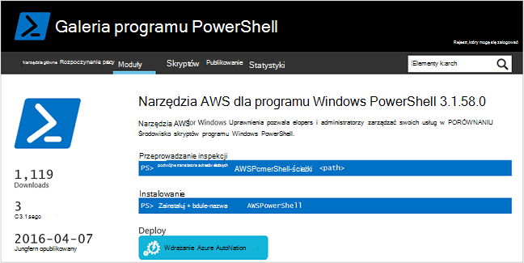
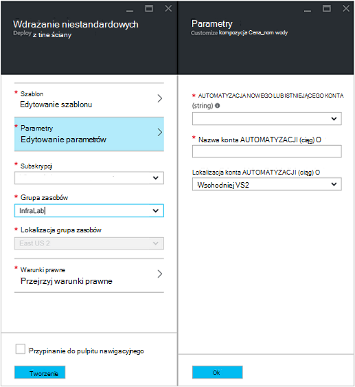
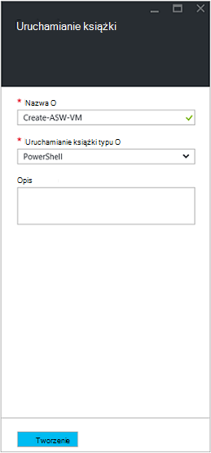
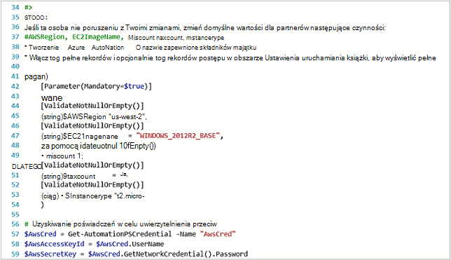
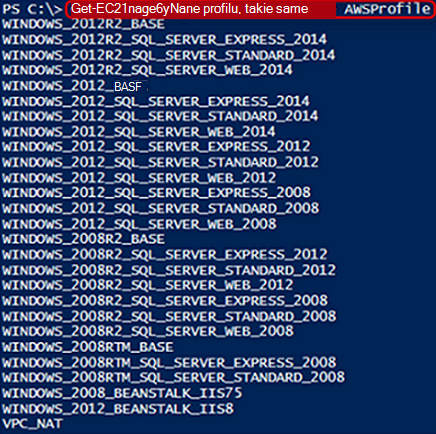
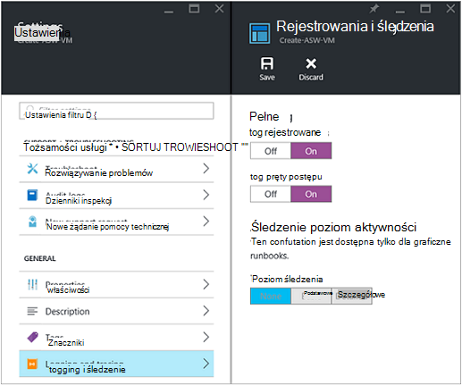
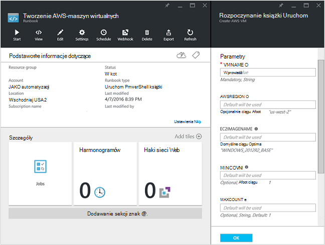
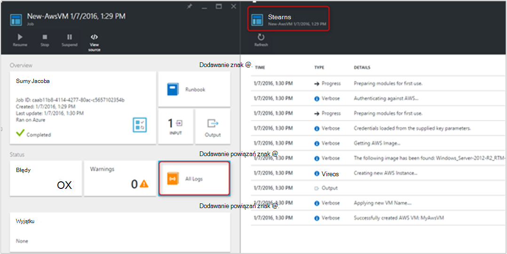
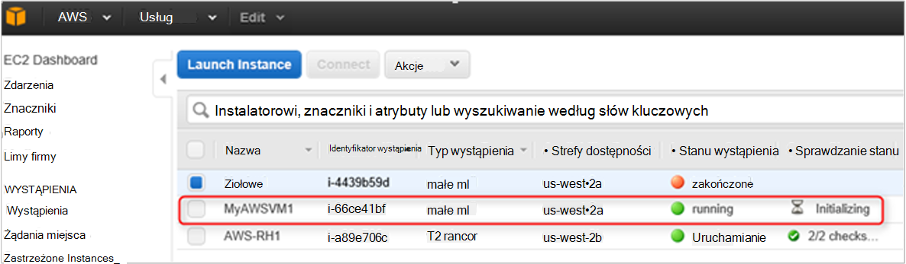

<properties
   pageTitle="Automatyzowanie wdrażania maszyn wirtualnych w usługach sieci Web Amazon | Microsoft Azure"
   description="W tym artykule przedstawiono sposób użycia automatyzacji Azure, aby zautomatyzować tworzenie maszyn wirtualnych Amazon w sieci Web usługi"
   services="automation"
   documentationCenter=""
   authors="mgoedtel"
   manager="jwhit"
   editor="" />
<tags
   ms.service="automation"
   ms.devlang="na"
   ms.topic="article"
   ms.tgt_pltfrm="na"
   ms.workload="na"
   ms.date="08/17/2016"
   ms.author="tiandert; bwren" />

# <a name="azure-automation-scenario---provision-an-aws-virtual-machine"></a>Scenariusz automatyzacji Azure — Obsługa administracyjna maszyn wirtualnych AWS 

W tym artykule firma Microsoft pokazano, jak można korzystać z automatyzacji Azure do obsługi administracyjnej maszyny wirtualnej w ramach subskrypcji usługi sieci Web Amazon (AWS) i nadaj tej maszyn wirtualnych nazwę określonego — AWS odnosi się do jako "znakowanie" maszyn wirtualnych.

## <a name="prerequisites"></a>Wymagania wstępne

Na potrzeby tego artykułu musisz mieć konto Azure automatyzacji i AWS subskrypcji. Aby uzyskać więcej informacji na temat ustawiania konto Azure automatyzacji i konfigurowanie go przy użyciu poświadczeń subskrypcji AWS Przejrzyj [Skonfigurować uwierzytelnianie za pomocą usługi sieci Web Amazon](../automation/automation-sec-configure-aws-account.md).  To konto należy utworzony lub zaktualizowany przy użyciu poświadczeń subskrypcji AWS przed kontynuowaniem, jak firma Microsoft będzie odwoływać się do tego konta w ramach poniższych kroków.


## <a name="deploy-amazon-web-services-powershell-module"></a>Wdrażanie modułu programu PowerShell usługi Amazon w sieci Web

Nasze maszyn wirtualnych inicjowania obsługi administracyjnej działań aranżacji będzie korzystać z modułu programu PowerShell AWS swojej pracy. Wykonaj poniższe czynności, aby dodać moduł do swojego konta automatyzacji, którego skonfigurowano AWS poświadczenia subskrypcji.  

1. Otwórz przeglądarkę sieci web i przejdź do [Galerii programu PowerShell](http://www.powershellgallery.com/packages/AWSPowerShell/) i wybierz polecenie **Rozmieść do przycisku automatyzacji Azure**.<br> 

2. Są pobierane do strony logowania Azure i po uwierzytelnieniu, możesz będą kierowane do Azure Portal i prezentowany następujące karta.<br> 

3. Wybierz grupę zasobów, z listy rozwijanej **Grupa zasobów** , a karta parametry, wprowadź następujące informacje:
   * Z listy rozwijanej **nowego lub istniejącego konta automatyzacji (ciąg)** wybierz **istniejący**.  
   * W polu **Nazwa konta automatyzacji (ciąg)** wpisz dokładną nazwę konta automatyzacji, które zawiera poświadczenia dla subskrypcji AWS.  Na przykład jeśli utworzysz konto dedykowane o nazwie **AWSAutomation**, następnie to wpisz w polu.
   * Wybierz odpowiedni region z listy rozwijanej **Lokalizacja konta automatyzacji** .

4. Po zakończeniu wprowadzania wymaganych informacji kliknij przycisk **Utwórz**.

    >[AZURE.NOTE]Podczas importowania modułu programu PowerShell do automatyzacji Azure, go też wyodrębnia poleceń cmdlet i działania te nie pojawią się zakończeniem moduł całkowicie importowania i wyodrębnianie poleceń cmdlet. Ten proces może potrwać kilka minut.  
<br>
5. Azure Portal otwórz konta automatyzacji, do których odwołuje się w kroku 3.
6. Kliknij na kafelku **składniki majątku** i karta **zasoby** , zaznacz opcję Podziel **moduły** .
7. Na karta **moduły** będą widoczne moduł **AWSPowerShell** na liście.

## <a name="create-aws-deploy-vm-runbook"></a>Tworzenie AWS wdrażanie działań aranżacji maszyn wirtualnych

Po wdrożeniu modułu programu PowerShell AWS, możemy teraz Autor działań aranżacji Aby zautomatyzować inicjowania obsługi administracyjnej maszyny wirtualnej AWS za pomocą skryptu programu PowerShell. Poniższe kroki przedstawi jak je wykorzystać natywnych skrypt programu PowerShell w automatyzacji Azure.  

>[AZURE.NOTE] Dodatkowe opcje i informacje dotyczące tego skryptu można znaleźć w [Galerii programu PowerShell](https://www.powershellgallery.com/packages/New-AwsVM/DisplayScript).


1. Pobieranie skrypt programu PowerShell AwsVM nowy z galerii programu PowerShell, otwierając sesji programu PowerShell i wpisując następujące czynności:<br>
   ```
   Save-Script -Name New-AwsVM -Path \<path\>
   ```
<br>
2. Z portalu Azure otwierającą konto automatyzacji, a następnie kliknij Kafelek **Runbooks** .  
3. Karta **Runbooks** zaznacz **Dodaj działań aranżacji**.
4. Na karta **Dodaj działań aranżacji** wybierz **Szybkie tworzenie** (Tworzenie nowych działań aranżacji).
5. Na karta właściwości **działań aranżacji** wpisz nazwę w polu Nazwa dla swojego działań aranżacji i **Typ działań aranżacji** listy rozwijanej wybierz z **programu PowerShell**i kliknij przycisk **Utwórz**.<br> 
6. Gdy pojawi się karta edytowanie działań aranżacji programu PowerShell, skopiuj i wklej skrypt programu PowerShell do działań aranżacji tworzenia obszaru roboczego.<br> <br>

    >[AZURE.NOTE] Uwaga poniższe czynności podczas pracy z przykładowy skrypt programu PowerShell:
    >
    > - Działań aranżacji zawiera liczbę wartości domyślne parametrów. Ocenianie wszystkich wartości domyślne i zaktualizować w razie potrzeby.
    > - Jeśli przechowujesz poświadczenia AWS jako trwały poświadczeń o nazwie inaczej niż **AWScred**, będzie konieczne zaktualizowanie skrypt w wierszu 57 zgodnie z odpowiednio.  
    > - Podczas pracy z poleceniami AWS interfejsu wiersza polecenia programu PowerShell, zwłaszcza z tym przykładzie działań aranżacji, musisz określić AWS region. W przeciwnym razie cmdlet nie powiedzie się.  Wyświetlanie tematu AWS [Określ Region AWS](http://docs.aws.amazon.com/powershell/latest/userguide/pstools-installing-specifying-region.html) narzędzia AWS dla dokumentu programu PowerShell, aby uzyskać więcej informacji.  
<br>
7. Aby pobrać listę nazw, obraz ze swojej subskrypcji AWS, uruchamianie środowiska PowerShell ISE i zaimportuj AWS modułu programu PowerShell.  Uwierzytelnić AWS zastępując **Get-AutomationPSCredential** w środowisku ISE z **AWScred = Get-poświadczeń**.  To wyświetli monit o podanie poświadczeń i można udostępnić swój **Identyfikator klucza dostępu** dla nazwy użytkownika i **Hasła klawisz dostępu** o podanie hasła.  Zobacz przykład poniżej:

        #Sample to get the AWS VM available images
        #Please provide the path where you have downloaded the AWS PowerShell module
        Import-Module AWSPowerShell
        $AwsRegion = "us-west-2"
        $AwsCred = Get-Credential
        $AwsAccessKeyId = $AwsCred.UserName
        $AwsSecretKey = $AwsCred.GetNetworkCredential().Password

        # Set up the environment to access AWS
        Set-AwsCredentials -AccessKey $AwsAccessKeyId -SecretKey $AwsSecretKey -StoreAs AWSProfile
        Set-DefaultAWSRegion -Region $AwsRegion

        Get-EC2ImageByName -ProfileName AWSProfile
   Zwracany jest następujący wynik:<br>
     
8. Skopiuj i Wklej do jednej z nazw obrazów w zmiennej automatyzacji określone w działań aranżacji jako **$InstanceType**. Ponieważ w tym przykładzie są nam przy użyciu bezpłatnego AWS tiered subskrypcji, użyjemy **t2.micro** naszym przykładzie działań aranżacji.
9. Zapisywanie działań aranżacji, a następnie kliknij pozycję **Publikuj** publikowanie działań aranżacji, a następnie **Tak** po wyświetleniu monitu.


### <a name="testing-the-aws-vm-runbook"></a>Testowanie działań aranżacji AWS maszyn wirtualnych
Aby można było kontynuować testowania działań aranżacji, należy sprawdzić kilka rzeczy. W szczególności:

   -  Utworzono środka trwałego dla uwierzytelnienia AWS nazywane **AWScred** lub skrypt został zaktualizowany w celu odwołanie nazwy do środka poświadczeń.  
   -  Zaimportowano modułu programu PowerShell AWS w automatyzacji Azure
   -  Utworzono nowy działań aranżacji i wartości parametrów została zweryfikowana i aktualizowane w razie potrzeby
   -  **Pełne rekordów dziennika** i opcjonalnie **rekordów dziennika postępu** w obszarze Ustawienia **rejestrowania i śledzenia** działań aranżacji ustawiono **na**.<br> 

1. Chcemy Rozpoczynanie działań aranżacji, więc kliknij przycisk **Start** , a następnie kliknij przycisk **OK** , gdy zostanie otwarta karta Rozpoczynanie działań aranżacji.
2. Karta Rozpoczynanie działań aranżacji dostarcza **VMname**.  Zaakceptuj wartości domyślne parametrach wstępnie skryptu wcześniej.  Kliknij **przycisk OK** , aby rozpocząć zadanie działań aranżacji.<br> 
3. Okienko zadań zostanie otwarty dla zadania działań aranżacji właśnie utworzony. Zamknij to okienko.
4. Firma Microsoft może wyświetlać informacje o postępie zadania i widok wyjściowych **strumienie** , wybierając kafelków **Wszystkich dzienników** z działań aranżacji karta zadania.<br> 
5. Aby potwierdzić, że obsługi administracyjnej maszyn wirtualnych, zaloguj się do konsoli zarządzania AWS, jeśli użytkownik nie jest obecnie zalogowany.<br> 

## <a name="next-steps"></a>Następne kroki
-   Aby rozpocząć pracę z runbooks graficznych, zobacz [Moje pierwszego graficzne działań aranżacji](automation-first-runbook-graphical.md)
-   Aby rozpocząć pracę z runbooks przepływu pracy programu PowerShell, zobacz [Moje pierwszego działań aranżacji przepływu pracy programu PowerShell](automation-first-runbook-textual.md)
-   Aby dowiedzieć się więcej na temat typów działań aranżacji, ich zalet i ograniczeń, zobacz [Typy działań aranżacji automatyzacji Azure](automation-runbook-types.md)
-   Aby uzyskać więcej informacji na temat skrypt programu PowerShell obsługi funkcji, zobacz [skrypt PowerShell natywnych pomocy technicznej w automatyzacji Azure](https://azure.microsoft.com/blog/announcing-powershell-script-support-azure-automation-2/)
