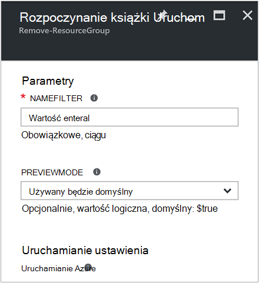
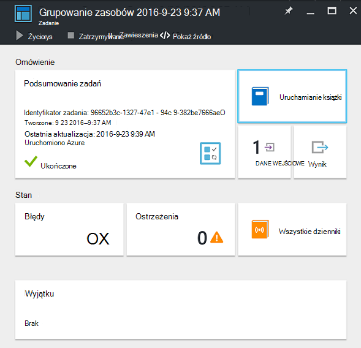
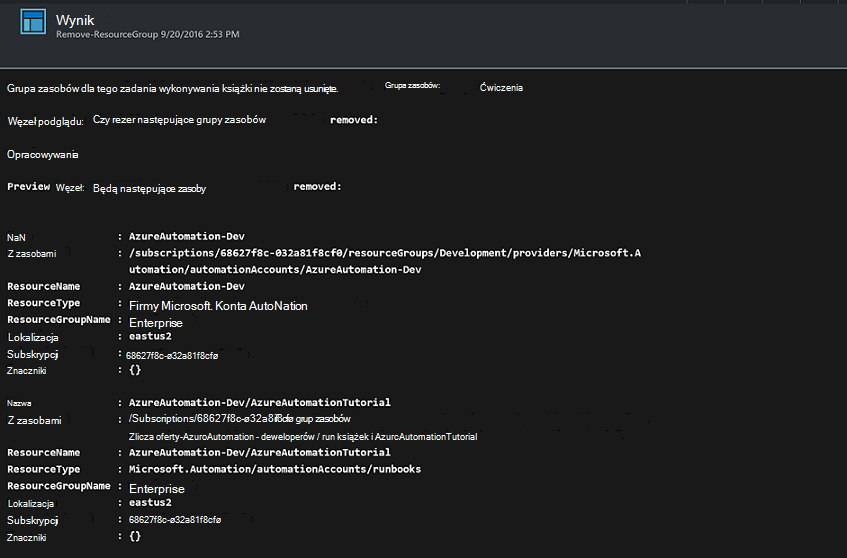

<properties
    pageTitle="Automatyzowanie usuwania grup zasobów | Microsoft Azure"
    description="Wersja przepływu pracy programu PowerShell scenariusz automatyzacji Azure, w tym runbooks, aby usunąć wszystkie grupy zasobów w ramach subskrypcji."
    services="automation"
    documentationCenter=""
    authors="MGoedtel"
    manager="jwhit"
    editor=""
    />
<tags
    ms.service="automation"
    ms.workload="tbd"
    ms.tgt_pltfrm="na"
    ms.devlang="na"
    ms.topic="get-started-article"
    ms.date="09/26/2016"
    ms.author="magoedte"/>

# Scenariusz automatyzacji Azure - zautomatyzować usuwania grup zasobów

Wielu klientów utworzyć więcej niż jedną grupę zasobów. Niektóre mogą być używane do zarządzania aplikacjami produkcji, a inne osoby mogą służyć jako rozwój, testowanie i przygotowania środowiska. Automatyzowanie wdrożenia tych zasobów jest jedno, ale możliwość zlikwidować grupy zasobów za pomocą kliknięcia przycisku jest inny. Typowe zadania zarządzania można usprawnić przy użyciu automatyzacji Azure. Jest to przydatne, jeśli pracujesz z subskrypcją usługi Azure o limicie wydatków za pośrednictwem ofertę członka, takich jak witryny MSDN lub program Microsoft Partner Network Cloud Essentials.

W tym scenariuszu jest oparty na działań aranżacji programu PowerShell i ma na celu usuwanie jednej lub kilku grup zasobów, określające ze swojej subskrypcji. Ustawienie domyślnego zestawu działań aranżacji jest testowanie przed kontynuowaniem. Dzięki temu, że nie przypadkowego usunięcia grupy zasobów przed będzie już gotowe do wykonania tej procedury.   

## Wprowadzenie tego scenariusza

W tym scenariuszu składa się z programu PowerShell działań aranżacji, który można pobrać z [Galerii programu PowerShell](https://www.powershellgallery.com/packages/Remove-ResourceGroup/1.0/DisplayScript). Możesz też zaimportować bezpośrednio z [Galerii działań aranżacji](automation-runbook-gallery.md) w portalu Azure.  

Działań aranżacji | Opis|
----------|------------|
Grupa zasobów Usuń | Usuwa jeden lub więcej grup zasobów Azure i skojarzonych z nimi zasobów z subskrypcji.  
 
Dla tego działań aranżacji zdefiniowano następujących parametrów wejściowych:

Parametr | Opis|
----------|------------|
NameFilter (wymagany) | Określa filtr nazw w celu ograniczenia liczby grup zasobów, które mają o usuwaniu. Można przekazać wiele wartości przy użyciu rozdzielaną średnikami listę. Filtr nie jest uwzględniana wielkość liter i będzie pasować do żadnej grupy zasobów, zawierającą ciąg.|
PreviewMode (opcjonalnie) | Wykonuje działań aranżacji, aby wyświetlić grupy zasobów, które zostaną usunięte, ale brak działania. Wartość domyślna to **PRAWDA** aby zapobiec przypadkowemu usunięciu przekazywane do działań aranżacji jedną lub więcej grup zasobów.  

## Instalowanie i konfigurowanie w tym scenariuszu

### Wymagania wstępne

Ten działań aranżacji uwierzytelnia przy użyciu [konta Azure Uruchom jako](automation-sec-configure-azure-runas-account.md).    

### Instalowanie i publikowanie runbooks

Po pobraniu działań aranżacji, możesz go zaimportować przy użyciu procedury w [procedurach działań aranżacji importowanie](automation-creating-importing-runbook.md#importing-a-runbook-from-a-file-into-Azure-Automation). Publikowanie działań aranżacji po jego zostały pomyślnie zaimportowane do Twojego konta automatyzacji.

## Za pomocą działań aranżacji

Poniższe kroki przeprowadzi Cię przez wykonanie tej działań aranżacji i pozwalają w łatwy sposób zapoznanie się ze działania. Można będzie tylko być testowanie działań aranżacji w tym przykładzie rzeczywiście usunięcie grupy zasobów.  

1. Z poziomu portalu Azure Otwórz konto automatyzacji, a następnie kliknij pozycję **Runbooks**.
2. Zaznacz działań aranżacji **Grupa zasobów Usuń** , a następnie kliknij przycisk **Start**.
3. Po uruchomieniu działań aranżacji zostanie wyświetlona karta **Rozpoczynanie działań aranżacji** i można skonfigurować parametry. Wprowadź nazwy grup zasobów w ramach subskrypcji można używać do testowania, a następnie spowoduje, że nie szkód jeśli przypadkowo usunięty.  

    >[AZURE.NOTE] Upewnij się, że **Previewmode** jest ustawiona na **wartość PRAWDA** , aby uniknąć usunięcia wybranych grup zasobów.  **Uwaga** to działań aranżacji nie spowoduje usunięcia grupa zasobów, zawierającą konto automatyzacji, które jest uruchomiony ten działań aranżacji.  

4. Po skonfigurowaniu wszystkich parametr wartości, kliknij **przycisk OK**i działań aranżacji zostaną umieszczone w kolejce do wykonania.  

Aby wyświetlić szczegółowe informacje o zadaniu działań aranżacji **Grupa zasobów Usuń** w portalu Azure, zaznacz **zadania** w działań aranżacji. Zadania sumaryczne są wyświetlane parametrów wejściowych i strumienia wyjściowego oprócz ogólne informacje o zadaniu i wyjątki, które wystąpiły.  .

**Zadania sumarycznego** zawiera wiadomości z dane wyjściowe, ostrzeżenia i strumienie błędu. Zaznacz **dane wyjściowe** , aby wyświetlić szczegółowe wyniki w czasie wykonywania działań aranżacji.  

## Następne kroki

- Aby rozpocząć tworzenie własnych działań aranżacji, zobacz [Tworzenie lub importowanie działań aranżacji w automatyzacji Azure](automation-creating-importing-runbook.md).
- Aby rozpocząć pracę z runbooks przepływu pracy programu PowerShell, zobacz [Moje pierwszego działań aranżacji przepływu pracy programu PowerShell](automation-first-runbook-textual.md).
