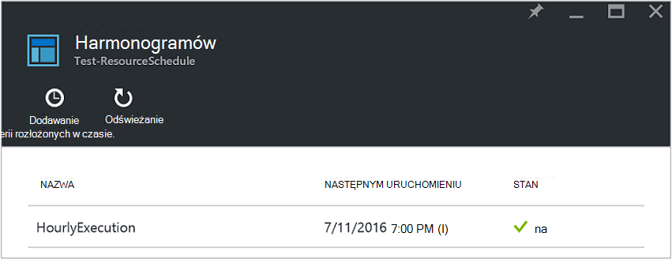
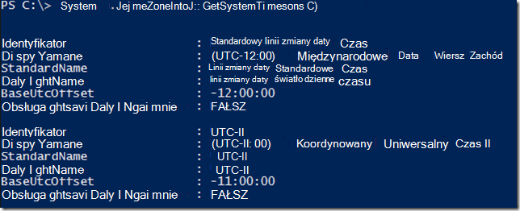
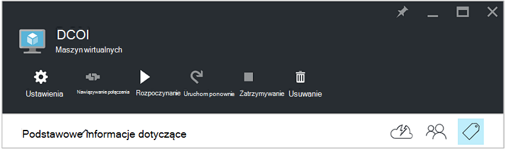
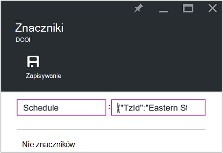
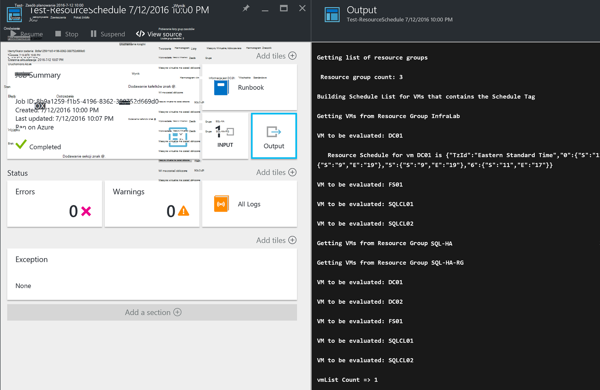

<properties
   pageTitle="Używanie tagów sformatowane JSON umożliwiające utworzenie harmonogramu dla maszyn wirtualnych Azure uruchamiania i zamykania | Microsoft Azure"
   description="W tym artykule przedstawiono sposób użycia ciągów JSON na znaczniki, aby zautomatyzować planowanie uruchamiania maszyn wirtualnych i zamykania."
   services="automation"
   documentationCenter=""
   authors="MGoedtel"
   manager="jwhit"
   editor="tysonn" />
<tags
   ms.service="automation"
   ms.devlang="na"
   ms.topic="article"
   ms.tgt_pltfrm="na"
   ms.workload="infrastructure-services"
   ms.date="07/18/2016"
   ms.author="magoedte;paulomarquesc" />

# Scenariusz automatyzacji Azure: utworzenie harmonogramu dla maszyn wirtualnych Azure uruchamiania i zamykania przy użyciu znaczników sformatowane JSON

Klienci często chcesz zaplanować uruchamiania i zamykania maszyn wirtualnych pomocy technicznej firmy i wymagań technicznych lub zmniejszyć koszty subskrypcji.  

Następującym scenariuszu można skonfigurować automatyczne uruchamianie i zamykanie programu maszyny wirtualne przy użyciu tagu określanym harmonogramu na poziomie grupy zasobów lub maszyn wirtualnych w Azure. Ten harmonogram można skonfigurować od Niedziela do Sobota z czasem uruchamiania i czasu zamykania.  

Mamy niektóre opcje w nowym polu. W tym:
-  [Ustawia skali maszyn wirtualnych](../virtual-machine-scale-sets/virtual-machine-scale-sets-overview.md) z ustawieniami autoscale, pozwalających na skalowanie lub pomniejszyć.
- Usługa [DevTest Labs](../devtest-lab/devtest-lab-overview.md) , która ma wbudowanej funkcji planowania operacji uruchamiania i zamykania.

Jednak tych opcji obsługuje tylko określonych scenariuszach i nie można stosować do maszyny wirtualne infrastruktury jako z usługi (IaaS).   

Harmonogram zostanie zastosowany do grupy zasobów, są również stosowane do wszystkich maszyn wirtualnych wewnątrz danej grupy zasobów. Jeśli harmonogram jest stosowane do maszyny również bezpośrednio, ostatni harmonogram ma pierwszeństwo w następującej kolejności:

1.  Harmonogram zastosowane do grupy zasobów
2.  Harmonogram zastosowane do grupy zasobów i maszyn wirtualnych w grupie zasobów
3.  Harmonogram zastosowane maszyn wirtualnych

W tym scenariuszu zasadniczo JSON ciąg znaków z określonym formatem i dodaje ją jako wartość tagu o nazwie harmonogramu. Następnie działań aranżacji zawiera listę wszystkich grup zasobów i maszyn wirtualnych i identyfikuje harmonogramów dla każdego maszyn wirtualnych oparte na scenariuszach wymienionych powyżej. Następnie w pętli maszyny wirtualne zawierające harmonogramów dołączone i daje w wyniku działania, jakie należy podjąć. Na przykład określają, które maszyny wirtualne należy zatrzymać, zamknij lub ignorowane.

Te runbooks służą do uwierzytelniania za pomocą [konta Azure Uruchom jako](../automation/automation-sec-configure-azure-runas-account.md).

## Pobierz runbooks scenariusza

W tym scenariuszu składa się z czterech runbooks przepływu pracy programu PowerShell, które można pobrać z [Galerii TechNet](https://gallery.technet.microsoft.com/Azure-Automation-Runbooks-84f0efc7) lub repozytorium [GitHub](https://github.com/paulomarquesdacosta/azure-automation-scheduled-shutdown-and-startup) dla tego projektu.

Działań aranżacji | Opis
----------|----------
Test ResourceSchedule | Sprawdza każdy harmonogram maszyn wirtualnych i wykonuje zamknięcia lub uruchomienia, w zależności od harmonogramu.
Dodawanie ResourceSchedule | Dodaje znacznik harmonogramu do grupy maszyn wirtualnych lub zasobów.
Aktualizacja ResourceSchedule | Modyfikuje istniejącego znacznika harmonogram, zamieniając nową.
Usuń ResourceSchedule | Usuwa znacznik harmonogram z grupy maszyn wirtualnych lub zasobów.

## Instalowanie i konfigurowanie w tym scenariuszu

### Instalowanie i publikowanie runbooks

Po pobraniu runbooks, możesz je zaimportować przy użyciu procedury [Tworzenie](automation-creating-importing-runbook.md#importing-a-runbook-from-a-file-into-Azure-Automation)lub importowanie działań aranżacji w automatyzacji Azure.  Publikowanie poszczególnych działań aranżacji po jego zostały pomyślnie zaimportowane do Twojego konta automatyzacji.

### Dodawanie serii rozłożonych w czasie do działań aranżacji Test ResourceSchedule

Wykonaj poniższe czynności, aby włączyć harmonogram działań aranżacji Test ResourceSchedule. Jest to działań aranżacji, które sprawdza maszyn wirtualnych powinny być pracę, zamknij lub pewien.

1. Z portalu Azure otwierającą konto automatyzacji, a następnie kliknij Kafelek **Runbooks** .
2. Wybierz polecenie karta **Test ResourceSchedule** kafelków **harmonogramów** .
3. Na karta **harmonogramów** kliknij przycisk **Dodaj serii rozłożonych w czasie**.
4. Wybierz **Połącz harmonogram programu działań aranżacji**na karta **harmonogramów** . Następnie wybierz pozycję **Utwórz nowy arkusz**.
5.  Na karta **nowego arkusza** wpisz imię i nazwisko tej harmonogram, na przykład: *HourlyExecution*.
6. **Rozpoczynanie**harmonogramu Ustawianie momentu rozpoczęcia przyrost o godzinę.
7. Zaznacz **cyklu**, a następnie dla **cykliczności każdej interwału**, wybierz pozycję **1 godzina**.
8. Sprawdź, czy **Ustawianie wygaśnięcia** jest ustawiona na wartość **nie**, a następnie kliknij przycisk **Utwórz** , aby zapisać nowy harmonogram.
9. Na **Harmonogram działań aranżacji** karta Opcje wybierz **Ustawienia uruchamiania i parametry**. W karta Test ResourceSchedule **Parametry** wprowadź nazwę subskrypcji, w polu **SubscriptionName** .  To jest tylko parametr wymaganego dla działań aranżacji.  Gdy skończysz, kliknij **przycisk OK**.  

Harmonogram działań aranżacji powinna wyglądać następująco po jego zakończeniu:

 

## Formatowanie ciągu JSON

To rozwiązanie zasadniczo ma JSON ciągu z określonym formatem i dodaje ją jako wartość znacznika o nazwie harmonogramu. Następnie działań aranżacji zawiera listę wszystkich grup zasobów i maszyn wirtualnych i identyfikuje harmonogramy dla każdej maszyny wirtualnej.

Działań aranżacji pętli maszyn wirtualnych, które zostały dołączone harmonogramów i sprawdza działania, jakie należy podjąć. Oto przykładowy sposób formatowania rozwiązania:

    {
       "TzId": "Eastern Standard Time",
        "0": {  
           "S": "11",
           "E": "17"
        },
        "1": {
           "S": "9",
           "E": "19"
        },
        "2": {
           "S": "9",
           "E": "19"
        },
    }

Oto niektóre szczegółowe informacje na temat tej struktury:

1. Aby obejść ograniczenie 256 znaków wartości jeden znacznik platformy Azure jest zoptymalizowany format tej struktury JSON.

2. *TzId* reprezentuje strefę czasową maszyny wirtualnej. Ten identyfikator można uzyskać za pomocą klasę .NET informacje o strefie czasowej w sesji programu PowerShell —**[System.TimeZoneInfo]:: GetSystemTimeZones()**.

    

    - Dni robocze są przedstawiane z wartością liczbową zera do 6. Wartość zero jest równe niedzielę.
    - Czas rozpoczęcia jest reprezentowane atrybutem **S** , a jego wartość jest w formacie 24-godzinnym.
    - Czas zakończenia lub zamknięcia jest reprezentowane atrybutem **E** , a jego wartość jest w formacie 24-godzinnym.

    Jeśli atrybutów każdej **S** i **E** ma wartość zero (0), maszyna wirtualna pozostanie w jej obecnym stanie w czasie oceny.   

3. Jeśli chcesz pominąć oceny określony dzień tygodnia, nie dodawaj sekcji dla tego dnia tygodnia. W poniższym przykładzie jest obliczane tylko poniedziałek, a nie są uwzględniane dni tygodnia:

        {
          "TzId": "Eastern Standard Time",
           "1": {
             "S": "11",
             "E": "17"
           }
        }

## Grupy zasobów znacznika lub maszyny wirtualne

Aby zamknąć maszyny wirtualne, musisz oznakować maszyny wirtualne lub grup zasobów, w których są one umieszczone. Maszyn wirtualnych, które nie mają znacznik harmonogram nie są uwzględniane. W związku z tym nie są uruchomione lub zamknięty.

Istnieją dwa sposoby grup zasobów znacznika lub maszyny wirtualne dotyczące tego rozwiązania. Można to zrobić bezpośrednio w portalu. Lub można użyć Dodaj ResourceSchedule, ResourceSchedule aktualizacji i Usuń ResourceSchedule runbooks.

### Znakowanie za pośrednictwem portalu

Wykonaj poniższe czynności, aby oznakować maszyn wirtualnych lub grupa zasobów w portalu:

1. Spłaszcz ciągu JSON i sprawdź, czy nie ma żadnych spacji.  Ciągu JSON powinna wyglądać następująco:

        {"TzId":"Eastern Standard Time","0":{"S":"11","E":"17"},"1":{"S":"9","E":"19"},"2": {"S":"9","E":"19"},"3":{"S":"9","E":"19"},"4":{"S":"9","E":"19"},"5":{"S":"9","E":"19"},"6":{"S":"11","E":"17"}}

2. Wybierz ikonę **znacznika** w grupie maszyn wirtualnych lub zasób zastosować ten harmonogram.

    
3. Znaczniki są definiowane po pary klucz wartość. Wpisz **harmonogramu** w polu **klucza** , a następnie wklej w polu **wartość** ciągu JSON. Kliknij przycisk **Zapisz**. Nowe oznakowanie powinna zostać wyświetlona na liście znaczniki dla zasobu.

### Znacznik z programu PowerShell

Wszystkie runbooks zaimportowanego zawierają informacje pomocy na początku skrypt, który opisano, jak wykonać runbooks bezpośrednio z poziomu programu PowerShell. Możesz nawiązać połączenie runbooks ScheduleResource Dodawanie i aktualizowanie ScheduleResource programu PowerShell. W tym przekazując wymagane parametry, które umożliwiają tworzenie lub aktualizowanie znacznik harmonogramu w grupie maszyn wirtualnych lub zasób poza portalu.  

Aby utworzyć, dodawanie i usuwanie znaczników przy użyciu programu PowerShell, pierwszy konieczne jest [skonfigurowanie środowiska PowerShell dla Azure](../powershell-install-configure.md). Po zakończeniu instalacji, możesz kontynuować następujące czynności.

### Tworzenie znacznika harmonogramu przy użyciu programu PowerShell

1. Otwórz sesję programu PowerShell. Następnie należy użyć następującego przykładu, do uwierzytelniania za pomocą konta Uruchom jako i określ subskrypcji:   

        Conn = Get-AutomationConnection -Name AzureRunAsConnection
        Add-AzureRMAccount -ServicePrincipal -Tenant $Conn.TenantID `
        -ApplicationId $Conn.ApplicationID -CertificateThumbprint $Conn.CertificateThumbprint
        Select-AzureRmSubscription -SubscriptionName "MySubscription"

2. Definiowanie tabeli mieszania harmonogramu. Oto przykładowy sposób wykonane:

        $schedule= @{ "TzId"="Eastern Standard Time"; "0"= @{"S"="11";"E"="17"};"1"= @{"S"="9";"E"="19"};"2"= @{"S"="9";"E"="19"};"3"= @{"S"="9";"E"="19"};"4"= @{"S"="9";"E"="19"};"5"= @{"S"="9";"E"="19"};"6"= @{"S"="11";"E"="17"}}

3. Definiowanie parametrów, które są wymagane przez działań aranżacji. W poniższym przykładzie są możemy kierowanie maszyny:

        $params = @{"SubscriptionName"="MySubscription";"ResourceGroupName"="ResourceGroup01"; `
        "VmName"="VM01";"Schedule"=$schedule}

    Jeśli masz znakowanie grupa zasobów, należy usunąć *VMName* parametr z tabeli mieszania $params w następujący sposób:

        $params = @{"SubscriptionName"="MySubscription";"ResourceGroupName"="ResourceGroup01"; `
        "Schedule"=$schedule}

4. Uruchom działań aranżacji Dodaj ResourceSchedule z poniższych parametrów Tworzenie znacznika harmonogramu:

        Start-AzureRmAutomationRunbook -Name "Add-ResourceSchedule" -Parameters $params `
        -AutomationAccountName "AutomationAccount" -ResourceGroupName "ResourceGroup01"

5. Aby zaktualizować grupa zasobów lub znacznik maszyn wirtualnych, wykonywanie działań aranżacji **Aktualizacji ResourceSchedule** z następujących parametrów:

        Start-AzureRmAutomationRunbook -Name "Update-ResourceSchedule" -Parameters $params `
        -AutomationAccountName "AutomationAccount" -ResourceGroupName "ResourceGroup01"

### Usuwanie znacznika harmonogramu przy użyciu programu PowerShell

1. Otwórz sesję programu PowerShell i uruchom poniższe czynności, do uwierzytelniania za pomocą konta Uruchom jako, a aby wybrać i określić subskrypcji:

        Conn = Get-AutomationConnection -Name AzureRunAsConnection
        Add-AzureRMAccount -ServicePrincipal -Tenant $Conn.TenantID `
        -ApplicationId $Conn.ApplicationID -CertificateThumbprint $Conn.CertificateThumbprint
        Select-AzureRmSubscription -SubscriptionName "MySubscription"

2. Definiowanie parametrów, które są wymagane przez działań aranżacji. W poniższym przykładzie są możemy kierowanie maszyny:

        $params = @{"SubscriptionName"="MySubscription";"ResourceGroupName"="ResourceGroup01" `
        ;"VmName"="VM01"}

    Aby usunąć znacznik z grupy zasobów, należy usunąć *VMName* parametr z tabeli mieszania $params w następujący sposób:

        $params = @{"SubscriptionName"="MySubscription";"ResourceGroupName"="ResourceGroup01"}

3. Wykonywanie działań aranżacji ResourceSchedule Usuń, aby usunąć znacznik harmonogramu:

        Start-AzureRmAutomationRunbook -Name "Remove-ResourceSchedule" -Parameters $params `
        -AutomationAccountName "AutomationAccount" -ResourceGroupName "ResourceGroup01"

4. Aby zaktualizować grupa zasobów lub znacznik maszyn wirtualnych, wykonywanie działań aranżacji ResourceSchedule Usuń z następujących parametrów:

        Start-AzureRmAutomationRunbook -Name "Remove-ResourceSchedule" -Parameters $params `
        -AutomationAccountName "AutomationAccount" -ResourceGroupName "ResourceGroup01"

>[AZURE.NOTE] Zaleca się, że wyprzedzeniem monitorować te runbooks (i Państwa maszyn wirtualnych), aby zweryfikować, że maszyn wirtualnych są zamknięte w dół i w związku z tym pracę.  

Aby wyświetlić szczegółowe informacje o zadaniu działań aranżacji Test ResourceSchedule w portalu Azure, zaznacz opcję Podziel **zadania** zestawu działań aranżacji. Zadania sumaryczne, zostanie wyświetlony parametrów wejściowych i strumienia wyjściowego, oprócz ogólne informacje o zadaniu i wyjątki od ich wystąpienia.  

**Zadania sumarycznego** zawiera wiadomości z dane wyjściowe, ostrzeżenia i strumienie błędu. Wybierz Kafelek **dane wyjściowe** , aby wyświetlić szczegółowe wyniki w czasie wykonywania działań aranżacji.

  

## Następne kroki

-  Aby rozpocząć pracę z runbooks przepływu pracy programu PowerShell, zobacz [Moje pierwszego działań aranżacji przepływu pracy programu PowerShell](automation-first-runbook-textual.md).
-  Aby dowiedzieć się więcej na temat typów działań aranżacji i ich zalet i ograniczeń, zobacz [Typy działań aranżacji automatyzacji Azure](automation-runbook-types.md).
-  Aby uzyskać więcej informacji na temat skrypt programu PowerShell obsługi funkcji, zobacz [skrypt PowerShell natywnych pomocy technicznej w automatyzacji Azure](https://azure.microsoft.com/blog/announcing-powershell-script-support-azure-automation-2/).
-  Aby dowiedzieć się więcej na temat działań aranżacji rejestrowania i dane wyjściowe, zobacz [dane wyjściowe działań aranżacji i wiadomości w automatyzacji Azure](automation-runbook-output-and-messages.md).
-  Aby dowiedzieć się więcej na temat konto Azure Uruchom jako oraz jak uwierzytelnianie usługi runbooks przy użyciu go, zobacz [runbooks uwierzytelniania za pomocą konta Azure Uruchom jako](../automation/automation-sec-configure-azure-runas-account.md).
