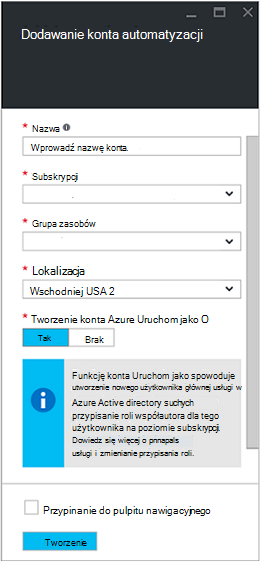
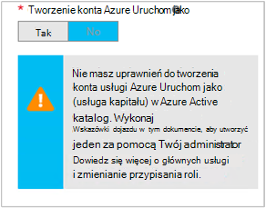

<properties
   pageTitle="Konfigurowanie konta użytkownika Azure AD | Microsoft Azure"
   description="Ten artykuł zawiera opis sposobu konfigurowania poświadczeń konta Azure AD użytkownika dla runbooks w automatyzacji Azure do uwierzytelniania rąk i ASM."
   services="automation"
   documentationCenter=""
   authors="MGoedtel"
   manager="jwhit"
   editor="tysonn"
   keywords="konto użytkownika usługi Azure active directory użytkownika azure usługi zarządzania azure ad" />
<tags
   ms.service="automation"
   ms.devlang="na"
   ms.topic="get-started-article"
   ms.tgt_pltfrm="na"
   ms.workload="infrastructure-services"
   ms.date="09/12/2016"
   ms.author="magoedte" />

# Uwierzytelnianie Runbooks z zarządzania usługą Azure i Menedżera zasobów

W tym artykule opisano kroki, które należy wykonać, aby skonfigurować konto Azure AD użytkownika dla runbooks automatyzacji Azure uruchomionym w celu zarządzania usługi Azure (ASM) lub Azure Menedżera zasobów (ARM) zasobów.  Gdy to będzie działać podstawą tożsamości obsługiwanego uwierzytelniania dla Twojej ARM runbooks, zaleca korzysta z nowego konta Azure Uruchom jako.       

## Tworzenie nowego użytkownika usługi Azure Active Directory

1. Zaloguj się do portalu klasyczny Azure jako administrator usługi Azure subskrypcji, którą chcesz zarządzać.
2. Zaznacz **Usługi Active Directory**, a następnie wybierz nazwę katalogu organizacji.
3. Wybierz kartę **użytkowników** , a następnie w obszarze polecenia wybierz pozycję **Dodaj użytkownika**.
4. Na stronie **Przekaż nam o tym użytkowniku** w polu **Typ użytkownika**wybierz **nowego użytkownika w Twojej organizacji**.
5. Wprowadź nazwę użytkownika.  
6. Wybierz nazwę katalogu, z którą jest skojarzony z subskrypcją usługi Azure na stronie usługi Active Directory.
7. Na stronie **profilu użytkownika** wprowadź pierwszy i ostatni nazwę, przyjazna nazwa i użytkownika z listy **ról** .  Czy **włączyć uwierzytelnianie wieloskładnikowe**.
8. Uwaga pełnej nazwy użytkownika i hasła tymczasowego.
9. Wybierz pozycję **Ustawienia > Administratorzy > Dodaj**.
10. Wpisz pełną nazwę użytkownika, którego została utworzona.
11. Wybierz subskrypcję, do której użytkownik ma zarządzać.
12. Wyloguj się z Azure, a następnie zaloguj się ponownie, używając innego konta, dla którego został utworzony. Możesz zostanie wyświetlony monit o zmianę hasła użytkownika.

## Tworzenie konta automatyzacji w klasycznym Portal Azure
W tej sekcji będą wykonaj następujące czynności, aby utworzyć nowe konto Azure automatyzacji w Portal Azure, używany przy użyciu usługi zarządzania zasobami w trybie ASM i rąk runbooks.  

>[AZURE.NOTE] Konta automatyzacji utworzone za pomocą portalu klasyczny Azure może zarządzać zarówno klasyczny Azure i Azure Portal oraz zestawu poleceń cmdlet. Po utworzeniu konta nie ma różnicy jak tworzyć i zarządzania zasobami w ramach tego konta. Jeśli planujesz korzystać z portalu klasyczny Azure w dalszym ciągu, następnie używaj go zamiast Azure Portal kont automatyzacji.

1. Zaloguj się do portalu klasyczny Azure jako administrator usługi Azure subskrypcji, którą chcesz zarządzać.
2. Wybierz pozycję **automatyzacji**.
3. Na stronie **automatyzacji** wybierz opcję **Utwórz konto automatyzacji**.
4. W oknie dialogowym **Tworzenie konta automatyzacji** wpisz nazwę dla nowego konta automatyzacji i wybierz **Region** z listy rozwijanej.  
5. Kliknij **przycisk OK** , aby zaakceptować ustawienia i utworzyć konto.
6. Po utworzeniu znajdzie się ona na stronie **automatyzacji** .
7. Kliknij konto, a spowoduje przeniesienie do strony pulpitu nawigacyjnego.  
8. Na stronie pulpitu nawigacyjnego automatyzacji wybierz pozycję **elementy zawartości**.
9. Na stronie **elementy zawartości** wybierz pozycję **Dodaj ustawienia** znajduje się w dolnej części strony.
10. Na stronie **Dodawanie ustawienia** wybierz pozycję **Dodaj poświadczenia**.
11. Na stronie **Definiowanie poświadczeń** wybierz z listy rozwijanej **Typ poświadczeń** **Systemu Windows PowerShell poświadczeń** i podaj nazwę dla poświadczenia.
12. W następujących Definiowanie strony typ **Poświadczeń** w nazwa użytkownika konta użytkownika AD utworzone wcześniej w polu **Nazwa użytkownika** i hasło w polach **hasło** i **Potwierdź hasło** . Kliknij **przycisk OK** , aby zapisać zmiany.

## Tworzenie konta automatyzacji w Azure Portal

W tej sekcji będą wykonaj następujące czynności, aby utworzyć nowe konto Azure automatyzacji w Portal Azure, używany z runbooks zarządzania zasobami w trybie ARM.  

1. Zaloguj się do portalu Azure jako administrator usługi Azure subskrypcji, którą chcesz zarządzać.
2. Wybierz pozycję **konta automatyzacji**.
3. W karta automatyzacji kont kliknij przycisk **Dodaj**. 
2. W karta **Dodaj konto automatyzacji** w polu **Nazwa** wpisz nazwę nowego konta automatyzacji.
5. Jeśli masz więcej niż jedną subskrypcję, określ jedną dla nowego konta, a także nowej lub istniejącej **grupy zasobów** i Azure centrum danych **lokalizacji**.
3. Wybierz wartość **Brak** opcji **Tworzenie Azure konta Uruchom jako** , a następnie kliknij przycisk **Utwórz** .  

    >[AZURE.NOTE] Jeśli wybierzesz nie utworzyć konta Uruchom jako, wybierając opcję **Brak**, zostaną wyświetlone z komunikatem ostrzegawczym w karta **Dodaj konto automatyzacji** .  Gdy konto zostanie utworzone i przydzielone do roli **współautora** w subskrypcji, nie ma odpowiedniego tożsamość uwierzytelniania w ramach usługi katalogowej subskrypcje i dlatego nie uzyskują dostęp do zasobów w ramach subskrypcji.  Uniemożliwi to wszelkie runbooks odwoływanie się do tego konta uniemożliwia do uwierzytelniania i wykonywać zadania w odniesieniu do ARM zasobów.

    

4. Gdy Azure tworzy konto automatyzacji, możesz śledzić postęp w obszarze **powiadomień** z menu.

Po zakończeniu tworzenia poświadczeń następnie należy utworzyć zasób poświadczeń chcesz skojarzyć konto użytkownika AD wcześniej utworzone konto automatyzacji.  Pamiętaj, że tylko utworzone konta automatyzacji i nie jest skojarzony z tożsamością uwierzytelniania.  Wykonaj kroki opisane w [aktywa poświadczeń w artykule automatyzacji Azure](../automation/automation-credentials.md#creating-a-new-credential) i wprowadź wartość dla **nazwy użytkownika** w formacie **domena\użytkownik**.

## Użyj poświadczeń w działań aranżacji

Można pobrać poświadczeń w działań aranżacji używania działania [Get-AutomationPSCredential](http://msdn.microsoft.com/library/dn940015.aspx) i używaj go z [AzureAccount Dodaj](http://msdn.microsoft.com/library/azure/dn722528.aspx) nawiązywania połączenia z subskrypcji usługi Azure. W przypadku poświadczenia administratora wielu subskrypcji Azure, należy również użyć [AzureSubscription wybierz](http://msdn.microsoft.com/library/dn495203.aspx) określ poprawne. Jest ona wyświetlana w próbce programu Windows PowerShell poniżej zwykle wyświetlaną u góry większości runbooks automatyzacji Azure.

    $cred = Get-AutomationPSCredential –Name "myuseraccount.onmicrosoft.com"
    Add-AzureAccount –Credential $cred
    Select-AzureSubscription –SubscriptionName "My Subscription"

W swojej działań aranżacji, należy powtórzyć te wiersze po dowolnej [punktów kontrolnych](http://technet.microsoft.com/library/dn469257.aspx#bk_Checkpoints) . Jeśli działań aranżacji zostało zawieszone, a następnie życiorysy na innego pracownika, następnie konieczne będzie przeprowadzenie uwierzytelniania ponownie.

## Następne kroki
* Przeglądanie działań aranżacji różnych typów i instrukcje dotyczące tworzenia własnych runbooks z następującego artykułu [Typy działań aranżacji automatyzacji Azure](../automation/automation-runbook-types.md)
