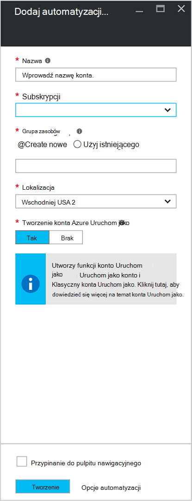
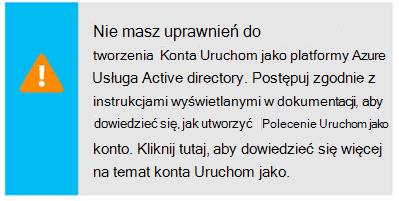
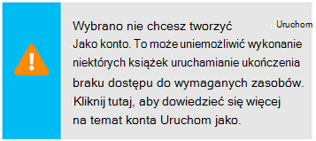
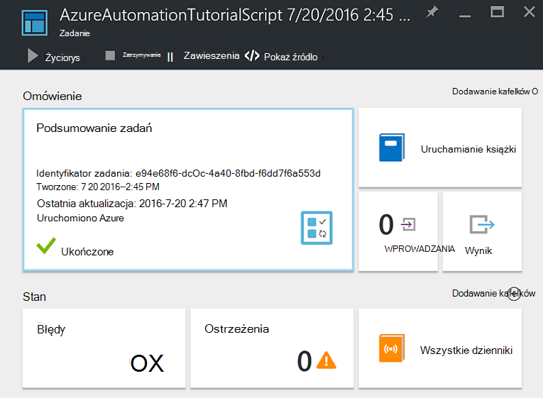
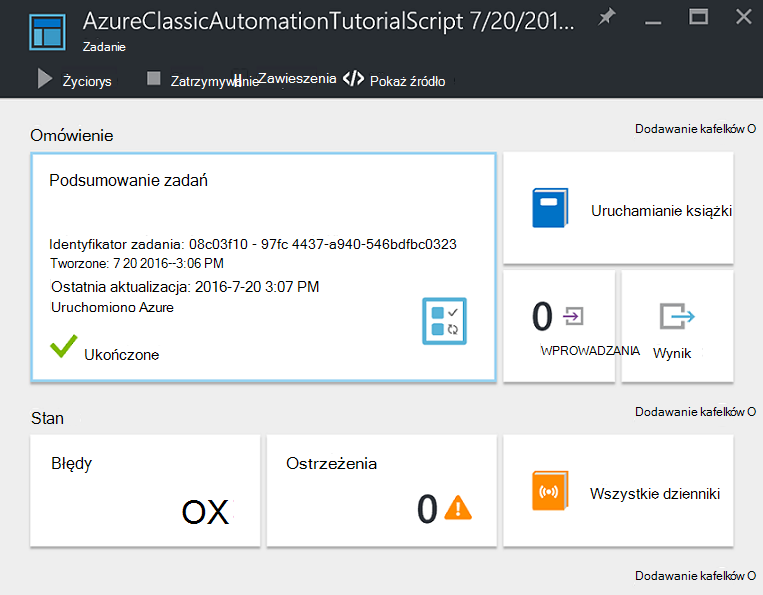
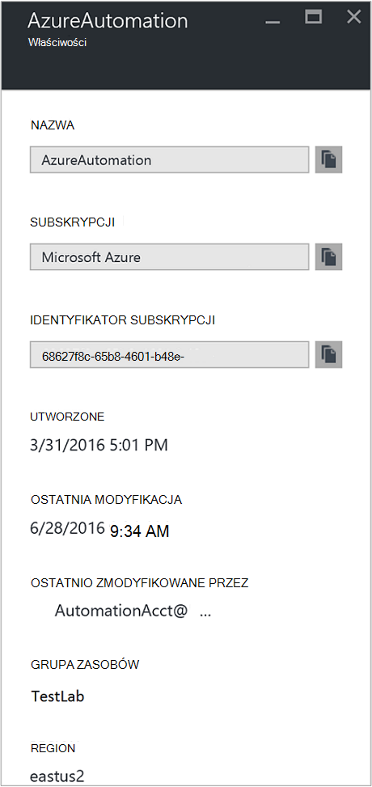

<properties
    pageTitle="Konfigurowanie Azure Uruchom jako konto | Microsoft Azure"
    description="Samouczki który przeprowadzi Cię przez tworzenie, testowanie i przykład stosowania zabezpieczeń uwierzytelniania kapitału w automatyzacji Azure."
    services="automation"
    documentationCenter=""
    authors="mgoedtel"
    manager="jwhit"
    editor=""
    keywords="główna nazwa usługi, setspn azure uwierzytelniania"/>
<tags
    ms.service="automation"
    ms.workload="tbd"
    ms.tgt_pltfrm="na"
    ms.devlang="na"
    ms.topic="get-started-article"
    ms.date="08/17/2016"
    ms.author="magoedte"/>

# Typ poświadczeń uwierzytelniania Runbooks konta Azure Uruchom jako

W tym temacie procedurach pokazano, jak skonfigurować konto automatyzacji z portalu Azure za pomocą funkcji konto Uruchom jako do uwierzytelnienia runbooks zarządzać zasobami w Menedżera zasobów Azure lub Zarządzanie usługą Azure.

Po utworzeniu nowego konta automatyzacji w portalu Azure automatycznie tworzy:

- Uruchom jako konto, które tworzy nowy podmiot usługi Azure Active Directory, certyfikat i przypisuje kontrola dostępu oparta na rolach współpracownik (RBAC), która będzie używana do zarządzania zasobami Menedżera zasobów za pomocą runbooks.   
- Klasyczny konta Uruchom jako, przekazując certyfikatu zarządzania, która będzie używana do zarządzania usługą Azure czy klasyczny zasobów za pomocą runbooks.  

Upraszcza proces i pozwala szybko rozpocząć tworzenie i wdrażanie runbooks dla różnych potrzeb automatyzacji.      

Przy użyciu konta Uruchom jako, a klasyczny uruchomić, możesz wykonać następujące czynności:

- Umożliwia standardowym uwierzytelniania Azure podczas zarządzania Menedżera zasobów Azure lub Zarządzanie usługą Azure zasobów z runbooks w portalu Azure.  
- Automatyzowanie stosowania globalnej runbooks skonfigurowany w Azure alertów.

>[AZURE.NOTE] Azure [funkcji integracji alertów](../monitoring-and-diagnostics/insights-receive-alert-notifications.md) o Runbooks globalnej automatyzacji wymaga konta automatyzacji, który skonfigurowano Uruchom jako i konta klasyczny Uruchom jako. Możesz wybierz konto automatyzacji, który ma już konto Uruchom jako i klasyczny Uruchom jako zdefiniowane lub wybierz pozycję Utwórz nową.

Firma Microsoft będzie pokazano, jak utworzyć konto automatyzacji z portalu Azure, aktualizowanie konto automatyzacji za pomocą programu PowerShell i przedstawiają sposoby uwierzytelniania w swojej runbooks.

Przed możemy to zrobić, istnieje kilka rzeczy, które należy zrozumieć i należy rozważyć przed kontynuowaniem.

1. Nie ma wpływu istniejących kont automatyzacji utworzone w klasycznym lub model wdrożenia Menedżera zasobów.  
2. Działa tylko w przypadku kont automatyzacji utworzone przez Azure portal.  Próby utworzenia konta z portalu klasyczny nie będą replikowane Konfiguracja konta Uruchom jako.
3. Jeśli masz runbooks i zasoby (to znaczy harmonogramów, zmienne itp.) utworzone wcześniej do zarządzania zasobami klasyczny i chcesz je runbooks do uwierzytelnienia z nowym kontem klasyczny Uruchom jako, będzie konieczne migrowanie ich do nowego konta automatyzacji lub aktualizowanie istniejącego konta za pomocą skryptu programu PowerShell poniżej.  
4. Uwierzytelnianie przy użyciu nowego konta Uruchom jako i konto klasyczny uruchamianie jako automatyzacji, będzie konieczne modyfikowanie z istniejących runbooks z poniższego przykładowego kodu.  **Uwaga należy** konta Uruchom jako przeznaczone do uwierzytelniania zasobów Menedżer zasobów za pomocą głównej usługi na podstawie certyfikatu, a następnie konta klasyczny Uruchom jako występuje w przypadku uwierzytelniania na usługi zarządzania zasobami przy użyciu certyfikatu zarządzania.     

## Tworzenie nowego konta automatyzacji z Azure Portal

W tej sekcji będą wykonaj następujące czynności, aby utworzyć nowe konto Azure automatyzacji z portalu Azure.  Spowoduje to utworzenie Uruchom jako i Klasyczny konta Uruchom jako.  

>[AZURE.NOTE] Użytkownik wykonujące te czynności *muszą* być członkiem roli Administratorzy subskrypcji i Współtworzenie administrator subskrypcji, które jest udzielanie dostępu do subskrypcji dla użytkownika.  Użytkownik musi również dodany jako użytkownika do tej subskrypcji domyślne usługi Active Directory; konto nie muszą być przypisane do ról uprzywilejowanych.

1. Zaloguj się do portalu Azure z konta, które jest członkiem roli Administratorzy subskrypcji i Współtworzenie administrator subskrypcji.
2. Wybierz pozycję **konta automatyzacji**.
3. W karta automatyzacji kont kliknij przycisk **Dodaj**. 

    >[AZURE.NOTE]Jeśli zobaczysz następujące ostrzeżenie w karta **Dodaj konto automatyzacji** , wynika to konto nie jest członkiem roli Administratorzy subskrypcji i co administratorami subskrypcji. 

4. W karta **Dodaj konto automatyzacji** w polu **Nazwa** wpisz nazwę nowego konta automatyzacji.
5. Jeśli masz więcej niż jedną subskrypcję, określ dla nowego konta, a także nowej lub istniejącej **grupy zasobów** i Azure centrum danych **lokalizacji**.
6. Sprawdź wartość, która jest zaznaczona opcja **Tak** dla opcji **Tworzenie Azure konta Uruchom jako** , a następnie kliknij przycisk **Utwórz** .  

    >[AZURE.NOTE] Jeśli wybierzesz nie utworzyć konta Uruchom jako, wybierając opcję **Brak**, zostaną wyświetlone z komunikatem ostrzegawczym w karta **Dodaj konto automatyzacji** .  Gdy konto zostanie utworzony w portalu Azure, nie ma odpowiedniego tożsamość uwierzytelniania w ramach usługi klasyczny lub usługa katalogowa subskrypcji Menedżera zasobów i w związku z tym, nie dostępu do zasobów w ramach subskrypcji.  Uniemożliwi to wszelkie runbooks odwoływanie się do tego konta uniemożliwia do uwierzytelniania i wykonywać zadania w odniesieniu do zasobów w tych modeli wdrożenia.

    > 
Nie utworzono wystawcy usługi roli współautora nie można przypisać.

7. Gdy Azure tworzy konto automatyzacji, możesz śledzić postęp w obszarze **powiadomień** z menu.

### Zasoby dostępny

Po pomyślnym utworzeniu konta automatyzacji kilka zasoby są tworzone automatycznie dla Ciebie.  W poniższej tabeli podsumowano zasoby dla konta Uruchom jako. 

Zasób|Opis
--------|-----------
AzureAutomationTutorial działań aranżacji|Przykład programu PowerShell działań aranżacji pokazano, jak uwierzytelnianie za pomocą konta Uruchom jako, która pobiera wszystkie zasoby Menedżera zasobów.
AzureAutomationTutorialScript działań aranżacji|Przykład programu PowerShell działań aranżacji pokazano, jak uwierzytelnianie za pomocą konta Uruchom jako, która pobiera wszystkie zasoby Menedżera zasobów.
AzureRunAsCertificate|Trwały certyfikat automatycznie utworzone podczas tworzenia konta automatyzacji lub za pomocą skryptu programu PowerShell poniżej dla istniejącego konta.  Umożliwia uwierzytelniania przez Azure, dzięki czemu można zarządzać Menedżera zasobów Azure zasobów z runbooks.  Certyfikat ma rozpiętość czasu jednego roku.
AzureRunAsConnection|Trwały połączenia automatycznie utworzone podczas tworzenia konta automatyzacji lub za pomocą skryptu programu PowerShell poniżej dla istniejącego konta.

W poniższej tabeli podsumowano zasoby dla konta klasyczny Uruchom jako. 

Zasób|Opis
--------|-----------
AzureClassicAutomationTutorial działań aranżacji|Przykład działań aranżacji które pobiera wszystkie klasyczny maszyny wirtualne w subskrypcji za pomocą klasycznej uruchamianie jako konta (certyfikat), a następnie wyświetla nazwę maszyn wirtualnych i stan.
Skrypt AzureClassicAutomationTutorial działań aranżacji|Przykład działań aranżacji które pobiera wszystkie klasyczny maszyny wirtualne w subskrypcji za pomocą klasycznej uruchamianie jako konta (certyfikat), a następnie wyświetla nazwę maszyn wirtualnych i stan.
AzureClassicRunAsCertificate|Trwały certyfikat automatycznie utworzony, który jest używany do uwierzytelniania z Azure, dzięki czemu można zarządzać Azure klasyczny zasobów z runbooks.  Certyfikat ma roczną rozpiętość czasu.
AzureClassicRunAsConnection|Trwały połączenia automatycznie utworzony, który jest używany do uwierzytelniania z Azure, dzięki czemu można zarządzać Azure klasyczny zasobów z runbooks.  

## Sprawdzanie uwierzytelniania Uruchom jako

Następnie przeprowadzi firma Microsoft small test, aby potwierdzić, że jesteś udało się uwierzytelnić przy użyciu nowego konta Uruchom jako.     

1. Otwórz Azure Portal konta automatyzacji utworzony wcześniej.  
2. Kliknij Kafelek **Runbooks** , aby otworzyć listę runbooks.
3. Wybieranie działań aranżacji **AzureAutomationTutorialScript** , a następnie kliknij przycisk **Uruchom** , aby rozpocząć działań aranżacji.  Otrzymasz monit zweryfikowania, że chcesz rozpocząć działań aranżacji.
4. Utworzono [działań aranżacji zadania](automation-runbook-execution.md) , zadanie zostanie wyświetlona karta i stan zadania wyświetlane w kafelku **Podsumowanie zadań** .  
5. Stan zadania zostanie uruchomiony jako *kolejce* wskazująca oczekuje pracownika działań aranżacji w chmurze stanie się dostępna. Następnie przejdzie do *Uruchamianie* podczas pracownikiem roszczeń zadania, a następnie *uruchomione* podczas działań aranżacji faktycznie uruchamiania.  
6. Po zakończeniu zadania działań aranżacji, możemy powinna być widoczna stan **ukończone**.   
7. Aby wyświetlić szczegółowe wyniki działań aranżacji, kliknij w polu **dane wyjściowe** .
8. W karta **dane wyjściowe** powinny być widoczne został pomyślnie uwierzytelnione i zwracane listę wszystkich zasobów dostępnych w grupie zasobów.
9. Zamknij karta **dane wyjściowe** , aby powrócić do karta **Podsumowanie zadań** .
13. Zamknij **Podsumowanie zadań** i odpowiadające im karta działań aranżacji **AzureAutomationTutorialScript** .

## Sprawdzanie uwierzytelniania klasyczny Uruchom jako

Następny wykona firma Microsoft small test upewnij się, że jesteś udało się uwierzytelnić przy użyciu nowego konta klasyczny Uruchom jako.     

1. Otwórz Azure Portal konta automatyzacji utworzony wcześniej.  
2. Kliknij Kafelek **Runbooks** , aby otworzyć listę runbooks.
3. Wybieranie działań aranżacji **AzureClassicAutomationTutorialScript** , a następnie kliknij przycisk **Uruchom** , aby rozpocząć działań aranżacji.  Otrzymasz monit zweryfikowania, że chcesz rozpocząć działań aranżacji.
4. Utworzono [działań aranżacji zadania](automation-runbook-execution.md) , zadanie zostanie wyświetlona karta i stan zadania wyświetlane w kafelku **Podsumowanie zadań** .  
5. Stan zadania zostanie uruchomiony jako *kolejce* wskazująca oczekuje pracownika działań aranżacji w chmurze stanie się dostępna. Następnie przejdzie do *Uruchamianie* podczas pracownikiem roszczeń zadania, a następnie *uruchomione* podczas działań aranżacji faktycznie uruchamiania.  
6. Po zakończeniu zadania działań aranżacji, możemy powinna być widoczna stan **ukończone**.   
7. Aby wyświetlić szczegółowe wyniki działań aranżacji, kliknij w polu **dane wyjściowe** .
8. W karta **dane wyjściowe** powinny być widoczne ma pomyślnie uwierzytelniony i zwracane listę wszystkich klasyczny maszyn wirtualnych znajdują się w subskrypcji.
9. Zamknij karta **dane wyjściowe** , aby powrócić do karta **Podsumowanie zadań** .
13. Zamknij **Podsumowanie zadań** i odpowiadające im karta działań aranżacji **AzureClassicAutomationTutorialScript** .

## Aktualizowanie konta automatyzacji przy użyciu programu PowerShell

W tym miejscu otrzymasz opcję za pomocą programu PowerShell, aby zaktualizować istniejące konto automatyzacji, jeśli:

1. Utworzone konto automatyzacji, ale je odrzucił utworzyć konto Uruchom jako
2. Masz już konto automatyzacji do zarządzania zasobami Menedżera zasobów i chcesz zaktualizować go, aby uwzględniały konto Uruchom jako uwierzytelniania działań aranżacji
2. Masz już konto automatyzacji do zarządzania zasobami klasyczny i chcesz zaktualizować go używać klasyczny Uruchom jako zamiast tworzenia nowego konta i przeprowadzania migracji z runbooks i zasoby do niego   

Przed kontynuowaniem sprawdź następujące czynności:

1. Zostały pobrane i zainstalowane [Windows Management Framework (WMF) 4.0](https://www.microsoft.com/download/details.aspx?id=40855) , jeśli korzystasz z systemu Windows 7.   
    Jeśli korzystasz z systemu Windows Server 2012 R2, Windows Server 2012, Windows 2008 R2, Windows 8.1 i Windows 7 z dodatkiem SP1, [Windows Management Framework 5.0](https://www.microsoft.com/download/details.aspx?id=50395) jest dostępny dla instalacji.
2. Azure programu PowerShell 1.0. Aby uzyskać informacje o tej wersji i jak ją zainstalować zobacz [jak zainstalować i skonfigurować Azure programu PowerShell](../powershell-install-configure.md).
3. Utworzono konto automatyzacji.  To konto będzie można odwoływać się jako wartości parametrów — AutomationAccountName i ApplicationDisplayName — w obu poniższych skryptów.

Aby uzyskać wartości dla *SubscriptionID*, *Grupa zasobów*i *AutomationAccountName*, które są wymagane parametry dotyczące skryptów w portalu Azure Wybieranie konta automatyzacji z karta **konta automatyzacji** oraz **wszystkie ustawienia**.  Z karta **wszystkie ustawienia** w obszarze **Ustawienia konta** wybierz pozycję **Właściwości**.  Karta **Właściwości** Zanotuj te wartości.    

### Tworzenie uruchamianie jako konto skrypt programu PowerShell

Skrypt programu PowerShell poniżej będzie skonfigurować następujące ustawienia:

- Aplikacja Azure AD, która będzie uwierzytelniony z podpisem własnym certyfikatu, tworzenie kapitału konta usługi dla tej aplikacji w Azure AD i przypisana rola współautora (można to zmienić do właściciela lub innych roli) dla tego konta w bieżącej subskrypcji.  Aby uzyskać więcej informacji zapoznaj się z tego artykułu [Kontrola dostępu oparta na rolach w automatyzacji Azure](../automation/automation-role-based-access-control.md) .
- Zasób certyfikat automatyzacji na koncie automatyzacji określonego o nazwie **AzureRunAsCertificate**, posiadającą certyfikat używany przez głównej usługi.
- Środka trwałego połączenia automatyzacji na koncie automatyzacji określonego o nazwie **AzureRunAsConnection**, który zawiera identyfikator aplikacji, tenantId, subscriptionId i odcisku palca certyfikatu.    

Poniższe kroki przeprowadzi Cię przez proces wykonywania skryptu.

1. Poniższy skrypt należy zapisać na komputerze.  W tym przykładzie Zapisz go z pliku **AzureServicePrincipal.ps1 nowy**.  

        #Requires -RunAsAdministrator
        Param (
        [Parameter(Mandatory=$true)]
        [String] $ResourceGroup,

        [Parameter(Mandatory=$true)]
        [String] $AutomationAccountName,

        [Parameter(Mandatory=$true)]
        [String] $ApplicationDisplayName,

        [Parameter(Mandatory=$true)]
        [String] $SubscriptionId,

        [Parameter(Mandatory=$true)]
        [String] $CertPlainPassword,

        [Parameter(Mandatory=$false)]
        [int] $NoOfMonthsUntilExpired = 12
        )

        Login-AzureRmAccount
        Import-Module AzureRM.Resources
        Select-AzureRmSubscription -SubscriptionId $SubscriptionId

        $CurrentDate = Get-Date
        $EndDate = $CurrentDate.AddMonths($NoOfMonthsUntilExpired)
        $KeyId = (New-Guid).Guid
        $CertPath = Join-Path $env:TEMP ($ApplicationDisplayName + ".pfx")

        $Cert = New-SelfSignedCertificate -DnsName $ApplicationDisplayName -CertStoreLocation cert:\LocalMachine\My -KeyExportPolicy Exportable -Provider "Microsoft Enhanced RSA and AES Cryptographic Provider"

        $CertPassword = ConvertTo-SecureString $CertPlainPassword -AsPlainText -Force
        Export-PfxCertificate -Cert ("Cert:\localmachine\my\" + $Cert.Thumbprint) -FilePath $CertPath -Password $CertPassword -Force | Write-Verbose

        $PFXCert = New-Object -TypeName System.Security.Cryptography.X509Certificates.X509Certificate -ArgumentList @($CertPath, $CertPlainPassword)
        $KeyValue = [System.Convert]::ToBase64String($PFXCert.GetRawCertData())

        $KeyCredential = New-Object  Microsoft.Azure.Commands.Resources.Models.ActiveDirectory.PSADKeyCredential
        $KeyCredential.StartDate = $CurrentDate
        $KeyCredential.EndDate= $EndDate
        $KeyCredential.KeyId = $KeyId
        $KeyCredential.Type = "AsymmetricX509Cert"
        $KeyCredential.Usage = "Verify"
        $KeyCredential.Value = $KeyValue

        # Use Key credentials
        $Application = New-AzureRmADApplication -DisplayName $ApplicationDisplayName -HomePage ("http://" + $ApplicationDisplayName) -IdentifierUris ("http://" + $KeyId) -KeyCredentials $keyCredential

        New-AzureRMADServicePrincipal -ApplicationId $Application.ApplicationId | Write-Verbose
        Get-AzureRmADServicePrincipal | Where {$_.ApplicationId -eq $Application.ApplicationId} | Write-Verbose

        $NewRole = $null
        $Retries = 0;
        While ($NewRole -eq $null -and $Retries -le 6)
        {
           # Sleep here for a few seconds to allow the service principal application to become active (should only take a couple of seconds normally)
           Sleep 5
           New-AzureRMRoleAssignment -RoleDefinitionName Contributor -ServicePrincipalName $Application.ApplicationId | Write-Verbose -ErrorAction SilentlyContinue
           Sleep 10
           $NewRole = Get-AzureRMRoleAssignment -ServicePrincipalName $Application.ApplicationId -ErrorAction SilentlyContinue
           $Retries++;
        }

        # Get the tenant id for this subscription
        $SubscriptionInfo = Get-AzureRmSubscription -SubscriptionId $SubscriptionId
        $TenantID = $SubscriptionInfo | Select TenantId -First 1

        # Create the automation resources
        New-AzureRmAutomationCertificate -ResourceGroupName $ResourceGroup -AutomationAccountName $AutomationAccountName -Path $CertPath -Name AzureRunAsCertificate -Password $CertPassword -Exportable | write-verbose

        # Create a Automation connection asset named AzureRunAsConnection in the Automation account. This connection uses the service principal.
        $ConnectionAssetName = "AzureRunAsConnection"
        Remove-AzureRmAutomationConnection -ResourceGroupName $ResourceGroup -AutomationAccountName $AutomationAccountName -Name $ConnectionAssetName -Force -ErrorAction SilentlyContinue
        $ConnectionFieldValues = @{"ApplicationId" = $Application.ApplicationId; "TenantId" = $TenantID.TenantId; "CertificateThumbprint" = $Cert.Thumbprint; "SubscriptionId" = $SubscriptionId}
        New-AzureRmAutomationConnection -ResourceGroupName $ResourceGroup -AutomationAccountName $AutomationAccountName -Name $ConnectionAssetName -ConnectionTypeName AzureServicePrincipal -ConnectionFieldValues $ConnectionFieldValues

2. Na komputerze uruchom program **Windows PowerShell** na ekranie **startowym** z podwyższonym poziomem uprawnień użytkownika.
3. Z podwyższonym poziomem uprawnień powłoka wiersza polecenia programu PowerShell przejdź do folderu, który zawiera skrypt utworzony w kroku 1 i wykonywanie skryptów, zmiana wartości parametrów *— Grupa zasobów*, *- AutomationAccountName* *-ApplicationDisplayName*, *- SubscriptionId*i *- CertPlainPassword*. 

    >[AZURE.NOTE] Wyświetli monit o uwierzytelniania Azure po wykonaniu skryptu. Musisz zalogować się przy użyciu konta, które jest członkiem roli Administratorzy subskrypcji i co administratorami subskrypcji.

        .\New-AzureServicePrincipal.ps1 -ResourceGroup <ResourceGroupName>
        -AutomationAccountName <NameofAutomationAccount> `
        -ApplicationDisplayName <DisplayNameofAutomationAccount> `
        -SubscriptionId <SubscriptionId> `
        -CertPlainPassword "<StrongPassword>"  
 

Po pomyślnym zakończeniu skryptu dotyczą [Przykładowy kod](#sample-code-to-authenticate-with-resource-manager-resources) poniżej do uwierzytelniania z zasobami Menedżera zasobów i sprawdzić poprawność konfiguracji poświadczeń.

### Tworzenie konta klasyczny Uruchom jako skrypt programu PowerShell

Skrypt programu PowerShell poniżej będzie skonfigurować następujące ustawienia:

- Zasób certyfikat automatyzacji na koncie automatyzacji określonego o nazwie **AzureClassicRunAsCertificate**, który zawiera certyfikatu służącego do uwierzytelnienia użytkownika runbooks.
- Środka trwałego połączenia automatyzacji na koncie automatyzacji określonego o nazwie **AzureClassicRunAsConnection**, posiadającą nazwę subskrypcji, subscriptionId i certyfikatu nazwę zawartości.

Skrypt będzie Tworzenie certyfikatu z podpisem własnym zarządzania i zapisać go w folderze tymczasowych plików na komputerze, w obszarze profil użytkownika używany w celu wykonania sesji programu PowerShell - *%USERPROFILE%\AppData\Local\Temp*.  Po wykonaniu skryptu będzie konieczne przekazywanie certyfikatu zarządzania Azure w magazynie zarządzania subskrypcji konta automatyzacji został utworzony w.  Poniższe kroki przeprowadzi Cię przez proces wykonywania skryptu i przekazywanie certyfikatu.  

1. Poniższy skrypt należy zapisać na komputerze.  W tym przykładzie Zapisz go z pliku **AzureClassicRunAsAccount.ps1 nowy**.

        #Requires -RunAsAdministrator
        Param (
        [Parameter(Mandatory=$true)]
        [String] $ResourceGroup,

        [Parameter(Mandatory=$true)]
        [String] $AutomationAccountName,

        [Parameter(Mandatory=$true)]
        [String] $ApplicationDisplayName,

        [Parameter(Mandatory=$true)]
        [String] $SubscriptionId,

        [Parameter(Mandatory=$true)]
        [String] $CertPlainPassword,

        [Parameter(Mandatory=$false)]
        [int] $NoOfMonthsUntilExpired = 12
        )

        Login-AzureRmAccount
        Import-Module AzureRM.Resources
        $Subscription = Select-AzureRmSubscription -SubscriptionId $SubscriptionId
        $SubscriptionName = $subscription.Subscription.SubscriptionName

        $CurrentDate = Get-Date
        $EndDate = $CurrentDate.AddMonths($NoOfMonthsUntilExpired)
        $KeyId = (New-Guid).Guid
        $CertPath = Join-Path $env:TEMP ($ApplicationDisplayName + ".pfx")
        $CertPathCer = Join-Path $env:TEMP ($ApplicationDisplayName + ".cer")

        $Cert = New-SelfSignedCertificate -DnsName $ApplicationDisplayName -CertStoreLocation cert:\LocalMachine\My -KeyExportPolicy Exportable -Provider "Microsoft Enhanced RSA and AES Cryptographic Provider"

        $CertPassword = ConvertTo-SecureString $CertPlainPassword -AsPlainText -Force
        Export-PfxCertificate -Cert ("Cert:\localmachine\my\" + $Cert.Thumbprint) -FilePath $CertPath -Password $CertPassword -Force | Write-Verbose
        Export-Certificate -Cert ("Cert:\localmachine\my\" + $Cert.Thumbprint) -FilePath $CertPathCer -Type CERT | Write-Verbose

        # Create the automation resources
        $ClassicCertificateAssetName = "AzureClassicRunAsCertificate"
        New-AzureRmAutomationCertificate -ResourceGroupName $ResourceGroup -AutomationAccountName $AutomationAccountName -Path $CertPath -Name $ClassicCertificateAssetName  -Password $CertPassword -Exportable | write-verbose

        # Create a Automation connection asset named AzureClassicRunAsConnection in the Automation account. This connection uses the ClassicCertificateAssetName.
        $ConnectionAssetName = "AzureClassicRunAsConnection"
        Remove-AzureRmAutomationConnection -ResourceGroupName $ResourceGroup -AutomationAccountName $AutomationAccountName -Name $ConnectionAssetName -Force -ErrorAction SilentlyContinue
        $ConnectionFieldValues = @{"SubscriptionName" = $SubscriptionName; "SubscriptionId" = $SubscriptionId; "CertificateAssetName" = $ClassicCertificateAssetName}
        New-AzureRmAutomationConnection -ResourceGroupName $ResourceGroup -AutomationAccountName $AutomationAccountName -Name $ConnectionAssetName -ConnectionTypeName AzureClassicCertificate -ConnectionFieldValues $ConnectionFieldValues

        Write-Host -ForegroundColor red "Please upload the cert $CertPathCer to the Management store by following the steps below."
        Write-Host -ForegroundColor red "Log in to the Microsoft Azure Management portal (https://manage.windowsazure.com) and select Settings -> Management Certificates."
        Write-Host -ForegroundColor red "Then click Upload and upload the certificate $CertPathCer"

2. Na komputerze uruchom program **Windows PowerShell** na ekranie **startowym** z podwyższonym poziomem uprawnień użytkownika.  
3. Z podwyższonym poziomem uprawnień powłoka wiersza polecenia programu PowerShell przejdź do folderu, który zawiera skrypt utworzony w kroku 1 i wykonywanie skryptów, zmiana wartości parametrów *— Grupa zasobów*, *- AutomationAccountName* *-ApplicationDisplayName*, *- SubscriptionId*i *- CertPlainPassword*. 

    >[AZURE.NOTE] Wyświetli monit o uwierzytelniania Azure po wykonaniu skryptu. Musisz zalogować się przy użyciu konta, które jest członkiem roli Administratorzy subskrypcji i co administratorami subskrypcji.

        .\New-AzureClassicRunAsAccount.ps1 -ResourceGroup <ResourceGroupName>
        -AutomationAccountName <NameofAutomationAccount> `
        -ApplicationDisplayName <DisplayNameofAutomationAccount> `
        -SubscriptionId <SubscriptionId> `
        -CertPlainPassword "<StrongPassword>"

Po pomyślnym zakończeniu skrypt należy skopiować certyfikat utworzony w folderze **Temp** profilu użytkownika.  Postępuj zgodnie z instrukcjami dla [przekazywanie certyfikatu interfejsu API zarządzania](../azure-api-management-certs.md) portalu klasyczny Azure, a następnie przeczytaj [Przykładowy kod](#sample-code-to-authenticate-with-service-management-resources) , aby sprawdzić poprawność konfiguracji poświadczeń przy użyciu usługi zarządzania zasobami.

## Przykładowy kod do uwierzytelnienia z zasobami Menedżera zasobów

Możesz użyć kodu przykładowy poniżej, pobierany ze działań aranżacji przykład **AzureAutomationTutorialScript** , do uwierzytelniania za pomocą konta Uruchom jako do zarządzania zasobami Menedżera zasobów za pomocą usługi runbooks.   

    $connectionName = "AzureRunAsConnection"
    $SubId = Get-AutomationVariable -Name 'SubscriptionId'
    try
    {
       # Get the connection "AzureRunAsConnection "
       $servicePrincipalConnection=Get-AutomationConnection -Name $connectionName         

       "Logging in to Azure..."
       Add-AzureRmAccount `
         -ServicePrincipal `
         -TenantId $servicePrincipalConnection.TenantId `
         -ApplicationId $servicePrincipalConnection.ApplicationId `
         -CertificateThumbprint $servicePrincipalConnection.CertificateThumbprint
       "Setting context to a specific subscription"  
       Set-AzureRmContext -SubscriptionId $SubId             
    }
    catch {
        if (!$servicePrincipalConnection)
        {
           $ErrorMessage = "Connection $connectionName not found."
           throw $ErrorMessage
         } else{
            Write-Error -Message $_.Exception
            throw $_.Exception
         }
    }

Skrypt zawiera dwa wiersze kodu do obsługi odwoływanie się do kontekstu subskrypcji, dzięki czemu można łatwo pracować między wiele subskrypcji. Zasób zmiennej o nazwie SubscriptionId zawiera identyfikator subskrypcji, a po AzureRmAccount Dodawanie instrukcji polecenia cmdlet, określona przy użyciu polecenia [cmdlet Set-AzureRmContext](https://msdn.microsoft.com/library/mt619263.aspx) parametr wartość *- SubscriptionId*. Jeśli nazwa zmiennej jest zbyt ogólne, możesz poprawić nazwa zmiennej do uwzględnienia prefiksu lub innych konwencji nazewnictwa, aby ułatwić zidentyfikowanie wymaganiom. Alternatywnie, można zastosować parametr wartość - SubscriptionName zamiast - SubscriptionId z odpowiednich trwałym zmiennych.  

Zwróć uwagę, że polecenia cmdlet używany do uwierzytelniania w działań aranżacji — **Dodaj AzureRmAccount**są używane *ServicePrincipalCertificate* parametru.  Uwierzytelniania za pomocą certyfikatu głównej usługi, nie poświadczeń.  

## Przykładowy kod do uwierzytelnienia przy użyciu usługi zarządzania zasobami

Możesz użyć kodu przykładowy poniżej, pobierany ze działań aranżacji przykład **AzureClassicAutomationTutorialScript** , do uwierzytelnienia przy użyciu konta klasyczny Uruchom jako do zarządzania zasobami klasyczny z usługi runbooks.

    $ConnectionAssetName = "AzureClassicRunAsConnection"
    # Get the connection
    $connection = Get-AutomationConnection -Name $connectionAssetName        

    # Authenticate to Azure with certificate
    Write-Verbose "Get connection asset: $ConnectionAssetName" -Verbose
    $Conn = Get-AutomationConnection -Name $ConnectionAssetName
    if ($Conn -eq $null)
    {
       throw "Could not retrieve connection asset: $ConnectionAssetName. Assure that this asset exists in the Automation account."
    }

    $CertificateAssetName = $Conn.CertificateAssetName
    Write-Verbose "Getting the certificate: $CertificateAssetName" -Verbose
    $AzureCert = Get-AutomationCertificate -Name $CertificateAssetName
    if ($AzureCert -eq $null)
    {
       throw "Could not retrieve certificate asset: $CertificateAssetName. Assure that this asset exists in the Automation account."
    }

    Write-Verbose "Authenticating to Azure with certificate." -Verbose
    Set-AzureSubscription -SubscriptionName $Conn.SubscriptionName -SubscriptionId $Conn.SubscriptionID -Certificate $AzureCert
    Select-AzureSubscription -SubscriptionId $Conn.SubscriptionID

## Następne kroki

- Aby uzyskać więcej informacji na temat głównych usługi odwołują się do [aplikacji obiekty i wystawcy usługi](../active-directory/active-directory-application-objects.md).
- Aby uzyskać więcej informacji na temat oparta na rolach kontrola dostępu w usłudze automatyzacji Azure dotyczą [Kontrola dostępu oparta na rolach w automatyzacji Azure](../automation/automation-role-based-access-control.md).
- Aby uzyskać więcej informacji na temat certyfikatów i usług Azure odwołują się do [Omówienie certyfikatów dla usług w chmurze Azure](../cloud-services/cloud-services-certs-create.md)
