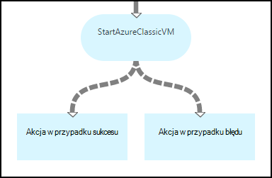
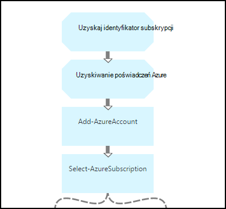
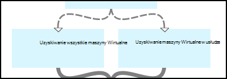
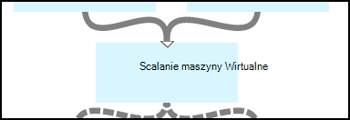
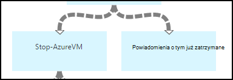
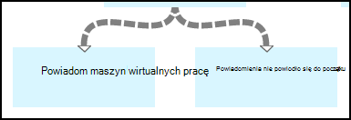
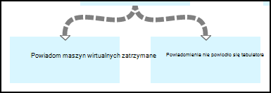

<properties 
    pageTitle="Uruchamianie i zatrzymywanie maszyn wirtualnych — wykres | Microsoft Azure"
    description="Wersja przepływu pracy programu PowerShell scenariusz automatyzacji Azure, łącznie z runbooks do rozpoczynania i kończenia klasyczny maszyn wirtualnych."
    services="automation"
    documentationCenter=""
    authors="mgoedtel"
    manager="jwhit"
    editor="tysonn" />
<tags 
    ms.service="automation"
    ms.devlang="na"
    ms.topic="article"
    ms.tgt_pltfrm="na"
    ms.workload="infrastructure-services"
    ms.date="07/06/2016"
    ms.author="bwren" />

# Azure scenariusz automatyzacji - uruchamianie i zatrzymywanie maszyn wirtualnych

W tym scenariuszu automatyzacji Azure zawiera runbooks do rozpoczynania i kończenia klasycznym maszyn wirtualnych.  W tym scenariuszu służą do dowolnej z następujących czynności:  

- Użyj runbooks bez zmian w środowisku. 
- Modyfikowanie runbooks do wykonywania niestandardowych funkcjach.  
- Zadzwoń runbooks z innego działań aranżacji jako część ogólnego rozwiązania. 
- Użyj runbooks jako samouczki, aby dowiedzieć się działań aranżacji tworzenia pojęcia. 

> [AZURE.SELECTOR]
- [Graficzne](automation-solution-startstopvm-graphical.md)
- [Przepływ pracy programu PowerShell](automation-solution-startstopvm-psworkflow.md)

To jest wersja graficzne działań aranżacji tego scenariusza. Jest również dostępne za pomocą [runbooks przepływu pracy programu PowerShell](automation-solution-startstopvm-psworkflow.md).

## Wprowadzenie tego scenariusza

Ten scenariusz składa się z dwóch dwóch runbooks graficzne, które można pobrać z poniższych łączy.  Zapoznaj się z [wersji przepływu pracy programu PowerShell](automation-solution-startstopvm-psworkflow.md) z tego scenariusza, łącza do runbooks przepływu pracy programu PowerShell.

| Działań aranżacji | Łącze | Typ | Opis |
|:---|:---|:---|:---|
| StartAzureClassicVM | [Rozpoczynanie działań aranżacji graficzne Azure klasyczny maszyn wirtualnych](https://gallery.technet.microsoft.com/scriptcenter/Start-Azure-Classic-VM-c6067b3d) | Graficzne | Powoduje uruchomienie wszystkich klasyczny maszyn wirtualnych w subskrypcji usługi Azure lub wszystkich maszyn wirtualnych przy użyciu nazwy określonej usługi. |
| StopAzureClassicVM | [Zatrzymywanie graficzne działań aranżacji Azure klasyczny maszyn wirtualnych](https://gallery.technet.microsoft.com/scriptcenter/Stop-Azure-Classic-VM-397819bd) | Graficzne | Zatrzymuje wszystkie maszyny wirtualne automatyzacji konta lub wszystkich maszyn wirtualnych przy użyciu nazwy określonej usługi.  |

## Instalowanie i konfigurowanie tego scenariusza

### 1. Instalowanie runbooks

Po pobraniu runbooks, możesz zaimportować je przy użyciu procedury w [graficzne działań aranżacji procedur](automation-graphical-authoring-intro.md#graphical-runbook-procedures).

### 2. Przejrzyj opis i wymagania
Runbooks zawierać działanie o nazwie **Read Me** zawierająca opis i wymagane elementy zawartości.  Możesz wyświetlać te informacje, wybierając aktywności **Odczytu mnie** , a następnie skryptu **Przepływu pracy** .  Możesz również wyświetlić te same informacje z tego artykułu. 

### 3. Konfigurowanie składników majątku
Runbooks wymagają następujące zasoby, które należy utworzyć i wypełniać odpowiednie wartości.  Imiona i nazwiska są domyślne.  Umożliwia elementy zawartości z różnych nazw po określeniu nazw [parametrów wejściowych](#using-the-runbooks) po uruchomieniu działań aranżacji.

| Typ zawartości | Domyślna nazwa | Opis |
|:---|:---|:---|:---|
| [Poświadczenia](automation-credentials.md) | AzureCredential | Zawiera poświadczenia dla konta, które ma uprawnienia do rozpoczynania i kończenia maszyn wirtualnych Azure subskrypcji.  |
| [Zmienna](automation-variables.md) | AzureSubscriptionId | Zawiera identyfikator subskrypcji Azure subskrypcji. |

## Za pomocą tego scenariusza

### Parametry

Runbooks każdego mają następujące [parametrów wejściowych](automation-starting-a-runbook.md#runbook-parameters).  Należy podać wartości parametrów obowiązkowe i opcjonalnie można podać wartości dla innych parametrów w zależności od potrzeb.

| Parametr | Typ | Obowiązkowe | Opis |
|:---|:---|:---|:---|
| Nazwausługi | ciąg | Brak | Jeśli wartość jest dostępne, wszystkie maszyn wirtualnych o tej nazwie usługi jest uruchomiona lub zatrzymana.  Jeśli wartość nie jest dostępne, wszystkie klasyczny środowisku maszyn wirtualnych systemu Azure subskrypcji jest uruchomiona lub zatrzymana. |
| AzureSubscriptionIdAssetName | ciąg | Brak | Zawiera nazwę [zmiennej zawartości](#installing-and-configuring-the-scenario) , który zawiera identyfikator subskrypcji subskrypcji usługi Azure.  Jeśli nie zostanie określona wartość, *AzureSubscriptionId* jest używany.  |
| AzureCredentialAssetName | ciąg | Brak | Zawiera nazwę [trwałego poświadczeń](#installing-and-configuring-the-scenario) , zawierający poświadczenia dla działań aranżacji korzystać.  Jeśli nie zostanie określona wartość, *AzureCredential* jest używany.  |

### Uruchamianie runbooks

Umożliwia metod przy [uruchamianiu działań aranżacji w automatyzacji Azure](automation-starting-a-runbook.md) rozpocząć albo runbooks w tym artykule.

Następujące polecenia przykładowy używa programu Windows PowerShell do uruchomienia **StartAzureClassicVM** , aby rozpocząć wszystkich maszyn wirtualnych z nazwą usługi *MyVMService*.

    $params = @{"ServiceName"="MyVMService"}
    Start-AzureAutomationRunbook –AutomationAccountName "MyAutomationAccount" –Name "StartAzureClassicVM" –Parameters $params

### Wynik

Runbooks będzie [wyjściowy wiadomości](automation-runbook-output-and-messages.md) dla każdego wskazująca maszyn wirtualnych czy instrukcji zacznij lub Przestań zostały pomyślnie przesłane.  Możesz wyszukiwać określony ciąg w wyniki w celu ustalenia wyników dla każdego działań aranżacji.  Ciągi danych wyjściowych są wymienione w poniższej tabeli.

| Działań aranżacji | Warunek | Komunikat |
|:---|:---|:---|
| StartAzureClassicVM | Maszyn wirtualnych jest już uruchomiony.  | MyVM jest już uruchomiony. |
| StartAzureClassicVM | Żądanie uruchomienia dla maszyn wirtualnych pomyślnie | Rozpoczęto MyVM |
| StartAzureClassicVM | Żądanie rozpoczęcia maszyn wirtualnych nie powiodło się  | Nie można uruchomić MyVM |
| StopAzureClassicVM | Maszyn wirtualnych jest już uruchomiony.  | MyVM jest już zatrzymany |
| StopAzureClassicVM | Żądanie uruchomienia dla maszyn wirtualnych pomyślnie | Rozpoczęto MyVM |
| StopAzureClassicVM | Żądanie rozpoczęcia maszyn wirtualnych nie powiodło się  | Nie można uruchomić MyVM |

Oto obrazu przy użyciu **StartAzureClassicVM** jako [działań aranżacji podrzędny](automation-child-runbooks.md) w graficzne działań aranżacji próbki.  Ta opcja stosuje warunkowe łącza w poniższej tabeli.

| Łącze | Kryteria |
|:---|:---|
| Łącze sukcesu | $ActivityOutput [StartAzureClassicVM] — takie jak "\* został uruchomiony"    |
| Błąd łącza   | $ActivityOutput [StartAzureClassicVM]-notlike "\* został uruchomiony" |

## Szczegółowy podział

Oto szczegółowy podział runbooks w tym scenariuszu.  Za pomocą tych informacji do dostosowywania runbooks albo tylko informacje z nich do tworzenia własnych scenariusze automatyzacji.
 

### Uwierzytelnianie

Działań aranżacji zaczyna się od czynności, aby ustawić [poświadczenia](automation-configuring.md#configuring-authentication-to-azure-resources) i Azure subskrypcji, która będzie używana dla każdego zestawu działań aranżacji.

Dwa pierwsze działań, **Pobierz identyfikator subskrypcji** i **Uzyskać poświadczenia Azure**, pobrać [zasoby](#installing-the-runbook) są używane przez następnych dwóch działań.  Tych czynności bezpośrednio można określić składniki majątku, ale są potrzebne nazwy zasobów.  Ponieważ firma Microsoft co pozwala użytkownikowi określić nazw [parametrów wejściowych](#using-the-runbooks)potrzebujemy działalności pobrać składniki majątku pod nazwą określony przez parametr wejściowy.

**Dodaj AzureAccount** Ustawia poświadczenia, które będą używane dla każdego zestawu działań aranżacji.  Trwały poświadczeń, pobierającego z **Uzyskać poświadczenia Azure** musi mieć dostęp do rozpoczynania i kończenia maszyn wirtualnych Azure subskrypcji.  Subskrypcji, która jest używana jest zaznaczone, **Wybierz pozycję AzureSubscription** używający subskrypcji identyfikator **Pobierz identyfikator subskrypcji**.

### Uzyskiwanie maszyn wirtualnych

Działań aranżacji należy określić maszyn wirtualnych będą pracować z i czy są one już uruchomiona, lub zatrzymana (w zależności od działań aranżacji).   Jedną z dwóch czynności pobiera maszyny wirtualne.  **Uzyskiwanie maszyny wirtualne w usłudze** zostanie uruchomiony *NazwaUsługi* parametru wejściowego dla działań aranżacji zawiera wartość.  **Uzyskiwanie wszystkie maszyny wirtualne** zostanie uruchomiony *NazwaUsługi* parametru wejściowego dla działań aranżacji nie zawiera wartości.  Ten logiczny jest wykonywane przez warunkowe linki, poprzedzającego każdej czynności.

Obydwa rodzaje działalności użyć polecenia cmdlet **Get-AzureVM** .  **Uzyskiwanie wszystkie maszyny wirtualne** parametr **ListAllVMs** Ustawianie zwraca wszystkie maszyn wirtualnych.  **Uzyskiwanie maszyny wirtualne w usłudze** używa zestaw parametrów **GetVMByServiceAndVMName** i zapewnia parametru wejściowego **NazwaUsługi** parametru **NazwaUsługi** .  

### Scalanie maszyny wirtualne

Działanie **Scalanie maszyny wirtualne** jest wymagane o podanie danych wejściowych dla **AzureVM rozpoczęcia** , które są potrzebne nazwa i nazwa usługi vm(s), aby rozpocząć.  Dane wejściowe mogą pochodzić z **Uzyskiwanie wszystkie maszyny wirtualne** albo **Uzyskaj maszyny wirtualne w usłudze**, ale **Start AzureVM** można określić tylko jedno działanie dla swojego wejścia.   

Scenariusz jest tworzenie **Korespondencji seryjnej maszyny wirtualne** uruchamia polecenie cmdlet **Dane wyjściowe zapisu** .  Parametr **InputObject** dla tego polecenia cmdlet jest wyrażeniem programu PowerShell łączący wprowadzenia poprzedniego dwa działania.  Tylko jeden z tych czynności będą uruchamiane tylko jeden zestaw danych wyjściowych jest planowane.  **Rozpocznij AzureVM** za pomocą tego raportu można jej parametrów wejściowych. 

### Rozpocznij i Zatrzymaj maszyn wirtualnych

 

W zależności od działań aranżacji następne działania próba uruchamianie lub zatrzymywanie działań aranżacji przy użyciu **Start AzureVM** lub **AzureVM tabulatora**.  Ponieważ działania poprzedza łącze potok, będzie działać raz dla każdego obiektu zwrócone przez **Maszyny wirtualne korespondencji seryjnej**.  Łącze jest warunkowe, dzięki czemu działania działa tylko w przypadku *RunningState* maszyny wirtualnej *zatrzymania* dla **Start AzureVM** i *wprowadzenie* dla **AzureVM tabulatora**. Jeśli nie jest spełniony ten warunek, następnie **Powiadom już rozpoczęte** lub **Powiadomić już zatrzymany** jest uruchamiany do wysyłania wiadomości przy użyciu **Danych wyjściowych zapisu**.

### Wyślij dane wyjściowe

 

Ostatnim krokiem działań aranżacji ma wysłać dane wyjściowe, czy zacznij lub Przestań każdej maszyny wirtualnej został pomyślnie wniosku o. Istnieje osobny aktywności **Zapisu wynik** dla każdej z nich, i określamy, który z nich do uruchomienia z łączami warunkowe.  **Powiadom uruchomiona maszyn wirtualnych** lub **Powiadomić zatrzymana maszyn wirtualnych** jest uruchamiany w przypadku *OperationStatus* *powiodło się*.  Jeśli *OperationStatus* ma inną wartość, następnie **Powiadom zakończone niepowodzeniem, aby uruchomić** , czy **Powiadomienia o tym nie kończą się** jest uruchamiany.

## Następne kroki

- [Graficzne, tworzenia w automatyzacji Azure](automation-graphical-authoring-intro.md)
- [Runbooks podrzędny w automatyzacji Azure](automation-child-runbooks.md) 
- [Dane wyjściowe działań aranżacji i wiadomości w automatyzacji Azure](automation-runbook-output-and-messages.md)