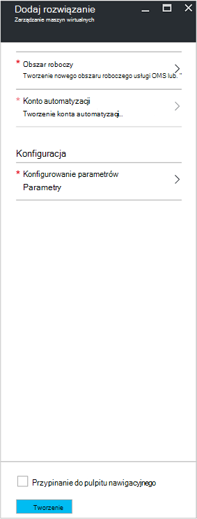
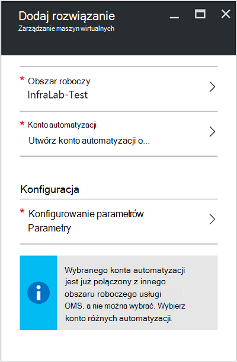
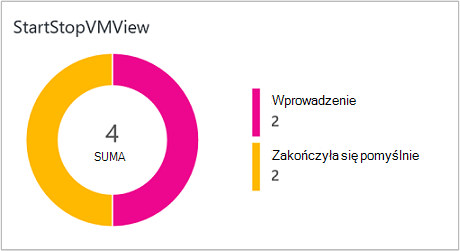
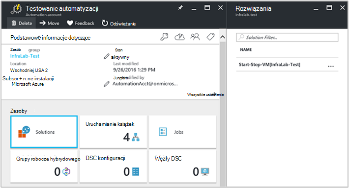
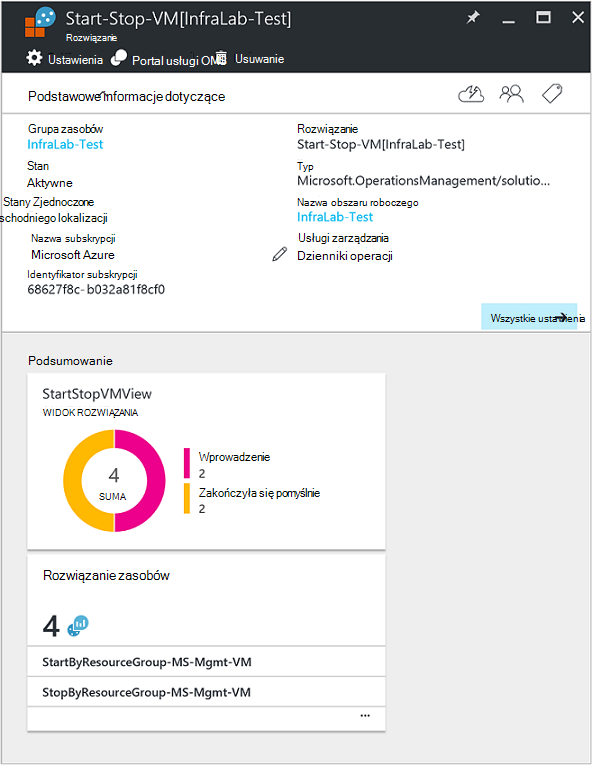

<properties
    pageTitle="Rozpocznij i Zatrzymaj maszyny wirtualne podczas rozwiązanie po godzinach pracy [Podgląd] | Microsoft Azure"
    description="Rozwiązania do zarządzania maszyn wirtualnych zaczyna się przestaje maszyn wirtualnych Menedżera zasobów Azure zgodnie z harmonogramem i monitorowanie aktywnie z analizy dziennika."
    services="automation"
    documentationCenter=""
    authors="MGoedtel"
    manager="jwhit"
    editor=""
    />
<tags
    ms.service="automation"
    ms.workload="tbd"
    ms.tgt_pltfrm="na"
    ms.devlang="na"
    ms.topic="get-started-article"
    ms.date="10/07/2016"
    ms.author="magoedte"/>

# Rozpocznij i Zatrzymaj maszyny wirtualne podczas rozwiązanie po godzinach pracy [Podgląd] w automatyzacji

Maszyny wirtualne Rozpocznij i Zatrzymaj podczas rozwiązanie po godzinach pracy [Podgląd] zaczyna się przestaje maszyn wirtualnych Azure Menedżera zasobów według harmonogramu zdefiniowane przez użytkownika i zapewnia wgląd w sukcesu zadań automatyzacji, które uruchamiać i zatrzymywać maszyn wirtualnych przy użyciu usługi OMS dziennika analizy.  

## Wymagania wstępne

- Runbooks pracy przy użyciu [konta Azure Uruchom jako](automation-sec-configure-azure-runas-account.md).  Konta Uruchom jako jest preferowaną metodę uwierzytelniania, ponieważ używa certyfikatu uwierzytelniania zamiast hasło, które mogą być wygaśnie lub często zmieniają.  

- To rozwiązanie może zarządzać tylko maszyny wirtualne, które znajdują się w tym samym subskrypcji i grupa zasobów jako miejsce, w którym znajduje się konto automatyzacji.  

- To rozwiązanie wdraża tylko w następujących regionach Azure - kopiec Australia, USA Wschodniej Azji Południowo i Europa Zachodnia.  Runbooks, którzy zarządzają harmonogram maszyn wirtualnych można kierować maszyny wirtualne w dowolnym regionie.  

- Aby wysłać powiadomienia e-mail, po ukończeniu runbooks maszyn wirtualnych rozpoczęcia i zakończenia, wymagany jest subskrypcji usługi Office 365 klasy biznesowej.  

## Składniki rozwiązania

To rozwiązanie składa się z następujących zasobów, które zostaną zaimportowane i dodane do Twojego konta automatyzacji.

### Runbooks

Działań aranżacji | Opis|
--------|------------|
CleanSolution-MS-zarządzania-maszyn wirtualnych | Ten działań aranżacji usunie wszystkie zawarte zasobami i harmonogramami po przejściu do usunięcia rozwiązanie ze swojej subskrypcji.|  
SendMailO365-MS-zarządzania | Ten działań aranżacji wysyła wiadomość e-mail, używając Exchange w usłudze Office 365.|
StartByResourceGroup-MS-zarządzania-maszyn wirtualnych | Ten działań aranżacji ma się zacząć maszyny wirtualne (zarówno klasyczny i maszyny wirtualne oparty na ARM) który znajduje się na liście danej grupy Azure zasobów.
StopByResourceGroup-MS-zarządzania-maszyn wirtualnych | Ten działań aranżacji ma na celu zatrzymania maszyny wirtualne (zarówno klasyczny i maszyny wirtualne oparty na ARM) który znajduje się na liście danej grupy Azure zasobów.|
 

### Zmienne

Zmienna | Opis|
---------|------------|
**SendMailO365-MS-zarządzania** Działań aranżacji ||
SendMailO365-IsSendEmail-MS-zarządzania | Określa, jeśli StartByResourceGroup-MS-zarządzania-maszyn wirtualnych i runbooks StopByResourceGroup-MS-zarządzania-maszyn wirtualnych można wysyłać powiadomienia pocztą e-mail po zakończeniu.  Wybierz **wartość PRAWDA** umożliwiające i **FAŁSZ,** Aby wyłączyć alerty wiadomości e-mail. Wartość domyślna to **False**.| 
**StartByResourceGroup-MS-zarządzania-maszyn wirtualnych** Działań aranżacji ||
StartByResourceGroup zduplikowany MS-zarządzania-maszyn wirtualnych | Wprowadź nazwy maszyn wirtualnych mają być wykluczone z operacji zarządzania; poszczególne nazwy za pomocą semi-colon(;). Wartości jest uwzględniana wielkość liter i symboli wieloznacznych (gwiazdka) jest obsługiwana.|
StartByResourceGroup-SendMailO365-EmailBodyPreFix-MS-zarządzania | Tekst, który można dołączać do początku treść wiadomości e-mail.|
StartByResourceGroup-SendMailO365-EmailRunBookAccount-MS-zarządzania | Nazwa konta automatyzacji, zawierającego działań aranżacji poczty E-mail.  **Nie modyfikuj tej zmiennej.**|
StartByResourceGroup-SendMailO365-EmailRunbookName-MS-zarządzania | Nazwa zestawu działań aranżacji poczty e-mail.  StartByResourceGroup-MS-zarządzania-maszyn wirtualnych i runbooks StopByResourceGroup-MS-zarządzania-maszyn wirtualnych służy do wysyłania wiadomości e-mail.  **Nie modyfikuj tej zmiennej.**|
StartByResourceGroup-SendMailO365-EmailRunbookResourceGroup-MS-zarządzania | Nazwa grupy zasobów, który zawiera działań aranżacji poczty E-mail.  **Nie modyfikuj tej zmiennej.**|
StartByResourceGroup-SendMailO365-EmailSubject-MS-zarządzania | Określa tekst w wierszu tematu wiadomości e-mail.|  
StartByResourceGroup-SendMailO365-EmailToAddress-MS-zarządzania | Określa adresatów wiadomości e-mail.  Wprowadź inne nazwy za pomocą semi-colon(;).|
StartByResourceGroup-TargetResourceGroups-MS-zarządzania-maszyn wirtualnych | Wprowadź nazwy maszyn wirtualnych mają być wykluczone z operacji zarządzania; poszczególne nazwy za pomocą semi-colon(;). Wartości jest uwzględniana wielkość liter i symboli wieloznacznych (gwiazdka) jest obsługiwana.  Wartość domyślna (gwiazdka) zostaną uwzględnione wszystkie grupy zasobów w subskrypcji.|
StartByResourceGroup-TargetSubscriptionID-MS-zarządzania-maszyn wirtualnych | Określa subskrypcji, która zawiera maszyny wirtualne być zarządzani przy użyciu tego rozwiązania.  Musi to być tej samej subskrypcji miejsce, w którym znajduje się konto automatyzacji tego rozwiązania.|
**StopByResourceGroup-MS-zarządzania-maszyn wirtualnych** Działań aranżacji ||
StopByResourceGroup zduplikowany MS-zarządzania-maszyn wirtualnych | Wprowadź nazwy maszyn wirtualnych mają być wykluczone z operacji zarządzania; poszczególne nazwy za pomocą semi-colon(;). Wartości jest uwzględniana wielkość liter i symboli wieloznacznych (gwiazdka) jest obsługiwana.|
StopByResourceGroup-SendMailO365-EmailBodyPreFix-MS-zarządzania | Tekst, który można dołączać do początku treść wiadomości e-mail.|
StopByResourceGroup-SendMailO365-EmailRunBookAccount-MS-zarządzania | Nazwa konta automatyzacji, zawierającego działań aranżacji poczty E-mail.  **Nie modyfikuj tej zmiennej.**|
StopByResourceGroup-SendMailO365-EmailRunbookResourceGroup-MS-zarządzania | Nazwa grupy zasobów, który zawiera działań aranżacji poczty E-mail.  **Nie modyfikuj tej zmiennej.**|
StopByResourceGroup-SendMailO365-EmailSubject-MS-zarządzania | Określa tekst w wierszu tematu wiadomości e-mail.|  
StopByResourceGroup-SendMailO365-EmailToAddress-MS-zarządzania | Określa adresatów wiadomości e-mail.  Wprowadź inne nazwy za pomocą semi-colon(;).|
StopByResourceGroup-TargetResourceGroups-MS-zarządzania-maszyn wirtualnych | Wprowadź nazwy maszyn wirtualnych mają być wykluczone z operacji zarządzania; poszczególne nazwy za pomocą semi-colon(;). Wartości jest uwzględniana wielkość liter i symboli wieloznacznych (gwiazdka) jest obsługiwana.  Wartość domyślna (gwiazdka) zostaną uwzględnione wszystkie grupy zasobów w subskrypcji.|
StopByResourceGroup-TargetSubscriptionID-MS-zarządzania-maszyn wirtualnych | Określa subskrypcji, która zawiera maszyny wirtualne być zarządzani przy użyciu tego rozwiązania.  Musi to być tej samej subskrypcji miejsce, w którym znajduje się konto automatyzacji tego rozwiązania.|  
 

### Harmonogramów

Harmonogram | Opis|
---------|------------|
StartByResourceGroup harmonogram MS-zarządzania | Harmonogram działań aranżacji StartByResourceGroup, który wykonuje uruchamiania maszyny wirtualne zarządzane przy użyciu tego rozwiązania.|
StopByResourceGroup harmonogram MS-zarządzania | Harmonogram działań aranżacji StopByResourceGroup, który wykonuje zamknięcia maszyny wirtualne zarządzane przy użyciu tego rozwiązania.|

### Poświadczenia

Poświadczenia | Opis|
-----------|------------|
O365Credential | Określa prawidłowe konto użytkownika usługi Office 365 do wysyłania wiadomości e-mail.  Wymagane tylko, jeśli zmienna SendMailO365-IsSendEmail-MS-zarządzania jest ustawiona na **PRAWDA**.

## Konfiguracja

Wykonaj poniższe kroki, aby dodać maszyny wirtualne Rozpocznij i Zatrzymaj podczas po godzinach pracy [Podgląd] rozwiązanie do swojego konta automatyzacji, a następnie skonfiguruj zmiennych dostosowywanie rozwiązania.

1. Na ekranu głównego w portalu Azure wybierz Kafelek **witryny Marketplace** .  Jeśli fragmentu nie jest już przypięta do ekranu głównego w okienku nawigacji po lewej stronie wybierz pozycję **Nowy**.  
2. W karta Marketplace wpisz **Rozpocząć maszyn wirtualnych** w polu wyszukiwania, a następnie zaznacz rozwiązanie **Maszyny wirtualne Rozpocznij i Zatrzymaj godzinami [Podgląd]** z wyników wyszukiwania.  
3. W karta **Maszyny wirtualne Rozpocznij i Zatrzymaj godzinami [Podgląd]** dla wybranego rozwiązania przejrzeć informacje podsumowujące, a następnie kliknij przycisk **Utwórz**.  
4. Karta **Dodaj rozwiązanie** jest wyświetlany, gdy zostanie wyświetlony monit o konfigurowanie rozwiązania można było importować do subskrypcji automatyzacji.     
5.  Na karta **Dodaj rozwiązanie** zaznacz **obszar roboczy** i w tym miejscu wybrać usługi OMS obszaru roboczego, który jest połączony z tej samej subskrypcji Azure używanego konta automatyzacji lub tworzenie nowego obszaru roboczego usługi OMS.  Jeśli nie masz usługi OMS obszaru roboczego, można wybrać **Tworzenie nowego obszaru roboczego** i na karta **Usługi OMS obszaru roboczego** , wykonaj następujące czynności: 
   - Określ nazwę nowego **Obszaru roboczego usługi OMS**.
   - Wybierz **subskrypcję** , łącze przez wybranie z listy rozwijanej, jeśli nie jest domyślnie zaznaczone.
   - **Grupa zasobów**można utworzyć nową grupę zasobów lub wybrać istniejącej grupy zasobów.  
   - Wybierz **lokalizację**.  Obecnie tylko miejscach doboru są **Kopiec Australia**, **USA Wschodniej** **Azji Południowo**i **Europa Zachodnia**.
   - Wybierz **poziom ceny**.  Rozwiązanie jest oferowane w dwa poziomy: wolny i usługi OMS opłaconej warstwy.  Bezpłatne warstwa ma limit od ilości danych zebranych codziennie, okres przechowywania i działań aranżacji zadania środowisko uruchomieniowe minut.  Warstwa usługi OMS opłaconej nie ma limit od ilości danych zebranych codziennie.  

        > [AZURE.NOTE]
        > Gdy autonomicznego płatnych warstwa jest wyświetlany jako opcja, nie jest stosowana.  Jeśli zaznacz go i kontynuować tworzenie tego rozwiązania w ramach subskrypcji, go nie powiedzie się.  Ten problem zostanie rozwiązany po urzędowo tego rozwiązania. Użycie tego rozwiązania będzie tylko za pomocą automatyzacji zadania minut i logowania spożyciu.  Rozwiązanie nie dodać dodatkowe węzły usługi OMS w środowisku.  

6. Po zapewnieniu wymagane informacje na karta **usługi OMS obszaru roboczego** , kliknij przycisk **Utwórz**.  A informacje zostanie zweryfikowana utworzony obszar roboczy, można śledzić postęp w obszarze **powiadomień** z menu.  Powrócisz do karta **Dodaj rozwiązanie** .  
7. Na karta **Dodaj rozwiązanie** wybierz **Konto automatyzacji**.  Jeśli tworzysz nowy obszar roboczy usługi OMS, będzie trzeba również utworzyć nowe konto automatyzacji, który będzie skojarzony z nowym usługi OMS obszarze roboczym określonej wcześniej, łącznie z subskrypcji Azure, grupa zasobów i region.  Można wybrać **Utwórz konto automatyzacji** i na karta **automatyzacji Dodawanie konta** , podaj następujące czynności: 
  - W polu **Nazwa** wprowadź nazwę konta automatyzacji.

    Inne opcje są automatycznie wypełnione według obszaru roboczego usługi OMS zaznaczone i nie można zmodyfikować te opcje.  Konto Azure Uruchom jako to domyślną metodę uwierzytelniania runbooks zawarte w rozwiązaniu.  Po kliknięciu przycisku **OK**opcje konfiguracji jest sprawdzana poprawność i utworzeniu konta automatyzacji.  Z menu można śledzić postęp w obszarze **powiadomień** . 

    W przeciwnym razie możesz wybrać istniejącego konta Uruchom jako automatyzacji.  Uwaga, że wybrane konto nie już można połączyć z innej usługi OMS obszar roboczy, w przeciwnym razie wiadomość zostanie wyświetlona w karta z informacją.  Jeśli jest już połączony, będzie konieczne wybierz inne konto automatyzacji Uruchom jako lub Utwórz nowy.    

8. Na koniec na karta **Dodaj rozwiązanie** , wybierz pozycję **Konfiguracja** , a zostanie wyświetlona karta **Parametry** .  Na karta **Parametry** zostanie wyświetlony monit o:  
   - Określ **Nazw docelowych grupa zasobów**, która jest nazwy grupy zasobów, która zawiera maszyny wirtualne być zarządzani przy użyciu tego rozwiązania.  Można wprowadzić więcej niż jedną nazwę i rozdzielić średnikiem (wartości są uwzględniania wielkości liter).  Używanie symboli wieloznacznych jest obsługiwana, gdy chcesz docelowej maszyny wirtualne we wszystkich grupach zasobów w subskrypcji.
   - Wybierz pozycję **Harmonogram** , czyli cyklicznego datę i godzinę uruchamianie i zatrzymywanie maszyn wirtualnych w docelowej grup zasobów.  

10. Po zakończeniu konfigurowania ustawień początkowej wymagane dla rozwiązanie, wybierz pozycję **Utwórz**.  Będą sprawdzane wszystkie ustawienia, a następnie spróbuje wdrażania rozwiązania w ramach subskrypcji.  Ten proces może potrwać kilka sekund, a następnie z menu można śledzić postęp w obszarze **powiadomień** . 

## Częstotliwość pobierania

Automatyzacji dziennika i zadania strumienia danych zadania jest spożywana do repozytorium usługi OMS co pięć minut.  

## Za pomocą rozwiązanie

Po dodaniu rozwiązania do zarządzania maszyn wirtualnych w obszarze roboczym usługi OMS **Widoku StartStopVM** kafelków były dodawane do pulpitu nawigacyjnego usługi OMS.  Ten fragment Wyświetla reprezentację zadań runbooks rozwiązania, które zostały uruchomione i została ukończona pomyślnie i liczba.     

Na koncie automatyzacji można uzyskać dostęp do i zarządzać rozwiązanie, wybierając kafelków **rozwiązań** karta **rozwiązań** , a następnie wybierając rozwiązanie **Start-Zatrzymaj-maszyn wirtualnych [obszaru roboczego]** z listy.     

Wybieranie rozwiązanie zostanie wyświetlona karta rozwiązanie **Start-Zatrzymaj-maszyn wirtualnych [obszaru roboczego]** , gdzie można przeglądać ważne informacje, takie jak kafelków **StartStopVM** takich jak w obszarze roboczym usługi OMS, co spowoduje wyświetlenie graficzna reprezentacja zadań runbooks rozwiązania, które zostały uruchomione i została ukończona pomyślnie i liczba.     

Z tego miejsca można również otwierać obszaru roboczego usługi OMS i podczas dalszej analizy rekordów zadań.  Po prostu kliknij pozycję **wszystkie ustawienia**i w karta **Ustawienia** wybierz **Szybki Start** i zaznacz pole wyboru w pozycji **Portal usługi OMS**w karta **Szybki Start** .   To Otwórz nową kartę lub nową sesję przeglądarki i prezentowanie obszaru roboczego usługi OMS skojarzone z swoje konto automatyzacji i subskrypcji.  

### Konfigurowanie powiadomień pocztą e-mail

Aby włączyć powiadomienia e-mail, po uruchomieniu i zatrzymaniu maszyn wirtualnych runbooks wykonane, należy zmodyfikować **O365Credential** poświadczeń i co najmniej następujące zmienne:

 - SendMailO365-IsSendEmail-MS-zarządzania
 - StartByResourceGroup-SendMailO365-EmailToAddress-MS-zarządzania
 - StopByResourceGroup-SendMailO365-EmailToAddress-MS-zarządzania

Aby skonfigurować poświadczenia **O365Credential** , wykonaj następujące czynności:

1. Z Twoim kontem automatyzacji kliknij pozycję **Wszystkie ustawienia** w górnej części okna. 
2. Na karta **Ustawienia** w sekcji **Zasoby automatyzacji**wybierz pozycję **elementy zawartości**. 
3. Na karta **zasoby** zaznacz opcję Podziel **poświadczeń** i karta **poświadczeń** zaznacz **O365Credential**.  
4. Wprowadź prawidłową nazwę usługi Office 365 i hasło, a następnie kliknij przycisk **Zapisz** , aby zapisać zmiany.  

Aby skonfigurować zmienne wyróżnione wcześniej, wykonaj następujące czynności:

1. Z Twoim kontem automatyzacji kliknij pozycję **Wszystkie ustawienia** w górnej części okna. 
2. Na karta **Ustawienia** w sekcji **Zasoby automatyzacji**wybierz pozycję **elementy zawartości**. 
3. Na karta **składniki majątku** zaznacz opcję Podziel **zmienne** i karta **zmienne** zaznacz zmienną wymienionych powyżej, a następnie zmodyfikuj jej następujące wartości określonej wcześniej w sekcji [zmiennej](##variables) opis go.  
4. Kliknij przycisk **Zapisz** , aby zapisać zmiany do zmiennej.   

### Modyfikowanie harmonogramu uruchamiania i zamykania

Zarządzanie harmonogramem uruchamiania i zamykania w rozwiązaniu wykonuje te same kroki opisane w [planowaniu działań aranżacji w automatyzacji Azure](automation-scheduling-a-runbook.md).  Należy pamiętać, że nie można modyfikować konfiguracji harmonogramu.  Musisz wyłączyć istniejący harmonogram, a następnie utwórz nową, a następnie połączyć **StartByResourceGroup-MS-zarządzania-maszyn wirtualnych** lub działań aranżacji **StopByResourceGroup-MS-zarządzania-maszyn wirtualnych** , odpowiednią harmonogram, aby zastosować do.   

## Rekordy analizy dziennika

Automatyzacja tworzy dwa typy rekordów w repozytorium usługi OMS.

### Dzienniki zadania

Właściwość | Opis|
----------|----------|
Rozmówcy |  Kto rozpoczął operację.  Możliwe wartości to adres e-mail lub systemu zaplanowanych zadań.|
Kategoria | Klasyfikacja typu danych.  Automatyzacja wartość jest JobLogs.|
CorrelationId | Identyfikator GUID, który jest identyfikator korelacji działań aranżacji zadania.|
JobId | Identyfikator GUID, który jest identyfikator zadania działań aranżacji.|
operationName | Określa rodzaj operacji wykonywanych w Azure.  Automatyzacja wartość będzie zadania.|
resourceId | Określa typ zasobu w Azure.  Automatyzacji wartość jest konto automatyzacji skojarzone z działań aranżacji.|
Grupa zasobów | Nazwa zasobu grupy działań aranżacji zadania.|
ResourceProvider | Określa Azure usługa, która dostarcza zasobów można wdrożyć i zarządzać nimi.  Automatyzacja wartość jest Azure automatyzacji.|
Typu zasobu | Określa typ zasobu w Azure.  Automatyzacji wartość jest konto automatyzacji skojarzone z działań aranżacji.|
resultType | Stan zadania działań aranżacji.  Możliwe wartości są następujące: — Wprowadzenie -Zatrzymane -Zawieszone — Nie powiodła się -Powiodła się|
resultDescription | W tym artykule opisano stan wynik działań aranżacji zadania.  Możliwe wartości są następujące: -Zadanie jest uruchomione -Zadania nie powiodła się -Zadanie zostało zakończone|
RunbookName | Nazwa zestawu działań aranżacji.|
SourceSystem | Określa system źródła danych przesyłanych.  W przypadku automatyzacji, będzie wartość: OpsManager|
StreamType | Określa rodzaj zdarzenia. Możliwe wartości są następujące: — Pełne -Wyników -Błąd -Ostrzeżenie|
SubscriptionId | Określa identyfikator subskrypcji zadania.
Czas | Data i godzina, kiedy zadanie działań aranżacji wykonane.|

### Strumienie zadania

Właściwość | Opis|
----------|----------|
Rozmówcy |  Kto rozpoczął operację.  Możliwe wartości to adres e-mail lub systemu zaplanowanych zadań.|
Kategoria | Klasyfikacja typu danych.  Automatyzacja wartość jest JobStreams.|
JobId | Identyfikator GUID, który jest identyfikator zadania działań aranżacji.|
operationName | Określa rodzaj operacji wykonywanych w Azure.  Automatyzacja wartość będzie zadania.|
Grupa zasobów | Nazwa zasobu grupy działań aranżacji zadania.|
resourceId | Określa identyfikator zasobu w Azure.  Automatyzacji wartość jest konto automatyzacji skojarzone z działań aranżacji.|
ResourceProvider | Określa Azure usługa, która dostarcza zasobów można wdrożyć i zarządzać nimi.  Automatyzacja wartość jest Azure automatyzacji.|
Typu zasobu | Określa typ zasobu w Azure.  Automatyzacji wartość jest konto automatyzacji skojarzone z działań aranżacji.|
resultType | Wynik działań aranżacji zadania w chwili wygenerowania zdarzenia.  Możliwe wartości są następujące: -Trakcie wykonywania|
resultDescription | Zawiera strumienia wyjściowego ze działań aranżacji.|
RunbookName | Nazwa zestawu działań aranżacji.|
SourceSystem | Określa system źródła danych przesyłanych.  W przypadku automatyzacji wartość będzie OpsManager|
StreamType | Typ zadania strumienia. Możliwe wartości są następujące: -Postępu -Wyników -Ostrzeżenie -Błąd -Debugowanie — Pełne|
Czas | Data i godzina, kiedy zadanie działań aranżacji wykonane.|

Podczas wykonywania wyszukiwania dziennika zwraca rekordów kategorii **JobLogs** lub **JobStreams**, możesz wybrać widok **JobLogs** lub **JobStreams** , wyświetlającego zestaw kafelków podsumowywania aktualizacje zwrócone przez wyszukiwanie.

## Przykładowy dziennik wyszukiwania

Poniższa tabela zawiera przykładowy dziennik wyszukiwanie rekordów zadań zebrane przy użyciu tego rozwiązania. 

Kwerendy | Opis|
----------|----------|
Znajdowanie zadania dla działań aranżacji StartVM, która została ukończona pomyślnie | Kategoria = JobLogs RunbookName_s = ResultType "maszyn StartByResourceGroup-MS-zarządzania wirtualnych" = zakończyła się pomyślnie & #124; Zmierz count() przez JobId_g|
Znajdowanie zadania dla działań aranżacji StopVM, która została ukończona pomyślnie | Kategoria = JobLogs RunbookName_s = ResultType "maszyn StartByResourceGroup-MS-zarządzania wirtualnych" = nie powiodło się & #124; Zmierz count() przez JobId_g
Pokaż stan zadania w czasie dla runbooks StartVM i StopVM | Kategoria = JobLogs RunbookName_s = NOT(ResultType="started") "maszyn StartByResourceGroup-MS-zarządzania wirtualnych" lub "StopByResourceGroup-MS-zarządzania VM" | Zmierz Count() od interwału ResultType 1 dzień|

## Następne kroki

- Aby dowiedzieć się więcej na temat konstruowania kwerend wyszukiwania różnych i przejrzyj dzienniki zadania automatyzacji z analizy dziennika, zobacz [wyszukiwania dziennika do analizy dziennika](../log-analytics/log-analytics-log-searches.md)
- Aby dowiedzieć się więcej na temat wykonywanie działań aranżacji jak monitorowanie działań aranżacji zadania i inne szczegóły techniczne, zobacz [Śledzenie działań aranżacji zadania](automation-runbook-execution.md)
- Aby dowiedzieć się więcej na temat analizy dziennika usługi OMS i źródła zbioru danych, zobacz [Zbieranie Azure miejsca do magazynowania danych w omówienie analizy dziennika](../log-analytics/log-analytics-azure-storage.md)

   

