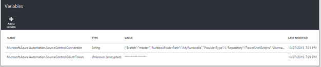
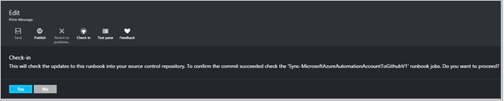

<properties 
    pageTitle=" Źródło kontrolki integracji automatyzacji Azure | Microsoft Azure"
    description="W tym artykule opisano źródło formantu Integracja z GitHub w automatyzacji Azure."
    services="automation"
    documentationCenter=""
    authors="mgoedtel"
    manager="jwhit"
    editor="tysonn" />    
<tags 
    ms.service="automation"
    ms.devlang="na"
    ms.topic="article"
    ms.tgt_pltfrm="na"
    ms.workload="infrastructure-services"
    ms.date="09/12/2016"
    ms.author="magoedte;sngun" />

# Integracja kontroli źródła w automatyzacji Azure

Integracja kontroli źródła umożliwia skojarzenie runbooks na Twoim koncie automatyzacji do repozytorium GitHub źródło formantu. Formant źródła pozwala na łatwe współpraca z zespołem, śledzenie zmian i przywracanie wcześniejszych wersji programu runbooks. Na przykład kontrolki źródła umożliwia synchronizowanie gałęziami w formancie źródła do rozwoju, test lub produkcji automatyzacji kont użytkownika, co ułatwia promowanie kod, którego przetestowano w środowisku rozwoju do swojego konta automatyzacji produkcji.

Formant źródła umożliwia push kod z automatyzacji Azure do kontrolki źródła lub wypychania usługi runbooks z kontrolki źródła do automatyzacji Azure. W tym artykule opisano, jak skonfigurować kontrolki źródła w środowisku usługi Azure automatyzacji. Firma Microsoft rozpocznie się przez skonfigurowanie automatyzacji Azure, aby uzyskać dostęp do repozytorium GitHub i szczegółową różnych operacji, które można wykonywać przy użyciu integracją kontroli źródła. 

>[AZURE.NOTE]Formant źródła obsługuje pobierania danych i naciśnięcie [runbooks przepływu pracy programu PowerShell](automation-runbook-types.md#powershell-workflow-runbooks) , a także [runbooks programu PowerShell](automation-runbook-types.md#powershell-runbooks). [Runbooks graficzne](automation-runbook-types.md#graphical-runbooks) nie są jeszcze obsługiwane.  

Dostępne są dwie proste czynności wymagane do skonfigurowania kontrolki źródła dla Twojego konta automatyzacji i tylko, jeśli masz już konto GitHub. Są to:
## Krok 1 — Tworzenie repozytorium GitHub

Jeśli masz już konto GitHub i repozytorium, który chcesz połączyć automatyzacji Azure, a następnie zaloguj się do istniejącego konta i rozpocząć procedurę od kroku 2 poniżej. W przeciwnym razie przejdź do [GitHub](https://github.com/), zaloguj się do nowego konta i [tworzyć nowe repozytorium](https://help.github.com/articles/create-a-repo/).

## Krok 2 — Konfigurowanie kontrolki źródła w automatyzacji Azure

1. Karta konta automatyzacji w portalu Azure, kliknij **się kontrolki źródła.** 
 
    

2. Zostanie wyświetlona karta **Kontrolki źródła** miejsce, w którym można konfigurować szczegółowe informacje o koncie GitHub. Poniżej przedstawiono listę parametrów w celu skonfigurowania:  

  	|**Parametr**            |**Opis** |
  	|:---|:---| 
  	|Wybierz źródło   | Wybierz źródło. Obecnie jest obsługiwana tylko **GitHub** . |
  	|Autoryzacja | Kliknij przycisk **Autoryzuj** udostępnienia automatyzacji Azure repozytorium GitHub. Jeśli już zalogowany do konta GitHub w innym oknie, są używane poświadczenia tego konta. Po pomyślnym autoryzacji karta zostanie wyświetlona nazwa użytkownika GitHub w obszarze **Właściwości autoryzacji**. |
  	|Wybierz pozycję repozytorium | Zaznacz repozytorium GitHub z listy dostępne repozytoria. |
  	|Wybierz gałąź | Oddział wybierz z listy dostępne oddziałów. Tylko **wzorcowych** gałąź jest wyświetlany, jeśli utworzono jeszcze oddziałów. |
  	|Ścieżka folderu działań aranżacji | Ścieżka folderu działań aranżacji Określa ścieżkę w repozytorium GitHub, z której chcesz push lub rozsunąć kodzie. Muszą być wprowadzone w formacie **/foldername/subfoldername**. Tylko runbooks w ścieżce folderu działań aranżacji będą synchronizowane z kontem automatyzacji. Runbooks podfoldery woli ścieżkę folderu działań aranżacji **nie** można zsynchronizować. Używanie **/** Aby zsynchronizować wszystkie runbooks w obszarze repozytorium. |

3. Na przykład jeśli masz repozytorium o nazwie **PowerShellScripts** , która zawiera folder o nazwie **RootFolder**, zawierający folder o nazwie **podfolderu**. Następujące ciągi umożliwia synchronizowanie każdego poziomu folderu:

    1. Aby zsynchronizować runbooks z **repozytorium**, ścieżka folderu działań aranżacji jest*/*
    2. Aby zsynchronizować runbooks z **RootFolder**, ścieżka folderu działań aranżacji jest */RootFolder*
    3. Aby zsynchronizować runbooks z **podfolder**, ścieżka folderu działań aranżacji jest */RootFolder/SubFolder*.
  

4. Po skonfigurowaniu parametry są wyświetlane na **Karta górę kontrolki źródła.**  
 
    

5. Po kliknięciu przycisku OK integracją kontroli źródła jest skonfigurowany dla Twojego konta automatyzacji i należy je zaktualizować wraz z informacjami GitHub. Możesz teraz kliknąć w tej części, aby wyświetlić wszystkie historii zadania synchronizacji kontrolki źródła.  

    

6. Po skonfigurowaniu kontrolki źródła następujące zasoby automatyzacji zostaną utworzone na swoim koncie automatyzacji:  
 Są tworzone dwa [składniki majątku zmiennych](automation-variables.md) .  
      
    * Zmienna **Microsoft.Azure.Automation.SourceControl.Connection** zawiera wartości parametrów połączenia, tak jak pokazano poniżej.  

  	|**Parametr**            |**Wartość** |
  	|:---|:---|
  	| Nazwa  | Microsoft.Azure.Automation.SourceControl.Connection |
  	| Typ | Ciąg |
  	| Wartość  | {"Gałęzią":\<*nazwy gałąź*>, "RunbookFolderPath":\<*ścieżka folderu działań aranżacji*>, "typ dostawcy":\<*ma wartość 1 dla GitHub*>, "Repozytorium":\<*nazwę repozytorium*>, "Nazwa_użytkownika":\<*GitHub swoją nazwę użytkownika*>} |   

    * Zmienna **Microsoft.Azure.Automation.SourceControl.OAuthToken**zawiera bezpiecznego zaszyfrowaną wartość usługi OAuthToken.  

  	|**Parametr**            |**Wartość** |
  	|:---|:---|
  	| Nazwa  | Microsoft.Azure.Automation.SourceControl.OAuthToken |
  	| Typ | Unknown(Encrypted) |
  	| Wartość | <*Zaszyfrowane OAuthToken*> |  

      

    * **Formant źródła automatyzacji** zostanie dodane jako aplikacja autoryzowanych do swojego konta GitHub. Aby wyświetlić aplikacji: ze strony głównej GitHub przejdź do swojego **profilu** > **Ustawienia** > **aplikacji**. Ta aplikacja umożliwia automatyzację Azure zsynchronizować repozytorium GitHub z klientem automatyzacji.  

    

## Za pomocą kontrolki źródła w automatyzacji

### Ewidencjonowanie działań aranżacji z automatyzacji Azure do kontroli źródła

Ewidencjonowanie działań aranżacji umożliwia push zmiany wprowadzone do działań aranżacji w automatyzacji Azure do repozytorium kontroli źródła. Poniżej przedstawiono procedurę działań aranżacji ewidencjonowania:

1. Z konta automatyzacji, [Utwórz nowy tekstowy działań aranżacji](automation-first-runbook-textual.md)lub [Edytowanie istniejących, tekstowy działań aranżacji](automation-edit-textual-runbook.md). Ten działań aranżacji może być przepływ pracy programu PowerShell lub działań aranżacji skrypt programu PowerShell.  

2. Po zakończeniu edytowania swojej działań aranżacji, Zapisz, a następnie kliknij przycisk **Zaewidencjonuj** z karta **Edytowanie** .  

    

     >[AZURE.NOTE] Ewidencjonowanie z automatyzacji Azure zastąpi kod, który istnieje obecnie w źródło formantu. Instrukcja równoważną wiersza polecenia cyfra do wyboru w jest **cyfra Dodawanie + cyfra Zatwierdź + cyfra push**  

3. Po kliknięciu **ewidencjonowania**, zostanie wyświetlony monit o potwierdzenie, kliknij przycisk Tak, aby kontynuować.  

    

4. Ewidencjonowanie zaczyna się działań aranżacji kontrolki źródła: **MicrosoftAzureAutomationAccountToGitHubV1 synchronizacji**. Ten działań aranżacji nawiązuje połączenie GitHub i umieszcza zmiany z automatyzacji Azure do repozytorium. Aby wyświetlić historię ewidencjonowania zadania, wróć do karty **Integracją kontroli źródła** , a następnie kliknij, aby otworzyć karta repozytorium synchronizacji. Ta karta zawiera wszystkich zadań Źródło formantu.  Zaznacz zadanie, które chcesz wyświetlić i kliknij przycisk, aby wyświetlić szczegóły.  

    

    >[AZURE.NOTE] Źródło formantu runbooks są specjalne runbooks automatyzacji, którego nie można wyświetlać ani edytować. Podczas ich nie będą widoczne na liście działań aranżacji, zostaną wyświetlone pojawia się na liście zadań zadania synchronizacji.
 
5. Nazwa zmienione działań aranżacji są wysyłane jako parametru wejściowego do działań aranżacji zaewidencjonowania. Można [wyświetlać szczegóły zadania](automation-runbook-execution.md#viewing-job-status-using-the-azure-management-portal) rozwijanie działań aranżacji w karta **Repozytorium synchronizacji** .  

    

6. Odświeżanie repozytorium GitHub po zakończeniu zadania, aby wyświetlić zmiany.  Repozytorium z komunikatem Zatwierdź powinny być zlecenie: *Nazwa działań aranżacji *zaktualizowane ** Automation.* * w Azure  

### Runbooks synchronizacji z kontrolki źródła do automatyzacji Azure 

Przycisk Synchronizuj na karta synchronizacji repozytorium umożliwia uwzględniał wszystkie runbooks działań aranżacji ścieżkę folderu repozytorium do swojego konta automatyzacji. Tym samym repozytorium można synchronizowane z więcej niż jedno konto automatyzacji. Poniżej przedstawiono procedurę Synchronizowanie działań aranżacji:

1. Z konta automatyzacji miejsce, w którym możesz skonfigurować kontrolki źródła, otwórz **Karta synchronizacji integracji-repozytorium kontroli źródła** i kliknij przycisk **Synchronizuj** , a następnie zostanie wyświetlony monit z potwierdzeniem kliknij przycisk **Tak,** aby kontynuować.  

    

2. Synchronizowanie zaczyna się działań aranżacji: **MicrosoftAzureAutomationAccountFromGitHubV1 synchronizacji**. Ten działań aranżacji nawiązuje połączenie GitHub i pobiera zmiany z repozytorium do automatyzacji Azure. Nowe zadanie powinna być widoczna na karta **Repozytorium synchronizacji** dla tej akcji. Aby wyświetlić szczegółowe informacje o zadaniu synchronizacji, kliknij, aby otworzyć Karta Szczegóły zadania.  
 
    

 
    >[AZURE.NOTE] Synchronizowanie z kontrolki źródła zastępuje wersję roboczą runbooks, która istnieje obecnie na Twoim koncie automatyzacji dla **wszystkich** runbooks, które są obecnie w formancie źródła. Instrukcja równoważne wiersza polecenia cyfra zsynchronizować jest **Pobieraj cyfra**

## Rozwiązywanie problemów kontrolki źródła

Jeśli istnieją jakiekolwiek błędy, ewidencjonowanie lub synchronizowanie zadanie, stan zadania powinny zostać zawieszone i w karta zadania można wyświetlać szczegółowe informacje o błędzie.  Część **Wszystkie dzienniki** Pokaż wszystkie strumienie programu PowerShell skojarzonego z tym zadaniem. To umożliwi ze szczegółami, aby ułatwić rozwiązywanie problemów z synchronizacją ewidencjonowanie lub. Zostanie również wyświetlona sekwencji czynności, które wystąpiły podczas synchronizowania lub sprawdzania ruch przychodzący działań aranżacji.  

## Rozłączanie kontrolki źródła

Aby odłączyć od konta GitHub, otwórz karta repozytorium synchronizacji, a następnie kliknij przycisk **Rozłącz**. Po odłączeniu kontrolki źródła runbooks, czy zostały zsynchronizowane wcześniej nadal pozostanie na swoim koncie automatyzacji, ale karta repozytorium synchronizacji nie będą dostępne.  

  

## Następne kroki

Aby uzyskać więcej informacji na temat integracją kontroli źródła zobacz następujące zasoby:  
- [Azure automatyzacji: Integracja kontroli źródła w automatyzacji Azure](https://azure.microsoft.com/blog/azure-automation-source-control-13/)  
- [Zagłosuj na ulubione źródłowego systemu sterowania](https://www.surveymonkey.com/r/?sm=2dVjdcrCPFdT0dFFI8nUdQ%3d%3d)  
- [Azure automatyzacji: Integrowanie działań aranżacji kontrolki źródła przy użyciu programu Visual Studio Team Services](https://azure.microsoft.com/blog/azure-automation-integrating-runbook-source-control-using-visual-studio-online/)  
