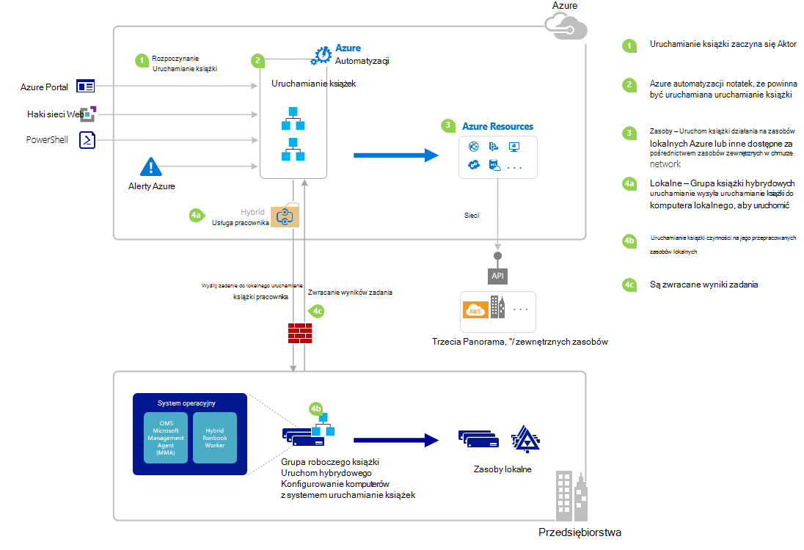

<properties
   pageTitle="Rozpoczynanie działań aranżacji w automatyzacji Azure | Microsoft Azure"
   description="Podsumowanie różnych metod, które mogą być używane do uruchomienia działań aranżacji w automatyzacji Azure i szczegółowe informacje na temat korzystania z Azure portal i programu Windows PowerShell."
   services="automation"
   documentationCenter=""
   authors="mgoedtel"
   manager="jwhit"
   editor="tysonn" />
<tags
   ms.service="automation"
   ms.devlang="na"
   ms.topic="article"
   ms.tgt_pltfrm="na"
   ms.workload="infrastructure-services"
   ms.date="10/08/2016"
   ms.author="magoedte;bwren"/>

# <a name="starting-a-runbook-in-azure-automation"></a>Rozpoczynanie działań aranżacji w automatyzacji Azure

Poniższa tabela pomoże Ci określić metodę do uruchomienia działań aranżacji w automatyzacji Azure, który jest najbardziej odpowiednie dla Twojej scenariusza. Ten artykuł zawiera szczegółowe informacje o uruchamianiu działań aranżacji Portal Azure i przy użyciu programu Windows PowerShell. Szczegółowe informacje na temat innych metod znajdują się w innej dokumentacji, którą można korzystać z poniższych łączy.

| **METODA**                                                                    | **WŁAŚCIWOŚCI**                                                                                                                                                                                                                                                                                                                                                |
|-------------------------------------------------------------------------------|--------------------------------------------------------------------------------------------------------------------------------------------------------------------------------------------------------------------------------------------------------------------------------------------------------------------------------------------------------------------|
| [Azure Portal](#starting-a-runbook-with-the-azure-portal)                     | <li>Najłatwiejszym metoda z interfejsem użytkownika interakcyjnego.<br> <li>Formularz o podanie wartości parametrów prosty.<br> <li>Łatwe śledzenie stanu zadania.<br> <li>Dostęp uwierzytelnionych Azure logowania.                                                                                                                                                                               |
| [Środowiska Windows PowerShell](https://msdn.microsoft.com/library/dn690259.aspx)        | <li>Nawiązywanie połączenia z wiersza polecenia przy użyciu poleceń cmdlet programu Windows PowerShell.<br> <li>Może być dołączone do zautomatyzowanego rozwiązania za pomocą kilku kroków.<br> <li>Żądanie uwierzytelniania za pomocą certyfikatu lub użytkownika OAuth głównych / usługi kapitału.<br> <li>Podaj wartości parametrów proste i złożone.<br> <li>Śledzenie stanu zadania.<br> <li>Klient wymagane do obsługi poleceń cmdlet programu PowerShell. |
| [Interfejs API Azure automatyzacji](https://msdn.microsoft.com/library/azure/mt662285.aspx) | <li>Najbardziej elastyczna metoda, ale również większość zespolonej.<br> <li>Nawiązywanie połączenia z kodu niestandardowego, który można utworzyć żądania HTTP.<br> <li>Żądanie uwierzytelnianie za pomocą certyfikatu lub użytkownika Oauth głównych / usługi kapitału.<br> <li>Podaj wartości parametrów proste i złożone.<br> <li>Śledzenie stanu zadania.                                                                          |
| [Webhooks](automation-webhooks.md)                                            | <li>Rozpoczynanie działań aranżacji z pojedynczego żądania HTTP.<br> <li>Uwierzytelnianie przy użyciu tokenu zabezpieczającego w adresie URL.<br> <li>Klient nie można zastąpić wartości parametrów podczas tworzenia webhook. Działań aranżacji można zdefiniować jeden parametr, który zostanie wypełniona informacje dotyczące żądania HTTP.<br> <li>Nie możliwości umożliwia śledzenie stanu zadania za pomocą adresu URL webhook.                                      |
| [Odpowiadanie na Azure Alert](../log-analytics/log-analytics-alerts.md)               | <li>Rozpoczynanie działań aranżacji w odpowiedzi na Azure alert.<br> <li>Konfigurowanie webhook dla działań aranżacji i łączy alert.<br> <li>Uwierzytelnianie przy użyciu tokenu zabezpieczającego w adresie URL.<br> <li>Obecnie tylko obsługuje alert na metryki.                                                                                                                                                       |
| [Harmonogram](automation-schedules.md)                                | <li>Automatycznie uruchom działań aranżacji zgodnie z harmonogramem co godzinę, dziennie lub tygodniowo.<br> <li>Modyfikowanie harmonogramu przez Azure portal, poleceń cmdlet środowiska PowerShell lub interfejsu API Azure.<br> <li>Podaj wartości parametrów do użycia z harmonogramem.                                                                                                                                               |
| [Z innego działań aranżacji](automation-child-runbooks.md)                          | <li>Użyj działań aranżacji jako działania w innej działań aranżacji.<br> <li>Przydatne w przypadku funkcje używane przez wiele runbooks.<br> <li>Udostępnia wartości parametrów do działań aranżacji podrzędne i za pomocą raportu w działań aranżacji nadrzędnej.                                                                                                                                                               |

Poniższa ilustracja przedstawia szczegółowe procedury krok po kroku w cyklu życia działań aranżacji. Zawiera różne sposoby działań aranżacji jest uruchamiany w automatyzacji Azure składniki wymagane dla pracownika działań aranżacji hybrydowych wykonać runbooks automatyzacji Azure i interakcje między różne składniki. Aby uzyskać informacje o wykonanie runbooks automatyzacji w centrum danych, należy zapoznać się z [pracowników działań aranżacji hybrydowego](automation-hybrid-runbook-worker.md)



## <a name="starting-a-runbook-with-the-azure-portal"></a>Rozpoczynanie działań aranżacji Portal Azure

1.  W portalu usługi Azure wybierz **automatyzacji** , a następnie kliknij pozycję w nazwę konta automatyzacji.
2.  Wybierz kartę **Runbooks** .
3.  Wybieranie działań aranżacji, a następnie kliknij polecenie **Uruchom**.
4.  Jeśli działań aranżacji zawiera parametry, zostanie wyświetlony monit o Podaj wartości z pola tekstowego dla każdego parametru. Zobacz [Parametry działań aranżacji](#Runbook-parameters) poniżej szczegółowe informacje o parametry.
5.  Wybierz pozycję **Zadania** obok wiadomości działań aranżacji **Uruchamianie** albo wybierz kartę **zadania** działań aranżacji wyświetlić stan zadania działań aranżacji.

## <a name="starting-a-runbook-with-the-azure-portal"></a>Rozpoczynanie działań aranżacji Portal Azure

1.  Z Twojego konta automatyzacji kliknij część **Runbooks** , aby otworzyć karta **Runbooks** .
2.  Kliknij pozycję działań aranżacji, aby otworzyć jego karta **działań aranżacji** .
3.  Kliknij przycisk **Start**.
4.  Jeśli działań aranżacji nie ma parametrów, zostanie wyświetlony monit o potwierdzenie, czy chcesz uruchomić. Jeśli działań aranżacji zawiera parametry, karta **Rozpoczynanie działań aranżacji** zostanie otwarty umożliwiające podanie wartości parametrów. Zobacz [Parametry działań aranżacji](#Runbook-parameters) poniżej szczegółowe informacje o parametry.
5.  Karta **zadanie** zostanie otwarty, tak aby można było śledzić stan zadania.

## <a name="starting-a-runbook-with-windows-powershell"></a>Rozpoczynanie działań aranżacji przy użyciu programu Windows PowerShell

[Rozpocznij AzureRmAutomationRunbook](https://msdn.microsoft.com/library/mt603661.aspx) umożliwia rozpoczynanie działań aranżacji przy użyciu programu Windows PowerShell. Następujący kod zostanie uruchomiony działań aranżacji o nazwie działań aranżacji Test.

```
Start-AzureRmAutomationRunbook -AutomationAccountName "MyAutomationAccount" -Name "Test-Runbook" -ResourceGroupName "ResourceGroup01"
```

Rozpocznij AzureRmAutomationRunbook zwraca obiekt zadania, która umożliwia śledzenie stanu po rozpoczęciu działań aranżacji. Następnie służy ten obiekt zadania z [Get-AzureRmAutomationJob](https://msdn.microsoft.com/library/mt619440.aspx) do określenia stanu zadania i [Get-AzureRmAutomationJobOutput](https://msdn.microsoft.com/library/mt603476.aspx) uzyskanie jej wyniki. Następujący kod zostanie uruchomiony działań aranżacji o nazwie działań aranżacji Test, czeka, dopóki nie została ukończona, a następnie wyświetli jej wyniki.

```
$runbookName = "Test-Runbook"
$ResourceGroup = "ResourceGroup01"
$AutomationAcct = "MyAutomationAccount"

$job = Start-AzureRmAutomationRunbook –AutomationAccountName $AutomationAcct -Name $runbookName -ResourceGroupName $ResourceGroup

$doLoop = $true
While ($doLoop) {
   $job = Get-AzureRmAutomationJob –AutomationAccountName $AutomationAcct -Id $job.JobId -ResourceGroupName $ResourceGroup
   $status = $job.Status
   $doLoop = (($status -ne "Completed") -and ($status -ne "Failed") -and ($status -ne "Suspended") -and ($status -ne "Stopped"))
}

Get-AzureRmAutomationJobOutput –AutomationAccountName $AutomationAcct -Id $job.JobId -ResourceGroupName $ResourceGroup –Stream Output
```

Jeśli działań aranżacji wymaga parametrów, należy podać ich jako [skrótów](http://technet.microsoft.com/library/hh847780.aspx) miejsce, w którym klucz skrótów odpowiada nazwie parametru i wartość jest wartością parametru. W poniższym przykładzie pokazano, jak rozpocząć działań aranżacji z dwoma parametrami ciąg o nazwie imię i nazwisko, liczbę całkowitą z zakresu o nazwie RepeatCount i logiczne parametr o nazwie pokaz. Aby uzyskać dodatkowe informacje o parametrach zobacz [Parametry działań aranżacji](#Runbook-parameters) poniżej.

```
$params = @{"FirstName"="Joe";"LastName"="Smith";"RepeatCount"=2;"Show"=$true}
Start-AzureRmAutomationRunbook –AutomationAccountName "MyAutomationAccount" –Name "Test-Runbook" -ResourceGroupName "ResourceGroup01" –Parameters $params
```

## <a name="runbook-parameters"></a>Parametry działań aranżacji

Po uruchomieniu działań aranżacji z Azure Portal lub środowiska Windows PowerShell instrukcji są wysyłane za pośrednictwem usługi sieci web automatyzacji Azure. Ta usługa nie obsługuje parametry ze złożonymi typami danych. Jeśli musisz podać wartość parametru złożone, następnie wywołaj go w tekście z innego działań aranżacji zgodnie z opisem w [runbooks podrzędny w automatyzacji Azure](automation-child-runbooks.md).

Usługa sieci web automatyzacji Azure zapewnia funkcje specjalne dla parametrów przy użyciu określonych typów danych, zgodnie z opisem w poniższych sekcjach.

### <a name="named-values"></a>Nazwane wartości

Jeśli parametr jest typ danych [obiekt], a następnie za pomocą następującego formatu JSON je wysłać listy wartości nazwanych: *{Nazwa1: "Wartość1", Nazwa2: "Wartość2", Name3: "Wartość3"}*. Te wartości muszą być typów prostych. Działań aranżacji otrzymają parametr jako [PSCustomObject](https://msdn.microsoft.com/library/system.management.automation.pscustomobject%28v=vs.85%29.aspx) z właściwościami, które odpowiadają wartości nazwanych.

Należy rozważyć następujące działań aranżacji test, które akceptuje parametr o nazwie użytkownika.

```
Workflow Test-Parameters
{
   param (
      [Parameter(Mandatory=$true)][object]$user
   )
    $userObject = $user | ConvertFrom-JSON
    if ($userObject.Show) {
        foreach ($i in 1..$userObject.RepeatCount) {
            $userObject.FirstName
            $userObject.LastName
        }
    }
}
```

Następujący tekst może być używany do parametr użytkownika.

```
{FirstName:'Joe',LastName:'Smith',RepeatCount:'2',Show:'True'}
```

Powoduje następujące wyniki.

```
Joe
Smith
Joe
Smith
```

### <a name="arrays"></a>Tablice

Jeśli parametr jest tablicę, takich jak [tablica] i [ciąg [[]], a następnie za pomocą następującego formatu JSON je wysłać listy wartości: *[Wartość1; wartość2 Wartość3]*. Te wartości muszą być typów prostych.

Należy rozważyć następujące działań aranżacji test, które akceptuje parametr o nazwie *użytkownika*.

```
Workflow Test-Parameters
{
   param (
      [Parameter(Mandatory=$true)][array]$user
   )
    if ($user[3]) {
        foreach ($i in 1..$user[2]) {
            $ user[0]
            $ user[1]
        }
    }
}
```

Następujący tekst może być używany do parametr użytkownika.

```
["Joe","Smith",2,true]
```

Powoduje następujące wyniki.

```
Joe
Smith
Joe
Smith
```

### <a name="credentials"></a>Poświadczenia

Jeśli parametr jest typ danych **parametr PSCredential**, można podać nazwę automatyzacji Azure [trwałego poświadczeń](automation-credentials.md). Działań aranżacji pobiera poświadczenia z nazwą użytkownika.

Należy rozważyć następujące test działań aranżacji akceptującym parametru o nazwie poświadczeń.

```
Workflow Test-Parameters
{
   param (
      [Parameter(Mandatory=$true)][PSCredential]$credential
   )
   $credential.UserName
}
```

Następujący tekst może być używany do parametr użytkownika, przy założeniu, że został zbiór poświadczeń o nazwie *Moje poświadczenia*.

```
My Credential
```

Zakładając, że nazwa użytkownika w poświadczenia została *jsmith*, powoduje następujące wyniki.

```
jsmith
```

## <a name="next-steps"></a>Następne kroki

-   Architektura działań aranżacji w bieżącym artykuł zawiera omówienie runbooks zarządzania zasobami Azure i lokalnego z pracownikiem działań aranżacji hybrydowych.  Aby uzyskać informacje o wykonanie runbooks automatyzacji w centrum danych, skorzystaj z [Hybrydowego działań aranżacji pracowników](automation-hybrid-runbook-worker.md).
-   Aby dowiedzieć się więcej na temat tworzenia runbooks moduły używanego przez inne runbooks dla określonych lub typowych funkcji, zapoznaj się z [Runbooks podrzędne](automation-child-runbooks.md).
