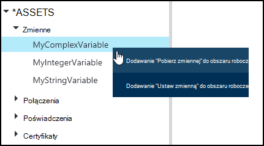
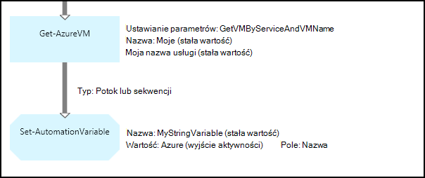
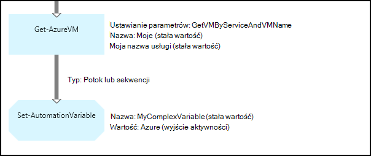
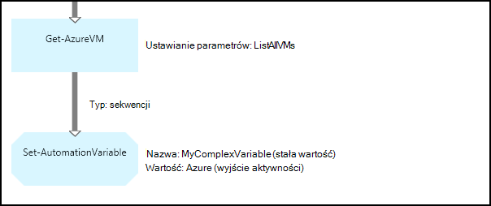
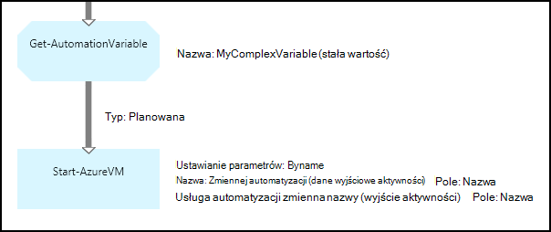
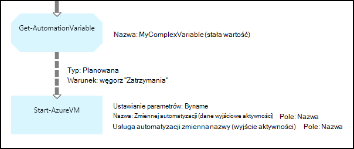

<properties 
   pageTitle="Zmienna środkami automatyzacji Azure | Microsoft Azure"
   description="Zmienna są wartości, które są dostępne dla wszystkich runbooks i konfiguracji DSC automatyzacji Azure.  W tym artykule wyjaśniono szczegóły zmiennych i jak z nimi pracować w tworzeniu zarówno tekstowych i graficznych."
   services="automation"
   documentationCenter=""
   authors="mgoedtel"
   manager="jwhit"
   editor="tysonn" />
<tags 
   ms.service="automation"
   ms.devlang="na"
   ms.topic="article"
   ms.tgt_pltfrm="na"
   ms.workload="infrastructure-services"
   ms.date="05/24/2016"
   ms.author="magoedte;bwren" />

# Zmienna środkami automatyzacji Azure

Zmienna są wartości, które są dostępne dla wszystkich runbooks i konfiguracji DSC na koncie automatyzacji. Ich można tworzyć, modyfikować i pobrane z portalu Azure programu Windows PowerShell oraz w programie działań aranżacji lub DSC konfiguracji. Zmienne automatyzacji są przydatne w następujących przypadkach:

- Udostępnianie wartość z zakresu od wielu runbooks lub DSC konfiguracji.

- Udostępnianie wartość z zakresu od wielu zadań z tym samym działań aranżacji lub DSC konfiguracji.

- Zarządzanie wartość z portalu lub z poziomu wiersza polecenia programu Windows PowerShell, jest używana przez runbooks lub DSC konfiguracji.

Zmienne automatyzacji są zachowywane, tak, aby nadal są dostępne, nawet jeśli działań aranżacji lub Konfiguracja DSC kończy się niepowodzeniem.  To również pozwala wartości określonych przez jeden działań aranżacji następnie jest używany przez inny lub jest używany przez samego działań aranżacji lub DSC konfiguracji przy następnym uruchomieniu.

Po utworzeniu zmiennej można określić, że być przechowywane zaszyfrowane.  Gdy zmiennej są szyfrowane, są przechowywane bezpiecznie w automatyzacji Azure, a jej wartość nie można pobrać z polecenia cmdlet [Get-AzureAutomationVariable](http://msdn.microsoft.com/library/dn913772.aspx) , która wchodzi w skład modułu programu PowerShell usługi Azure.  Jedynym sposobem zaszyfrowaną wartość mogą być pobierane jest z działania **Get-AutomationVariable** działań aranżacji lub DSC konfiguracji.

>[AZURE.NOTE]Bezpieczny środkami automatyzacji Azure obejmują poświadczeń, certyfikaty, połączeń i zaszyfrowane zmiennych. Te zasoby są szyfrowane i przechowywane w automatyzacji Azure za pomocą Unikatowy klucz, który jest generowany dla każdego konta automatyzacji. Ten klawisz jest szyfrowane przez certyfikat i przechowywane w automatyzacji Azure. Przed zapisaniem bezpiecznego elementów zawartości, klucz konta automatyzacji jest odszyfrowane przy użyciu certyfikatu wzorca, a następnie służącego do szyfrowania elementu.

## Typy zmiennych

Po utworzeniu zmiennej Portal Azure należy określić typ danych z listy rozwijanej, aby portalu mógł wyświetlić odpowiednie kontrolki do wprowadzania wartości zmiennej. Zmienna nie jest ograniczona do tego typu danych, ale należy ustawić zmienną przy użyciu programu Windows PowerShell, jeśli chcesz określić wartość innego typu. Jeśli użytkownik określi, **nie zdefiniowano**, następnie ustawić wartość zmiennej do **$null**i należy ustawić wartości przy użyciu polecenia cmdlet [Set-AzureAutomationVariable](http://msdn.microsoft.com/library/dn913767.aspx) lub **AutomationVariable zestawu** czynności.  Nie można utworzyć lub zmienić wartość w polu typu zmiennej zespolonych w portalu, ale można podać wartość dowolnego typu za pomocą programu Windows PowerShell. Typy złożone zostanie zwrócony jako [PSCustomObject](http://msdn.microsoft.com/library/system.management.automation.pscustomobject.aspx).

Można przechowywać wiele wartości jednej zmiennej przez tworzenie tablicy lub skrótów i zapisanie go do zmiennej.

## Polecenia cmdlet oraz działania przepływów pracy

Polecenia cmdlet w poniższej tabeli służą do tworzenia i zarządzania nimi zmienne automatyzacji przy użyciu programu Windows PowerShell. Dostarczają jako części [modułu programu PowerShell usługi Azure](../powershell-install-configure.md) , który jest dostępny do użytku w runbooks automatyzacji i konfiguracji DSC.

|Polecenia cmdlet|Opis|
|:---|:---|
|[Get-AzureAutomationVariable](http://msdn.microsoft.com/library/dn913772.aspx)|Pobiera wartość istniejącej zmiennej.|
|[Nowy AzureAutomationVariable](http://msdn.microsoft.com/library/dn913771.aspx)|Tworzy nową zmienną i ustawia wartość.|
|[Usuń AzureAutomationVariable](http://msdn.microsoft.com/library/dn913775.aspx)|Usuwa istniejącej zmiennej.|
|[Ustawianie AzureAutomationVariable](http://msdn.microsoft.com/library/dn913767.aspx)|Ustawia wartość dla istniejącej zmiennej.|

Działania przepływu pracy w poniższej tabeli umożliwiają dostęp do automatyzacji zmiennych w działań aranżacji. Są dostępne tylko dla działań aranżacji lub konfiguracji DSC i nie są dostarczane jako części modułu programu PowerShell usługi Azure.

|Działania przepływu pracy|Opis|
|:---|:---|
|Get-AutomationVariable|Pobiera wartość istniejącej zmiennej.|
|Ustawianie AutomationVariable|Ustawia wartość dla istniejącej zmiennej.|

>[AZURE.NOTE] Należy unikać zmiennych w — Nazwa parametru **Get-AutomationVariable** działań aranżacji lub DSC konfiguracji, ponieważ to skomplikować odnajdowania zależności między runbooks lub konfiguracji DSC i zmiennych automatyzacji w czasie projektowania.

## Tworzenie nowej zmiennej automatyzacji

### Aby utworzyć nową zmienną Portal Azure

1. Z Twojego konta automatyzacji kliknij pozycję **elementy zawartości** w górnej części okna.
1. U dołu okna kliknij pozycję **Dodaj ustawienie**.
1. Kliknij przycisk **Dodaj zmiennej**.
1. Kończenie pracy kreatora, a następnie kliknij pole wyboru, aby zapisać nową zmienną.

### Aby utworzyć nową zmienną Portal Azure

1. Z Twojego konta automatyzacji kliknij część **aktywów** otworzyć karta **zasoby** .
1. Kliknij część **zmiennych** , aby otworzyć karta **zmiennych** .
1. Kliknij przycisk **Dodaj zmiennej** w górnej części karta.
1. Wypełnij formularz, a następnie kliknij przycisk **Utwórz** , aby zapisać nową zmienną.

### Aby utworzyć nową zmienną przy użyciu programu Windows PowerShell

Polecenia cmdlet [New-AzureAutomationVariable](http://msdn.microsoft.com/library/dn913771.aspx) tworzy nową zmienną i ustawia wartość początkowa. Można pobrać wartość przy użyciu [Get-AzureAutomationVariable](http://msdn.microsoft.com/library/dn913772.aspx). Jeśli wartość jest typu prostego, zwracana jest tego samego typu. Jeśli jest to typ złożony, zwracana jest **PSCustomObject** .

Następujące polecenia przykładowych pokazująca, jak utworzyć zmienną typu ciąg, a następnie powróć jej wartość.

    New-AzureAutomationVariable –AutomationAccountName "MyAutomationAccount" –Name 'MyStringVariable' –Encrypted $false –Value 'My String'
    $string = (Get-AzureAutomationVariable –AutomationAccountName "MyAutomationAccount" –Name 'MyStringVariable').Value

Następujące polecenia przykładowe pokazująca, jak utworzyć zmienną typu złożone, a następnie powróć jego właściwości. W tym przypadku obiekt maszyn wirtualnych **Get-AzureVM** jest używana.

    $vm = Get-AzureVM –ServiceName "MyVM" –Name "MyVM"
    New-AzureAutomationVariable –AutomationAccountName "MyAutomationAccount" –Name "MyComplexVariable" –Encrypted $false –Value $vm
    
    $vmValue = (Get-AzureAutomationVariable –AutomationAccountName "MyAutomationAccount" –Name "MyComplexVariable").Value
    $vmName = $vmValue.Name
    $vmIpAddress = $vmValue.IpAddress

## Przy użyciu zmiennej działań aranżacji lub DSC konfiguracji

Działanie **Zestawu AutomationVariable** służy do wartość zmiennej automatyzacji działań aranżacji lub konfiguracji DSC i **Get-AutomationVariable** , aby go pobrać.  Nie należy używać polecenia cmdlet **AzureAutomationVariable zestawu** lub **Get-AzureAutomationVariable** działań aranżacji lub DSC konfiguracji, ponieważ są one mniej skuteczne niż działania przepływu pracy.  Ponadto nie można pobrać wartości bezpiecznego zmiennych z **Get-AzureAutomationVariable**.  Jedynym sposobem Utwórz nową zmienną z poziomu działań aranżacji lub DSC konfiguracji jest użyć polecenia cmdlet [New-AzureAutomationVariable](http://msdn.microsoft.com/library/dn913771.aspx) .

### Przykłady działań aranżacji tekstowy

#### Ustawianie i pobieranie prostą wartością zmiennej

Następujące polecenia przykładowych pokazano, jak i pobrać zmiennej w tekstowy działań aranżacji. W tym przykładzie zakłada się, że zmienne typu Liczba całkowita o nazwie *NumberOfIterations* i *NumberOfRunnings* oraz zmienną typu ciąg nazwany *SampleMessage* zostały już utworzone.

    $NumberOfIterations = Get-AutomationVariable -Name 'NumberOfIterations'
    $NumberOfRunnings = Get-AutomationVariable -Name 'NumberOfRunnings'
    $SampleMessage = Get-AutomationVariable -Name 'SampleMessage'
    
    Write-Output "Runbook has been run $NumberOfRunnings times."
    
    for ($i = 1; $i -le $NumberOfIterations; $i++) {
       Write-Output "$i`: $SampleMessage"
    }
    Set-AutomationVariable –Name NumberOfRunnings –Value ($NumberOfRunnings += 1)

#### Ustawianie i pobieranie złożonych obiektu w zmiennej

Poniższy przykład kodu pokazano, jak zaktualizować zmiennej w tekstowy działań aranżacji złożonych wartość. W tym przykładzie Azure maszyn wirtualnych jest pobierana z **Get-AzureVM** i zapisać w istniejącej zmiennej automatyzacji.  Jak wyjaśniono w [zmiennej typu](#variable-types), to jest przechowywana jako PSCustomObject.

    $vm = Get-AzureVM -ServiceName "MyVM" -Name "MyVM"
    Set-AutomationVariable -Name "MyComplexVariable" -Value $vm

Poniższy kod wartość jest pobierana z zmiennej i użyty do uruchomienia maszyny wirtualnej.

    $vmObject = Get-AutomationVariable -Name "MyComplexVariable"
    if ($vmObject.PowerState -eq 'Stopped') {
       Start-AzureVM -ServiceName $vmObject.ServiceName -Name $vmObject.Name
    }

#### Ustawianie i pobieranie zbioru w zmiennej

Następujący kod pokazano, jak używać zmiennej ze zbiorem złożone wartości tekstowych działań aranżacji. W tym przykładzie wielu Azure maszyn wirtualnych są pobierane z **Get-AzureVM** i zapisać w istniejącej zmiennej automatyzacji.  Jak wyjaśniono w [zmiennej typu](#variable-types), to jest przechowywana jako zbiór PSCustomObjects.

    $vms = Get-AzureVM | Where -FilterScript {$_.Name -match "my"}     
    Set-AutomationVariable -Name 'MyComplexVariable' -Value $vms

Poniższy kod kolekcji jest pobierane z zmiennej i użyty do uruchomienia poszczególnych maszyn wirtualnych.

    $vmValues = Get-AutomationVariable -Name "MyComplexVariable"
    ForEach ($vmValue in $vmValues)
    {
       if ($vmValue.PowerState -eq 'Stopped') {
          Start-AzureVM -ServiceName $vmValue.ServiceName -Name $vmValue.Name
       }
    }

### Przykłady działań aranżacji graficzne

W graficzne działań aranżacji możesz dodać **Get-AutomationVariable** lub **Zestawu AutomationVariable** , klikając prawym przyciskiem myszy na zmiennej w okienku Biblioteka graficznego edytora i wybierając działanie, które chcesz.

#### Ustawianie wartości w zmiennej

Poniższa ilustracja przedstawia przykładowe działań do aktualizacji zmiennej w graficzne działań aranżacji prosty wartość. W tym przykładzie pojedynczy Azure maszyny wirtualnej jest pobierana z **Get-AzureVM** , a nazwa komputera są zapisywane w istniejącej automatyzacji zmiennej typu ciąg.  Nie ma znaczenia, czy [łącze jest planowana lub sekwencji](automation-graphical-authoring-intro.md#links-and-workflow) ponieważ oczekujemy tylko jeden obiekt w wyniku kwerendy.

Na poniższej ilustracji przedstawiono działania umożliwia aktualizowanie zmiennej w graficzne działań aranżacji złożonych wartość. Zmienianie tylko z poprzedniego przykładu nie jest określający **ścieżkę pola** dla **wynik działania** na działanie **AutomationVariable zestaw** , tak, aby obiekt zamiast właściwości obiektu.  Jak wyjaśniono w [zmiennej typu](#variable-types), to jest przechowywana jako PSCustomObject.

Poniższa ilustracja przedstawia podobną funkcję co w poprzednim przykładzie wiele maszyn wirtualnych zapisany do zmiennej.  [Łącze sekwencji](automation-graphical-authoring-intro.md#links-and-workflow) należy tutaj, aby aktywności **AutomationVariable zestaw** odbiera całego zestawu maszyn wirtualnych jako jedną kolekcję.  Jeśli użyto [łącza potok](automation-graphical-authoring-intro.md#links-and-workflow) , następnie aktywności **AutomationVariable zestaw** chcesz uruchomić oddzielnie dla każdego obiektu z wynikiem że zostanie zapisana tylko ostatniego maszyny wirtualnej w zbiorze.  Jak wyjaśniono w [zmiennej typu](#variable-types), to jest przechowywana jako zbiór PSCustomObjects.

#### Pobieranie wartości z zmiennej

Poniższa ilustracja przedstawia przykładowe działania, które pobrać i użyć zmiennej w graficzne działań aranżacji.  Pierwszym działaniem pobiera maszyn wirtualnych, które zostały zapisane zmiennej w poprzednim przykładzie.  Łącze musi być [procesu](automation-graphical-authoring-intro.md#links-and-workflow) , tak aby aktywności **AzureVM rozpoczęcia** był uruchamiany raz dla każdego obiektu wysłanych z aktywności **Get-AutomationVariable** .  To działa tak samo czy jednego lub kilku obiektów, które są przechowywane w zmiennej.  Działanie **Start AzureVM** używa właściwości PSCustomObject, reprezentująca poszczególnych maszyn wirtualnych. 

Poniższa ilustracja przedstawia sposób filtrowania obiektów, które są przechowywane do zmiennej w graficzne działań aranżacji.  [Warunek](automation-graphical-authoring-intro.md#links-and-workflow) jest dodawana do łącze w poprzednim przykładzie, aby filtrować tylko tych maszyn wirtualnych, które zostały zatrzymane ustalonego zmiennej.

## Następne kroki

- Aby dowiedzieć się więcej na temat łączenia działalności razem do tworzenia graficznych, zobacz [łącza do tworzenia graficznych](automation-graphical-authoring-intro.md#links-and-workflow)
- Aby rozpocząć pracę z runbooks graficznych, zobacz [Moje pierwszego graficzne działań aranżacji](automation-first-runbook-graphical.md) 
