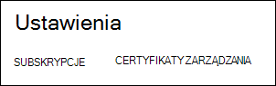
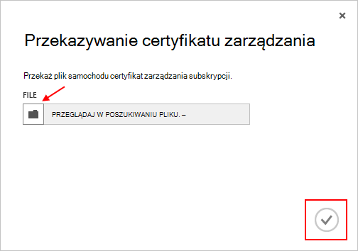

<properties 
    pageTitle="Przekazywanie certyfikatu interfejsu API usługi Azure zarządzania | Azure Microsoft" 
    description="Dowiedz się, jak przekazać athe interfejsu API zarządzania certyfikat portalu klasyczny Azure." 
    services="cloud-services" 
    documentationCenter=".net" 
    authors="Thraka" 
    manager="timlt" 
    editor=""/>

<tags 
    ms.service="na" 
    ms.workload="tbd" 
    ms.tgt_pltfrm="na" 
    ms.devlang="na" 
    ms.topic="article" 
    ms.date="04/18/2016"
    ms.author="adegeo"/>

# Przekazywanie certyfikatu zarządzania Azure zarządzania interfejsu API

Certyfikaty zarządzania umożliwiają uwierzytelnienia z interfejsem API usługi zarządzania dostarczony przez Azure. Wiele programów i narzędzia (na przykład programu Visual Studio lub Azure SDK) przy użyciu tych certfikaty zautomatyzować Konfiguracja i wdrożenie różnych usług Azure. **Dotyczy to tylko portalu klasyczny Azure**. 

>[AZURE.WARNING] Ostrożnie! Poniższe typy certyfikatów zezwolić każdej osobie uwierzytelnia im Aby zarządzać subskrypcją, z którymi są skojarzone z. 

Więcej informacji na temat Azure certyfikatów (w tym tworzenie certyfikatu z podpisem własnym) jest [dostępna](cloud-services/cloud-services-certs-create.md#what-are-management-certificates) , jeśli jest potrzebna.

Za pomocą [Usługi Azure Active Directory](/services/active-directory/) do uwierzytelniania kod klienta na potrzeby automatyzacji.

## Przekazywanie certyfikatu zarządzania

Po umieszczeniu zarządzania certyfikat utworzony, (plik cer z kluczem publicznym) można przekazać go do portalu. Gdy certyfikat jest dostępny w portalu, każda osoba dysponująca pasujące certficiate (klucz prywatny) nawiąż połączenie za pomocą interfejsu API zarządzania i uzyskać dostęp do zasobów skojarzone subskrypcji.

1. Zaloguj się do [portalu klasyczny Azure](http://manage.windowsazure.com).

2. Upewnij się, wybierz subskrypcję poprawne, który chcesz skojarzyć z certyfikatem z. Naciśnij klawisz tekst **Subskrypcje** w prawym górnym rogu portalu.

    

3. Po umieszczeniu poprawne wybranych subskrypcji, naciśnij klawisz **Ustawienia** po lewej stronie portalu (może być konieczne przewinięcie strony w dół). 
    
    

4. Naciśnij klawisz tab **Certyfikaty zarządzania** .

    
    
5. Naciśnij przycisk **Przekaż** .

    
    
6. Wypełnij informacje o okno dialogowe, a następnie naciśnij klawisz gotowe **znacznik wyboru**.

    

## Następne kroki

Teraz, gdy masz certyfikat zarządzania skojarzonego z subskrypcją, można (po zainstalowaniu zgodnego certyfikatu lokalnie) programowo nawiązywanie połączenia z [Interfejsu API usługi REST zarządzania usługi](https://msdn.microsoft.com/library/azure/mt420159.aspx) i zautomatyzować różnych Azure zasobów, które są też skojarzone z tej subskrypcji. 