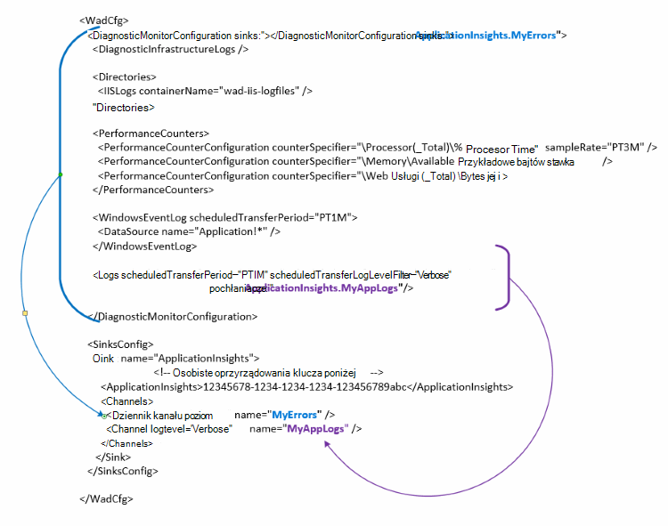

<properties
   pageTitle="Konfigurowanie diagnostyki Azure wysyłanie danych do aplikacji wniosków | Microsoft Azure"
   description="Zaktualizuj konfigurację publicznej diagnostyki Azure wysyłanie danych do aplikacji wnioski."
   services="multiple"
   documentationCenter=".net"
   authors="sbtron"
   manager="douge"
   editor="" />
<tags
   ms.service="application-insights"
   ms.devlang="na"
   ms.topic="article"
   ms.tgt_pltfrm="na"
   ms.workload="na"
   ms.date="12/15/2015"
   ms.author="saurabh" />

# Konfigurowanie diagnostyki Azure wysyłanie danych do aplikacji wnioski

Diagnostyka Azure są przechowywane dane do tabel magazyn Azure.  Jednak możesz również rura wszystkich lub podzestawu danych do aplikacji wniosków przez skonfigurowanie "sink" i "kanałów" w konfiguracji podczas korzystania z rozszerzenia diagnostyki Azure 1.5 lub nowszym.

Ten artykuł zawiera opis sposobu tworzenia publicznej konfiguracji rozszerzenia diagnostyki Azure, aby skonfigurowanych wysyłanie danych do aplikacji wnioski.

## Konfigurowanie aplikacji wnioski jako zainstalowania stołu

Wprowadza rozszerzenie Azure diagnostyki 1,5 **<SinksConfig>** element w publicznej konfiguracji. Definiuje dodatkowe *sink* wysyłania danych diagnostyki Azure. Możesz określić szczegóły miejsce, w którym chcesz wysłać dane Azure diagnostyki w ramach tego zasobu aplikacji wniosków **<SinksConfig>**.
Przykład **SinksConfig** wyglądają podobnie do tych-  

    <SinksConfig>
        <Sink name="ApplicationInsights">
          <ApplicationInsights>{Insert InstrumentationKey}</ApplicationInsights>
          <Channels>
            <Channel logLevel="Error" name="MyTopDiagData"  />
            <Channel logLevel="Verbose" name="MyLogData"  />
          </Channels>
        </Sink>
      </SinksConfig>

Dla elementu **Sink** atrybut *nazwy* określa wartość ciągu, używany do jednoznacznie odwołują się do obiekt sink.
**ApplicationInsights** element określa klucz oprzyrządowania zasobu wniosków aplikacji wysyłania danych diagnostyki Azure. Jeśli nie masz istniejący zasób wnioski aplikacji, zobacz [Tworzenie nowego zasobu wnioski aplikacji](./application-insights/app-insights-create-new-resource.md) , aby uzyskać więcej informacji na temat tworzenia zasobu i wprowadzenie klucza oprzyrządowania.

Jeśli tworzysz projektu usługi w chmurze z 2,8 SDK Azure ten klucz oprzyrządowania jest automatycznie wypełniane w konfiguracji publicznej na podstawie ustawienia konfiguracji usługi **APPINSIGHTS_INSTRUMENTATIONKEY** pakowania projektu usługi cloud. Zobacz [Używanie aplikacji wniosków Diagnostyka Azure rozwiązywać problemy z usługi w chmurze](./cloud-services/cloud-services-dotnet-diagnostics-applicationinsights.md).

Element **kanałów** pozwala na zdefiniowanie jeden lub więcej elementów **kanału** danych, które będzie wysyłane do obiekt sink. Kanał działa jak filtr i umożliwia wybranie określonych log poziomów, które chcesz wysłać do obiekt sink. Na przykład może zbieranie dzienników pełne i wysłać je do miejsca do magazynowania, ale można zdefiniować kanału z poziomu dziennika błędów i wysłać dzienniki za pośrednictwem że dzienników błędów tylko kanału będą wysyłane do tego sink.
Dla tego **kanału** atrybut *nazwy* służy do jednoznacznie odwołują się do tego kanału.
Atrybut *loglevel* pozwala określić poziom rejestrowania, które umożliwią kanału. Poziomy rejestrowania dostępne w kolejności najbardziej przynajmniej informacje są
 - Pełne
 - Informacje o
 - Ostrzeżenie
 - Błąd
 - Krytyczne

## Wysyłanie danych do sink wniosków aplikacji
Po zdefiniowaniu sink wnioski aplikacji danych można wysłać do tego zlew, dodając atrybut *zlew* do elementów w węźle **DiagnosticMonitorConfiguration** . Dodawanie elementu *sink* do każdego węzła Określa, że dane zebrane z tego węzła i dowolny węzeł pod nim do wysłania do sink określone.

Na przykład jeśli chcesz wysłać wszystkie dane, które są są zbierane przez Azure diagnostyki następnie możesz dodać atrybut *sink* bezpośrednio do węzła **DiagnosticMonitorConfiguration** . Ustaw wartość *sink* do nazwy Sink został określony na **SinkConfig**.

    <DiagnosticMonitorConfiguration overallQuotaInMB="4096" sinks="ApplicationInsights">

Jeśli chcesz wysłać tylko dzienników błędów analizy aplikacji zlew, a następnie można ustawić wartość *pochłaniacze* nazwa Sink, a po nim nazwa kanału, oddzielonych kropką ("."). Na przykład wysłać dzienniki błędów tylko do wniosków aplikacji sink za pomocą kanałem MyTopDiagdata, które zostało zdefiniowane w SinksConfig powyżej.  

    <DiagnosticMonitorConfiguration overallQuotaInMB="4096" sinks="ApplicationInsights.MyTopDiagdata">

Jeśli chcesz wysłać Dzienniki aplikacji pełne do wniosków aplikacji chcesz dodać atrybut *sink* węzeł **Dzienniki** .

    <Logs scheduledTransferPeriod="PT1M" scheduledTransferLogLevelFilter="Verbose" sinks="ApplicationInsights.MyLogData"/>

Można także dodać wielu pochłaniacze w konfiguracji na różnych poziomach hierarchii. W takim przypadku sink określony na najwyższym poziomie hierarchii działa jako ustawień globalnych i jedną określone czynności element poszczególnych elementów, takich jak zastępowanie do tego ustawień globalnych.    

Oto pełny przykład pliku konfiguracji publicznej, który wysyła wszystkie błędy wniosków aplikacji (określony w węźle **DiagnosticMonitorConfiguration** ) i dodatkowo pełne dzienniki poziomu dla Dzienniki aplikacji (określony w węźle **dzienników** ).

    <WadCfg>
      <DiagnosticMonitorConfiguration overallQuotaInMB="4096"
           sinks="ApplicationInsights.MyTopDiagData"> <!-- All info below sent to this channel -->
        <DiagnosticInfrastructureLogs />
        <PerformanceCounters>
          <PerformanceCounterConfiguration counterSpecifier="\Processor(_Total)\% Processor Time" sampleRate="PT3M" sinks="ApplicationInsights.MyLogData/>
          <PerformanceCounterConfiguration counterSpecifier="\Memory\Available MBytes" sampleRate="PT3M" />
          <PerformanceCounterConfiguration counterSpecifier="\Web Service(_Total)\Bytes Total/Sec" sampleRate="PT3M" />
        </PerformanceCounters>
        <WindowsEventLog scheduledTransferPeriod="PT1M">
          <DataSource name="Application!*" />
        </WindowsEventLog>
        <Logs scheduledTransferPeriod="PT1M" scheduledTransferLogLevelFilter="Verbose"
                sinks="ApplicationInsights.MyLogData"/> <!-- This specific info sent to this channel -->
      </DiagnosticMonitorConfiguration>

    <SinksConfig>
        <Sink name="ApplicationInsights">
          <ApplicationInsights>{Insert InstrumentationKey}</ApplicationInsights>
          <Channels>
            <Channel logLevel="Error" name="MyTopDiagData"  />
            <Channel logLevel="Verbose" name="MyLogData"  />
          </Channels>
        </Sink>
      </SinksConfig>
    </WadCfg>

Istnieją pewne ograniczenia, o których warto pamiętać przy użyciu tej funkcji

- Kanały są przeznaczone tylko do pracy z nie liczniki wydajności i typ dziennika. Jeśli użytkownik określi kanału z elementem licznik wydajności będą ignorowane.
- Poziom rejestrowania dla kanału nie może przekraczać poziom rejestrowania dla co to są zbierane przez diagnostyki Azure. Na przykład: nie można zbieranie błędów w dzienniku aplikacji w elemencie dzienniki i próbują wysłać pełne dzienniki sink wglądu aplikacji. Atrybut *scheduledTransferLogLevelFilter* musi zawsze zbieranie równa lub dzienniki więcej niż dzienniki próbujesz wysłać do zainstalowania stołu.
- Nie możesz wysłać wszystkie dane obiektów blob zbierane przez rozszerzenia diagnostyki Azure analizy aplikacji. Na przykład niczego określony węźle *katalogów* . Dla dokonuje zrzutu awarię zrzut awaryjny rzeczywisty nadal będą wysyłane do blob miejsca do magazynowania i otrzyma tylko powiadomienie, że został wygenerowany zrzutu awarię aplikacji wnioski.

## Następne kroki

- Aby włączyć rozszerzenie Azure diagnostyki aplikacji za pomocą [programu PowerShell](./cloud-services/cloud-services-diagnostics-powershell.md) . 
- Włączanie rozszerzenia diagnostyki Azure aplikacji za pomocą [Programu Visual Studio](vs-azure-tools-diagnostics-for-cloud-services-and-virtual-machines.md)
