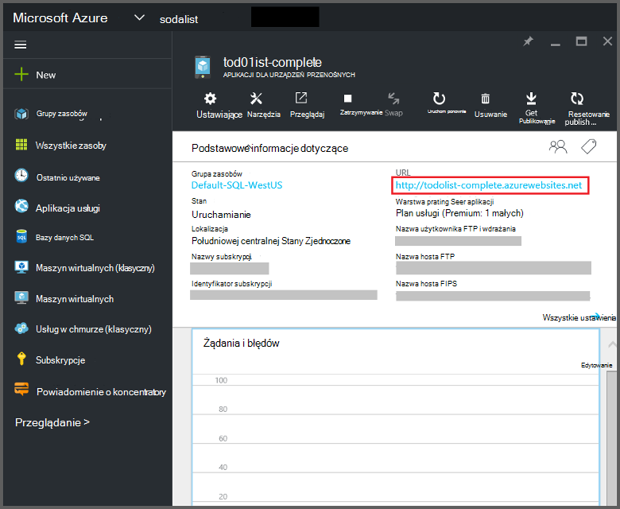
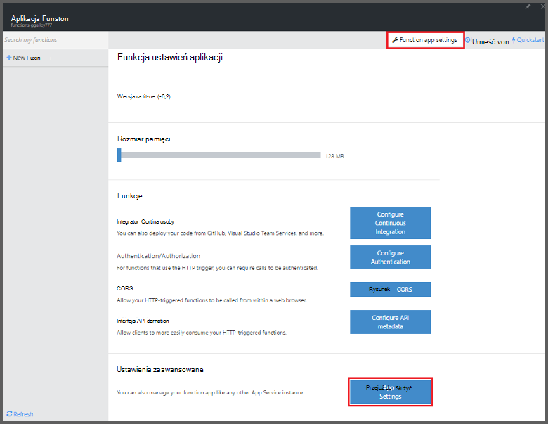
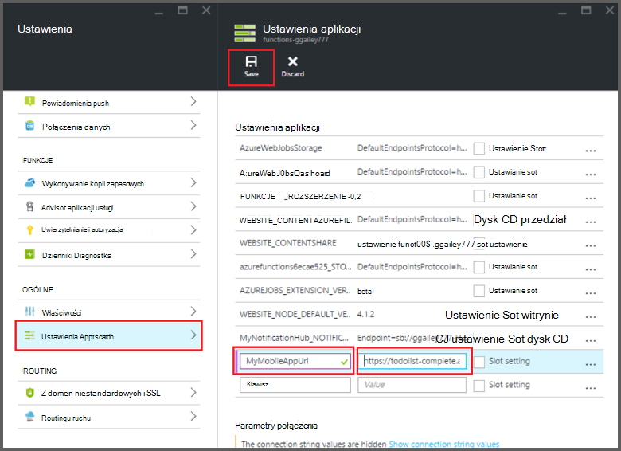

<properties
    pageTitle="Azure powiązań aplikacji Mobile funkcje | Microsoft Azure"
    description="Opis sposobu używania aplikacji Mobile Azure powiązania w funkcjach Azure."
    services="functions"
    documentationCenter="na"
    authors="ggailey777"
    manager="erikre"
    editor=""
    tags=""
    keywords="Funkcje Azure, funkcje, przetwarzanie zdarzenia, dynamiczne obliczeń pliki architektura"/>

<tags
    ms.service="functions"
    ms.devlang="multiple"
    ms.topic="reference"
    ms.tgt_pltfrm="multiple"
    ms.workload="na"
    ms.date="08/30/2016"
    ms.author="glenga"/>

# Azure powiązań funkcje aplikacji Mobile

[AZURE.INCLUDE [functions-selector-bindings](../../includes/functions-selector-bindings.md)]

W tym artykule wyjaśniono, jak skonfigurować i kod aplikacji Mobile Azure powiązania w funkcjach Azure. 

[AZURE.INCLUDE [intro](../../includes/functions-bindings-intro.md)] 

Azure usługi aplikacji Mobile umożliwia udostępniania danych tabeli punkt końcowy dla klientów przenośnych. Te same dane tabelarycznego można używać z obu dane wejściowe i wyjściowe powiązania w funkcjach Azure. Ponieważ obsługuje on schematu dynamiczne, Node.js wewnętrznej bazy danych aplikacji dla urządzeń przenośnych jest idealnym tabelarycznego przez funkcje publikowania. Dynamiczne schematu jest domyślnie włączone i powinno być wyłączone w aplikacji dla urządzeń przenośnych produkcji. Aby uzyskać więcej informacji o tabeli punkty końcowe w wewnętrznej bazie danych Node.js, zobacz [Omówienie: Operacje tabeli](../app-service-mobile/app-service-mobile-node-backend-how-to-use-server-sdk.md#TableOperations). W aplikacji Mobile Node.js wewnętrznej bazy danych obsługuje w portalu przeglądania i edytowania tabel. Aby uzyskać więcej informacji zobacz w temacie Node.js SDK do [edycji w portalu](../app-service-mobile/app-service-mobile-node-backend-how-to-use-server-sdk.md#in-portal-editing) . Użycie .NET wewnętrznej bazy danych aplikacji dla urządzeń przenośnych z funkcjami Azure, możesz ręcznie zaktualizować zgodnie z wymaganiami funkcja modelu danych. Aby uzyskać więcej informacji o tabeli punkty końcowe w .NET wewnętrznej bazy danych aplikacji dla urządzeń przenośnych, zobacz [jak: Definiowanie kontrolerze tabeli](../app-service-mobile/app-service-mobile-dotnet-backend-how-to-use-server-sdk.md#define-table-controller) w temacie SDK wewnętrznej bazy danych .NET. 

## Tworzenie zmiennej środowiska dla adresu URL wewnętrznej bazy danych aplikacji dla urządzeń przenośnych

Obecnie powiązań aplikacji Mobile konieczne jest tworzenie zwraca adres URL do wewnętrznej bazy danych aplikacji dla urządzeń przenośnych, samej zmiennej środowiska. Ten adres URL znajduje się w [portalu Azure](https://portal.azure.com) lokalizowanie usługi aplikacji dla urządzeń przenośnych i otwierając karta.

Aby ustawić ten adres URL jako zmienna środowiska w funkcji aplikacji:

1. W aplikacji funkcji w [portal Azure funkcje](https://functions.azure.com/signin), kliknij pozycję **Ustawienia aplikacji funkcji** > **Przejdź do pozycji Ustawienia usługi aplikacji**. 

    

2. W funkcji aplikacji kliknij polecenie **wszystkie ustawienia**, przewiń w dół do **ustawień aplikacji**, następnie w obszarze **Ustawienia aplikacji** wpisz nową **nazwę** dla zmiennej środowiska, wklej adres URL do **wartości**, pamiętając za pomocą programu HTTPS, a następnie kliknij przycisk **Zapisz** i zamknij karta aplikacji funkcji aby powrócić do portalu funkcji.   

    

Teraz można ustawić ten Nowa zmienna środowiska jako pole *połączenia* w powiązań.

## Użyj klawisza interfejsu API do bezpiecznego dostępu do punktów końcowych aplikacji Mobile tabeli.

W przypadku funkcji Azure powiązań przenośnych tabeli pozwalają określić klucz interfejsu API, czyli tajnego, który może być używany, aby zablokować niechciane dostęp za pomocą aplikacji innych niż funkcje. Aplikacje Mobile nie ma Obsługa uwierzytelniania za pomocą interfejsu API klucza. Można jednak zaimplementować klucz interfejsu API w aplikacji mobilnej wewnętrznej bazy danych Node.js, wykonując w przykładach w [aplikacji Mobile Azure aplikacji usługi implementacji klucz interfejsu API wewnętrznej bazy danych](https://github.com/Azure/azure-mobile-apps-node/tree/master/samples/api-key). Podobnie można zaimplementować klucz interfejsu API w [aplikacji dla urządzeń przenośnych wewnętrznej bazy danych .NET](https://github.com/Azure/azure-mobile-apps-net-server/wiki/Implementing-Application-Key).

>[AZURE.IMPORTANT] Ten klucz interfejsu API nie musi być rozpowszechniane z klientami aplikacji dla urządzeń przenośnych, jego powinny tylko być rozdzielone bezpieczne klientów po stronie usług, takich jak funkcje Azure. 

## Powiązanie wprowadzania Azure aplikacji Mobile

Powiązania wprowadzania można załadować rekordu z punkt końcowy tabeli urządzeń przenośnych i przekazać je bezpośrednio do wiązania. Rekord, który jest określony identyfikator oparty na wyzwalacz wywołaniu funkcji. W przypadku C# funkcji wszystkie zmiany wprowadzone w rekordzie są automatycznie wysyłane powrót do tabeli, gdy funkcja kończy się pomyślnie.

#### Function.JSON oprawienia wprowadzania danych w aplikacji Mobile

Plik *function.json* obsługuje następujące właściwości:

- `name`: Nazwa zmiennej używane w kodzie funkcji dla nowego rekordu.
- `type`: Biding typu musi być równa *mobileTable*.
- `tableName`: Tabela, której zostanie utworzony nowy rekord.
- `id`: Identyfikator rekordu do pobierania. Ta właściwość obsługuje powiązań podobne do `{queueTrigger}`, która będzie korzystać z wartości ciągu wiadomości kolejki jako rekord identyfikatora.
- `apiKey`: Ciąg, który jest ustawieniem aplikacji, które określa opcjonalny klucz interfejsu API dla aplikacji dla urządzeń przenośnych. Jest to wymagane, gdy usługi aplikacji dla urządzeń przenośnych za pomocą klucz interfejsu API ograniczenia dostępu klienta.
- `connection`: Ciąg, który jest nazwą zmiennej środowiska w ustawieniach aplikacji, która określa adres URL do wewnętrznej bazy danych aplikacji dla urządzeń przenośnych.
- `direction`: Kierunek powiązanie musi być ustawiona *w*.

Przykładowy plik *function.json* :

    {
      "bindings": [
        {
          "name": "record",
          "type": "mobileTable",
          "tableName": "MyTable",
          "id" : "{queueTrigger}",
          "connection": "My_MobileApp_Url",
          "apiKey": "My_MobileApp_Key",
          "direction": "in"
        }
      ],
      "disabled": false
    }

#### Azure przykład kodu aplikacji Mobile wyzwalacza kolejki C#

Oparte na przykład function.json powyżej, pobiera powiązania wejściowego rekord z aplikacji Mobile tabeli punkt końcowy identyfikator pasuje do ciągu wiadomości w kolejce i przekazuje je do parametr *rekordu* . Gdy rekord nie zostanie znaleziony, parametr ma wartość null. Rekord jest następnie aktualizowany przy użyciu nowej wartości *tekstowe* po zamknięciu funkcji.

    #r "Newtonsoft.Json"    
    using Newtonsoft.Json.Linq;
    
    public static void Run(string myQueueItem, JObject record)
    {
        if (record != null)
        {
            record["Text"] = "This has changed.";
        }    
    }

#### Azure przykład kodu aplikacji Mobile wyzwalacza kolejki Node.js

Oparte na przykład function.json powyżej, pobiera powiązania wejściowego rekordu w aplikacji Mobile tabeli punkt końcowy identyfikator pasuje do ciągu wiadomości w kolejce i przekazuje je do parametr *rekordu* . W przypadku funkcji Node.js zaktualizowane rekordy nie są wysyłane do tabeli. W tym przykładzie kodu zapisuje pobieranego rekordu w dzienniku.

    module.exports = function (context, input) {    
        context.log(context.bindings.record);
        context.done();
    };

## Powiązania wyjściowego Azure aplikacji Mobile

Funkcja można zapisać rekord punktu końcowego aplikacji Mobile tabeli przy użyciu powiązanie danych wyjściowych. 

#### powiązania wyjściowego Function.JSON dla aplikacji Mobile

Plik function.json obsługuje następujące właściwości:

- `name`: Nazwa zmiennej używane w kodzie funkcji dla nowego rekordu.
- `type`: Typ powiązanie, który musi być ustawiona na *mobileTable*.
- `tableName`: Tabela, gdy jest tworzony nowy rekord.
- `apiKey`: Ciąg, który jest ustawieniem aplikacji, które określa opcjonalny klucz interfejsu API dla aplikacji dla urządzeń przenośnych. Jest to wymagane, gdy usługi aplikacji dla urządzeń przenośnych za pomocą klucz interfejsu API ograniczenia dostępu klienta.
- `connection`: Ciąg, który jest nazwą zmiennej środowiska w ustawieniach aplikacji, która określa adres URL do wewnętrznej bazy danych aplikacji dla urządzeń przenośnych.
- `direction`: Kierunek powiązanie musi być równa *się*.

Przykład function.json:

    {
      "bindings": [
        {
          "name": "record",
          "type": "mobileTable",
          "tableName": "MyTable",
          "connection": "My_MobileApp_Url",
          "apiKey": "My_MobileApp_Key",
          "direction": "out"
        }
      ],
      "disabled": false
    }

#### Azure przykład kodu aplikacji Mobile wyzwalacza kolejki C#

W tym przykładzie kodu C# Wstawia nowy rekord do punktu końcowego tabeli aplikacji Mobile z właściwością *tekstu* w tabeli określonej w powyższym powiązanie.

    public static void Run(string myQueueItem, out object record)
    {
        record = new {
            Text = $"I'm running in a C# function! {myQueueItem}"
        };
    }

#### Azure przykład kodu aplikacji Mobile wyzwalacza kolejki Node.js

W tym przykładzie kodu Node.js Wstawia nowy rekord do punktu końcowego tabeli aplikacji Mobile z właściwością *tekstu* w tabeli określonej w powyższym powiązanie.

    module.exports = function (context, input) {
    
        context.bindings.record = {
            text : "I'm running in a Node function! Data: '" + input + "'"
        }   
    
        context.done();
    };

## Następne kroki

[AZURE.INCLUDE [next steps](../../includes/functions-bindings-next-steps.md)]
