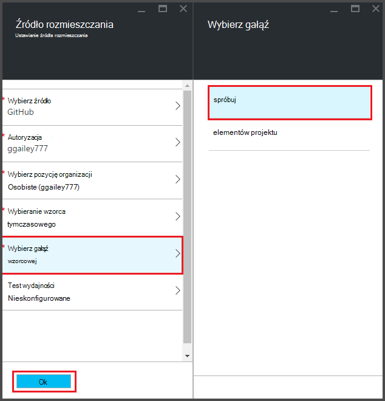
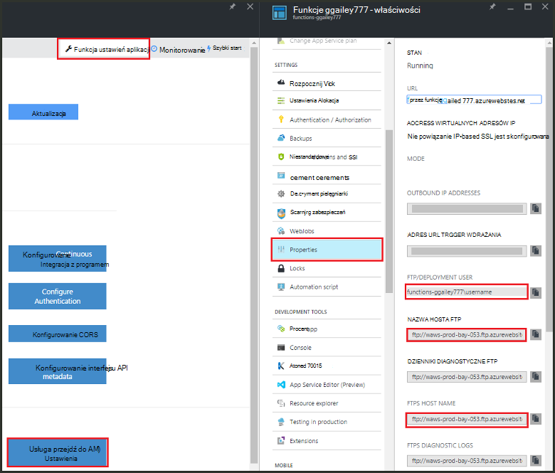

<properties
   pageTitle="Ciągły wdrażania funkcji Azure | Microsoft Azure"
   description="Publikowanie funkcje Azure za pomocą urządzenia ciągły wdrożenia usługi aplikacji Azure."
   services="functions"
   documentationCenter="na"
   authors="ggailey777"
   manager="erikre"
   editor=""
   tags=""
   />

<tags
   ms.service="functions"
   ms.devlang="multiple"
   ms.topic="article"
   ms.tgt_pltfrm="multiple"
   ms.workload="na"
   ms.date="09/25/2016"
   ms.author="glenga"/>

# Ciągły wdrażania funkcji Azure 

Funkcje Azure ułatwia konfigurowanie ciągły wdrażania aplikacji funkcji. Funkcje wykorzystuje Azure aplikacji usługi integracji z BitBucket, skrzynki GitHub i Visual Studio zespołu usługi (VSTS) umożliwiające przepływ wdrożenia ciągły miejsce, w którym Azure pobiera aktualizacje w kodzie funkcji po opublikowaniu do jednej z tych usług. Jeśli jesteś nowym użytkownikiem usługi Azure funkcje rozpoczynać [Omówienie funkcji Azure](functions-overview.md).

Ciągły wdrożenia to świetne rozwiązanie w przypadku projektów miejsce, w którym wielu i częste wpłaty są włączone. Umożliwia również zachować kontrolę źródła w kodzie funkcji. Obecnie obsługiwane są następujące źródła rozmieszczania:

+ [Bitbucket](https://bitbucket.org/)
+ [Dropbox](https://bitbucket.org/)
+ [Lokalne repo cyfra](../app-service-web/app-service-deploy-local-git.md)
+ Cyfra repo zewnętrznych
+ [GitHub]
+ Mercurial repo zewnętrznych
+ [Usługi OneDrive](https://onedrive.live.com/)
+ Program Visual Studio Team Services

Wdrożenia są skonfigurowane na zasadzie na funkcji — aplikacji. Po włączeniu wdrożenia ciągły dostęp do funkcji kod w portalu jest ustawiona na *tylko do odczytu*.

## Wymagania dotyczące rozmieszczania ciągły

W źródle wdrożenia przed możesz konfiguracji ciągły wdrożenia, musisz mieć źródło wdrożenia skonfigurowane i kodzie funkcji. We wdrożeniu aplikacji daną funkcję każdej funkcji znajdują się w nazwanym podkatalogów, nazwę funkcji jest nazwa katalogu. Ta struktura folderów jest zasadniczo kodu witryny. 

[AZURE.INCLUDE [functions-folder-structure](../../includes/functions-folder-structure.md)]

## Tworzenie ciągły wdrażania

Poniższa procedura umożliwia skonfigurowanie ciągły wdrażania istniejącej aplikacji funkcji:

1. W aplikacji funkcji w [portal Azure funkcje](https://functions.azure.com/signin), kliknij pozycję **Ustawienia aplikacji funkcji** > **integracji ciągły Konfiguruj** > **konfiguracji**.

    
    
    
    
    Możesz również wyświetlić do karta wdrożeń z funkcji Szybki Start, klikając pozycję **Rozpocznij od kontrolki źródła**.

2. W karta wdrożeń **Wybierz źródło**, następnie wypełnij informacje dotyczące źródła wybranym wdrożenia i kliknij **przycisk OK**.

    

Po skonfigurowaniu ciągły wdrożenia wszystkie pliki zmian w źródle wdrożenia są kopiowane do funkcji aplikacji, a zostanie wywołana wdrożenia całą zawartość witryny. Witryny jest ponownego rozmieszczania serwera podczas aktualizacji plików w źródle.

##Opcje wdrażania

Poniżej przedstawiono niektóre typowe wdrożeń:

+ 

###Tworzenie tymczasowej wdrażania

Funkcja aplikacje jeszcze nie obsługuje gniazda wdrożenia. Jednak nadal można zarządzać osobnych wdrożeń roboczych i produkcyjnych przy użyciu integracji ciągły.

Proces konfigurowania i pracować z tymczasowy wdrożenia wygląda zazwyczaj następująco:

1. Tworzenie obiema aplikacjami funkcji w subskrypcji, jedną dla kodu produkcji i jedną dla tymczasowego. 

2. Tworzenie źródła rozmieszczania, jeśli nie masz jeszcze jedną. Użyjemy [GitHub].
 
3. Dla aplikacji funkcji produkcji wykonaj powyższe czynności w **wdrożenia ciągły ustanowienia** i ustaw gałąź wdrożenia wzorca gałęzi usługi repo GitHub.

    

4. Powtórz ten krok dla aplikacji, funkcja tymczasowy, ale tym razem wybierz tymczasową gałąź w swojej repo GitHub. Jeśli źródło wdrożenia nie obsługuje gałęzi, użyj innego folderu.
 
5. Uaktualniać kodu w tymczasowej gałęzi lub folder, a następnie sprawdź, czy te zmiany są odzwierciedlane w ramach wdrożenia tymczasowy.

6. Po przetestowaniu, Scal zmiany z tymczasowej gałęzi gałąź wzorca. Spowoduje to wdrażania aplikacji funkcji produkcji. Jeśli źródło wdrożenia nie obsługuje gałęziami, zastąpić pliki z folderu przenoszenia plików w folderze produkcji.

###Przenoszenie istniejących funkcji ciągły wdrażania

Jeśli masz istniejące funkcje, które zostały utworzone i przechowywane w portalu, należy pobrać istniejące pliki kodu funkcji za pomocą FTP lub lokalnego repozytorium cyfra przed można wdrożenia ciągły konfiguracji, zgodnie z powyższym opisem. Można to zrobić w obszarze Ustawienia aplikacji usługi dla aplikacji funkcji. Po pobraniu plików Przekaż je do źródła wybranym wdrożenia ciągły.

>[AZURE.NOTE]Po skonfigurowaniu integracji ciągły już można edytować plików źródłowych w portalu funkcji.

####Jak: skonfigurować wdrożenie poświadczenia
Przed pobraniem plików z Twojej aplikacji funkcji, musisz skonfigurować poświadczenia, aby uzyskać dostęp do witryny, co można zrobić z portalu. Poświadczenia są ustawione na poziomie aplikacji funkcji.

1. W aplikacji funkcji w [portal Azure funkcje](https://functions.azure.com/signin), kliknij pozycję **Ustawienia aplikacji funkcji** > **Przejdź do pozycji Ustawienia usługi aplikacji** > **wdrażania poświadczeń**.

    

2. Wpisz nazwę użytkownika i hasło, a następnie kliknij przycisk **Zapisz**. Za pomocą tych poświadczeń można teraz uzyskać dostęp do funkcji aplikacji z FTP lub wbudowane repo cyfra.

####Jak: pobieranie plików za pomocą protokołu FTP

1. W aplikacji funkcji w [portal Azure funkcje](https://functions.azure.com/signin), kliknij pozycję **Ustawienia aplikacji funkcji** > **Przejdź do pozycji Ustawienia usługi aplikacji** > **Właściwości** i skopiuj wartości dla **Użytkownika FTP i wdrażania**, **Nazwa hosta FTP**i **FTPS nazwa hosta**.  
**Użytkownika FTP i wdrażania** należy wprowadzić wyświetlaną w portalu, takich jak nazwa aplikacji w celu zapewnienia prawidłowego kontekstu dla serwera FTP.

    
    
2. Z klienta FTP, należy użyć informacji o połączeniu zgromadzono nawiązać połączenie z aplikacji i pobrać pliki źródłowe funkcje.

####Jak: pobieranie plików przy użyciu lokalnego repozytorium cyfra

1. W aplikacji funkcji w [portal Azure funkcje](https://functions.azure.com/signin), kliknij pozycję **Ustawienia aplikacji funkcji** > **integracji ciągły Konfiguruj** > **konfiguracji**.

2. W karta wdrożeń kliknij pozycję **Wybierz źródło**, **repozytorium cyfra lokalny**, a następnie kliknij **przycisk OK**.
 
3. Kliknij przycisk **Przejdź do pozycji Ustawienia usługi aplikacji** > Notatka wartość adres URL cyfra i**Właściwości** . 
    
    

4. Klonowanie repo na komputerze lokalnym przy użyciu pamiętać o cyfra wiersza polecenia lub Ulubione narzędzie cyfra. Polecenie klonowanie cyfra wygląda następująco:

        git clone https://username@my-function-app.scm.azurewebsites.net:443/my-function-app.git

5. Zdalny dostęp do plików z Twojej aplikacji funkcji na sklonuj na komputerze lokalnym, tak jak w poniższym przykładzie:

        git pull origin master

    Jeśli wymagane, należy podać nazwę użytkownika i hasło dla funkcji wdrożenia aplikacji.  

[GitHub]: https://github.com/
