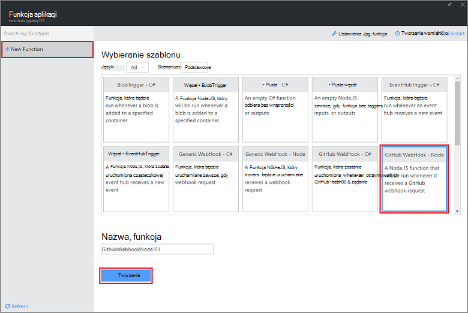
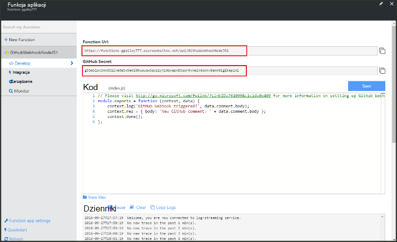
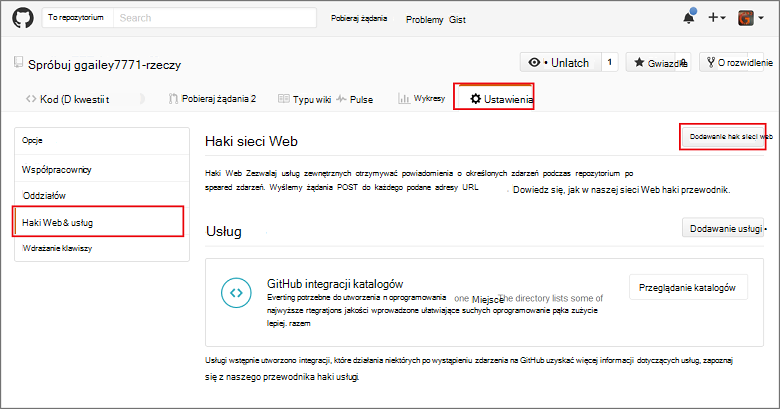
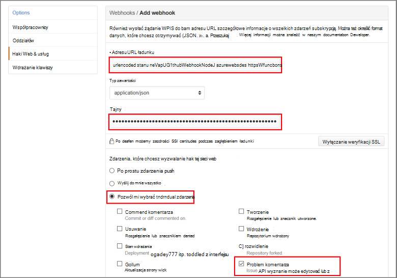

<properties
   pageTitle="Tworzenie hak sieci web lub funkcji Azure interfejsu API | Microsoft Azure"
   description="Użyj funkcji Azure, aby utworzyć funkcję, która jest wywoływana przez WebHook lub interfejsu API połączeń."
   services="azure-functions"
   documentationCenter="na"
   authors="ggailey777"
   manager="erikre"
   editor=""
   tags=""
   />

<tags
   ms.service="functions"
   ms.devlang="multiple"
   ms.topic="get-started-article"
   ms.tgt_pltfrm="multiple"
   ms.workload="na"
   ms.date="08/30/2016"
   ms.author="glenga"/>
   
# Tworzenie webhook lub funkcji interfejsu API platformy Azure

Funkcje Azure jest środowisko sterowane zdarzeniami, obliczeń na żądanie umożliwia tworzenie według harmonogramu lub wyzwalane kod jednostki zaimplementowana w różnych językach programowania. Aby dowiedzieć się więcej na temat funkcji Azure, zobacz [Omówienie funkcji Azure](functions-overview.md).

W tym temacie pokazano, jak utworzyć nową funkcję Node.js wywoływana przez GitHub webhook. Nowa funkcja zostanie utworzona na podstawie szablonu wstępnie zdefiniowanych w portalu funkcji Azure. Możesz też obejrzeć krótki klip wideo, aby zobaczyć, jak te kroki wykonuje się w portalu.

## Obejrzyj klip wideo

Poniższym klipie wideo przedstawiono sposób wykonywania podstawowych zadań w ramach tego samouczka 

[AZURE.VIDEO create-a-web-hook-or-api-azure-function]

##Utwórz funkcję wyzwalane webhook z szablonu

Aplikacja funkcja obsługuje wykonanie funkcje platformy Azure. Przed utworzeniem funkcji, musisz mieć konto Azure active. Jeśli nie masz już konto Azure [bezpłatnego konta są dostępne](https://azure.microsoft.com/free/). 

1. Przejdź do [portalu funkcji Azure](https://functions.azure.com/signin) i logowania za pomocą konta usługi Azure.

2. Jeśli masz istniejącej aplikacji funkcji za pomocą, wybierz ją z **funkcji aplikacji** kliknij pozycję **Otwórz**. Do utworzenia nowej aplikacji funkcji, wpisz unikatową **nazwę** dla nowej aplikacji funkcji lub zaakceptować ten wygenerowane, wybierz swój preferowany **Region**, a następnie kliknij **Tworzenie + wprowadzenie**. 

3. W funkcji aplikacji, kliknij pozycję **+ Nowa funkcja** > **GitHub Webhook - węzeł** > **Tworzenie**. Spowoduje to utworzenie funkcji przy użyciu domyślnej nazwy, oparty na określonego szablonu. 

     

4. **Opracowanie**Zanotuj funkcja sample express.js w oknie **kodu** . Ta funkcja odbiera żądania GitHub od webhook komentarz problem, dzienniki tekst problem i wysyła odpowiedź na webhook jako `New GitHub comment: <Your issue comment text>`.

     

5. Skopiuj **Adres URL funkcji** i **Hasło GitHub** wartości. Konieczne będzie następujących po utworzeniu webhook w GitHub. 

6. Przewiń w dół do **uruchomienia**, zwróć uwagę wstępnie zdefiniowanych treści JSON komentarza problem w treści wezwania na, a następnie kliknij polecenie **Uruchom**. 
 
    Zawsze możesz przetestować nową funkcję oparty na szablonie bezpośrednio w na karcie **rozwoju** , podając dowolne oczekiwaniami treści JSON danych i kliknij przycisk **Uruchom** . W tym przypadku szablon zawiera wstępnie zdefiniowane treści komentarza problem. 
 
Następnie utworzy rzeczywisty webhook w repozytorium GitHub.

##Konfigurowanie webhook

1. W GitHub przejdź do repozytorium, że jesteś właścicielem; Ta opcja uwzględnia wszystkie repozytoria, które mają forked.
 
2. Kliknij pozycję **Ustawienia** > **Webhooks i usług** > **webhook Dodaj**.

       

3. Wklej adres URL i hasła usługi funkcji w **Ładunku adresu URL** i **hasło**, a następnie kliknij opcję **Pozwól mi wybrać pojedyncze zdarzenia**, zaznacz **komentarz problem** i kliknij **Dodaj webhook**.

     

W tym momencie GitHub webhook jest skonfigurowany do wyzwalanie funkcja podczas dodawania nowego komentarza problem.  
Teraz nadszedł czas, aby przetestować go.

##Testowanie funkcji

1. W swojej repo GitHub Otwórz kartę **problemy** w nowym oknie przeglądarki, kliknij przycisk **Nowy problem**, wpisz tytuł, a następnie kliknij przycisk **Prześlij nowy problem**. Można również otworzyć istniejący problem.

2. W ten problem wpisz komentarz, a następnie kliknij przycisk **komentarz**. W tym momencie możesz wrócić do Twojej nowej webhook w GitHub w obszarze **Ostatnie dostaw** Zobacz zostało wysłane żądanie webhook i czy treść odpowiedzi jest `New GitHub comment: <Your issue comment text>`.

3. W portalu funkcji przewiń do pozycji Dzienniki i zobacz, że funkcja została wyzwolona oraz wartość z `New GitHub comment: <Your issue comment text>` są zapisywane w dziennikach przesyłanie strumieniowe.

##Następne kroki

Zobacz następujące tematy, aby uzyskać więcej informacji na temat funkcji Azure.

+ [Dokumentacja dewelopera funkcje Azure](functions-reference.md)  
Odwołanie programisty kodowania funkcje.
+ [Testowanie funkcji Azure](functions-test-a-function.md)  
W tym artykule opisano różne narzędzia i techniki testując funkcje.
+ [Jak skalowanie funkcje Azure](functions-scale.md)  
W tym artykule omówiono plany usługi dostępne za pomocą funkcji Azure wraz ze plan usług dynamiczne oraz wybierz plan, do prawej.  

[AZURE.INCLUDE [Getting Started Note](../../includes/functions-get-help.md)]
