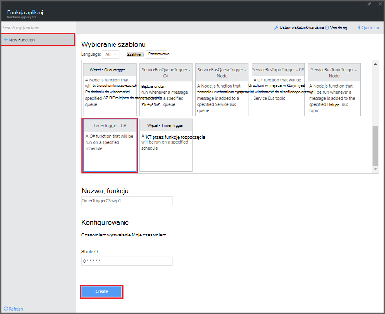
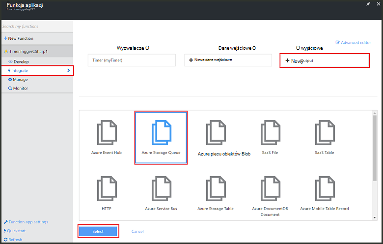
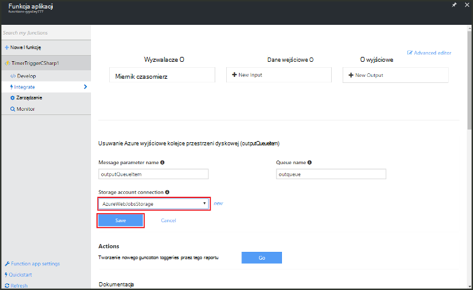

<properties
   pageTitle="Tworzenie wydarzenia przetwarzania funkcja | Microsoft Azure"
   description="Korzystanie z funkcji Azure utworzyć funkcję C# uruchamianej oparte na czasomierza zdarzenia."
   services="functions"
   documentationCenter="na"
   authors="ggailey777"
   manager="erikre"
   editor=""
   tags=""
   />

<tags
   ms.service="functions"
   ms.devlang="multiple"
   ms.topic="get-started-article"
   ms.tgt_pltfrm="multiple"
   ms.workload="na"
   ms.date="09/25/2016"
   ms.author="glenga"/>
   
# Tworzenie wydarzenia przetwarzania funkcja Azure

Funkcje Azure jest środowisko sterowane zdarzeniami, obliczeń na żądanie umożliwia tworzenie według harmonogramu lub wyzwalane kod jednostki zaimplementowana w różnych językach programowania. Aby dowiedzieć się więcej na temat funkcji Azure, zobacz [Omówienie funkcji Azure](functions-overview.md).

W tym temacie pokazano, jak utworzyć nową funkcję w C# wykonującego według czasomierz zdarzenia, aby dodać wiadomości do kolejki miejsca do magazynowania. 

## Wymagania wstępne 

Przed utworzeniem funkcji, musisz mieć konto Azure active. Jeśli nie masz już konto Azure [bezpłatnego konta są dostępne](https://azure.microsoft.com/free/).

## Utwórz funkcję wyzwalane czasomierza z szablonu

Aplikacja funkcja obsługuje wykonanie funkcje platformy Azure. Przed utworzeniem funkcji, musisz mieć konto Azure active. Jeśli nie masz już konto Azure [bezpłatnego konta są dostępne](https://azure.microsoft.com/free/). 

1. Przejdź do [portalu funkcji Azure](https://functions.azure.com/signin) i logowania za pomocą konta usługi Azure.

2. Jeśli masz istniejącej aplikacji funkcji za pomocą, wybierz ją z **funkcji aplikacji** kliknij pozycję **Otwórz**. Do utworzenia nowej aplikacji funkcji, wpisz unikatową **nazwę** dla nowej aplikacji funkcji lub zaakceptować ten wygenerowane, wybierz swój preferowany **Region**, a następnie kliknij **Tworzenie + wprowadzenie**. 

3. W funkcji aplikacji, kliknij pozycję **+ Nowa funkcja** > **TimerTrigger - C#** > **Tworzenie**. Spowoduje to utworzenie funkcji przy użyciu domyślnej nazwy uruchamianego na domyślny harmonogram raz na minutę. 

    

4. W swojej nowej funkcji, kliknij kartę **Integracja** > **Nowe dane wyjściowe** > **Azure miejsca do magazynowania kolejki** > **Wybierz**.

    

5. **Azure miejsca do magazynowania kolejki dane wyjściowe**wybierz istniejące **połączenia konta miejsca do magazynowania**, lub Utwórz nowy, a następnie kliknij przycisk **Zapisz**. 

    

6. Ponownie na karcie **opracowanie** zamienić istniejący skrypt C# w oknie **kodu** następujący kod:

        using System;
        
        public static void Run(TimerInfo myTimer, out string outputQueueItem, TraceWriter log)
        {
            // Add a new scheduled message to the queue.
            outputQueueItem = $"Ping message added to the queue at: {DateTime.Now}.";
            
            // Also write the message to the logs.
            log.Info(outputQueueItem);
        }

    Kod dodaje nową wiadomość do kolejki z bieżącą datą i godziną po wykonaniu funkcji.

7. Kliknij przycisk **Zapisz** i obejrzyj **Dzienniki** systemu windows do następnego wykonania funkcji.

8. (Opcjonalnie) Przejdź do konta miejsca do magazynowania i sprawdź, czy wiadomości są dodawane do kolejki.

9. Wróć do karty **Integracja** i zmienianie pola harmonogram `0 0 * * * *`. Funkcja uruchamiane raz na godzinę. 

Jest to bardzo uproszczony powiązania wyjściowego przykład wyzwalacza czasomierza i kolejki miejsca do magazynowania. Aby uzyskać więcej informacji zobacz zarówno [wyzwalacza czasomierza funkcje Azure](functions-bindings-timer.md) , jak i tematy [Funkcje Azure wyzwalaczami i powiązania magazyn Azure](functions-bindings-storage.md) .

##Następne kroki

Zobacz następujące tematy, aby uzyskać więcej informacji na temat funkcji Azure.

+ [Dokumentacja dewelopera funkcje Azure](functions-reference.md)  
Odwołanie programisty kodowania funkcje i definiowanie wyzwalaczami i powiązań.
+ [Testowanie funkcji Azure](functions-test-a-function.md)  
W tym artykule opisano różne narzędzia i techniki testując funkcje.
+ [Jak skalowanie funkcje Azure](functions-scale.md)  
W tym artykule omówiono plany usługi dostępne za pomocą funkcji Azure wraz ze plan usług dynamiczne oraz wybierz plan, do prawej.  

[AZURE.INCLUDE [Getting Started Note](../../includes/functions-get-help.md)]
