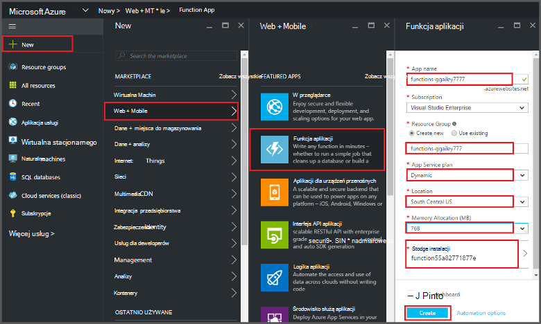
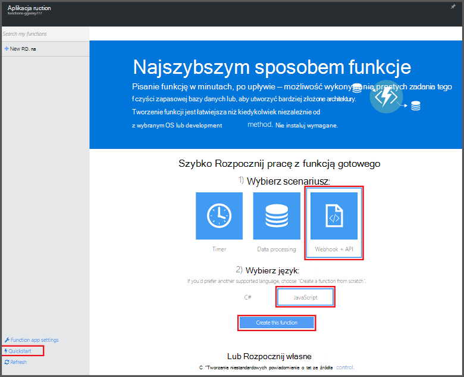
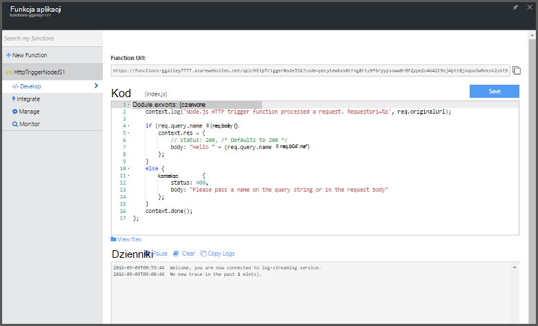

<properties
   pageTitle="Tworzenie funkcji z Azure Portal | Microsoft Azure"
   description="Tworzenie pierwszego funkcja Azure, pliki aplikacji, w czasie krótszym niż dwie minuty."
   services="functions"
   documentationCenter="na"
   authors="ggailey777"
   manager="erikre"
   editor=""
   tags=""
/>

<tags
   ms.service="functions"
   ms.devlang="multiple"
   ms.topic="article"
   ms.tgt_pltfrm="multiple"
   ms.workload="na"
   ms.date="09/08/2016"
   ms.author="glenga"/>

#Tworzenie funkcji Azure w portalu

##Omówienie
Funkcje Azure jest sterowane zdarzeniami, obliczeń na żądanie, dzięki czemu rozszerza istniejące platformy Azure aplikacji z funkcjami do wykonania kodu wyzwalane przez zdarzenia występujące w innych usług Azure, produkty władz akredytacji bezpieczeństwa i systemy lokalnego. Za pomocą funkcji Azure aplikacji skalowanie oparte na żądanie i płacisz tylko dla zasobów, których można używać. Azure umożliwia funkcji tworzenia zaplanowanych lub wyzwalane jednostek kodu zaimplementować w wielu językach programowania. Aby dowiedzieć się więcej na temat funkcji Azure, zobacz [Omówienie funkcji Azure](functions-overview.md).

W tym temacie przedstawiono sposób używania Azure portal, aby utworzyć prosty "Witaj świecie" Node.js Azure funkcji, która jest wywoływana przez wyzwalacz HTTP. Aby można było tworzyć funkcji w portalu Azure, musi być utworzone jawnie aplikacji funkcji w usłudze Azure w aplikacji. Aby aplikacja funkcji tworzony automatycznie, zobacz [innym samouczku Szybki Start funkcje Azure](functions-create-first-azure-function.md)prostsze środowisko Szybki Start i zawiera plik wideo.

##Tworzenie aplikacji funkcji

Aplikacja funkcja obsługuje wykonanie funkcje platformy Azure. Wykonaj poniższe czynności, aby utworzyć aplikację funkcji w portalu Azure.

Przed utworzeniem pierwszej funkcja musisz mieć konto Azure active. Jeśli nie masz już konto Azure [bezpłatnego konta są dostępne](https://azure.microsoft.com/free/).

1. Przejdź do [portalu Azure](https://portal.azure.com) i logowania za pomocą konta usługi Azure.

2. Kliknij pozycję **+ Nowe** > **Web + Mobile** > **Funkcji aplikacji**, wybierz **subskrypcję**, wpisz unikatową **nazwę aplikacji** , identyfikujący funkcji aplikacji, a następnie określ następujące ustawienia:

    + **[Grupa zasobów](../azure-portal/resource-group-portal.md/)**: wybierz pozycję **Utwórz nowy** i wprowadź nazwę nowej grupy zasobów. Możesz również wybrać istniejącej grupy zasobów, jednak nie może być można tworzyć dynamiczne plan aplikacji usługi aplikacji funkcji.
    + **[Plan usług aplikacji](../app-service/azure-web-sites-web-hosting-plans-in-depth-overview.md)**: Wybierz *dynamiczne* lub *klasycznego*. 
        + **Dynamiczne**: domyślnego typu planu dla funkcji Azure. Po wybraniu planu dynamicznego możesz wybrać **lokalizację** i ustawić **Przydzielanie pamięci** (w MB). Uzyskać informacji na temat wpływu przydzielanie pamięci kosztów, zobacz [Funkcje Azure ceny](https://azure.microsoft.com/pricing/details/functions/). 
        + **Klasyczny**: klasyczny plan usług aplikacji należy utworzyć **plan Lokalizacja usługi aplikacji** lub wybierz istniejący. Te ustawienia określają [lokalizację, funkcje, kosztów i obliczanie zasoby](https://azure.microsoft.com/pricing/details/app-service/) skojarzone z aplikacji.  
    + **Konto miejsca do magazynowania**: poszczególnych aplikacjach funkcja wymaga konta miejsca do magazynowania. Możesz wybrać istniejącego konta miejsca do magazynowania lub utworzyć. 

    

3. Kliknij przycisk **Utwórz** dostarczaniem i wdrażanie nowej aplikacji funkcji.  

Teraz, gdy aplikacja funkcji jest obsługi administracyjnej, możesz utworzyć pierwszy funkcja.

## Tworzenie funkcji

Te kroki utworzyć funkcję z funkcji Azure Szybki Start.

1. Na karcie **Szybki Start** kliknij pozycję **WebHook + interfejsu API** i **JavaScript**, a następnie kliknij przycisk **Utwórz funkcji**. Zostanie utworzona nowa funkcja Node.js wstępnie zdefiniowanych. 

    

2. (Opcjonalnie) W tym momencie w Szybki Start, można skorzystać z krótkiego przewodnika funkcje funkcje Azure w portalu.   Po ukończeniu lub pominięta przewodnika, możesz przetestować do nowej funkcji za pomocą wyzwalacza HTTP.

##Testowanie funkcji

Ponieważ funkcje Azure Przewodniki Szybki Start zawiera kod funkcjonalności, możesz przetestować bezpośrednio do nowej funkcji.

1. Na karcie **opracowanie** Przejrzyj okna **kodu** i zwróć uwagę, że kod Node.js oczekuje żądania HTTP z wartości z pola *Nazwa* w treści wiadomości lub w ciągu kwerendy. Po uruchomieniu funkcja ta wartość jest zwracana w wiadomości odpowiedzi.

    

2. Przewiń w dół do pola tekstowego **treści żądania** , zmień wartość właściwości *nazwy* na swoją nazwę, a następnie kliknij polecenie **Uruchom**. Zobaczysz, że wykonanie jest wyzwalane przez żądania HTTP test, informacje są zapisywane w dziennikach przesyłanie strumieniowe, a odpowiedzi "Witaj" jest wyświetlana w **danych wyjściowych**. 

3. Aby wyzwolić wykonanie tej samej funkcji z innego okna przeglądarki lub tab, skopiuj wartość **Adres URL funkcji** na karcie **opracowanie** i wklej go na pasku adresu przeglądarki, a następnie dołączyć wartość ciągu kwerendy `&name=yourname` i naciśnij klawisz enter. Te same informacje są zapisywane pliki dziennika i przeglądarka wyświetla odpowiedź "Witaj" jako przed.

##Następne kroki

Ten szybki start zaprezentowano bardzo proste wykonywanie podstawowych funkcji wyzwalane HTTP. Zobacz następujące tematy, aby uzyskać więcej informacji na temat korzystania z możliwości Azure funkcji w aplikacji.

+ [Dokumentacja dewelopera funkcje Azure](functions-reference.md)  
Odwołanie programisty kodowania funkcje i definiowanie wyzwalaczami i powiązań.
+ [Testowanie funkcji Azure](functions-test-a-function.md)  
W tym artykule opisano różne narzędzia i techniki testując funkcje.
+ [Jak skalowanie funkcje Azure](functions-scale.md)  
W tym artykule omówiono plany usługi dostępne za pomocą funkcji Azure wraz ze plan usług dynamiczne oraz wybierz plan, do prawej. 
+ [Co to jest usługa Azure aplikacji?](../app-service/app-service-value-prop-what-is.md)  
Funkcje Azure używa platformy Azure aplikacji usługi podstawowe funkcje, takie jak wdrożenia, zmienne środowiska i diagnostyki. 

[AZURE.INCLUDE [Getting Started Note](../../includes/functions-get-help.md)]
