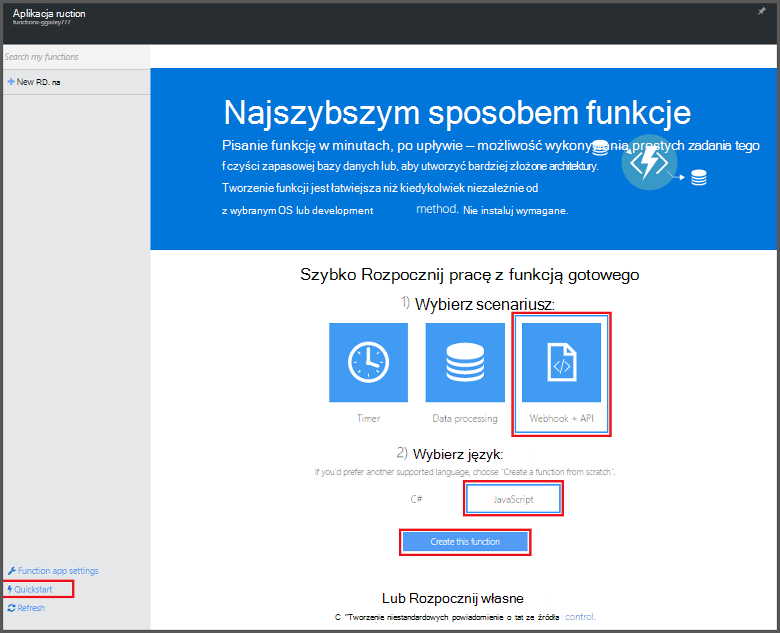
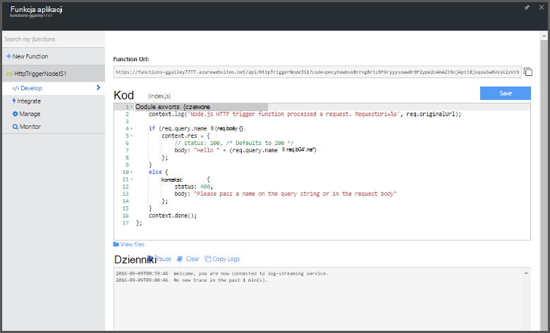

<properties
   pageTitle="Tworzenie pierwszego funkcja Azure | Microsoft Azure"
   description="Tworzenie pierwszego funkcja Azure, pliki aplikacji, w czasie krótszym niż dwie minuty."
   services="functions"
   documentationCenter="na"
   authors="ggailey777"
   manager="erikre"
   editor=""
   tags=""
/>

<tags
   ms.service="functions"
   ms.devlang="multiple"
   ms.topic="hero-article"
   ms.tgt_pltfrm="multiple"
   ms.workload="na"
   ms.date="09/08/2016"
   ms.author="glenga"/>

#Tworzenie pierwszego funkcja Azure

##Omówienie
Funkcje Azure jest sterowane zdarzeniami, obliczeń na żądanie, dzięki czemu rozszerza istniejące platformy Azure aplikacji z funkcjami do wykonania kodu wyzwalane przez zdarzenia występujące w innych usług Azure, produkty władz akredytacji bezpieczeństwa i systemy lokalnego. Za pomocą funkcji Azure aplikacji skalowanie oparte na żądanie i płacisz tylko dla zasobów, których można używać. Azure umożliwia funkcji tworzenia zaplanowanych lub wywołany jednostek kodu zaimplementowana w różnych językach programowania. Aby dowiedzieć się więcej na temat funkcji Azure, zobacz [Omówienie funkcji Azure](functions-overview.md).

W tym temacie pokazano, jak używać funkcji Azure Szybki Start w portalu do tworzenia prostych "Witaj świecie" Node.js funkcję, która jest wywoływana przez wyzwalacz HTTP. Możesz też obejrzeć krótki klip wideo, aby zobaczyć, jak te kroki wykonuje się w portalu.

## Obejrzyj klip wideo

Poniższym klipie wideo przedstawiono sposób wykonywania podstawowych zadań w tym samouczku. 

[AZURE.VIDEO create-your-first-azure-function-simple]

##Tworzenie funkcji z Szybki Start

Aplikacja funkcja obsługuje wykonanie funkcje platformy Azure. Wykonaj poniższe czynności, aby utworzyć nową aplikację funkcji, a także nowej funkcji. Nowa aplikacja funkcji jest tworzona z konfiguracją domyślną. Na przykład jawnie tworzenie aplikacji funkcji, zobacz [inne funkcje Azure samouczek Szybki Start](functions-create-first-azure-function-azure-portal.md).

Przed utworzeniem pierwszej funkcja musisz mieć konto Azure active. Jeśli nie masz już konto Azure [bezpłatnego konta są dostępne](https://azure.microsoft.com/free/).

1. Przejdź do [portalu funkcji Azure](https://functions.azure.com/signin) i logowania za pomocą konta usługi Azure.

2. Wpisz unikatową **nazwę** dla nowej aplikacji funkcji lub zaakceptować ten wygenerowane, wybierz swój preferowany **Region**, a następnie kliknij **Tworzenie + wprowadzenie**. 

3. Na karcie **Szybki Start** kliknij pozycję **WebHook + interfejsu API** i **JavaScript**, a następnie kliknij przycisk **Utwórz funkcji**. Zostanie utworzona nowa funkcja Node.js wstępnie zdefiniowanych. 

    

4. (Opcjonalnie) W tym momencie w Szybki Start, można skorzystać z krótkiego przewodnika funkcje funkcje Azure w portalu.   Po ukończeniu lub pominięta przewodnika, możesz przetestować do nowej funkcji za pomocą wyzwalacza HTTP.

##Testowanie funkcji

Ponieważ funkcje Azure Przewodniki Szybki Start zawiera kod funkcjonalności, możesz przetestować bezpośrednio do nowej funkcji.

1. Na karcie **opracowanie** Przejrzyj okna **kodu** i zwróć uwagę, że kod Node.js oczekuje żądania HTTP z wartości z pola *Nazwa* w treści wiadomości lub w ciągu kwerendy. Po uruchomieniu funkcja ta wartość jest zwracana w wiadomości odpowiedzi.

    

2. Przewiń w dół do pola tekstowego **treści żądania** , zmień wartość właściwości *nazwy* na swoją nazwę, a następnie kliknij polecenie **Uruchom**. Pojawi się, że wykonanie jest wyzwalane przez żądania HTTP test, informacje są zapisywane w dziennikach przesyłanie strumieniowe, a odpowiedzi "Witaj" jest wyświetlana w **danych wyjściowych**. 

3. Aby wyzwolić wykonanie tej samej funkcji z innego okna przeglądarki lub tab, skopiuj wartość **Adres URL funkcji** na karcie **opracowanie** i wklej go na pasku adresu przeglądarki, a następnie dołączyć wartość ciągu kwerendy `&name=yourname` i naciśnij klawisz enter. Te same informacje są zapisywane pliki dziennika i przeglądarka wyświetla odpowiedź "Witaj" jako przed.

##Następne kroki

Ten szybki start zaprezentowano bardzo proste wykonywanie podstawowych funkcji wyzwalane HTTP. Zobacz następujące tematy, aby uzyskać więcej informacji na temat Korzystanie z możliwości Azure funkcji w aplikacji.

+ [Dokumentacja dewelopera funkcje Azure](functions-reference.md)  
Odwołanie programisty kodowania funkcje i definiowanie wyzwalaczami i powiązań.
+ [Testowanie funkcji Azure](functions-test-a-function.md)  
W tym artykule opisano różne narzędzia i techniki testując funkcje.
+ [Jak skalowanie funkcje Azure](functions-scale.md)  
W tym artykule omówiono plany usługi dostępne za pomocą funkcji Azure wraz ze plan usług dynamiczne oraz wybierz plan, do prawej. 
+ [Co to jest usługa Azure aplikacji?](../app-service/app-service-value-prop-what-is.md)  
Funkcje Azure wykorzystuje platformy Azure aplikacji usług dla podstawowych funkcji, takich jak wdrożenia, zmienne środowiska i diagnostyki. 

[AZURE.INCLUDE [Getting Started Note](../../includes/functions-get-help.md)]
