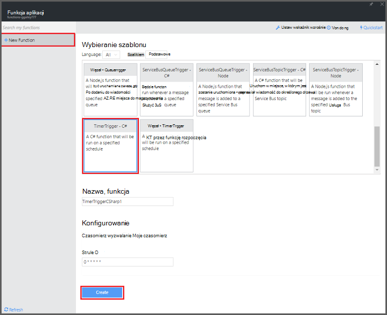

<properties
   pageTitle="Użyj funkcji Azure w celu wykonania według harmonogramu zadania oczyszczania | Microsoft Azure"
   description="Korzystanie z funkcji Azure utworzyć funkcję C# uruchamianej oparte na czasomierza zdarzenia."
   services="functions"
   documentationCenter="na"
   authors="ggailey777"
   manager="erikre"
   editor=""
   tags=""
   />

<tags
   ms.service="functions"
   ms.devlang="multiple"
   ms.topic="article"
   ms.tgt_pltfrm="multiple"
   ms.workload="na"
   ms.date="09/26/2016"
   ms.author="glenga"/>
   
# Korzystanie z funkcji Azure do wykonania według harmonogramu zadania oczyszczania

W tym temacie przedstawiono sposób używania funkcji Azure, aby utworzyć nową funkcję w C# uruchamianej oparte na zdarzenie czasomierza oczyszczania wierszy w tabeli bazy danych. Nowa funkcja zostanie utworzona na podstawie szablonu wstępnie zdefiniowanych w portalu funkcji Azure. Aby zrealizować ten scenariusz, należy ustawić parametry połączenia bazy danych aplikacji usług Ustawianie w aplikacji funkcji. 

## Wymagania wstępne 

Przed utworzeniem funkcji, musisz mieć konto Azure active. Jeśli nie masz już konto Azure [bezpłatnego konta są dostępne](https://azure.microsoft.com/free/).

W tym temacie przedstawiono polecenie Transact-SQL, które wykonuje operacji oczyszczania zbiorczej w tabeli o nazwie *TodoItems* w bazie danych SQL. W tej samej tabeli TodoItems jest tworzona po zakończeniu [Samouczek Szybki Start Mobile Azure aplikacji usługi](../app-service-mobile/app-service-mobile-ios-get-started.md). Umożliwia także przykładową bazę danych, jeśli zdecydujesz się na użycie innej tabeli, należy zmodyfikować polecenie.

Parametry połączenia używane przez aplikacji Mobile wewnętrznej bazy danych w portalu w obszarze **wszystkie ustawienia**można uzyskać > **Ustawienia aplikacji** > **Parametry połączenia** > **Pokaż wartości ciągu połączenia** > **MS_TableConnectionString**. Możesz również wyświetlić parametry połączenia bezpośrednio z bazy danych SQL w portalu w obszarze **wszystkie ustawienia** > **Właściwości** > **Pokaż parametry połączenia bazy danych** > **ADO.NET (uwierzytelnianie SQL)**.

W tym scenariuszu używa operacji zbiorczej w bazie danych. Aby z funkcji proces poszczególnych OBSŁUGIWAŁ operacje w aplikacji Mobile tabeli, należy użyć zamiast tego powiązanie tabeli Mobile.

## Ustawianie parametrów połączenia bazy danych SQL w aplikacji funkcji

Aplikacja funkcja obsługuje wykonanie funkcje platformy Azure. Jest najlepszym rozwiązaniem przechowywanie ciągów połączeń i inne hasła w ustawieniach funkcji aplikacji. Dzięki temu przypadkowe ujawnienie przy kodzie funkcja kończy się w górę w repo w dowolnym miejscu. 

1. Przejdź do [portalu funkcji Azure](https://functions.azure.com/signin) i logowania za pomocą konta usługi Azure.

2. Jeśli masz istniejącej aplikacji funkcji za pomocą, wybierz ją z **funkcji aplikacji** kliknij pozycję **Otwórz**. Do utworzenia nowej aplikacji funkcji, wpisz unikatową **nazwę** dla nowej aplikacji funkcji lub zaakceptować ten wygenerowane, wybierz swój preferowany **Region**, a następnie kliknij **Tworzenie + wprowadzenie**. 

3. W funkcji aplikacji, kliknij pozycję **Ustawienia aplikacji funkcji** > **Przejdź do pozycji Ustawienia usługi aplikacji**. 

    

4. W funkcji aplikacji, kliknij pozycję **wszystkie ustawienia**, przewiń w dół do pozycji **Ustawienia aplikacji**, a następnie w obszarze Typ **Parametry połączenia** `sqldb_connection` w polu **Nazwa**wkleić **wartość**parametry połączenia, kliknij przycisk **Zapisz**, a następnie zamknij karta aplikacji funkcji, aby powrócić do portalu funkcji.

    

Teraz możesz dodać kod funkcji C#, który łączy się z bazą danych SQL.

## Utwórz funkcję wyzwalane czasomierza z szablonu

1. W funkcji aplikacji, kliknij pozycję **+ Nowa funkcja** > **TimerTrigger - C#** > **Tworzenie**. Spowoduje to utworzenie funkcji przy użyciu domyślnej nazwy uruchamianego na domyślny harmonogram raz na minutę. 

    

2. W okienku **Kod** na karcie **opracowanie** Dodaj następujące informacje zestawu w górnej części istniejącego kodu funkcji:

        #r "System.Configuration"
        #r "System.Data"

3. Dodaj następujący `using` instrukcji funkcji:

        using System.Configuration;
        using System.Data.SqlClient;
        using System.Threading.Tasks; 

4. Zastąp istniejące funkcja **Uruchom** poniższy kod:

        public static async Task Run(TimerInfo myTimer, TraceWriter log)
        {
            var str = ConfigurationManager.ConnectionStrings["sqldb_connection"].ConnectionString;
            using (SqlConnection conn = new SqlConnection(str))
            {
                conn.Open();
                var text = "DELETE from dbo.TodoItems WHERE Complete='True'";
                using (SqlCommand cmd = new SqlCommand(text, conn))
                {
                    // Execute the command and log the # rows deleted.
                    var rows = await cmd.ExecuteNonQueryAsync();
                    log.Info($"{rows} rows were deleted");
                }
            }
        }

5. Kliknij przycisk **Zapisz**, obejrzyj **Dzienniki** systemu windows do następnego wykonania funkcji, a następnie sprawdź liczbę wierszy, które zostaną usunięte z tabeli TodoItems.

6. (Opcjonalnie) Przy użyciu [aplikacji Szybki Start aplikacji Mobile](../app-service-mobile/app-service-mobile-ios-get-started.md), oznacz dodatkowe elementy "ukończona" następnie wróć do okna **Dzienniki** i usunięcie czujki taką samą liczbę wierszy za pomocą funkcji podczas wykonywania następnego. 

##Następne kroki

Zobacz następujące tematy, aby uzyskać więcej informacji na temat funkcji Azure.

+ [Dokumentacja dewelopera funkcje Azure](functions-reference.md)  
Odwołanie programisty kodowania funkcje i definiowanie wyzwalaczami i powiązań.
+ [Testowanie funkcji Azure](functions-test-a-function.md)  
W tym artykule opisano różne narzędzia i techniki testując funkcje.
+ [Jak skalowanie funkcje Azure](functions-scale.md)  
W tym artykule omówiono plany usługi dostępne za pomocą funkcji Azure wraz ze plan usług dynamiczne oraz wybierz plan, do prawej.  

[AZURE.INCLUDE [Getting Started Note](../../includes/functions-get-help.md)]