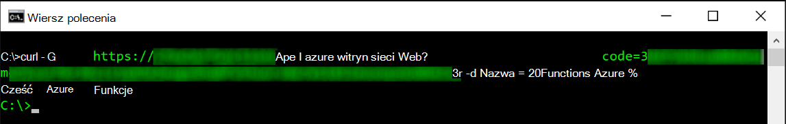
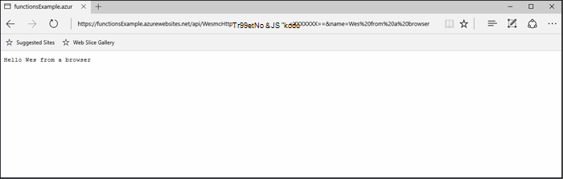
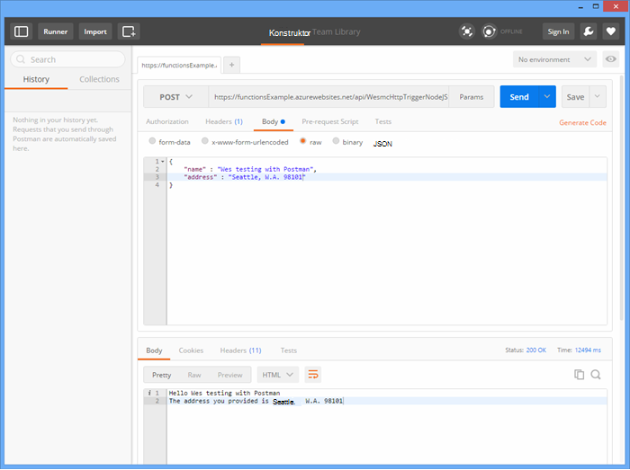
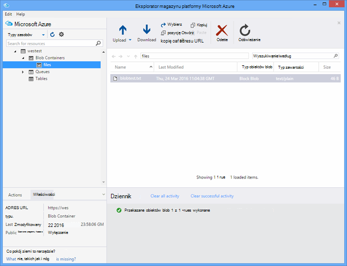

<properties
   pageTitle="Testowanie funkcji Azure | Microsoft Azure"
   description="Testowanie funkcje Azure za pomocą Postman, zwijanie i Node.js."
   services="functions"
   documentationCenter="na"
   authors="wesmc7777"
   manager="erikre"
   editor=""
   tags=""
   keywords="Azure funkcje, funkcje przetwarzania, webhooks, dynamiczne obliczeń, pliki architektura testowania"/>

<tags
   ms.service="functions"
   ms.devlang="multiple"
   ms.topic="article"
   ms.tgt_pltfrm="multiple"
   ms.workload="na"
   ms.date="08/19/2016"
   ms.author="wesmc"/>

# Testowanie funkcji Azure

## Omówienie

W tym samouczku będzie przeprowadzimy przez różnych metod do testowania funkcji. Firma Microsoft określi funkcja wyzwalacza http, która przyjmuje się przy użyciu parametru ciągu kwerendy lub treści żądania. Domyślny kod szablon **HttpTrigger Node.js funkcja** obsługuje `name` parametru ciągu kwerendy. Dodajemy również kod do obsługi parametru wraz z `address` informacje dla użytkownika w treści wezwania.

## Utwórz funkcję do celów testowych

Większość tego samouczka użyjemy nieco zmodyfikowanej wersji szablonu **Funkcja Nodejs HttpTrigger** , który jest dostępny podczas tworzenia nowych funkcji.  Jeśli potrzebujesz pomocy w tworzeniu nowej funkcji można przeglądać [Tworzenie pierwszej samouczek funkcji Azure](functions-create-first-azure-function.md) .  Po prostu wybierz szablon **HttpTrigger Nodejs funkcji** podczas tworzenia funkcji test w [Azure Portal].

Domyślny szablon funkcja zasadniczo jest funkcji świata Witaj ponownie echa nazwę z żądania treści lub kwerendy ciąg parametru `name=<your name>`.  Kod umożliwia również Podaj nazwę i adres jako JSON zawartość w treści wezwania zostanie odpowiednio zaktualizowana. Następnie funkcja będzie echo tych powrót do klienta, gdy są dostępne.   

Aktualizacja funkcji z następujący kod, który użyjemy do testowania:

    module.exports = function(context, req) {
        context.log("Node.js HTTP trigger function processed a request. RequestUri=%s", req.originalUrl);
        context.log("Request Headers = " + JSON.stringify(req.headers));    
    
        if (req.query.name || (req.body && req.body.name)) {
            if (typeof req.query.name != "undefined") {
                context.log("Name was provided as a query string param..."); 
                ProcessNewUserInformation(context, req.query.name);
            }
            else {
                context.log("Processing user info from request body..."); 
                ProcessNewUserInformation(context, req.body.name, req.body.address);
            }
        }
        else {
            context.res = {
                status: 400,
                body: "Please pass a name on the query string or in the request body"
            };
        }
        context.done();
    };
    
    function ProcessNewUserInformation(context, name, address)
    {    
        context.log("Processing User Information...");            
        context.log("name = " + name);            
        echoString = "Hello " + name;
        
        if (typeof address != "undefined")
        {
            echoString += "\n" + "The address you provided is " + address;
            context.log("address = " + address);            
        }
        
        context.res = {
                // status: 200, /* Defaults to 200 */
                body: echoString
            };
    }

## Testowanie funkcji narzędziami

### Testowanie z zwinięcie

Często podczas testowania oprogramowania, nie jest konieczne szukać dowolną dalej niż wiersza polecenia ułatwiające debugowanie aplikacji, to nie różni się z funkcjami.

Aby przetestować funkcję powyżej, skopiuj adres **Url funkcji** z portalu. Będzie miała następującą postać: 

    https://<Your Function App>.azurewebsites.net/api/<Your Function Name>?code=<your access code>
    
Jest to adres Url powodujące funkcja, można sprawdzać, czy to przy użyciu polecenia zwinięcie w wierszu polecenia, aby uzyskać (`-G` lub `--get`) żądania naszych funkcji:

    curl -G https://<Your Function App>.azurewebsites.net/api/<Your Function Name>?code=<your access code>
    
W tym przykładzie określonego powyżej wymaga parametr ciągu kwerendy, które mogą być przekazywane jako danych (`-d`) w tym poleceniu zwinięcie:

    curl -G https://<Your Function App>.azurewebsites.net/api/<Your Function Name>?code=<your access code> -d name=<Enter a name here>
    
Naciśnięcie klawisza enter i zostaną wyświetlone informacje funkcji w wierszu polecenia.

W oknie portalu **Dzienniki** wyjściowe podobny do następującego jest rejestrowany podczas wykonywania funkcji:

    2016-04-05T21:55:09  Welcome, you are now connected to log-streaming service.
    2016-04-05T21:55:30.738 Function started (Id=ae6955da-29db-401a-b706-482fcd1b8f7a)
    2016-04-05T21:55:30.738 Node.js HTTP trigger function processed a request. RequestUri=https://functionsExample.azurewebsites.net/api/HttpTriggerNodeJS1?code=XXXXXXX&name=Azure Functions
    2016-04-05T21:55:30.738 Function completed (Success, Id=ae6955da-29db-401a-b706-482fcd1b8f7a)

### Testowanie za pomocą przeglądarki

Funkcje, które nie są wymagane parametry lub tylko potrzebne parametry ciągu kwerendy, można sprawdzana w przeglądarce.

Aby przetestować funkcję, zdefiniowanych powyżej, skopiuj adres **Url funkcji** z portalu. Będzie miała następującą postać:

    https://<Your Function App>.azurewebsites.net/api/<Your Function Name>?code=<your access code>

Dołączanie `name` kwerenda parametru ciągu następująco, przy użyciu rzeczywistej nazwie dla `<Enter a name here>` symbol zastępczy.

    https://<Your Function App>.azurewebsites.net/api/<Your Function Name>?code=<your access code>&name=<Enter a name here>

Wklej adres URL w przeglądarce, a otrzymasz odpowiedź podobny do następującego.

W oknie portalu **Dzienniki** wyjściowe podobny do następującego jest rejestrowany podczas wykonywania funkcji:

    2016-03-23T07:34:59  Welcome, you are now connected to log-streaming service.
    2016-03-23T07:35:09.195 Function started (Id=61a8c5a9-5e44-4da0-909d-91d293f20445)
    2016-03-23T07:35:10.338 Node.js HTTP trigger function processed a request. RequestUri=https://functionsExample.azurewebsites.net/api/WesmcHttpTriggerNodeJS1?code=XXXXXXXXXX==&name=Wes from a browser
    2016-03-23T07:35:10.338 Request Headers = {"cache-control":"max-age=0","connection":"Keep-Alive","accept":"text/html","accept-encoding":"gzip","accept-language":"en-US"}
    2016-03-23T07:35:10.338 Name was provided as a query string param.
    2016-03-23T07:35:10.338 Processing User Information...
    2016-03-23T07:35:10.369 Function completed (Success, Id=61a8c5a9-5e44-4da0-909d-91d293f20445)

### Testowanie z Postman

Narzędzie zalecane w celu przetestowania większości funkcji usługi jest Postman. Aby zainstalować Postman, zobacz [Uzyskiwanie Postman](https://www.getpostman.com/). Postman zapewnia kontrolę nad wieloma atrybutami więcej żądania HTTP.

> [AZURE.TIP] Za pomocą klienta usługi REST, w którym masz doświadczenia. Oto niektóre rozwiązania alternatywne wobec Postman:  
> 
> * [Fiddler](http://www.telerik.com/fiddler)  
> * [Łapy](https://luckymarmot.com/paw)  

Aby przetestować funkcję o treści żądania w Postman: 

1. Uruchamianie Postman przy użyciu przycisku **aplikacji** w lewym górnym rogu okna przeglądarki Chrome.
2. Skopiuj adres **Url funkcji** i wkleić go w Postman. Zawiera parametr ciągu kwerendy kod dostępu.
3. Zmienianie metody HTTP **wpis**.
4. Kliknij **treść** > **nieprzetworzonych** i Dodaj treść żądania JSON podobny do następującego:

        {
            "name" : "Wes testing with Postman",
            "address" : "Seattle, W.A. 98101"
        }

5. Kliknij przycisk **Wyślij**.

Poniższa ilustracja przedstawia, testując echo prosty przykład funkcji w tym samouczku. 

W oknie portalu **Dzienniki** wyjściowe podobny do następującego jest rejestrowany podczas wykonywania funkcji:

    2016-03-23T08:04:51  Welcome, you are now connected to log-streaming service.
    2016-03-23T08:04:57.107 Function started (Id=dc5db8b1-6f1c-4117-b5c4-f6b602d538f7)
    2016-03-23T08:04:57.763 Node.js HTTP trigger function processed a request. RequestUri=https://functions841def78.azurewebsites.net/api/WesmcHttpTriggerNodeJS1?code=XXXXXXXXXX==
    2016-03-23T08:04:57.763 Request Headers = {"cache-control":"no-cache","connection":"Keep-Alive","accept":"*/*","accept-encoding":"gzip","accept-language":"en-US"}
    2016-03-23T08:04:57.763 Processing user info from request body...
    2016-03-23T08:04:57.763 Processing User Information...
    2016-03-23T08:04:57.763 name = Wes testing with Postman
    2016-03-23T08:04:57.763 address = Seattle, W.A. 98101
    2016-03-23T08:04:57.795 Function completed (Success, Id=dc5db8b1-6f1c-4117-b5c4-f6b602d538f7)
    
### Testowanie wyzwalacza obiektów blob za pomocą Eksploratora magazynu

Istnieje możliwość przetestowania wyzwalacza blob, funkcja przy użyciu [Eksploratora magazynu usługi Microsoft Azure](http://storageexplorer.com/).

1. W programie [Azure Portal] w aplikacji funkcji Utwórz nową funkcję wyzwalacza obiektów blob C#, F # lub węzeł. Ustaw ścieżkę monitorowanie zgodnie z nazwą swojego kontenera obiektów blob. Na przykład:

        files

2. Kliknij pozycję **+** przycisk, aby wybrać lub utworzyć konto miejsca do magazynowania, którego chcesz użyć. Następnie kliknij przycisk **Utwórz**.

3. Tworzenie pliku tekstowego z następującym tekstem i zapisz go:

        A text file for blob trigger function testing.

4. Uruchom [Eksploratora magazynu usługi Microsoft Azure](http://storageexplorer.com/) i łączenie w kontenerze obiektów blob na koncie miejsca do magazynowania monitorowane.

5. Kliknij przycisk **Przekaż** i przekaż plik tekstowy.

    

    Funkcja wyzwalacza obiektów blob domyślny kod komunikat przetwarzania obiektów blob w dzienniku:

        2016-03-24T11:30:10  Welcome, you are now connected to log-streaming service.
        2016-03-24T11:30:34.472 Function started (Id=739ebc07-ff9e-4ec4-a444-e479cec2e460)
        2016-03-24T11:30:34.472 C# Blob trigger function processed: A text file for blob trigger function testing.
        2016-03-24T11:30:34.472 Function completed (Success, Id=739ebc07-ff9e-4ec4-a444-e479cec2e460)

## Testowanie funkcji w funkcji

### Testowanie za pomocą portalu funkcji przycisk Uruchom

Przycisk **Uruchom** , co umożliwi niektórych ograniczone sprawdzenie, czy znajdują się w portalu. Można udostępniać treści żądania, za pomocą przycisku uruchamiania ale, nie można podać parametry ciągu kwerendy lub zaktualizować nagłówków żądania.

Testowanie funkcji wyzwalacza HTTP utworzonego wcześniej przez dodanie ciągu JSON podobny do następującego w polu **treści żądania** , a następnie kliknij przycisk **Uruchom** .

    {
        "name" : "Wes testing Run button",
        "address" : "USA"
    } 

W oknie portalu **Dzienniki** wyjściowe podobny do następującego jest rejestrowany podczas wykonywania funkcji:

    2016-03-23T08:03:12  Welcome, you are now connected to log-streaming service.
    2016-03-23T08:03:17.357 Function started (Id=753a01b0-45a8-4125-a030-3ad543a89409)
    2016-03-23T08:03:18.697 Node.js HTTP trigger function processed a request. RequestUri=https://functions841def78.azurewebsites.net/api/wesmchttptriggernodejs1
    2016-03-23T08:03:18.697 Request Headers = {"connection":"Keep-Alive","accept":"*/*","accept-encoding":"gzip","accept-language":"en-US"}
    2016-03-23T08:03:18.697 Processing user info from request body...
    2016-03-23T08:03:18.697 Processing User Information...
    2016-03-23T08:03:18.697 name = Wes testing Run button
    2016-03-23T08:03:18.697 address = USA
    2016-03-23T08:03:18.744 Function completed (Success, Id=753a01b0-45a8-4125-a030-3ad543a89409)

### Testowanie z wyzwalacza czasomierz

Niektóre funkcje, nie można przetestować naprawdę narzędziami wspomniano wcześniej. Na przykład kolejki wyzwalacza funkcja którego jest uruchamiany, gdy wiadomości są przenoszone do [Magazynowania kolejki Azure](../storage/storage-dotnet-how-to-use-queues.md). Zawsze można napisać kod upuszczanie wiadomości do własnej kolejki i poniżej znajduje się na przykład w projekcie konsoli. Istnieje jednak innej metody można przetestować z funkcjami bezpośrednio.  

Można użyć wyzwalacza czasomierza skonfigurowano kolejki powiązania wyjściowego. Kod wyzwalacza czasomierza następnie można zapisać wiadomości testowe do kolejki. W tej sekcji prowadzi przez przez przykładowy. 

Aby uzyskać więcej szczegółowych informacji na temat korzystania z powiązania z funkcjami Azure zobacz [Funkcje Azure Dokumentacja dewelopera](functions-reference.md). 

#### Tworzenie wyzwalacza kolejki do celów testowych

Wykazać tej metody, najpierw zostanie utworzony funkcja wyzwalacza kolejki chcemy testowanie kolejki o nazwie `queue-newusers`. Ta funkcja będzie przetwarzał informacje o nazwie i adresie dla nowego użytkownika usunięte w kolejce Azure miejsca do magazynowania. 

> [AZURE.NOTE] Jeśli możesz użyć nazwy innej kolejki, upewnij się, że nazwa, używanego jest zgodna z regułami [nazewnictwa kolejki i metadanych](https://msdn.microsoft.com/library/dd179349.aspx) .  W przeciwnym razie zostanie wyświetlony kod stanu HTTP 400: nieprawidłowe żądanie. 

1. W programie [Azure Portal] w aplikacji funkcji kliknij **Nową funkcję** > **QueueTrigger - C#**.
2. Wprowadź nazwę kolejki można monitorować za pomocą funkcji kolejki 

        queue-newusers 

3. Kliknij pozycję **+** przycisk (Dodaj), aby wybrać lub utworzyć konto miejsca do magazynowania, którego chcesz użyć. Następnie kliknij przycisk **Utwórz**.
4. Pozostaw to okno przeglądarki portalu otwarty można monitorować pozycje dziennika kod szablonu domyślnego kolejki funkcji.

#### Tworzenie wyzwalacza czasomierza upuszczania wiadomości w kolejce

1. Otwórz [Azure Portal] w nowym oknie przeglądarki i przejdź do aplikacji funkcji.
2. Kliknij przycisk **Nowa funkcja** > **TimerTrigger - C#**. Wpisz wyrażenie cron, aby ustawić częstotliwość kod czasomierza będzie wykonywać testowanie funkcja kolejki. Następnie kliknij przycisk **Utwórz**. Jeśli chcesz, aby test, aby uruchomić co 30 sekund, można użyć następujących [CRON wyrażenia](https://wikipedia.org/wiki/Cron#CRON_expression):

        */30 * * * * *

2. Kliknij kartę **Integracja** nowego wyzwalacza czasomierza.
3. W obszarze **dane wyjściowe**kliknij przycisk **+ nowy wynik** . Następnie kliknij przycisk **Wybierz** i **kolejki** .
4. Należy zauważyć, że nazwa używana dla **obiektu kolejki wiadomości** możesz hasła w kodzie funkcja timer.

        myQueue

4. Wprowadź nazwę kolejki wysyłania wiadomości: 

        queue-newusers 

3. Kliknij pozycję **+** przycisk (Dodaj), aby wybrać konta miejsca do magazynowania wcześniej użyto z wyzwalacza kolejki. Następnie kliknij przycisk **Zapisz**.
4. Kliknij kartę **opracowanie** wyzwalacza czasomierza.
5. Poniższy kod służy funkcji czasomierza C# jak używane samej kolejki wiadomości nazwę obiektu jak pokazano powyżej. Następnie kliknij przycisk **Zapisz**

        using System;
        
        public static void Run(TimerInfo myTimer, out String myQueue, TraceWriter log)
        {
            String newUser = 
            "{\"name\":\"User testing from C# timer function\",\"address\":\"XYZ\"}";
        
            log.Verbose($"C# Timer trigger function executed at: {DateTime.Now}");   
            log.Verbose($"{newUser}");   
            
            myQueue = newUser;
        }

Na tym etapie funkcja timer C# wykonać co 30 sekund, jeśli użyto wyrażeń cron przykład. Dzienniki funkcji czasomierza zgłasza wykonanie każdego:

    2016-03-24T10:27:02  Welcome, you are now connected to log-streaming service.
    2016-03-24T10:27:30.004 Function started (Id=04061790-974f-4043-b851-48bd4ac424d1)
    2016-03-24T10:27:30.004 C# Timer trigger function executed at: 3/24/2016 10:27:30 AM
    2016-03-24T10:27:30.004 {"name":"User testing from C# timer function","address":"XYZ"}
    2016-03-24T10:27:30.004 Function completed (Success, Id=04061790-974f-4043-b851-48bd4ac424d1)

W oknie przeglądarki dla funkcji kolejki zobaczysz każdej wiadomości przetwarzania:

    2016-03-24T10:27:06  Welcome, you are now connected to log-streaming service.
    2016-03-24T10:27:30.607 Function started (Id=e304450c-ff48-44dc-ba2e-1df7209a9d22)
    2016-03-24T10:27:30.607 C# Queue trigger function processed: {"name":"User testing from C# timer function","address":"XYZ"}
    2016-03-24T10:27:30.607 Function completed (Success, Id=e304450c-ff48-44dc-ba2e-1df7209a9d22)
    
## Testowanie funkcji z kodem

### Testowanie funkcji wyzwalacza HTTP z kodem: Node.js

Za pomocą kodu Node.js wykonać żądania http, aby przetestować funkcja Azure. 

Upewnij się ustawić:

- `host` w opcjach wezwania do hosta funkcji aplikacji
- Nazwy funkcji w `path`.
- Kod dostępu (`<your code>`) w `path`.

Przykład kodu:

    var http = require("http");
    
    var nameQueryString = "name=Wes%20Query%20String%20Test%20From%20Node.js";
    
    var nameBodyJSON = {
        name : "Wes testing with Node.JS code",
        address : "Dallas, T.X. 75201"
    };
    
    var bodyString = JSON.stringify(nameBodyJSON);
    
    var options = {
      host: "functions841def78.azurewebsites.net",
      //path: "/api/HttpTriggerNodeJS2?code=sc1wt62opn7k9buhrm8jpds4ikxvvj42m5ojdt0p91lz5jnhfr2c74ipoujyq26wab3wk5gkfbt9&" + nameQueryString,
      path: "/api/HttpTriggerNodeJS2?code=sc1wt62opn7k9buhrm8jpds4ikxvvj42m5ojdt0p91lz5jnhfr2c74ipoujyq26wab3wk5gkfbt9",
      method: "POST",
      headers : {
          "Content-Type":"application/json",
          "Content-Length": Buffer.byteLength(bodyString)
        }    
    };
    
    callback = function(response) {
      var str = ""
      response.on("data", function (chunk) {
        str += chunk;
      });
    
      response.on("end", function () {
        console.log(str);
      });
    }
    
    var req = http.request(options, callback);
    console.log("*** Sending name and address in body ***");
    console.log(bodyString);
    req.end(bodyString);

Wynik:

    C:\Users\Wesley\testing\Node.js>node testHttpTriggerExample.js
    *** Sending name and address in body ***
    {"name" : "Wes testing with Node.JS code","address" : "Dallas, T.X. 75201"}
    Hello Wes testing with Node.JS code
    The address you provided is Dallas, T.X. 75201
        
W oknie portalu **Dzienniki** wyjściowe podobny do następującego jest rejestrowany podczas wykonywania funkcji:

    2016-03-23T08:08:55  Welcome, you are now connected to log-streaming service.
    2016-03-23T08:08:59.736 Function started (Id=607b891c-08a1-427f-910c-af64ae4f7f9c)
    2016-03-23T08:09:01.153 Node.js HTTP trigger function processed a request. RequestUri=http://functionsExample.azurewebsites.net/api/WesmcHttpTriggerNodeJS1/?code=XXXXXXXXXX==
    2016-03-23T08:09:01.153 Request Headers = {"connection":"Keep-Alive","host":"functionsExample.azurewebsites.net"}
    2016-03-23T08:09:01.153 Name not provided as query string param. Checking body...
    2016-03-23T08:09:01.153 Request Body Type = object
    2016-03-23T08:09:01.153 Request Body = [object Object]
    2016-03-23T08:09:01.153 Processing User Information...
    2016-03-23T08:09:01.215 Function completed (Success, Id=607b891c-08a1-427f-910c-af64ae4f7f9c)
    

### Testowanie funkcji wyzwalacza kolejki z kodem: C# #

Wspomniano wcześniej może przetestowanie wyzwalacza kolejki przy użyciu kodu, aby usunąć wiadomość z własnej kolejki. Poniższy przykład kodu opiera się poza kod C# podany w samouczku [wprowadzenie magazyn kolejek Azure](../storage/storage-dotnet-how-to-use-queues.md) . Kod dla innych wersji językowych jest również dostępne z tego łącza.

Aby przetestować kod w aplikacji konsoli, które należy:

- [Konfigurowanie usługi miejsca do magazynowania w pliku app.config parametry połączenia](../storage/storage-dotnet-how-to-use-queues.md#setup-a-storage-connection-string).
- Kod akceptuje odpowiednie nazwisko i adres dla nowego użytkownika jako argumenty wiersza polecenia podczas wykonywania. Przekazać `name` i `address` jako parametrów do aplikacji. Na przykład`C:\myQueueConsoleApp\test.exe "Wes testing queues" "in a console app"`

Przykład C# kodu:

    static void Main(string[] args)
    {
        string name = null;
        string address = null;
        string queueName = "queue-newusers";
        string JSON = null;

        if (args.Length > 0)
        {
            name = args[0];
        }
        if (args.Length > 1)
        {
            address = args[1];
        }

        // Retrieve storage account from connection string
        CloudStorageAccount storageAccount = CloudStorageAccount.Parse(ConfigurationManager.AppSettings["StorageConnectionString"]);

        // Create the queue client
        CloudQueueClient queueClient = storageAccount.CreateCloudQueueClient();

        // Retrieve a reference to a queue
        CloudQueue queue = queueClient.GetQueueReference(queueName);

        // Create the queue if it doesn't already exist
        queue.CreateIfNotExists();

        // Create a message and add it to the queue.
        if (name != null)
        {
            if (address != null)
                JSON = String.Format("{{\"name\":\"{0}\",\"address\":\"{1}\"}}", name, address);
            else
                JSON = String.Format("{{\"name\":\"{0}\"}}", name);
        }

        Console.WriteLine("Adding message to " + queueName + "...");
        Console.WriteLine(JSON);

        CloudQueueMessage message = new CloudQueueMessage(JSON);
        queue.AddMessage(message);
    }

W oknie przeglądarki dla funkcji kolejki zobaczysz każdej wiadomości przetwarzania:

    2016-03-24T10:27:06  Welcome, you are now connected to log-streaming service.
    2016-03-24T10:27:30.607 Function started (Id=e304450c-ff48-44dc-ba2e-1df7209a9d22)
    2016-03-24T10:27:30.607 C# Queue trigger function processed: {"name":"Wes testing queues","address":"in a console app"}
    2016-03-24T10:27:30.607 Function completed (Success, Id=e304450c-ff48-44dc-ba2e-1df7209a9d22)

<!-- URLs. -->

[Azure Portal]: https://portal.azure.com
