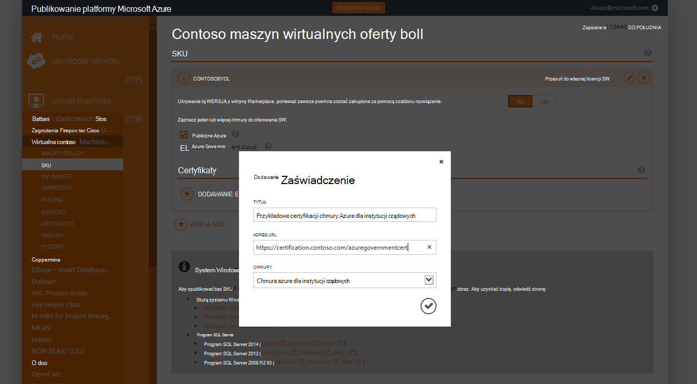

<properties
            pageTitle="Azure dokumentacji dla instytucji rządowych | Microsoft Azure"
            description="Umożliwia porównanie funkcji i wskazówki dotyczące tworzenia aplikacji dla instytucji rządowych Azure."
            services="Azure-Government"
            cloud="gov"
            documentationCenter=""
            authors="tsingh"
            manager="asimm"
            editor=""/>
 
<tags    ms.service="multiple"
            ms.devlang="na"
            ms.topic="article"
            ms.tgt_pltfrm="na"
            ms.workload="azure-government"
            ms.date="10/20/2016"
            ms.author="zakramer;tsingh;divacc"/> 

# Rząd Azure Marketplace
Dla partnerów w publikowania z ofertą Azure Marketplace dla instytucji rządowych Znajdź ze szczegółami poniżej.

## Publikowanie
>[AZURE.NOTE] Jeśli nie masz istniejącego partnera Azure Marketplace certyfikowane, wykonaj czynności [poniżej](../marketplace-publishing/marketplace-publishing-getting-started.md) przed kontynuowaniem.

### Krok 1  
Zaloguj się do [https://publish.windowsazure.com](https://publish.windowsazure.com)

### Krok 2
Kliknij pozycję oferty, które chcesz opublikować

### Krok 3
Kliknij **wersji produktu** i kliknij pole Azure dla instytucji rządowych chmury

>[AZURE.NOTE] Obsługiwane są tylko SKU wyświetlić swój własny licencji (BYOL).  Ta opcja nie jest dostępna dla wersji produktu repartycyjny (między).

### Krok 4
Kliknij przycisk + Dodaj certyfikacji łącze, aby dodać łącza do dowolnego certyfikaty dla Twoją ofertę.

### Krok 5
Żądanie konto wersji próbnej w chmurze firmy Microsoft Azure dla instytucji rządowych ułatwia testowanie obrazu w portalu publikowania: [https://azuregov.microsoft.com/trial/azuregovtrial](https://azuregov.microsoft.com/trial/azuregovtrial)

Uprawnień partnerem, która pełni US federal, stan, lokalne lub plemiennych jednostki są sprawdzane i klient otrzyma potwierdzenie za pośrednictwem poczty e-mail.  Konta wersji próbnej będą dostępne w wynosi 3 do 5 dni roboczych.

### Krok 6
Kliknij przycisk Publikuj, a następnie kliknij pozycję naciśnij, aby tymczasowego. 

Wyświetli monit o wprowadź subskrypcji whitelisted, która ma dostęp do etapowej oferty. Wprowadź identyfikator subskrypcji z nowo pobranych konto wersji próbnej platformy Azure dla instytucji rządowych.

### Krok 7
Po oferty są umieszczane pomyślnie, możesz przetestować obrazu przez funkcję rejestrowania celu [https://portal.azure.us](https://portal.azure.us) przy użyciu konta usługi Azure dla instytucji rządowych w wersji próbnej.

### Krok 8
Po sprawdzeniu poprawności obrazu przy użyciu subskrypcji wersji próbnej, można udostępnić ofertę live, klikając Publikuj i Oczekiwanie na zatwierdzenie, aby przejść do produkcji. 

## Następne kroki

Informacje dodatkowe i aktualizacji Zasubskrybuj [Blog dotyczący programu Microsoft Azure dla instytucji rządowych](https://blogs.msdn.microsoft.com/azuregov/).
